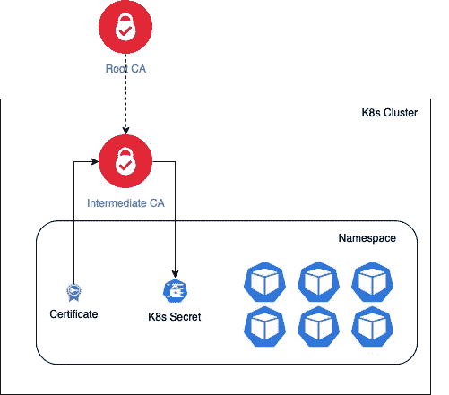
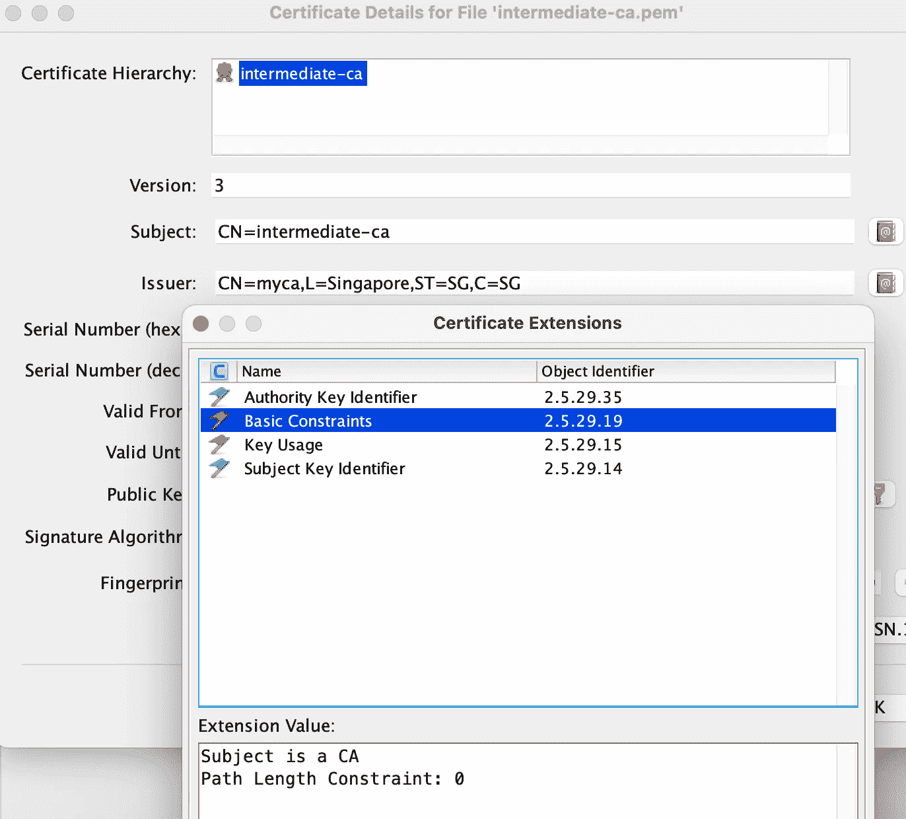
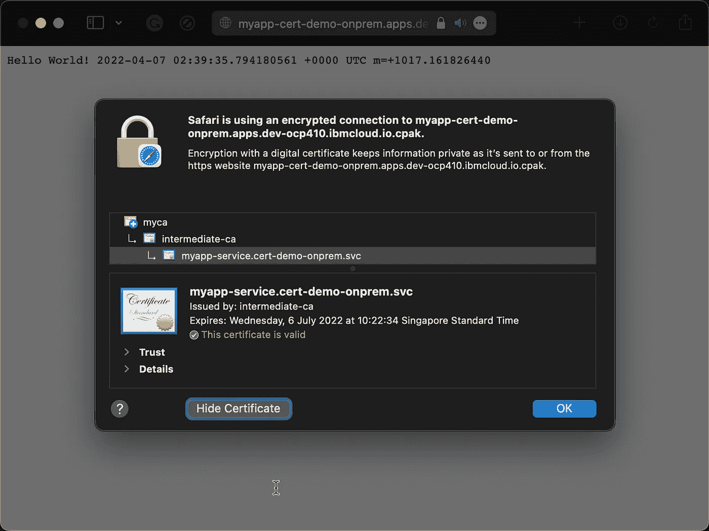

# 本地云原生应用的证书管理

> 原文：<https://itnext.io/certificate-management-for-on-premises-cloud-native-apps-dbca82e3c405?source=collection_archive---------0----------------------->


图片来自 [Pixabay](https://pixabay.com/?utm_source=link-attribution&utm_medium=referral&utm_campaign=image&utm_content=3037639)

本地应用的 HTTPS/TLS 证书传统上是集中管理的。若要在企业环境中为您的应用获取证书，您需要创建一个证书签名请求，将其提交给证书颁发机构进行签名，然后取回您的证书。通常都很繁琐耗时。不要忘记证书快到期时需要更新，同样的过程需要再次重复。

当采用微服务架构时，这种方法根本无法处理管理所有的证书请求及其更新过程。本文探讨了如何将[证书管理器](https://cert-manager.io)用于内部 kubernetes 应用程序来管理它们的证书生命周期。

## 证书管理器管理的证书

下图显示了我们如何使用 cert-manager 来管理证书。



按照企业中的典型设置，我们将有根 CA 和中间 CA。使用中间 CA 创建 ClusterIssuer 资源。收到证书请求后，集群颁发者资源将创建并签署证书，并将其存储为 K8s 秘密。然后可以将证书安装到 pod 上，供应用程序使用。证书管理器监视证书的到期，并在它到期之前更新它。

我们来设置一下。我的测试环境是 OpenShift 4.10。证书管理器的安装被跳过，因为在我的例子中，证书管理器已经被其他软件引入。总之，安装简单明了。

## 根 CA 和中间 CA

首先，使用 [cfssl](https://github.com/cloudflare/cfssl) 创建根 CA 和一个中间 CA。

准备以下 myca.json 文件，

```
{
  "CN": "myca",
  "hosts": [ "myca" ],
  "key": {
    "algo": "rsa",
    "size": 4096
  },
  "names": [
    {
      "C": "SG",
      "ST": "SG",
      "L": "Singapore"
    }
  ]
}
```

创建根 CA，

```
cfssl gencert -initca myca.json | cfssljson -bare myca
```

我们已经创建了`myca.pem`(证书)和`myca-key.pem`(密钥)文件。

创建以下 JSON 文件 ca-config.json，以定义不同的概要文件，

```
{
  "signing": {
    "default": {
        "expiry": "43800h"
    },
    "profiles": {
      "server": {
        "expiry": "43800h",
        "usages": [
          "signing",
          "key encipherment",
          "server auth",
          "client auth"
        ]
      },
      "client": {
          "expiry": "43800h",
          "usages": [
            "signing",
            "key encipherment",
            "client auth"
          ]
      },
      "**intermediate**": {
        "usages": ["cert sign", "crl sign"],
        "expiry": "43800h",
        "ca_constraint": {
          "is_ca": true,
          "max_path_len": 0,
          "max_path_len_zero": true
        }
      }
      }
  }
}
```

创建中间证书 JSON 文件 intermediate-ca.json，如下所示，

```
{
  "CN": "intermediate-ca",
  "hosts": [ "intermediate-ca" ],
  "key": {
    "algo": "rsa",
    "size": 4096
  }
}
```

使用以下命令创建由根 CA 签名的中间 CA，

```
cfssl gencert -ca=myca.pem -ca-key=myca-key.pem -config=ca-config.json -profile=intermediate -hostname=intermediate-ca intermediate-ca.json | cfssljson -bare intermediate-ca
```

我们使用 ca-config.json 文件中定义的中间概要文件来创建中间证书。创建证书后，检查证书及其扩展名的详细信息，



它是由根证书签名的 CA 证书。路径长度约束为 0，因此它将无法创建任何子 CA。

## 设置发行者

通过检查 cert-manager-controller pod 的命令行参数`cluster-resource-namespace`，确定 cert-manager 设置为群集资源名称空间的名称空间。否则，使用默认名称空间“cert-manager”

创建一个 TLS secret 来保存证书(中间证书和根证书)以及中间 CA 的密钥。

```
cat intermediate-ca.pem myca.pem > my-ca-chain.pemkubectl create secret tls my-ca-chain --cert=my-ca-chain.pem --key=intermediate-ca-key.pem
```

使用此机密创建一个带有 CA 的 ClusterIssuer，

```
apiVersion: cert-manager.io/v1
kind: ClusterIssuer
metadata:
  name: ca-issuer
spec:
  ca:
    secretName: my-ca-chain
```

颁发者准备好根据请求创建证书。

## 测试应用程序

让我们创建一个玩具测试应用程序，

```
package mainimport (
 "fmt"
 "log"
 "net/http"
 "os"
 "time"
)func greet(w http.ResponseWriter, r *http.Request) {
 fmt.Fprintf(w, "Hello World! %s", time.Now())
}func main() {
 http.HandleFunc("/", greet)
 port := os.Getenv("APP_PORT")
 if port == "" {
  port = "8443"
 } certFile := os.Getenv("APP_CERT_FILE")
 keyFile := os.Getenv("APP_KEY_FILE") err := http.ListenAndServeTLS(":"+port, certFile, keyFile, nil)
 if err != nil {
  log.Fatalf("Could not start server: %v", err)
 }
}
```

将为应用程序提供证书及其配对的密钥文件。

构建映像并将其推入私有注册表。使用以下 YAML 部署它，

```
apiVersion: apps/v1
kind: Deployment
metadata:
  name: app
  labels:
    app: app
spec:
  replicas: 1
  selector:
    matchLabels:
      app: app
  template:
    metadata:
      labels:
        app: app
    spec:
      containers:
      - name: app
        image: image-registry.openshift-image-registry.svc:5000/cert-demo-onprem/app:v1.0
        ports:
        - containerPort: 8443
        env:
        - name: APP_PORT
          value: "8443"
        - name: APP_CERT_FILE
          value: /certs/tls.crt
        - name: APP_KEY_FILE
          value: /certs/tls.key
        volumeMounts:
        - name: cert
          mountPath: /certs
      volumes:
      - name: cert
        secret:
          secretName: myapp-tls
```

证书是从一个名为`myapp-tls`的秘密中挂载的，这个秘密将由证书管理器自动创建。

## 证书

创建以下证书资源 YAML，

```
apiVersion: cert-manager.io/v1
kind: Certificate
metadata:
  name: myapp
  namespace: cert-demo-onprem
spec:
  secretName: myapp-tls
  dnsNames:
    - myapp-service.cert-demo-onprem.svc
    - myapp-cert-demo-onprem.apps.dev-ocp410.ibmcloud.io.cpak
  issuerRef:
    name: ca-issuer
    kind: ClusterIssuer
```

dnsName 是要包含在证书中的 SAN 条目。(*我按照 OpenShift 路由名称模式给出 DNS 名称*)。定义指向所创建的集群发布者的 issuerRef。secretName 是由证书管理器控制器创建的机密的名称。

应用它并观察在目标名称空间中创建的秘密。

```
$ oc get certificate
NAME    READY   SECRET      AGE   EXPIRATION
myapp   True    myapp-tls   36h   2022-07-06T02:22:34Z$ oc describe secret myapp-tls
Name:         myapp-tls
Namespace:    cert-demo-onprem
Labels:       <none>
Annotations:  cert-manager.io/alt-names: myapp-service.cert-demo-onprem.svc,myapp-cert-demo-onprem,myapp-cert-demo-onprem.apps.dev-ocp410.ibmcloud.io.cpak
              cert-manager.io/certificate-name: myapp
              cert-manager.io/common-name:
              cert-manager.io/ip-sans:
              cert-manager.io/issuer-group:
              cert-manager.io/issuer-kind: ClusterIssuer
              cert-manager.io/issuer-name: ca-issuer
              cert-manager.io/uri-sans:Type:  kubernetes.io/tlsData
====
ca.crt:   1895 bytes
tls.crt:  3489 bytes
tls.key:  1679 bytes
```

一旦创建了秘密，应用程序的部署就可以正常运行了。tls.crt 是证书和它的 singing CA cert。ca.crt 是根 ca 证书。tls.key 是证书的配对密钥。一旦秘密被装载到 pod 上，这些文件就可供应用程序获取了。

## 测试

创建 K8s 服务来公开应用程序，

```
apiVersion: v1
kind: Service
metadata:
  name: myapp-service
  namespace: cert-demo-onprem
spec:
  selector:
    app: myapp
  ports:
    - protocol: TCP
      port: 8443
      targetPort: 8443
```

然后创建一个 OpenShift 路径来访问应用程序。

```
oc create route passthrough myapp --service=myapp-service
```

将创建一个直通路由，以便由证书管理器创建的证书将直接服务于该请求。主机名 URL 创建如下，当我们创建证书资源 YAML 时，它被用作 dnsName。

```
myapp-cert-demo-onprem.apps.dev-ocp410.ibmcloud.io.cpak
```

启动浏览器以验证应用程序和证书是否正常工作。



如果我们对证书做进一步的检查，`oc describe certificate myapp`我们将会看到证书将会在过期之前被更新(默认情况下，是在证书有效期的 2/3 时)

```
...
Status:
  Conditions:
    Last Transition Time:  2022-04-07T02:22:36Z
    Message:               Certificate is up to date and has not expired
    Observed Generation:   3
    Reason:                Ready
    Status:                True
    Type:                  Ready
  Not After:               2022-07-06T02:22:34Z
  Not Before:              2022-04-07T02:22:34Z
  Renewal Time:            2022-06-06T02:22:34Z
```

## 结论

Cert-manager 自动管理证书生命周期。它极大地减少了从证书申请、签名、分发到续订的手动工作。