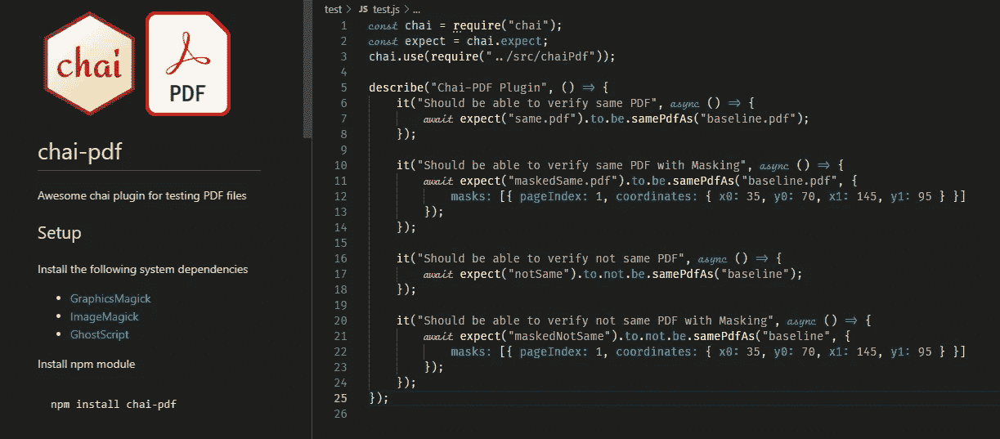

# chai-pdf:测试 pdf 文件的强大 chai 插件

> 原文：<https://itnext.io/chai-pdf-awesome-chai-plugin-for-testing-pdf-files-a0752f42e489?source=collection_archive---------3----------------------->



chai-pdf 正在运行

# 为什么是 chai-pdf？

您曾经遇到过项目要求您验证 pdf 文件的情况吗？你想要一个简单的方法来验证它们吗？如果是这样，那么请继续阅读。

通常，我们手动进行这些 pdf 测试，因为自动化测试可能会很复杂或者成本很高。我见过的一些 DIY 方法是将它们转换成可读的文本，然后验证特定字符串的存在。然而，我个人更喜欢将 pdf 页面转换成图像并进行图像比较的方法。通过这种方式，您不仅可以验证想要测试的文本是否存在，还可以验证 pdf 本身的结构。一举两得。


强制性模因

chai-pdf 提供了打包在一个简单易用的 [chai](https://www.npmjs.com/package/chai) 插件中的功能，使用您现有的 NodeJS 测试框架来验证 pdf。

# 给我看看代码！

样本 chai-pdf 测试

# 设置

首先，您需要安装以下系统依赖项:

*   [代笔](https://www.ghostscript.com/)
*   [图形魔术](http://www.graphicsmagick.org/README.html)
*   [ImageMagick](https://imagemagick.org/index.php)

一旦安装了这些依赖项，您现在就可以将 chai 插件安装到您的项目中了

```
npm install chai-pdf
```

在 NodeJS 测试框架中，创建以下文件夹结构，您将在其中放置 pdf:

*   /数据/实际 pdf
*   /数据/基线 pdf

# 测试执行


实际、基线和差异的示例图像

当您在后台执行测试时，chai-pdf 会将每个 pdf 转换成 png 文件，其中每个页面都有自己的索引。测试完成后，如果有差异，将在数据文件夹中保存一个差异图像，并以红色突出显示差异。

# 掩饰


掩饰

在某些情况下，pdf 文件可能包含动态数据。它可以是唯一的标识符或日期。在这种情况下， [chai-pdf](https://www.npmjs.com/package/chai-pdf) 允许您传递可以指示遮罩坐标的选项。这将在比较之前为实际和基线转换图像绘制一个黑色矩形。

# 下一步是什么？

就这样，很简单。

我正在考虑实现这个插件的其他功能和配置。如果你有一些建议，请在评论区告诉我你的想法。

保持牛逼，下集再见！

马尔达茨