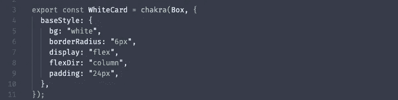

# 查克拉用户界面:为速度而建的反应库

> 原文：<https://itnext.io/chakra-ui-react-library-built-for-speed-dcf85cf8eed6?source=collection_archive---------1----------------------->

虽然有些人反对使用 UI 库，更喜欢从头开始构建它们的组件，但我认为由于速度优势，它们仍然值得使用。诀窍是找到正确的，查克拉 UI 是一个很好的选择。

Chakra UI 正在 React 社区获得支持。在撰写本文时，该库有大约 15.2K 的 Github stars 和 1.2K 的 forks。如果你是表情符号和风格系统的粉丝，那么采用 Chakra 是显而易见的——这个库是以这些技术为基础构建的。

这份清单将以赞成和反对的形式列出。先说优点。

## 赞成的意见

**#1 发展速度**

库为您提供了快速编写组件和设计组件样式的工具。背后的主要原因是它的[实用风格的道具。实用风格的道具将“快速”放在快速原型制作中。下面是一个样式化`Box`组件的例子:](https://chakra-ui.com/docs/features/style-props)

Chakra UI 有不同的便利组件，可以用于频繁的造型任务。有多少次你不得不编写定制的 CSS 来使元素在 div 中居中？嗯，你可以使用[中心](https://chakra-ui.com/docs/layout/center)组件来代替。

该库还提供了一些有用的钩子，比如" [useDisclosure](https://chakra-ui.com/docs/hooks/use-disclosure) "钩子。这个钩子允许您在项目中重用管理弹出窗口和模态的逻辑。

**#2 构件厂**

Chakra UI 提供了一种灵活的方式来构建样式组件。

使用库的[工厂函数](https://chakra-ui.com/docs/features/chakra-factory)，你可以像组装乐高积木一样组装组件。创建的组件与其构建块松散耦合。因此，您的组件系统将保持高度模块化。

**#3 内置打字稿**

Web 开发社区已经接受了 Typescript，而且理由很充分。使用 TypeScript 有很多好处，你可以在网上找到。这里有一篇来自数字海洋的关于这个话题的好文章。

Chakra UI 是以 TypeScript 为基础构建的。因此，该库提供了完整的 IDE 支持和类型检查。

**#4 聚焦 a11y**

如今，对于任何生产级别的软件来说，支持 [a11y](https://www.techopedia.com/definition/10165/accessibility-a11y#:~:text=Accessibility%20(a11y)%20is%20a%20measure,use%20that%20computer%20system%20successfully.) 都是必备的。Chakra UI 可以帮助你解决很多 a11y 问题，因为它提供了出色的 a11y 支持。

**#5 主动维护**

最后但同样重要的是，库的维护者积极地发布新的特性和改进。

举个例子，第二个版本提供了内置到库中的有用的钩子。这是一个很好的迹象，ChakraUI 正在 React 社区中保持最新的趋势。

## 骗局

**#1 一些组件没有遵循主题模式**

我遇到的一个不允许基于变体的样式的组件是 [Alert](https://chakra-ui.com/docs/feedback/alert) 。相反，警报的外观会根据“状态”属性发生变化。为了解决这个问题，我必须对组件应用自定义样式属性。

**#2 一名维护人员**

在撰写本文时，Chakra UI 似乎只有一个全心全意的维护者。那是图书馆的作者塞贡·阿德巴约。当有一个活跃的维护者时，停止支持的风险更高。但是这在未来可能不是问题，因为越来越多的人开始参与到图书馆中来。

**结论**

尽管有缺点，我还是鼓励你试试 Chakra UI！该库使得原型化和构建 React 组件变得更加容易和快速。

*原载于 2021 年 2 月 14 日 https://isamatov.com***。**