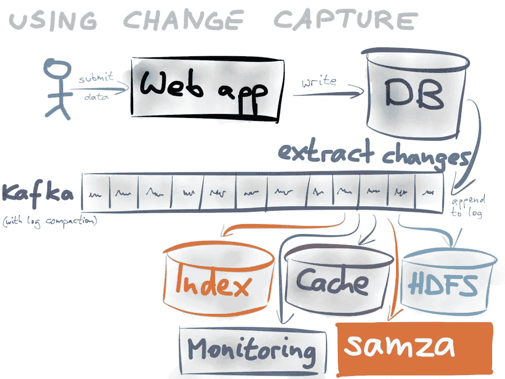
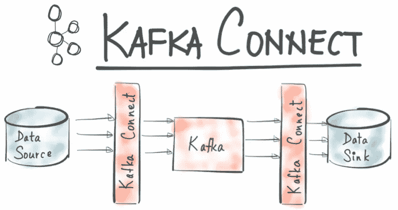
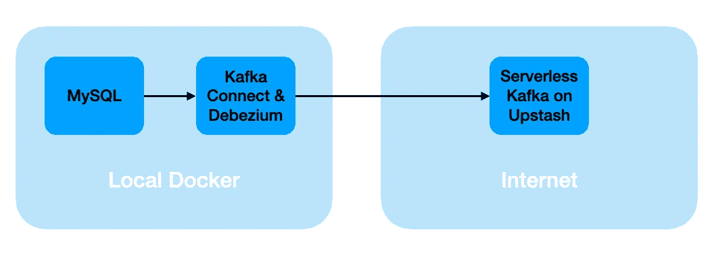
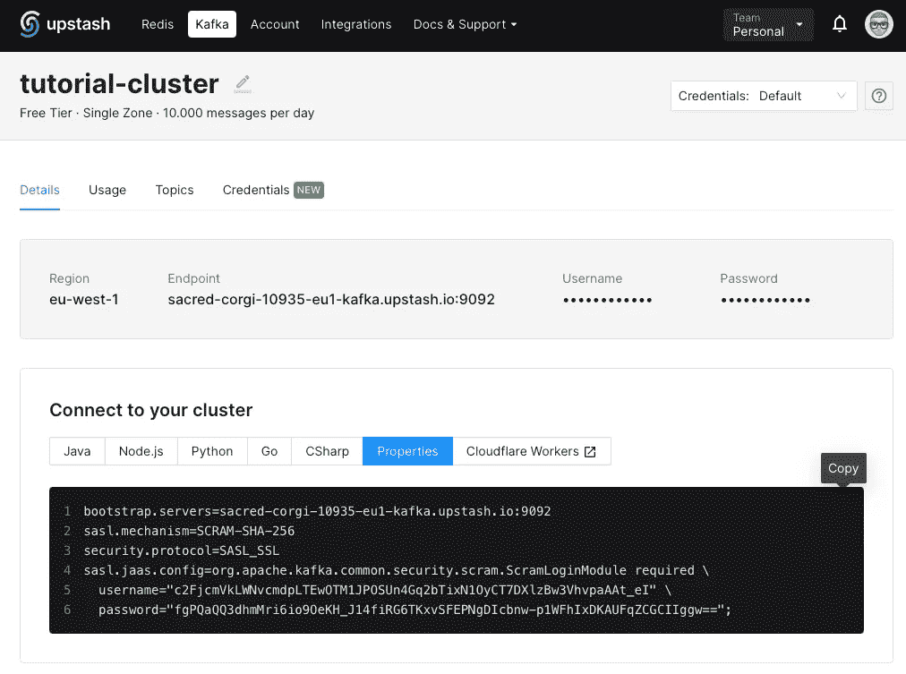
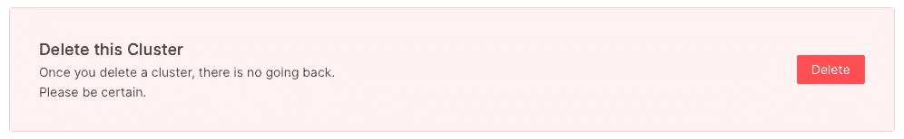

# 在无服务器 Kafka 上使用 Debezium 更改数据捕获

> 原文：<https://itnext.io/change-data-capture-with-debezium-on-serverless-kafka-e9e4bfa9944e?source=collection_archive---------0----------------------->


由 [Unsplash](https://unsplash.com?utm_source=medium&utm_medium=referral) 上的 [Modestas Urbonas](https://unsplash.com/@modestasu?utm_source=medium&utm_medium=referral) 拍摄的照片

如今，数据库无处不在，有了变更数据捕获，人们可以毫不费力地将它们转化为事件驱动系统的来源。

有像 Debezium 和 Kafka 这样的工具在这两个世界之间架起了桥梁，从而将传统的数据驱动应用程序转变为事件驱动应用程序。

本文将提供一个分步指南，介绍如何在 MySQL 数据库上使用 Debezium 和在 [Upstash](http://upstash.com/?utm_source=tobias_debezium) 上使用无服务器 Kafka 来设置变更数据捕获。

通过下图所示的事件驱动系统，我们可以对数据库的任何变化做出反应，无论是模式的变化还是存储数据的变化，并将该事件反馈给其他系统。



[https://discuse . dgraph . io/t/support-logical-replication-change-data-capture-CDC-with-Kafka/8747](https://discuss.dgraph.io/t/support-logical-replication-change-data-capture-cdc-with-kafka/8747)

在“过去”,我们必须运行批处理作业来周期性地在数据库上运行操作，以便处理存储的数据。这带来了许多缺点。这些手术费用昂贵，而且时间上有很大的延迟。

现在，当数据发生变化时，我们可以用较小的负载运行流程。

在接下来的章节中，我们将了解实现这样一个系统所需的所有部分。这些是:

*   数据库(MySQL)
*   Debezium
*   卡夫卡([抢在](http://upstash.com/?utm_source=tobias_debezium)前面)
*   卡夫卡连接

让我们开始更好地了解所有的部分。免责声明:我不会解释什么是数据库，但我会为所有其他部分提供一些提示。

## 什么是 Debezium？

Debezium 是一个工具，一个平台，用来监控数据库，以便能够立即对数据库中的变化做出反应。不仅可以检测到插入、更新和删除事件，还可以检测到模式变化。

它通过应用一种称为“变更数据捕获”的范式来实现这一点，这是一种设计模式，用于持续监控数据库的状态，然后通过向 Kafka 发送事件来对其做出反应。

## 卡夫卡是什么？

Kafka 是一个分布式事件流平台。对于本教程，我使用的是由 [Upstash](http://upstash.com/?utm_source=tobias_debezium) 提供的无服务器 Kafka。

[Upstash](http://upstash.com/?utm_source=tobias_debezium) 是一个按需付费的解决方案。这意味着，在你尝试的小项目中不需要信用卡。只有当您需要扩展您的 Kafka 集群并进行更高级的消息或事件交换时，它才需要成本。

查看这篇文章，让[超越](http://upstash.com/?utm_source=tobias_debezium)

[](/first-steps-with-upstash-for-kafka-6d4d023da590) [## 卡夫卡的第一步

### 编辑描述

itnext.io](/first-steps-with-upstash-for-kafka-6d4d023da590) 

## 什么是卡夫卡连接？

Kafka Connect 是一个框架，支持 Kafka 和其他系统之间的流式传输。正如本教程中所解释的，可以把它看作是卡夫卡和数据库之间的桥梁。



[https://www . confluent . io/blog/no-more-silos-how-to-integrate-your-databases-with-Apache-Kafka-and-CDC/](https://www.confluent.io/blog/no-more-silos-how-to-integrate-your-databases-with-apache-kafka-and-cdc/)

基本上，我们把所有的部分都集合在一起了。

## 将碎片拼在一起

让我们把在本教程中要用到的东西都摆在桌子上。

在本地机器上，我们将运行 MySQL 数据库和 Kafka Connect with Docker-Compose。

我们的无服务器卡夫卡在[的上方](http://upstash.com/?utm_source=tobias_debezium)结束了。我们用 SSL 保护本地 Kafka Connect 和 Upstah 之间的通信。



无标题的

是时候让所有部分一起工作了。这就是我们将在下一节中做的事情。

以下是接下来的步骤:

*   设置本地数据库
*   在 Upstash 上配置我们的 Kafka 集群和主题
*   配置 Kafka Connect 和 Debezium
*   创建数据库，添加一些数据和修改数据
*   监控与上述数据库操作相关的所有 Kafka 事件

## 设置本地数据库

是时候把手弄脏了。我们首先从建立数据库开始。

这是在`docker-compose.yml`中对 MySQL 数据库的服务描述

```
mysql:
    image: mysql:latest
    container_name: mysql
    command:
      --server-id=12345
      --log-bin=mysql-bin
      --binlog-format=ROW
      --binlog-row-image=full
    networks:
      - tutorial
    environment:
      MYSQL_USER: foo
      MYSQL_PASSWORD: bar
      MYSQL_ROOT_PASSWORD: foobar
    volumes:
      - db_data:/var/lib/mysql
```

首先从

```
docker-compose up mysql
```

通过控制台连接到数据库

```
docker-compose exec mysql bash -c 'mysql -uroot -pfoobar'
```

我们准备从 MySQL 控制台创建数据库。

```
create database testdb;
use testdb;
```

这是我们在本教程中要更改的数据库，捕获更改，将它们转换为事件，然后发送给 Kafka。嗯，我们只更改或修改数据库及其数据，其余的都是在后台自动处理的。

我们需要为我们的用户设置一些权限来监控这些更改。

```
GRANT REPLICATION CLIENT, REPLICATION SLAVE, LOCK TABLES ON *.* TO 'foo'@'%';

FLUSH PRIVILEGES;
```

数据库都设置好了。让我们去管道的另一边，也就是我们的卡夫卡星团。

## 主题的上传帐户和配置

我已经假设你有一个正在运行的 Kafka 集群。

现在，这取决于您的集群是否允许自动生成主题。否则，需要手动创建几个主题。

这就是它需要在后面的[上看起来的样子。](http://upstash.com/?utm_source=tobias_debezium)


现在，不管您的数据库如何命名，以下三个主题总是需要的:

*   连接-偏移
*   连接-配置
*   连接-状态

请确保他们有一个“紧凑”的清理策略。

然后我们有两个特定于数据库的主题

*   架构更改. testdb
*   服务器名称

我们的表还有一个主题，我们将监视它，但还没有创建。

*   服务器名.测试数据库.飞机

这些名称配置在不同的地方。

前三个在我们的`docker-compose.yml`中的 Kafka Connect 配置中提供。

## 使用 Debezium 连接器配置 Kafka Connect

最后，我们将连接器放回原处。这是我们如何用 Docker Compose 配置 Kafka Connect:

```
connect:
    image: quay.io/debezium/connect:1.9
    container_name: connect
    ports:
      - "8083:8083"
    networks:
      - tutorial
    environment:
      BOOTSTRAP_SERVERS: ...

      CONNECT_SECURITY_PROTOCOL: SASL_SSL
      CONNECT_SASL_MECHANISM: SCRAM-SHA-256
      CONNECT_SASL_JAAS_CONFIG: ...

      CONNECT_PRODUCER_SECURITY_PROTOCOL: SASL_SSL
      CONNECT_PRODUCER_SASL_MECHANISM: SCRAM-SHA-256
      CONNECT_PRODUCER_SASL_JAAS_CONFIG: ...

      CONFIG_STORAGE_TOPIC: connect-configs
      OFFSET_STORAGE_TOPIC: connect-offsets
      STATUS_STORAGE_TOPIC: connect-statuses
```

请确保用您的服务器名称和凭据替换圆点。

让我们开始吧

```
docker-compose up -d connect
```

最后，我们通过发出下面的 curl 命令，将 Debezium 连接器放到它的位置上

```
curl --location --request POST '127.0.0.1:8083/connectors' \
--header 'Content-Type: application/json' \
--data-raw '{
  "name": "tutorial-connector",  
  "config": {  
    "connector.class": "io.debezium.connector.mysql.MySqlConnector",
    "tasks.max": "1",  
    "database.hostname": "mysql",  
    "database.port": "3306",
    "database.user": "foo",
    "database.password": "bar",
    "database.server.id": "12345",
    "database.allowPublicKeyRetrieval":"true",
    "database.server.name": "theservername",  
    "database.include.list": "testdb",
    "table.whitelist": "testdb.planes",
    "table.include.list": "testdb.planes",
    "database.history.kafka.bootstrap.servers": "...",  
    "database.history.kafka.topic": "schema-changes.testdb",
    "database.history.consumer.security.protocol": "SASL_SSL",
    "database.history.consumer.ssl.endpoint.identification.algorithm": "https",
    "database.history.consumer.sasl.mechanism": "SCRAM-SHA-256",
    "database.history.consumer.sasl.jaas.config": "..."
    "database.history.producer.security.protocol": "SASL_SSL",
    "database.history.producer.ssl.endpoint.identification.algorithm": "https",
    "database.history.producer.sasl.mechanism": "SCRAM-SHA-256",
    "database.history.producer.sasl.jaas.config": "..."
  }
}'
```

同样，请确保替换服务器名称和您的凭据。

让我们检查一下连接器

```
curl --location --request GET '127.0.0.1:8083/connectors/tutorial-connector'
```

现在一切都各就各位了:

*   卡夫卡集群
*   Kafka Connect 和 Debezium
*   MySQL 数据库

在下一部分，我们将

*   创建表格
*   向表中添加一些数据
*   更改表格中的数据
*   监视特定卡夫卡主题的每一个动作

## 在 Kafka 中监控数据库操作

最后，在将所有的部分放回原位后，我们可以创建我们的表，添加和修改一些数据，并观察 Kafka 中的事件。

我们将使用`kafka-console-consumer`来监听 Kafka 主题，为此我们需要创建一个配置文件来存放一些属性。我把这个文件叫做`upstash.config`:

```
sasl.mechanism=SCRAM-SHA-256
security.protocol=SASL_SSL
    sasl.jaas.config=...
```

您可以直接从[上复制这些值到](http://upstash.com/?utm_source=tobias_debezium)



我们将监控两个主题:

*   架构更改. testdb
*   服务器名.测试数据库.飞机

让我们用下面的命令来监视第一个:

```
kafka-console-consumer --bootstrap-server ... --consumer.config upstash.config --from-beginning --topic schema-changes.testdb
```

在 MySQL 控制台中，您创建了一个表

```
CREATE TABLE planes (color INT);
```

这应该会在卡夫卡中产生一个事件，看起来应该是这样的:

```
{
  "source" : {
    "server" : "theservername"
  },
  "position" : {
    "transaction_id" : null,
    "ts_sec" : 1652358237,
    "file" : "mysql-bin.000003",
    "pos" : 1624,
    "server_id" : 12345
  },
  "databaseName" : "testdb",
  "ddl" : "CREATE TABLE planes (color INT)",
  "tableChanges" : [ {
    "type" : "CREATE",
    "id" : "\"testdb\".\"planes\"",
    "table" : {
      "defaultCharsetName" : "utf8mb4",
      "primaryKeyColumnNames" : [ ],
      "columns" : [ {
        "name" : "color",
        "jdbcType" : 4,
        "typeName" : "INT",
        "typeExpression" : "INT",
        "charsetName" : null,
        "position" : 1,
        "optional" : true,
        "autoIncremented" : false,
        "generated" : false,
        "comment" : null,
        "hasDefaultValue" : true,
        "enumValues" : [ ]
      } ]
    },
    "comment" : null
  } ]
}
```

我们用这个命令开始看第二个主题:

```
kafka-console-consumer --bootstrap-server ... --consumer.config upstash.config --from-beginning --topic theservername.testdb.planes
```

现在，让我们添加一些数据

```
INSERT INTO planes (color) VALUES (1);
```

您应该能够观察到类似这样的事件(提示:滚动到“有效负载”并检查“之前”和“之后”字段)。

```
{
    "schema": {
        "type": "struct",
        "fields": [
            {
                "type": "struct",
                "fields": [
                    {
                        "type": "int32",
                        "optional": true,
                        "field": "color"
                    }
                ],
                "optional": true,
                "name": "theservername.testdb.planes.Value",
                "field": "before"
            },
            {
                "type": "struct",
                "fields": [
                    {
                        "type": "int32",
                        "optional": true,
                        "field": "color"
                    }
                ],
                "optional": true,
                "name": "theservername.testdb.planes.Value",
                "field": "after"
            },
            {
                "type": "struct",
                "fields": [
                    {
                        "type": "string",
                        "optional": false,
                        "field": "version"
                    },
                    {
                        "type": "string",
                        "optional": false,
                        "field": "connector"
                    },
                    {
                        "type": "string",
                        "optional": false,
                        "field": "name"
                    },
                    {
                        "type": "int64",
                        "optional": false,
                        "field": "ts_ms"
                    },
                    {
                        "type": "string",
                        "optional": true,
                        "name": "io.debezium.data.Enum",
                        "version": 1,
                        "parameters": {
                            "allowed": "true,last,false,incremental"
                        },
                        "default": "false",
                        "field": "snapshot"
                    },
                    {
                        "type": "string",
                        "optional": false,
                        "field": "db"
                    },
                    {
                        "type": "string",
                        "optional": true,
                        "field": "sequence"
                    },
                    {
                        "type": "string",
                        "optional": true,
                        "field": "table"
                    },
                    {
                        "type": "int64",
                        "optional": false,
                        "field": "server_id"
                    },
                    {
                        "type": "string",
                        "optional": true,
                        "field": "gtid"
                    },
                    {
                        "type": "string",
                        "optional": false,
                        "field": "file"
                    },
                    {
                        "type": "int64",
                        "optional": false,
                        "field": "pos"
                    },
                    {
                        "type": "int32",
                        "optional": false,
                        "field": "row"
                    },
                    {
                        "type": "int64",
                        "optional": true,
                        "field": "thread"
                    },
                    {
                        "type": "string",
                        "optional": true,
                        "field": "query"
                    }
                ],
                "optional": false,
                "name": "io.debezium.connector.mysql.Source",
                "field": "source"
            },
            {
                "type": "string",
                "optional": false,
                "field": "op"
            },
            {
                "type": "int64",
                "optional": true,
                "field": "ts_ms"
            },
            {
                "type": "struct",
                "fields": [
                    {
                        "type": "string",
                        "optional": false,
                        "field": "id"
                    },
                    {
                        "type": "int64",
                        "optional": false,
                        "field": "total_order"
                    },
                    {
                        "type": "int64",
                        "optional": false,
                        "field": "data_collection_order"
                    }
                ],
                "optional": true,
                "field": "transaction"
            }
        ],
        "optional": false,
        "name": "theservername.testdb.planes.Envelope"
    },
    "payload": {
        "before": null,
        "after": {
            "color": 1
        },
        "source": {
            "version": "1.9.0.Final",
            "connector": "mysql",
            "name": "theservername",
            "ts_ms": 1652363759000,
            "snapshot": "false",
            "db": "testdb",
            "sequence": null,
            "table": "planes",
            "server_id": 12345,
            "gtid": null,
            "file": "mysql-bin.000003",
            "pos": 1153,
            "row": 0,
            "thread": 8,
            "query": null
        },
        "op": "c",
        "ts_ms": 1652363759766,
        "transaction": null
    }
}
```

让我们通过修改数据来做另一个测试

```
UPDATE planes SET color=2 WHERE color=1;
```

这将产生以下结果。再次检查“有效负载”部分中的“之前”和“之后”字段。

```
{
    "schema": {
        "type": "struct",
        "fields": [
            {
                "type": "struct",
                "fields": [
                    {
                        "type": "int32",
                        "optional": true,
                        "field": "color"
                    }
                ],
                "optional": true,
                "name": "theservername.testdb.planes.Value",
                "field": "before"
            },
            {
                "type": "struct",
                "fields": [
                    {
                        "type": "int32",
                        "optional": true,
                        "field": "color"
                    }
                ],
                "optional": true,
                "name": "theservername.testdb.planes.Value",
                "field": "after"
            },
            {
                "type": "struct",
                "fields": [
                    {
                        "type": "string",
                        "optional": false,
                        "field": "version"
                    },
                    {
                        "type": "string",
                        "optional": false,
                        "field": "connector"
                    },
                    {
                        "type": "string",
                        "optional": false,
                        "field": "name"
                    },
                    {
                        "type": "int64",
                        "optional": false,
                        "field": "ts_ms"
                    },
                    {
                        "type": "string",
                        "optional": true,
                        "name": "io.debezium.data.Enum",
                        "version": 1,
                        "parameters": {
                            "allowed": "true,last,false,incremental"
                        },
                        "default": "false",
                        "field": "snapshot"
                    },
                    {
                        "type": "string",
                        "optional": false,
                        "field": "db"
                    },
                    {
                        "type": "string",
                        "optional": true,
                        "field": "sequence"
                    },
                    {
                        "type": "string",
                        "optional": true,
                        "field": "table"
                    },
                    {
                        "type": "int64",
                        "optional": false,
                        "field": "server_id"
                    },
                    {
                        "type": "string",
                        "optional": true,
                        "field": "gtid"
                    },
                    {
                        "type": "string",
                        "optional": false,
                        "field": "file"
                    },
                    {
                        "type": "int64",
                        "optional": false,
                        "field": "pos"
                    },
                    {
                        "type": "int32",
                        "optional": false,
                        "field": "row"
                    },
                    {
                        "type": "int64",
                        "optional": true,
                        "field": "thread"
                    },
                    {
                        "type": "string",
                        "optional": true,
                        "field": "query"
                    }
                ],
                "optional": false,
                "name": "io.debezium.connector.mysql.Source",
                "field": "source"
            },
            {
                "type": "string",
                "optional": false,
                "field": "op"
            },
            {
                "type": "int64",
                "optional": true,
                "field": "ts_ms"
            },
            {
                "type": "struct",
                "fields": [
                    {
                        "type": "string",
                        "optional": false,
                        "field": "id"
                    },
                    {
                        "type": "int64",
                        "optional": false,
                        "field": "total_order"
                    },
                    {
                        "type": "int64",
                        "optional": false,
                        "field": "data_collection_order"
                    }
                ],
                "optional": true,
                "field": "transaction"
            }
        ],
        "optional": false,
        "name": "theservername.testdb.planes.Envelope"
    },
    "payload": {
        "before": {
            "color": 1
        },
        "after": {
            "color": 2
        },
        "source": {
            "version": "1.9.0.Final",
            "connector": "mysql",
            "name": "theservername",
            "ts_ms": 1652363881000,
            "snapshot": "false",
            "db": "testdb",
            "sequence": null,
            "table": "planes",
            "server_id": 12345,
            "gtid": null,
            "file": "mysql-bin.000003",
            "pos": 1443,
            "row": 0,
            "thread": 8,
            "query": null
        },
        "op": "u",
        "ts_ms": 1652363881104,
        "transaction": null
    }
}
```

这里有几个您可以尝试的命令。

```
ALTER TABLE PLANES ADD NAME varchar(100);
DROP TABLE PLANES;
```

## 清除

一切都搞定了吗？该打扫了。

在您的本地计算机上，停止所有容器并移除它们:

```
docker-compose rm -fsv
```

您也可以删除所有未使用的卷。小心这一点，这可能会删除仍可使用的卷。

```
docker system prune -f --volumes
```

最后，在[上抢了](http://upstash.com/?utm_source=tobias_debezium)的风头。转到“Datails ”,滚动到最后，找到删除集群的选项。



## 结论

这篇文章有一个简单的目的:提供关于使用 Debezium 捕获变更数据的实用介绍。

我们首先展示了我们需要的所有部分，以显示弥合我们的数据库和 Kafka 集群之间的差距所需的内容。

然后我们填补了空白，将 Kafka Connect 和 Debezium 放在它的位置上，将数据库转变为事件驱动系统的来源。

感谢您的阅读！

*   如果你喜欢这个，请[在媒体](https://twissmueller.medium.com/)上跟随我
*   [给我买杯咖啡](https://www.buymeacoffee.com/twissmueller)让我继续前进
*   通过[在这里注册](https://twissmueller.medium.com/membership)来支持我和其他媒体作者

[](https://twissmueller.medium.com/membership) [## 通过我的推荐链接加入媒体

### 作为一个媒体会员，你的会员费的一部分会给你阅读的作家，你可以完全接触到每一个故事…

twissmueller.medium.com](https://twissmueller.medium.com/membership) 

这篇文章包含附属链接，由 [Upstash](http://upstash.com/?utm_source=tobias_debezium) 赞助。

## 资源

*   [MongoDB 的 Debezium 连接器](https://debezium.io/documentation/reference/stable/connectors/mongodb.html)
*   [MySQL 的 Debezium 连接器](https://debezium.io/documentation/reference/stable/connectors/mysql.html)
*   [Debezium:教程](https://debezium.io/documentation/reference/stable/tutorial.html)
*   [MariaDB:激活二进制日志](https://mariadb.com/kb/en/activating-the-binary-log/)
*   [**Debezium & MySQL v8:不允许公钥检索**](https://rmoff.net/2019/10/23/debezium-mysql-v8-public-key-retrieval-is-not-allowed/)
*   [更改数据采集](https://en.wikipedia.org/wiki/Change_data_capture)