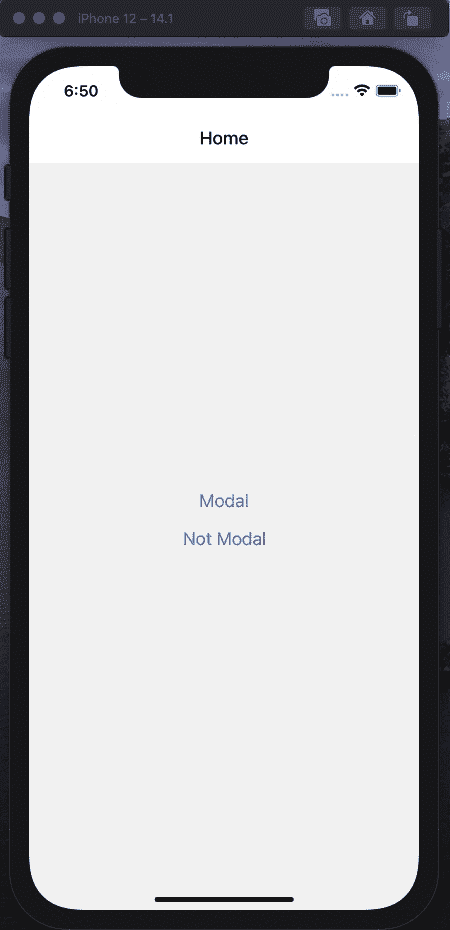
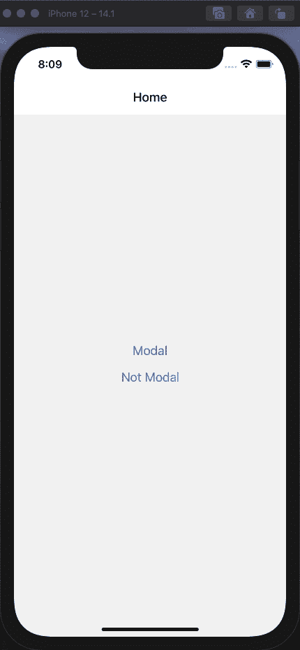
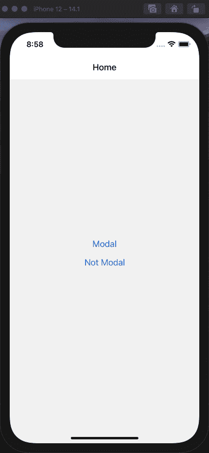
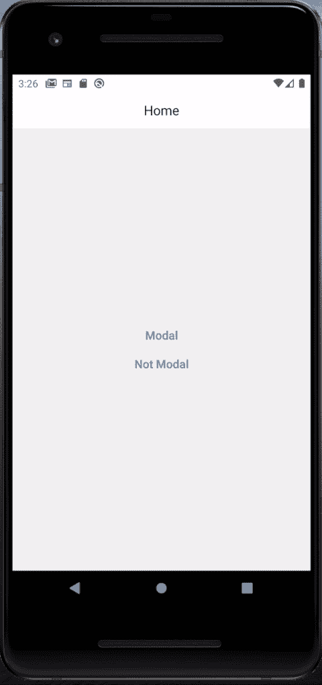
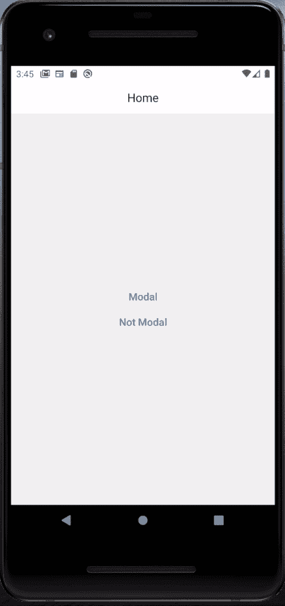

# 使用 react-navigation 更改 React 本机屏幕动画方向

> 原文：<https://itnext.io/change-react-native-screen-animation-direction-with-react-navigation-8cec0f66f22?source=collection_archive---------0----------------------->

在这篇文章中，我们将检查如何为任何我们想要的屏幕产生从下到上或从右到左的过渡。在我们的例子中，我们将有几个屏幕处于*模态*和*堆栈*模式。

我们将创建带有自定义标题的导航堆栈。对于某些屏幕，左侧动作必须是带有十字图标( **X** )的 ***关闭*** ，而对于某些屏幕，必须是带有向左箭头图标(←)的 ***返回*** 动作。

对于带有关闭( **X)** 图标的屏幕，屏幕必须表现得像模态屏幕一样，在出现屏幕时有自下而上的动画，在关闭屏幕时有自上而下的动画。

对于带有 back (←)图标的屏幕，屏幕必须像堆栈一样运行，因此动画应该在左右方向上。

# 设置导航

首先，让我们创建导航栈。我们将创建三个主屏幕— **主页**、**模态堆栈**和**非模态**。Home 和 NotModal 将只是一个简单的屏幕，而 ModalStack 将是我们新的屏幕堆栈。它应该以模态的形式出现，但是它里面的屏幕应该像普通的堆栈一样。

我们将 headerMode 设置为 ***none*** ，因为我们将使用我们自己的自定义头组件。

现在，我们的屏幕应该是这样的:



正如你所注意到的，我们的屏幕都没有“模态”行为。接下来我们将把 ***mode=modal*** 添加到我们的根导航器道具中。

对于我们的模态栈，我们现在已经得到了我们想要的。模态是作为 ***模态*** 本身打开的，但是模态内的其他屏幕有*堆栈式的*左右过渡。在 Android 上，你仍然可以看到模态堆栈中的其他屏幕不是从右到左的，但是我们稍后会讨论这个问题。

好吧，但是非模态屏幕呢？当我们将根导航器切换到 ***模态*** 模式时，其中的所有屏幕现在也是模态的。



# 添加自定义过渡

幸运的是，react-navigation 5 让我们有机会将自定义过渡添加到屏幕上。由于这一点，我们可以创建类似模态的和类似堆栈的导航，并在任何我们想要的地方添加它们。

如果你在 react-navigation doc(【https://reactnavigation.org/docs/stack-navigator】)中查看***create stack navigator***options props，你可以找到一堆操纵动画的选项。出于我们的目的，我们将使用***cardStyleInterpolator***。这个回调给了我们很多关于当前布局和当前过渡进度的信息，所以我们可以基于这些信息创建我们的自定义动画。我们只需要返回新的 ***cardStyle*** 对象，在那里我们可以添加我们的动画，就像我们对普通的 react 本地动画所做的那样。

因此，如果我们想为 react native 中某些组件准备从右向左的动画，我们可以这样做:

```
animatedStyle = { transform: [ { translateX: animation.interpolate({ inputRange: [0, 1], outputRange: [screen.width, 0], }), }, ],};
```

首先，当动画在它的起始点( **inputRange = 0** )时，我们将整个组件平移到屏幕右边缘之外。所以我们将 translateX 设置为 screen.width 值(**output range = screen . width**)。在转换结束时( **inputRange = 1** )，我们希望将 translateX 设置为 0 ( **outputRange = 0** )，这样它就不会被转换，完全可见。

就像我们在反应导航屏幕上做的一样。我们访问的不是 ***动画*** 对象，而是 ***当前进度*** 对象，这只是一个动画类型的对象。当谈到 ***screen.width*** 时，在我们的***cardStyleInterpolator***回调中我们可以访问***layouts . screen***对象，这是一个布局类型。

顺便说一句***cardStyleInterpolator***提供了比仅仅 ***当前*** 和 ***布局*** 更多的数据，所以如果你想准备更多花哨的过渡，你可以在 react-navigation 文档中查看。

我们要做的最后一件事是将我们的新品牌动画添加到我们的 react-***not modal***options 道具中。

而对于现在我们的 ***非模态*** 屏幕动画有水平方向。



我们要做的最后一件事是为 ***手势方向*** 道具添加适当的值。当我们改变过渡时，我们也应该调整与导航屏幕相关的用户手势的适当行为。我们可以将其设置为垂直、水平、垂直倒置或水平倒置。在我们的例子中，我们将它的值设置为水平，所以用户可以通过水平滑动返回。

现在我们可以回到 Android 了。我们现在有了自定义的水平动画，我们也可以将它添加到我们的 ***模式堆栈中。导航器*** 屏幕选项。在 Android 上，这个堆栈中的屏幕也可以表现得像“模态”一样，具有自下而上的过渡动画，所以现在我们可以改变它。



使用这个工具，我们也可以改变水平动画到垂直。

垂直动画看起来与水平动画非常相似。我们只需要从屏幕的最底部开始插值，然后沿着 Y 轴平移一切。

现在我们可以改变任何屏幕的动画方向。



## [**你会在 Github 上找到带有 Typescript 的完整项目。**](https://github.com/justynasowinska/react_native_navigation_transition_direction)