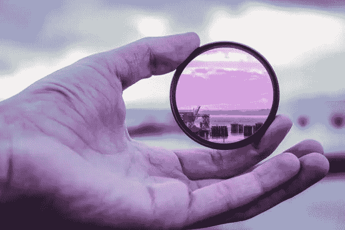
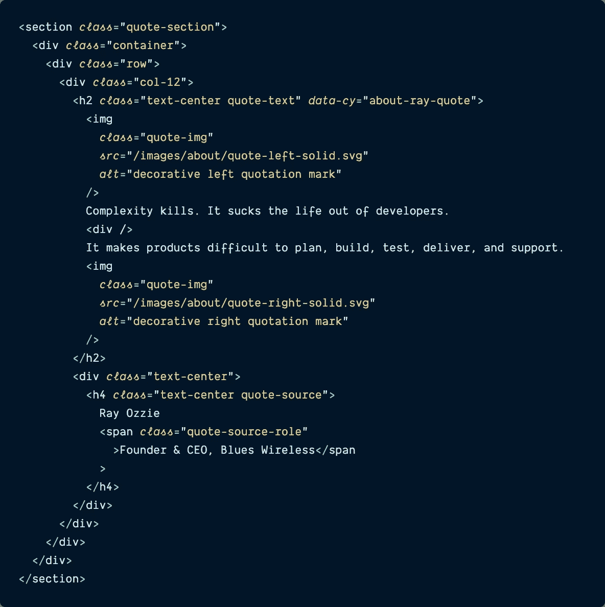
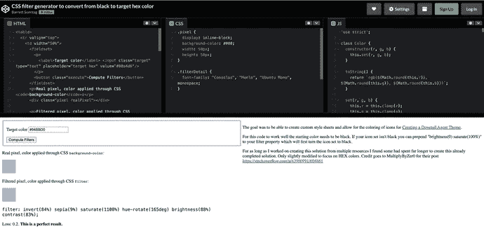
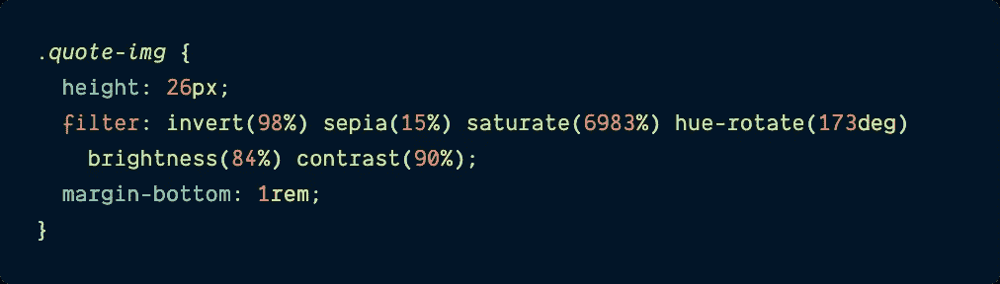

# 借助 CSS 滤镜更改 SVG 颜色

> 原文：<https://itnext.io/change-svg-color-with-help-from-css-filter-d978fb0d0bc9?source=collection_archive---------4----------------------->

## 当 SVG 的颜色稍有偏差时，我们不再需要打扰设计者:只需过滤它。

# 介绍

作为一名网页开发人员，和有才华的设计师一起工作是一件非常愉快的事情。他们不仅为页面设计出漂亮的布局，将复杂的概念简化成易于理解的视觉效果，而且经常给我提供机会学习一种新的 web 开发技术，将他们的想法变成现实。

我最近在为公司的营销网站建立一个新的“关于我们”页面时就有了这样一个机会。在模型中，页面上有我们创始人的一大段引文，文本周围的引号是风格化的 SVG 图像。然而，当设计师给我 SVG 时，它们是标准的黑色，与设计中的蓝色不匹配。

在我要求我的设计师重新创建新的 SVG 以匹配设计中的颜色(或者尝试自己改变 SVG 的颜色)之前，我在网上做了一些研究，发现了一个有用的 CSS 技术:`filter`。有了`filter`，我可以自己改变 SVG 的颜色——并且改变成我想要的任何色调——不需要打扰我的设计师。

**在这篇文章中，我们将探索 CSS** `**filter**` **，看看它如何被用来改变 SVG 图像的颜色以匹配模型中的颜色。**

我甚至会分享一个方便的网站，它会生成`filter`组合来精确复制 CSS 十六进制颜色。

下面的视频展示了 CSS 滤镜如何影响引号 SVG 的颜色——注意它们是如何从黑色变成浅蓝色的。

# CSS 过滤器

在我分享解决方案之前，让我们仔细看看 CSS`filter`——在此之前我并不熟悉这项技术。

根据 MDN 文档中关于 [**CSS**](https://developer.mozilla.org/en-US/docs/Web/CSS/filter) `[**filter**](https://developer.mozilla.org/en-US/docs/Web/CSS/filter)`的描述，它是用来对一个元素应用图形效果，比如模糊或者颜色偏移。一些标准的 CSS 函数包括:

*   `blur` -使图像更模糊或更清晰。
*   `contrast` -调整图像颜色的对比度。
*   `grayscale` -将图像转换为灰度。
*   `drop-shadow` -应用图像的模糊、偏移版本，以特定颜色绘制并合成在图像下方。

除了这些标准函数之外，SVG 还可以通过 SVG 过滤器元素的 URL 引用——本质上是一个自定义过滤器。

> *这篇文章没有详细介绍过滤函数是如何工作的，因为它们相当复杂。如果你想全面了解它们是什么以及它们是如何工作的，我推荐你查看一下* [*Mozilla 文档*](https://developer.mozilla.org/en-US/docs/Web/CSS/filter#functions) *以获得更多信息。*

现在，文档没有强调的是，这些函数中的多个可以在一个函数中组合*在一起*以产生巨大的效果——比如说，改变 SVG 的颜色，这是我们接下来要讨论的。

# 过滤器在工作

带有浅蓝色 SVG 引号的最终报价。

好的，让我向你展示如何在你自己的代码中使用这些过滤函数。首先你需要一些 HTML 元素来应用这个 CSS。

## 设置 HTML、SVGs 和 img-quote 类

我工作的网站碰巧是用雨果制作的，雨果是一个流行的用 go 编写的开源静态网站生成器。虽然它是用 Go 编写的，但是它依赖于[模板](https://gohugo.io/templates/introduction/)来呈现网站的大部分 HTML，所以如果你懂 HTML 的话，下面的示例代码应该对你来说比较熟悉。

> ***模板说明:***
> 
> *如果你曾经使用过 React 的 JSX 组件，Node.js 的 Pug 或 Handlebars，或者 Jekyll——Hugo 的模板是相似的:HTML 元素带有 go 变量和函数，用* `*{{ }}*` *在模板注入的地方呈现正确的信息。*

下面是报价部分的代码。为了本文的目的和清晰，我用生成的 HTML 替换了注入模板的 Go 变量。

`quote-template.html`

虽然这段代码相对较小，但仍然值得讨论。除了 HTML 元素之外，还有相当多的 CSS 类，其中许多是由 Bootstrap 的**提供的，Bootstrap 是响应式 web 开发的原始开源 CSS 框架之一。**

**在我用来自定义样式的`quote-section`、`quote-img`等自定义类中，有`container`、`row`、`col-12`、`text-center`等。所有后面的例子都是引导类，用来做一些事情，比如让引用文本占据页面的整个宽度:`col-12`，或者将文本放在`
` : `text-center`的中心。**

**虽然这些类与本文无关，但是本文中您想要关注的是附加到两个``元素的类:这是两个引号 SVG。**

**这个`quote-img`类就是我们如何将 CSS `filter`函数附加到两个引号 SVG 上，并确保它们的颜色与设计相匹配。**

## **将 CSS 过滤器添加到 quote-img**

**正如我上面提到的，我的设计师给我的 SVG 是标准的黑色，但是在设计模型中，引号是一种更淡的蓝色:十六进制颜色`#94BBD0`。**

**当我开始寻找改变这些 SVG 颜色的解决方案时，我在 StackOverflow 上看到了[这个答案。](https://stackoverflow.com/questions/22252472/how-to-change-the-color-of-an-svg-element/53336754#53336754)**

**虽然在回答帖中有人建议直接修改 SVG 的源代码(这不是我想做的事情)，但幸运的是我不必这样做。**

**我找到的解决方案不仅演示了如何使用 CSS `filter`来修改 SVG 的颜色，它还链接到一个 [**有用的 CodePen**](https://codepen.io/sosuke/pen/Pjoqqp) ，它允许我输入我想要的十六进制颜色(`#94BBD0`)，并给出创建它的确切 CSS 滤镜组合(加上一个精确读数，显示 CSS 滤镜代码与原始十六进制颜色的匹配程度)。我所要做的就是复制代码，在我自己的 CSS 文件中使用。多么惊人的省时！**

****

**CodePen 将任何 SVG 转换成特定的十六进制颜色:【https://codepen.io/sosuke/pen/Pjoqqp.】T21 感谢开发人员不辞辛苦地制作了这个！**

**因此，在我自己的 SCSS 文件中，添加了下面的类和从 CSS 过滤器代码生成器复制的代码，以帮助设计“关于我们”页面的 HTML 样式。**

> *****注意:*** *尽管示例代码中显示的这个文件是 SCSS 而不是纯 CSS，但对于这篇文章来说，应该没什么区别。应该是直接 1:1 对比。***

**`about.scss`**

****

**多个过滤函数的精心组合，如`invert`、`sepia`和其他函数，瞧——与十六进制代码完全匹配的蓝色阴影。**

**为了使图像引用相对于文本具有合适的大小和位置，除了改变它们的颜色，我还需要将 SVG 的高度设置为`26px`，并给它们一个`16px`的底部边距，使它们看起来像是围绕着文本，而不是与文本居中对齐。**

**现在，SVG 的颜色与实体模型相匹配，不需要设计师的干预——如果需要，将来可以很容易地进行更改。多方便啊？**

# **结论**

**伟大的设计有能力抓住人们的注意力，帮助他们理解特定产品或公司的好处——很多时候，他们帮助开发人员将这些设计付诸实践，在这个过程中学习一两件新东西。**

**当我为我公司的网站创建一个新页面，上面有一大段引用我们公司创始人的话时，我就遇到了这样一个场景，风格化的引号以黑色 SVG 图像的形式出现，但在设计中却显示为蓝色。**

**在要求我的设计师花时间用合适的颜色重新创建它们以匹配设计之前，我做了一些初步的谷歌搜索，发现了一个更加灵活的、代码驱动的解决方案，它充分利用了 CSS `filter`。**

**不仅答案存在，而且有人还做了一个可以匹配任何十六进制颜色的[码笔](https://codepen.io/sosuke/pen/Pjoqqp)！这正是我所需要的，任何人都可以从中受益。web 开发社区可以如此慷慨。**

**过几周再来看看——我会写更多关于 JavaScript、React、IoT 或其他与 web 开发相关的东西。**

**如果你想确保你不会错过我写的一篇文章，在这里注册我的时事通讯:[https://paigeniedringhaus.substack.com](https://paigeniedringhaus.substack.com/)**

**感谢阅读。我希望这个使用 CSS 的`filter`将 SVG 从一种颜色转换成另一种颜色的酷技巧能像它为我做的那样为你所用。作为一名开发人员，能够通过代码做出这些改变是一种很棒的感觉。**

# **参考资料和更多资源**

*   **[MDN 文档，CSS 过滤器](https://developer.mozilla.org/en-US/docs/Web/CSS/filter)**
*   **[栈溢出线程](https://stackoverflow.com/questions/22252472/how-to-change-the-color-of-an-svg-element/53336754#53336754)用于 CSS 过滤解决方案**
*   **[CodePen 网站通过 CSS 过滤器将 SVG 匹配到任何十六进制颜色](https://codepen.io/sosuke/pen/Pjoqqp)**

***原载于*[*https://www.paigeniedringhaus.com*](https://www.paigeniedringhaus.com/blog/change-svg-color-with-help-from-css-filter)*。***