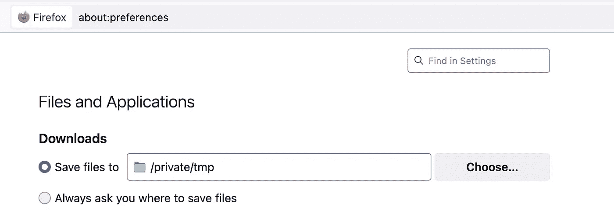
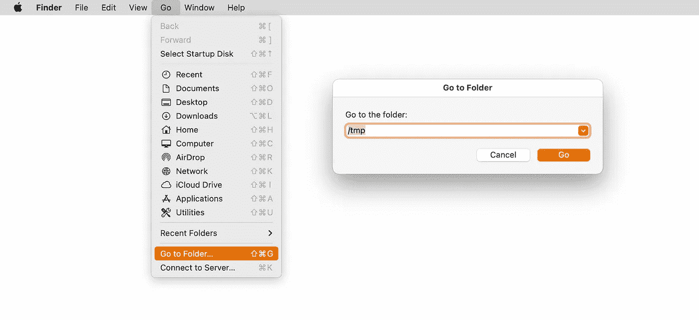
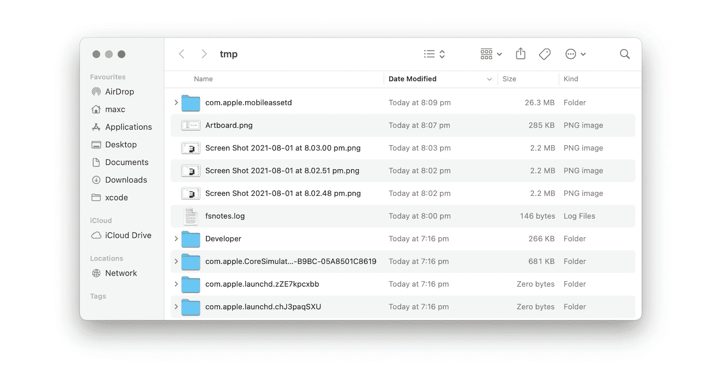
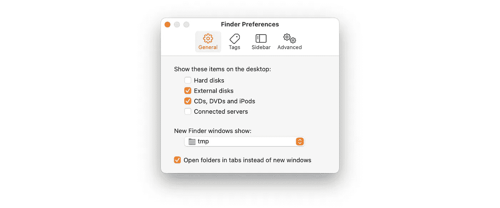
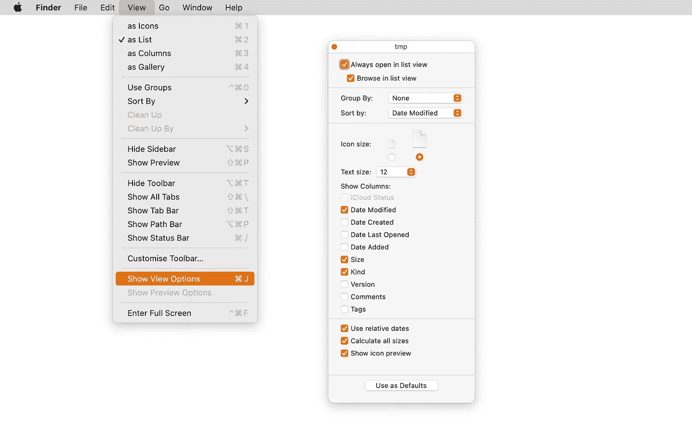
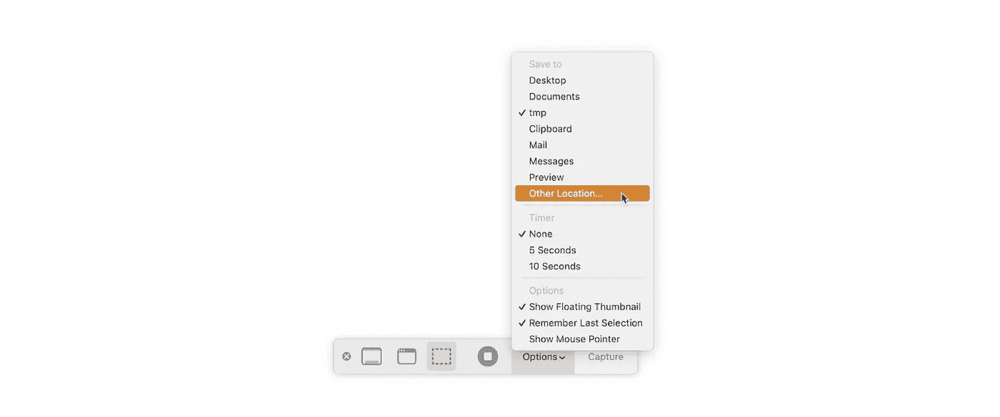

# 更改您的默认下载位置！

> 原文：<https://itnext.io/change-your-default-downloads-location-77a3e3477049?source=collection_archive---------3----------------------->

## 这里有一个关于如何处理混乱的~/Downloads 文件夹的想法。

*抬头！我通常会写一些相当技术性的软件工程文章——这篇特别的文章详细介绍了我在开发软件时发现的一些有用的东西，但是它也可以方便任何使用 Mac 的人！*


# 下载，下载，无处不在！

很多年来，我的`~/Downloads`文件夹的内容每天都在增加。在建议的午餐地点的 PDF 菜单和作为占位符下载的图像中，有一些文件，如示例软件项目，在许多周内仍然有用。

问题是我没有删除文件的政策:我经常需要整理所有的东西，决定什么应该扔掉。由于硬盘空间很大，所以“经常”指的是那些我用完磁盘空间的罕见情况。

# 保持下载文件短暂

我的解决方案是将浏览器下载文件的默认位置设置到一个特殊的文件夹:`/private/tmp`



火狐❤️

`/private/tmp`(也称为`/tmp`)是 macOS(以及其他基于 Unix 的操作系统)上的一个文件夹，用于存储口头文件。操作系统可以(也将会)在它认为合适的时候永久删除`/tmp`。如果你想更深入地了解，这里有一些进一步的信息，但是实际上我经历过重启电脑后被清空。

> 使用/tmp 进行下载意味着下载的任何内容都可能在任何时候被删除，所以您不得不将您实际想要保留的每个文件移动到一个更合适的位置！

# 如何从 Finder 访问/tmp

`/tmp`有点隐蔽，所以需要事先做一些设置:

## **使用取景器**

从 *Go* 菜单中选择 *Go to Folder…* ，在弹出的对话框中输入 */tmp* :



## 使用终端

命令`open /tmp`将打开一个新的 Finder 窗口，显示`/tmp`的内容。

# 轻松/tmp 访问

既然你已经打开了一个`/tmp`窗口，为什么不把它拖到 Finder 的侧边栏，这样当你需要它的时候它总是在那里！

将鼠标悬停在窗口标题上，直到文件夹图标出现，然后将文件夹图标拖到边栏中。



# 更进一步

我们还没完呢！这里有更多的建议，让你的生活更加美好。

## **将/tmp 设置为默认的 Finder 窗口位置**

在我做了这个改变后，我开始频繁地使用`/tmp`,以至于把它作为新 Finder 窗口的默认位置是有意义的。这可以在 Finder 的偏好设置中更改:



令人惊讶的是，我有多少次故意用它来存储来自其他应用程序的新创建的文件——例如，我为本文编辑的所有资产都存储在`/tmp`中，因为我知道我将来再也不会需要它们了！

## **按创建日期排序**

`/tmp`可以被所有应用程序访问，所以你也可以在那里找到其他文件。为了更容易忽略它们，为什么不设置你的`/tmp`窗口来按照创建日期排序它的内容呢？毕竟，大多数时候你去`/tmp`旅游，你会想看看你最后添加进去的东西。

将`/tmp`窗口前景化，打开视图菜单，选择*显示视图选项*。然后，将`Sort by`下拉设置为`Date Modified`。



## **不仅仅是网络浏览器**

还有许多其他应用程序可以将它们的存储位置设置为`/tmp`。例如，为什么不把 Slack(或者你使用的其他消息应用)的下载位置也设置为`/tmp`？

虽然与下载无关，但截图和屏幕记录通常是混乱的另一个来源。使用截图应用程序，您可以设置保存新截图的默认位置(即使您稍后使用 **⌘⇧4** 键盘快捷键)



如果您是一名 iOS 工程师，您可能会发现使用以下命令将 iOS 模拟器截图的位置设置为`/tmp`非常有用:

```
defaults write com.apple.iphonesimulator ScreenShotSaveLocation -string '/tmp'
```

# 感谢阅读！

这些年来，我有很多像这样的建议，它们改善了我的工作方式。我最初将它们写在一篇文章中，但是经过一些用户测试后，我决定不发表它，而是将每个技巧扩展到它自己的文章中。所以，一定要留下来听他们全部！