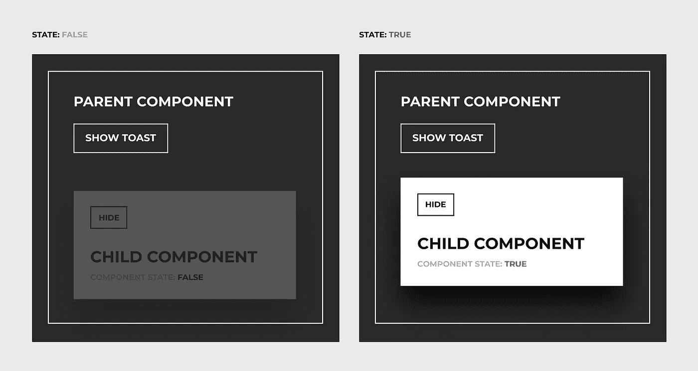
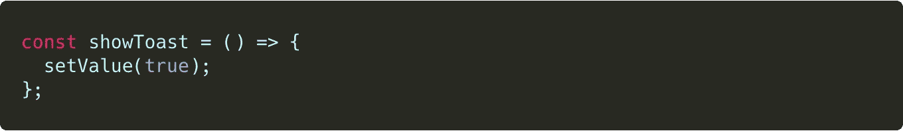
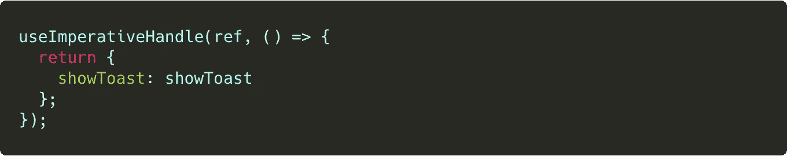
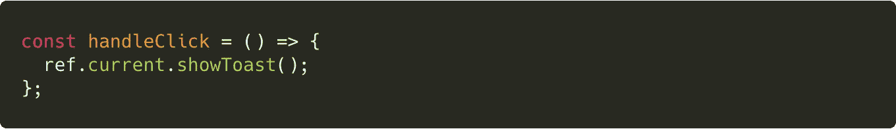
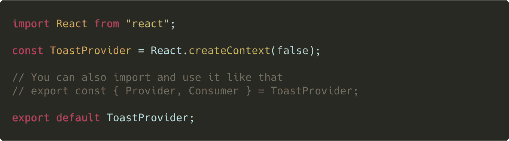

# 使用 React 挂钩从另一个组件更改子组件的状态

> 原文：<https://itnext.io/changing-children-state-from-another-component-with-react-hooks-5c982c042e8?source=collection_archive---------1----------------------->

最近，我经常使用 React 进行快速原型开发和开发人员交接，但是当您需要从一个组件改变另一个组件的状态时，我遇到了问题——在我的例子中，它是一个“Toast”组件。今天，让我们考虑几个关于这项任务的例子。

> 任务 ⤵
> 
> *我们在父组件中有一个 CTA 按钮，当我们单击它时，会显示一个子组件。子组件有一个“关闭”按钮，当我们点击它时，我们隐藏子组件。*

这里主要的事情是我们需要从父组件中改变子组件的状态——我们应该只有一个可共享的状态。如果`states`和`props`相同的话就简单多了，因为在 React 中传球我们可以很容易的通过道具，但不幸的是，不可以——`states`是动态的，`props`是静态的。

# 设计和状态

这是对与错陈述的基本切换情况。

# 解决方案 1。使用 Ref

在本例中，我们使用了`useRef`、`forwardRef`和`useImperativeHandle`。

在父组件中使用`useRef`，我们可以使用`useImperativeHandle`到达子组件中的函数、属性和值。

*例如，我们在子组件中有这个函数，我们需要将它放到外部来显示:*

*当* `*value*` *为* `*true*` *时我们显示该组件，当* `*false*` *时我们通过切换 className:* 将其隐藏

*为此，我们需要创建* `*useImperativeHandle*` *并在这里添加*`*showToast*`

**

**然后在父组件中，我们可以到达* `*showToast*` *函数调用* `*ref.current*`*

**

# *解决方案 2。使用上下文提供程序*

*在这种情况下，我们将为子组件和父组件共享相同的上下文。*

*为此，我们需要创建一个新文件`ToastProvider.js`并将我们的上下文放在那里:*

**

*如果我们将谷歌这种方法，许多情况下将致力于主题改变`ThemeProvider`就像这个例子——[https://codesandbox.io/s/m5q79oq8y8?from-embed](https://codesandbox.io/s/m5q79oq8y8?from-embed)*

*这是我们的解决方案:*

# *就这些，谢谢:-)如果你有自己的解决方案，请叉开我的例子，在下面的评论区留下你的解决方案，我会添加到文章中。*

*我对这篇文章的特别“感谢”是针对这个 StackOverflow 问题:*

* [## 从父组件更改反应挂钩状态

### 感谢贡献一个堆栈溢出的答案！请务必回答问题。提供详细信息并分享…

stackoverflow.com](https://stackoverflow.com/questions/55889357/change-react-hook-state-from-parent-component)* 

# *参考文献*

*以下是关于该主题的一些附加材料和文章:*

* [## 如何使用新的 React 上下文 API

### 谣言满天飞！语境能代替 redux 吗？是不是让道具钻灭绝了？就算语境！==世界和平……

hackernoon.com](https://hackernoon.com/how-do-i-use-react-context-3eeb879169a2)  [## 用 10 行代码实现 React 钩子和上下文 API 的状态管理！

### 终极和超级简单的 Redux 替代你的应用程序。

medium.com](https://medium.com/simply/state-management-with-react-hooks-and-context-api-at-10-lines-of-code-baf6be8302c)  [## 2019 年反应状态管理状态

### 在野外观察国家管理…商店开门营业了！🐯

blog.bitsrc.io](https://blog.bitsrc.io/state-of-react-state-management-in-2019-779647206bbc)  [## 使用 React 挂钩进行状态管理——没有冗余或上下文 API

### 反应钩比你想象的更强大。今天，我们将探索它并开发一个自定义挂钩来管理…

medium.com](https://medium.com/javascript-in-plain-english/state-management-with-react-hooks-no-redux-or-context-api-8b3035ceecf8)  [## diegohaz/awesome-react-上下文

### 一个与新的 React 上下文 API 特性相关的精选列表🔥Constate，一个状态管理库，使用…

github.com](https://github.com/diegohaz/awesome-react-context)  [## 用 React 钩子简化全局状态

### 用 useContext 和 useReducer 构建一个极简的全局状态管理解决方案

medium.com](https://medium.com/@pgivens/simplifying-global-state-with-react-hooks-4d7df52d363)*