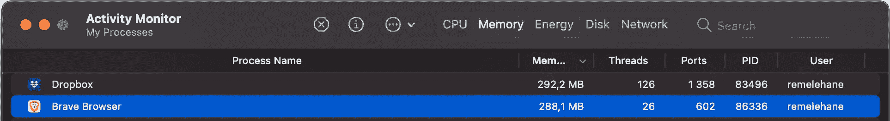
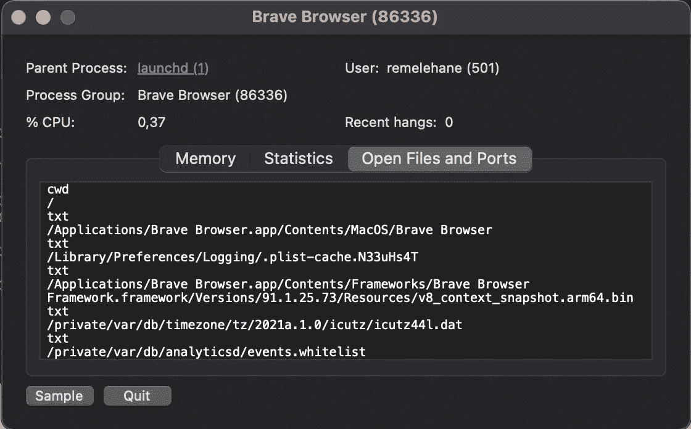

# 为 Flutter 更改调试浏览器(MacOS)

> 原文：<https://itnext.io/changing-your-debugging-browser-for-flutter-macos-3de049b0be32?source=collection_archive---------4----------------------->


默认情况下，Flutter 希望你安装 Chrome，以便能够使用 Flutter for Web 进行开发和调试。并非所有人都喜欢或希望使用 chrome，我们每个人都可能有自己偏好的 chrome 风格，可能是 Brave、Opera、Vivaldi 或许多其他选项。

虽然这是专门为改变[勇敢](https://brave.com/)而设计的，但这个过程对你喜欢的铬口味来说应该是一样的。

所有应用程序都安装在应用程序目录中，要覆盖“Chrome”浏览器，只需在环境中设置一个新路径。

这可以通过在 bashrc 或 zshrc 文件中设置 CHROME_EXECUTABLE 来实现，如果您使用的是 Brave，那么下面的代码应该就可以了:

```
export CHROME_EXECUTABLE = /Applications/Brave Browser.app/Contents/MacOS/Brave Browser
```

然而，如果你使用的是另一种风格的 Chromium，那么我找到正确路径的方法是访问“应用监视器”。运行浏览器。

在这里，您可以在列表中查找浏览器的运行实例，可能有多个，这在当今是很正常的，因为许多 chromium 浏览器为了性能和安全性将每个标签隔离在自己的运行实例中。



您应该会看到类似上面的内容，突出显示后，您要单击“I”图标，然后在下一个窗口中，单击“打开文件和端口”选项卡。



在上面的截图中，您要查找的行是第 4 行:

```
/Applications/Brave Browser.app/Contents/MacOS/Brave Browser
```

这是您将设置为 CHROME_EXECUTABLE 的路径。

然后，在上面提到的文件的某个地方，可能是底部，您将添加:

```
export CHROME_EXECUTABLE = "YOUR PATH HERE..."
```

完成后，将文件加载到您的终端中，或者在您的终端中简单地执行相同的行来更新环境。

要重新加载文件，只需运行:

```
. ~/.zshrc or . ~/.baschrc
```

然后，为了确认一切都成功，运行 flutter doctor -v 并检查输出，它应该包括类似这样的内容，CHROME_EXECUTABLE 路径应该是您设置的路径。


如果你像我一样使用编辑器的内置工具，你可能需要重启编辑器来加载新的环境变量，否则点击 play 可能会继续使用 Chrome。

也可以运行:

```
flutter run -d web-server
```

然而，在编写本文时，这种方法还不支持热重启，因此虽然更简单，但并不那么有用

感谢您的阅读，希望您发现这很有用，现在可以使用您喜欢的 chromium 来更好地享受您的 flutter 开发体验。

我希望您对此感兴趣，如果您有任何问题、评论或改进，请随时发表评论。享受你的颤振发展之旅:D

如果你喜欢，心形会很棒，如果你真的喜欢，一杯[咖啡](https://www.buymeacoffee.com/remelehane)会很棒。

感谢阅读。

*最初发布于 2021 年 8 月 1 日*[*https://remelehane . dev*](https://remelehane.dev/posts/changing-your-debugging-browser-for-flutter-macos/)*。*

[](/my-essential-tools-as-a-flutter-developer-7a055822a777) [## 作为一名 Flutter 开发人员，我的基本工具

### 作为开发人员，我们的日常工具对于我们的生产力甚至心智健全是必不可少的。对于所有复杂的事情，我们…

itnext.io](/my-essential-tools-as-a-flutter-developer-7a055822a777) [](https://medium.com/geekculture/unit-testing-datetime-now-with-the-help-of-dart-extensions-d2b0c9f991bf) [## 借助 Dart 扩展对 DateTime.now()进行单元测试

### 当需要使用 DateTime.now()时，快速演练 Flutter 中的单元测试

medium.com](https://medium.com/geekculture/unit-testing-datetime-now-with-the-help-of-dart-extensions-d2b0c9f991bf)