# 带 React 的 Chartjs 教程—带示例的 Nextjs

> 原文：<https://itnext.io/chartjs-tutorial-with-react-nextjs-with-examples-2f514fdc130?source=collection_archive---------0----------------------->

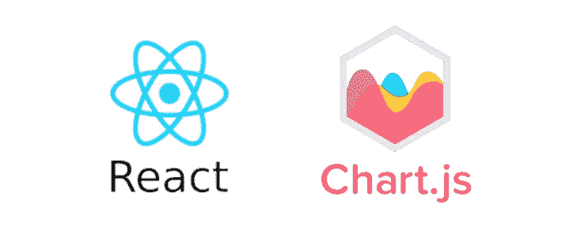

## 介绍

**React** 是 React 开发最流行的前端框架之一， **chartjs** 是最流行的图表库之一。
对于本教程，你可以使用 React 或 **Nextjs** 进行开发。

如果你想在服务器端渲染中使用 React，你可以使用 N **extjs**

如果你想看如何用 next.js 开始开发的教程，可以看看这篇文章

[](https://medium.com/@melih193/next-js-start-web-development-with-next-js-create-next-app-4042ca071dcb) [## Next.js —使用 Next.js & create-next-app 开始 web 开发

### 使用 Next.js 在几秒钟内开始开发

medium.com](https://medium.com/@melih193/next-js-start-web-development-with-next-js-create-next-app-4042ca071dcb) 

**现场演示**:[https://nextjs-chartjs.vercel.app/](https://nextjs-chartjs.vercel.app/)

**Github**:[https://github.com/hadnazzar/nextjs-chartjs](https://github.com/hadnazzar/nextjs-chartjs)

## 用图表构建的一些例子

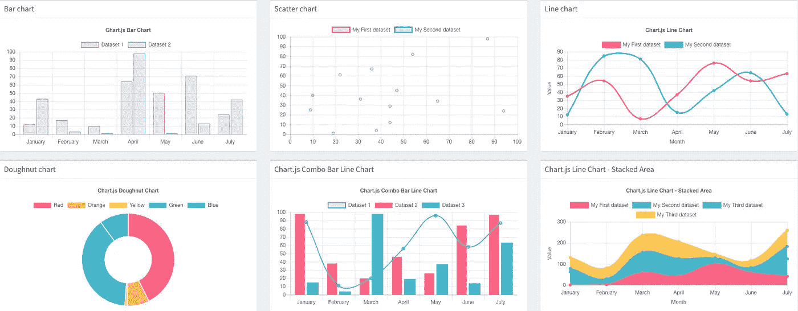

## 安装图表

在我们创建了 react 应用程序之后，现在我们可以**安装 **chartjs** 所需的**库，以便在项目中使用它。

npm

```
npm install --save react-chartjs-2 chart.js
```

故事

```
yarn add react-chartjs-2 chart.js
```

安装后，我们可以开始在我们的应用程序中使用 chartjs

## 用 Chartjs 构建的示例组件

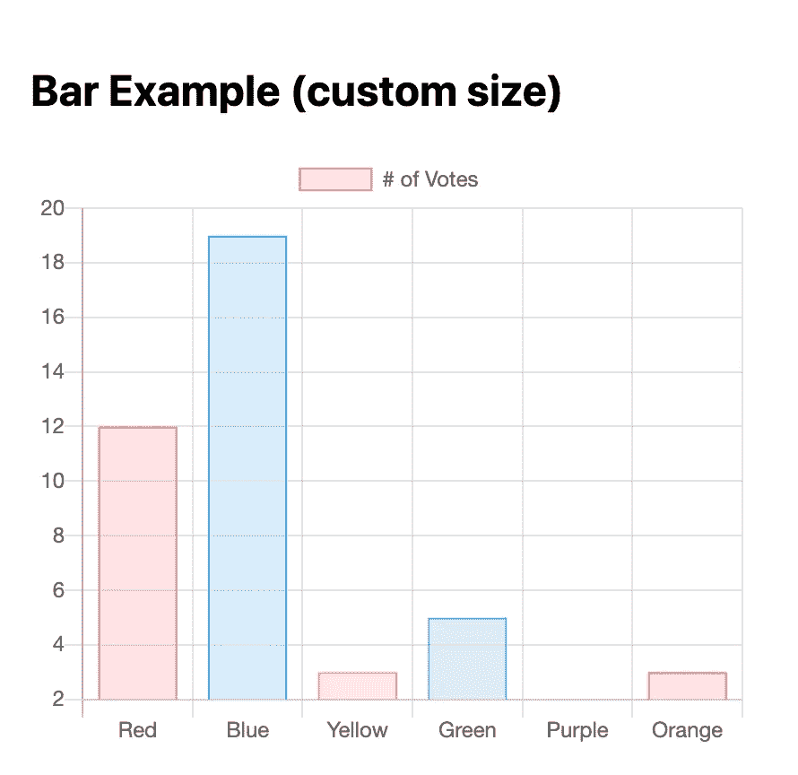

反应图表条形图示例

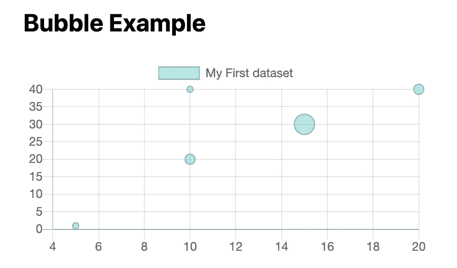

反应图气泡图

## 动态条形图

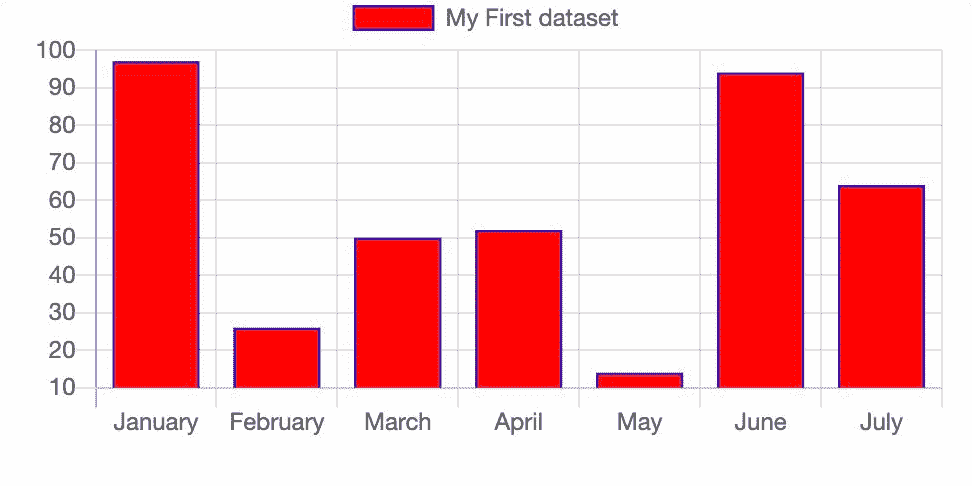

反应图 js 动态条形图

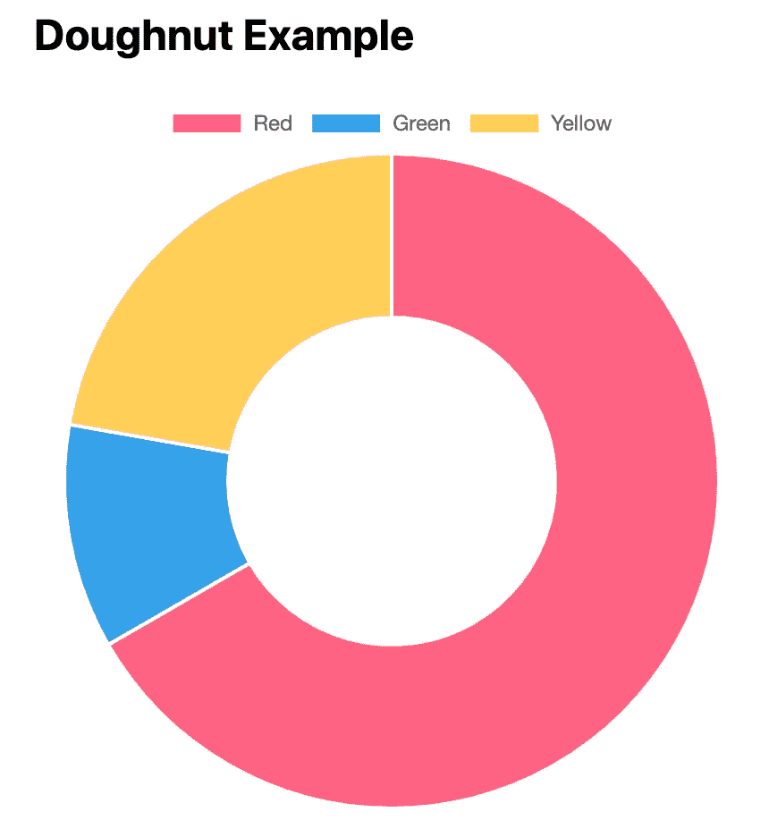

反应图圆环图

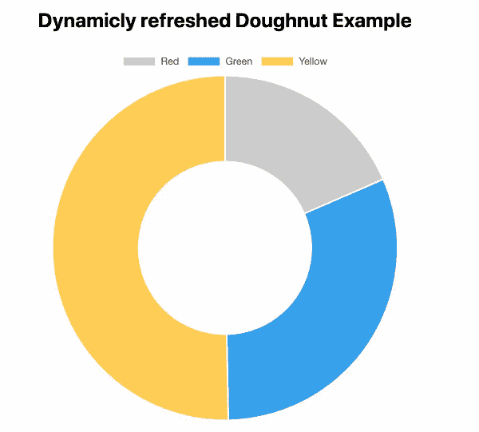

反应图表动态圆环图

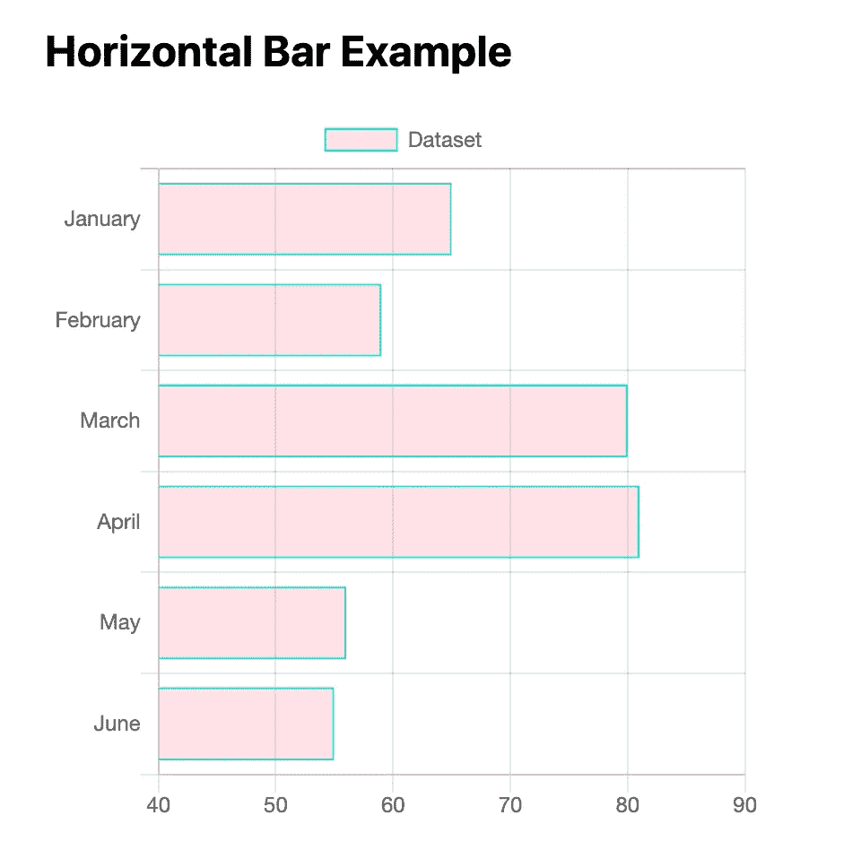

反应图水平条形图

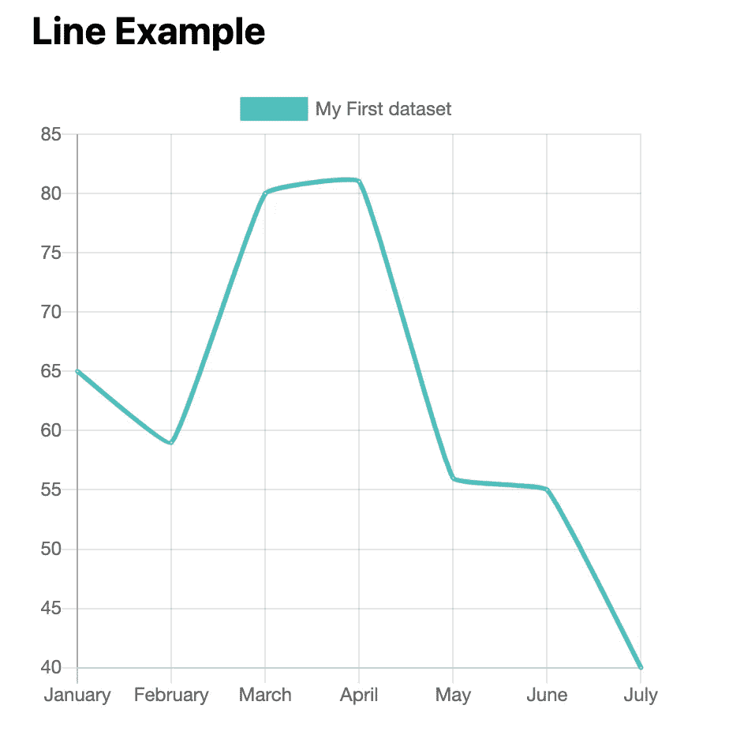

反应图折线图

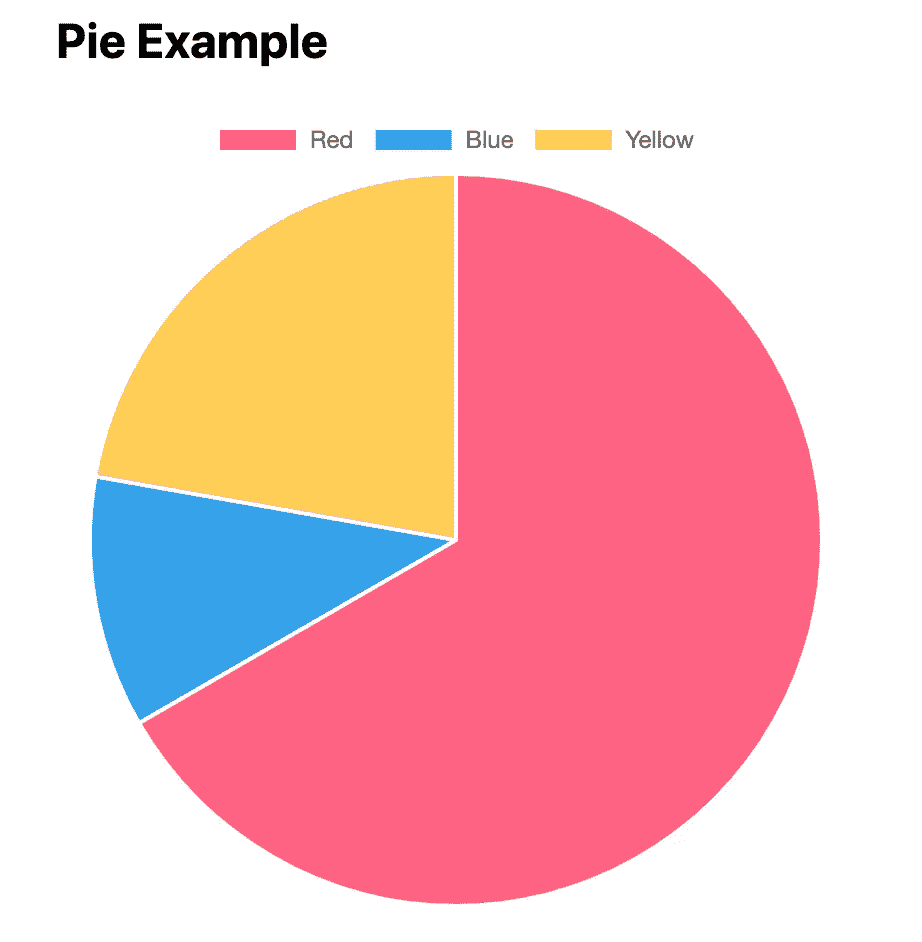

反应图饼图

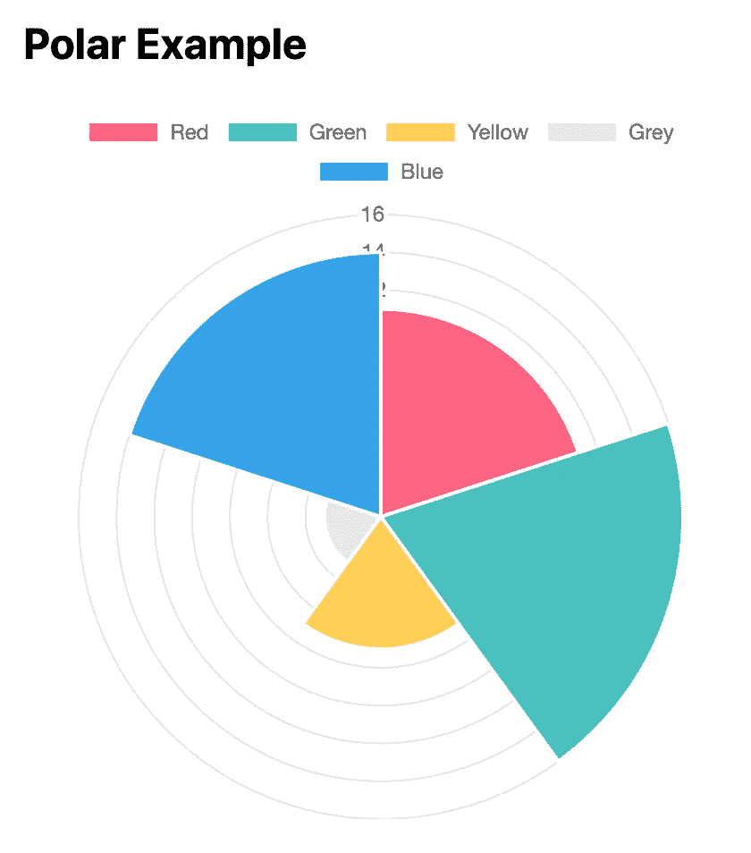

反应图极坐标图

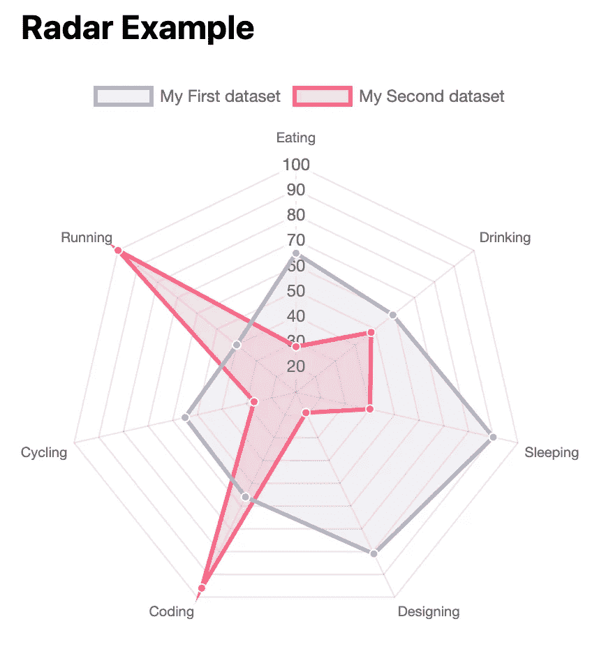

雷达图

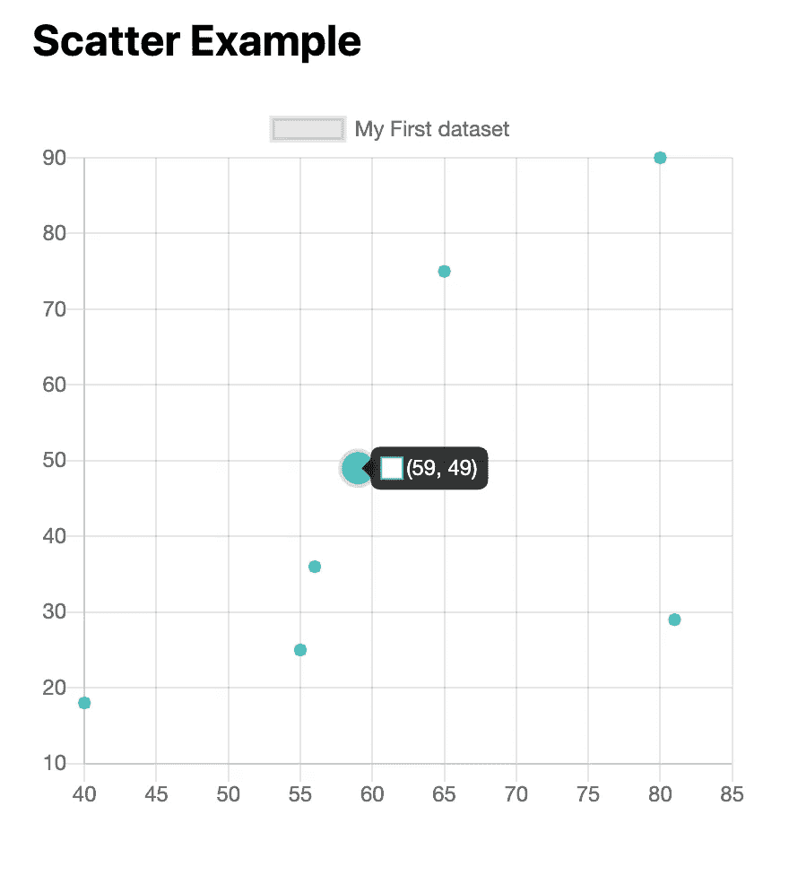

反应图散点图

## 结论

Chartjs 是一个非常强大的 web 开发库，可以显示惊人的图表。react 非常容易使用，您可以让您的数据看起来比以往任何时候都更令人惊叹。

**谢谢你读到这里。如果你喜欢这篇文章，请分享、评论并发表👏几次(最多 50 次)。。。也许会对某个人有帮助。**

**关注我的 Medium 或**[**Github**](https://gist.github.com/hadnazzar/)**如果你将来对这些更深入、更翔实的文章感兴趣的话。**😀

梅利赫