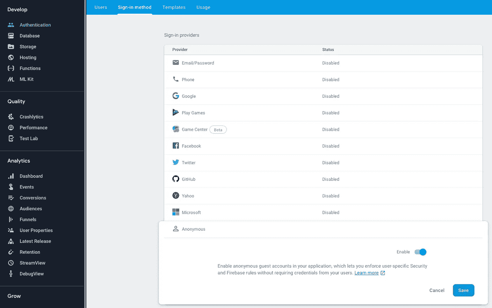
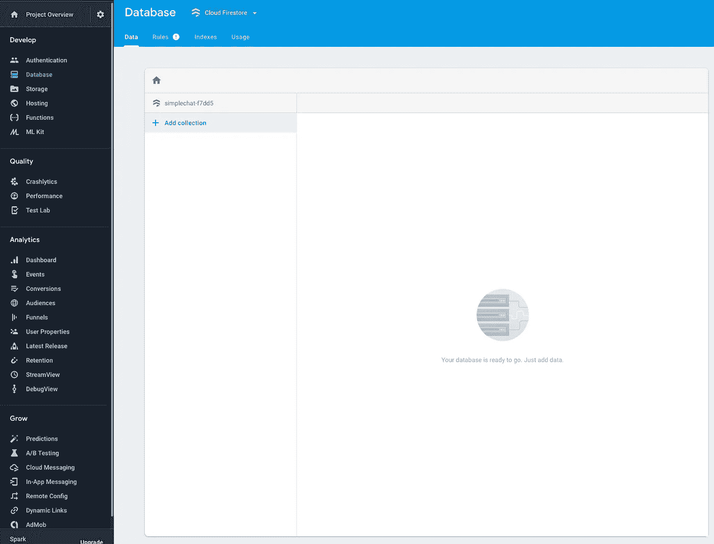
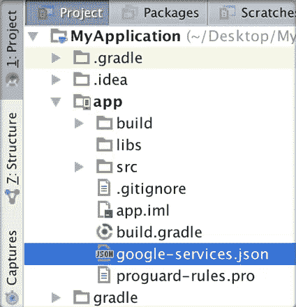
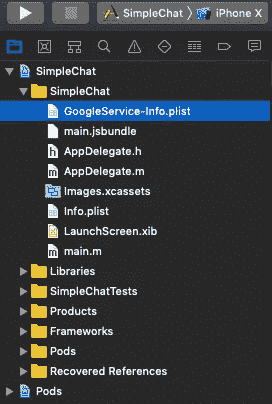
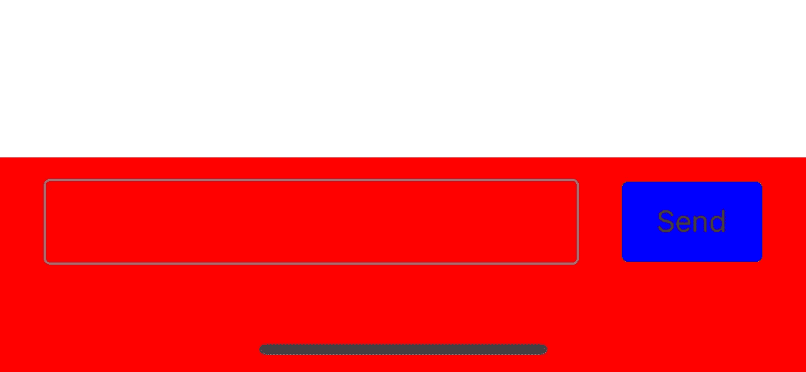
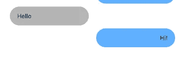
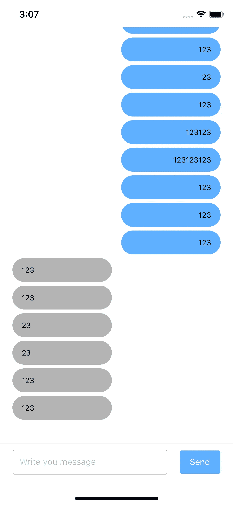

# 在 30 分钟内与 ReactNative 和 Firebase 聊天，认真！角。1.

> 原文：<https://itnext.io/chat-in-30-minutes-with-reactnative-and-firebase-seriously-pt-1-1712a18f7c8a?source=collection_archive---------0----------------------->


*结语。*

*聊天功能几乎是每个现代应用程序的必备功能，前端开发人员常常无法与陌生的后端人员完成这项任务:)*

如果我告诉你，你不需要一个后端的家伙呢？

如果我告诉你，你可以在 15 分钟内完成最低限度的一对一聊天，会怎么样？

如果我告诉你这对你的客户来说会便宜很多呢？

我们的目标:


# 第一集。设置

我们需要从包装中得到什么？

1.  react-native-firebase —它将是我们的后端和发布-订阅主机(Websockets)。你可以在这里找到包裹。我们需要为 iOS 的 Firebase 应用程序初始化`CocoaPods`。
2.  lodash——只是为了让我们的代码更干净。你可以在这里找到包裹。

因此，让我们从初始化一个空项目开始:

```
react-native init SimpleChat
```

现在直接添加所需的包:

```
yarn add lodash && yarn add firebase
```

**重要提示:**暂时不要做`react-native link`！

**安卓**

[官方安装指南](https://rnfirebase.io/docs/v5.x.x/installation/android)。你最好使用官方的安装指南，因为它足够详细。

**iOS**

[官方安装指南](https://rnfirebase.io/docs/v5.x.x/installation/ios)或者你可以进一步阅读，我们打算一步一步来做这个。

好了，既然 Android 已经设置好了，我们可以从`CocoaPods`开始。我会假设你正在使用`Mac`或者你已经安装了`Ruby` *(是的，它还没有死)。*如果没有，请按照此处[的说明](https://rvm.io)安装`RVM`和`Ruby`。

初始化`CocoaPods`，更多关于如何安装`CocoaPods`的细节你可以在这里找到。

导航到您的`/ios`文件夹，然后运行:

```
pod init
```

你会看到现在`/ios`文件夹里有`Podfile`(`CocoaPods`世界里的`package.json`模拟)和`SimpleChat.xcworkspace`。这意味着您的项目现在已经安装了`CocoaPods`。

**重要提示:**如果你正在使用 Xcode，请点击`SimpleChat.xcworkspace`而不是`.xcodeproj`文件来打开你的项目。

现在，我们为`react-native link`做好了准备，导航到您的项目根目录并执行:

```
react-native link
```

目前，该命令有两个用途:

1.  它会把`Firebase/Core`加到你的`Podfile`上。
2.  它将更新构建阶段，并将 Firebase 库本地链接到您的项目。

我们还需要 Firebase 包中的两个额外的库:

1.  `Firebase/Firestore` — Firebase 数据库
2.  `Firebase/Auth` —使用 Firebase 进行授权(例如，如果您有一个后端，您没有必要安装它，但是在本教程中，我需要它来识别用户)

所以，去更新我们的`/ios/Podfile`并添加几行代码。现在它应该是这样的:

```
platform :ios, '9.0'

target 'SimpleChat' do
  pod 'Firebase/Core', '~> 5.20.2'
  pod 'Firebase/Firestore', '~> 5.20.2'
  pod 'Firebase/Auth', '~> 5.20.2'
end
```

注意:如果你知道自己在做什么，请不要忘记删除文件中不必要的内容。

当`react-native link`完成并且您添加了所需的包后，现在您需要导航到`/ios`文件夹并运行:

```
pod install
```

现在我们需要修改我们的`AppDelegate.m`并添加两行代码，首先在您的导入旁边:

```
#import <Firebase.h>
```

定义后第二个在`didFinishLaunchingWithOptions:(NSDictionary *)launchOptions`内:

```
[FIRApp configure];
```

所有库都设置好了。现在我们需要设置 Firebase 应用程序本身。

# 第二集。Firebase 应用

前往 Firebase 控制台。如果您没有帐户，请创建一个。它是免费的。

创建一个新项目并输入其名称:


现在我们需要设置`Authentication`，同样，如果你有后端，这一步对你来说是不必要的。

导航至`Authentication` > `Setup sign-in method`并选择符合您需求的提货方式。对于本教程，匿名认证就足够了:



现在我们需要打开 Firestore，导航到`Database` > `Create database` >选择模式(对于本教程—我使用`test mode`，这样就够了)。如果您做的一切都正确，您应该会看到数据库管理页面:



太好了，服务准备好了，现在，创建 iOS 和 Android 应用程序。导航到`Project Overview` >选择你需要的操作系统(在本教程中，我只有 iOS 项目，但它在 Android 和 iOS 上都工作得很好。

对于这两个操作系统，只需按照 firebase 控制台中的说明进行操作(除了您已经完成的步骤，在您成功完成安装后，您将收到配置文件。

**安卓**

把你的`google-service.json`放进`/android/app`:



**iOS**

将您的`GoogleService-Info.plist`放入 Xcode 根目录:



现在我们准备好了。*让代码。*

# 第三集。利润

我会用`React Hooks`写所有的东西，但是你会在库中看到没有钩子的例子。

我们的项目树将如下所示:

```
|- /SimpleChat
|  |- /src
|  |  |- /components
|  |  |  |- /common
|  |  |  |  |- /Button
|  |  |  |  |  |- /index.js
|  |  |  |  |  |- /styles.js
|  |  |  |  |- /Loader
|  |  |  |  |  |- /index.js
|  |  |  |  |  |- /styles.js
|  |  |  |- /HooksExample
|  |  |  |  |- /index.js
|  |  |  |  |- /reducers.js
|  |  |  |- /Input
|  |  |  |  |- /index.js
|  |  |  |  |- /styles.js
|  |  |  |- /Message
|  |  |  |  |- /index.js
|  |  |  |  |- /styles.js
|  |  |- /constants
|  |  |  |- /collection.js
|  |  |  |- /index.js
|  |  |- /services
|  |  |  |- /index.js
|  |  |  |- /FirebaseService.js
|  |  |- /styles
|  |  |  |- /chat-room.js
|  |  |  |- /colors.js
|  |  |  |- /index.js
|  |  |- /index.js
|  |  |- /contexts.js
```

关于结构的一些细节:

1.  `/src/context.js` —这是我们放置所有上下文的地方(例如`currentUser`)。
2.  `/src/styles/chat-room.js` —这只是一个样式，因为我将在类组件示例中重用它们，这里的样式只是为了避免重复(不要重复)。通常，您可以将它放在您的组件文件夹下，在本例中，例如 it `HooksExample`。
3.  `/src/components/HooksExample/reducers.js` —是我把复杂的逻辑用钩子挂起来的地方。
4.  `/src/services/FirebaseService.js` —这是我们要与 firebase 沟通的地方。
5.  `/src/constants/collections.js` —这是我们保持我们的 firebase 系列名称的地方

从我们的主要组件开始。我们将在下一部分写出我们的逻辑。

因此，目前我们将在没有组件标记的情况下工作。基本上，所有聊天都有两个屏幕部分，消息和创建消息的输入加号按钮。

我们将创建我们的主组件，在本教程中我们称它为`HooksExample`，但它的正确名称是`Chat`组件。它将呈现带有我们的消息的`FlatList`和一个`Input`组件，我们将在其中填充消息并发送它们。

所以让我们从我们的`Input`组件开始。让我们编码:

```
*import* React, { useCallback, useState } *from* 'react'
*import* { View, TextInput } *from* 'react-native'

*import* Button *from* '../common/Button'

*import* styles *from* './styles'

*export default function* Input () {
  *const* [message, setMessage] = useState('')

  *const* handlePress = useCallback(
    *function* () {
      // todo this
    },
    [message]
  )

  *return* (
    <View *style*={styles.container}>
      <View *style*={styles.inputContainer}>
        <TextInput *style*={styles.input} *value*={message} *onChangeText*={setMessage} *placeholder*="Write you message" />
      </View>

      <Button *text*="Send" *onPress*={handlePress} />
    </View>
  )
}
```

我们的风格:

```
*import* { StyleSheet } *from* 'react-native'

*import* { COLORS } *from* '../../styles'

*export default* StyleSheet.create({
  container: {
    flexDirection: 'row',
    alignItems: 'center',
    justifyContent: 'space-around',
    width: '100%'
  },
  inputContainer: {
    width: '70%'
  },
  input: {
    height: 40,
    borderColor: COLORS.GREY,
    borderWidth: 1,
    borderRadius: 3,
    flexDirection: 'row',
    paddingHorizontal: 10
  }
})
```

这就是我们的示意图:



现在，瞄准`Message`组件:

```
*import* React *from* 'react'
*import* { View, Text } *from* 'react-native'

*import* { styles, flattenedStyles } *from* './styles'

*export default function* Message ({ message, side }) {
  *const* isLeftSide = side === 'left'

  *const* containerStyles = isLeftSide ? styles.container : flattenedStyles.container
  *const* textContainerStyles = isLeftSide ? styles.textContainer : flattenedStyles.textContainer
  *const* textStyles = isLeftSide ? flattenedStyles.leftText : flattenedStyles.rightText

  *return* (
    <View *style*={containerStyles}>
      <View *style*={textContainerStyles}>
        <Text *style*={textStyles}>
          {message}
        </Text>
      </View>
    </View>
  )
}
```

该组件接受两个`props`:

1.  `message` —文本，字符串
2.  `side` —字符串，将是`left`或`right`。这将帮助组件选择消息组件的样式。

我们需要为左侧和右侧应用不同的样式。以下是它的风格:

```
*import* { StyleSheet } *from* 'react-native'

*import* { COLORS } *from* '../../styles'

*const* styles = StyleSheet.create({
  container: {
    width: '100%',
    paddingVertical: 3,
    paddingHorizontal: 10,
    flexDirection: 'row',
    alignItems: 'center',
    justifyContent: 'flex-start'
  },
  textContainer: {
    width: 160,
    backgroundColor: COLORS.GREY,

    borderRadius: 40,
    paddingHorizontal: 15,
    paddingVertical: 12,
    marginLeft: 10
  },
  rightContainer: {
    justifyContent: 'flex-end'
  },
  rightTextContainer: {
    backgroundColor: COLORS.PRIMARY,
    marginRight: 10
  },
  leftText: {
    textAlign: 'left'
  },
  rightText: {
    textAlign: 'right'
  },
  text: {
    fontSize: 12
  }
})

*const* flattenedStyles = {
  container: StyleSheet.flatten([styles.container, styles.rightContainer]),
  textContainer: StyleSheet.flatten([styles.textContainer, styles.rightTextContainer]),
  leftText: StyleSheet.flatten([styles.leftText, styles.text]),
  rightText: StyleSheet.flatten([styles.rightText, styles.text])
}

*export* {
  styles,
  flattenedStyles
}
```

现在，我之所以创建一个名为`flattenedStyles`的对象，是为了创建一个带有 ID 的样式数组，这个机制是`StyleSheet`为我们提供的，它有助于进行简单的优化。



我们如何拥有`Message`和`Input`组件，并且我们必须将它们合并到我们的`HooksExample`组件中。

```
*import* React *from* 'react'
*import* { FlatList, SafeAreaView, View } *from* 'react-native'

*import* Input *from* '../Input'
*import* Message *from* '../Message'*import* { chatRoomStyles *as* styles } *from* '../../styles'

*export default function* HooksExample () {
  const mock = [
    { id: 1, message: 'Hello', side: 'left' }, 
    { id: 2, message: 'Hi!', side: 'right' }
  ] *return* (
    <SafeAreaView>
      <View *style*={styles.messagesContainer}>
        <FlatList
          *inverted
          data*={}
          *keyExtractor*={*function* (item) {
            *return* item.id
          }}
          *renderItem*={*function* ({ item }) {
            *return* (
              <Message *side*={data.side} *message*={data.message} />
            )
          }}
        />
      </View>

      <View *style*={styles.inputContainer}>
        <Input />
      </View>
    </SafeAreaView>
  )
}
```

我们的样式为`HooksExample`组件:

```
*import* { StyleSheet } *from* 'react-native'

*import* COLORS *from* './colors'

*export default* StyleSheet.create({
  messagesContainer: {
    height: '100%',
    paddingBottom: 100
  },
  inputContainer: {
    width: '100%',
    height: 100,
    position: 'absolute',
    bottom: 0,
    paddingVertical: 10,
    paddingLeft: 20

    borderTopWidth: 1,
    borderTopColor: COLORS.GREY
  }
})
```

所以，最后，我们会收到一个聊天记录



*开场白。*

我们的标记准备好了，我们可以写我们的逻辑了。访问[*30 分钟内与 ReactNative 和 Firebase 聊天，认真！角。2*](https://medium.com/@andriidrozdov/chat-in-30-minutes-with-reactnative-and-firebase-seriously-pt-2-1994d2401774) *。继续阅读……*

[*链接到知识库。*](https://github.com/tech-by-andrii/chat-in-30-minutes-with-react-native-and-firebase)

存储库中的项目已经有了一个安装 Firebase 应用程序，您可以克隆这个存储库并进行试验。

更多信息请关注我！