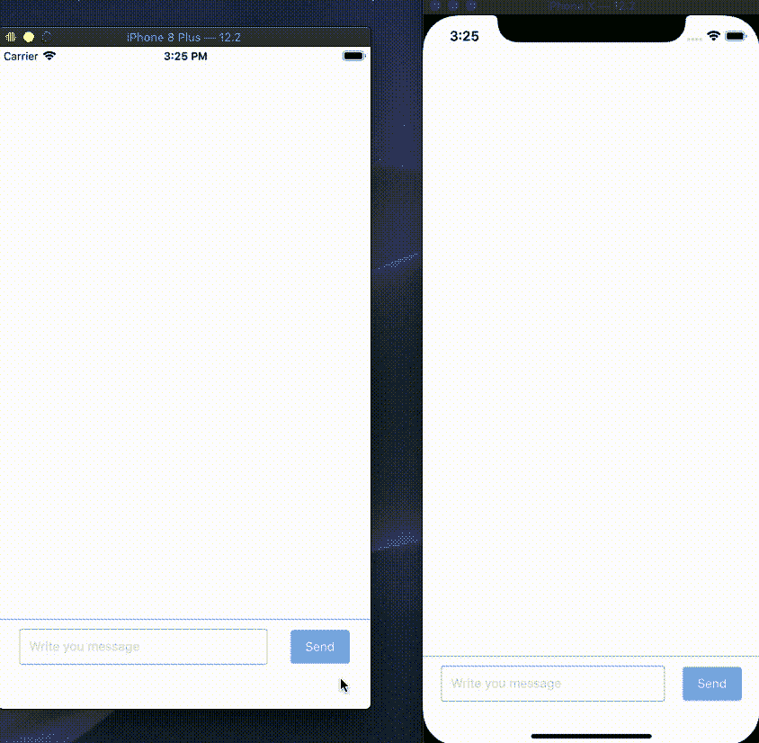

# 在 30 分钟内与 ReactNative 和 Firebase 聊天，认真！角。2.

> 原文：<https://itnext.io/chat-in-30-minutes-with-reactnative-and-firebase-seriously-pt-2-1994d2401774?source=collection_archive---------2----------------------->


*结语。*

之前我们为我们的聊天创建了标记，你可以在这里找到文章。现在，我们将绑定我们的标记并安装带有逻辑的 Firebase 包。

# 第四集。简单聊天教程前情提要。

我们的目标:



小，提醒一下，这是我们的项目结构:

```
|- /SimpleChat
|  |- /src
|  |  |- /components
|  |  |  |- /common
|  |  |  |  |- /Button
|  |  |  |  |  |- /index.js
|  |  |  |  |  |- /styles.js
|  |  |  |  |- /Loader
|  |  |  |  |  |- /index.js
|  |  |  |  |  |- /styles.js
|  |  |  |- /HooksExample
|  |  |  |  |- /index.js
|  |  |  |  |- /reducers.js
|  |  |  |- /Input
|  |  |  |  |- /index.js
|  |  |  |  |- /styles.js
|  |  |  |- /Message
|  |  |  |  |- /index.js
|  |  |  |  |- /styles.js
|  |  |- /constants
|  |  |  |- /collection.js
|  |  |  |- /index.js
|  |  |- /services
|  |  |  |- /index.js
|  |  |  |- /FirebaseService.js
|  |  |- /styles
|  |  |  |- /chat-room.js
|  |  |  |- /colors.js
|  |  |  |- /index.js
|  |  |- /index.js
|  |  |- /contexts.js
```

如果您尚未完成标记，请[导航至第 1 部分](https://medium.com/@andriidrozdov/chat-in-30-minutes-with-reactnative-and-firebase-seriously-pt-1-1712a18f7c8a)，并执行以下操作:)

# 第五集。FirebaseService。

现在，我们将创建您的主类来与 Firebase 应用程序进行通信。

在`/constants/collections.js`中定义我们的系列:

```
*export default* {
  MESSAGES: 'messages'
}
```

并在`/constants/index.js`中导出以便于访问:

```
*export* COLLECTIONS *from* './collections'
```

现在我们准备实施`FirebaseService.js`:

```
*import* firebase *from* 'react-native-firebase'
*import* { COLLECTIONS } *from* '../constants'

*export default class* FirebaseService {
  auth = firebase.auth()

  firestore = firebase.firestore()

  messageRef = *this*.firestore.collection(COLLECTIONS.MESSAGES);

  *async* signIn () {
    *try* {
      *const* response = *await this*.auth.signInAnonymously()
      *return* { user: response.user }
    } *catch* (error) {
      *return* { error }
    }
  }

  *async* fetchMessages () {
    *const* messages = *await this*.messageRef
      .orderBy('created_at', 'desc')
      .limit(10)
      .get()

    *return* messages.docs
  }

  *async* createMessage ({ message, uid }) {
    *await this*.messageRef.add({
      message,
      user_id: uid,
      created_at: *new* Date()
    })
  }
}
```

让我向您介绍一下代码:

`auth = firebase.auth()`和`firestore = firebase.firestore()`即使引擎盖下的 Firebase 库缓存`auth()`和`firestore()`初始化实例我最好还是把实例保存到变量里，以防万一。

由于我们只有一个集合，我缓存了集合的路径，只是为了避免每次都调用查询构建器。

`signIn` —也许在您的应用程序中，您不需要登录，因为在真实的项目中，您可能拥有自己的授权。在这种情况下，我只是进行匿名授权，只是为了获取用户的唯一 UID，在 Firebase 集合中标识用户。

`fetchMessages` —按特定顺序获取最后 10 条消息的功能。我们需要这个顺序来保证信息在聊天中的适当位置。我们将消息限制在 10 条以内有两个目的:

1.  我们将把它作为初始载荷
2.  我们只是确保，然后我们将获取新消息并过滤旧消息，以防 web 套接字没有传递一些消息(是的，在引擎盖下，Firebase 使用 web 套接字进行服务器到客户端的通信)。

`createMessage` —创建消息的功能。请注意，我使用的 UID 是通过 Firebase 登录方法检索的，如果您有一个真正的后端来使用您的数据库`user_id`，并且您的奇怪后端人员可以从后端访问用户消息，这将是一个很好的例子。

现在导出我们的类，**不要忘记**初始化我们的`FirebaseService`类的一个新实例:

```
*import* FirebaseService *from* './FirebaseService'

*const* firebaseService = *new* FirebaseService()

*export* {
  firebaseService
}
```

# 第六集。用户上下文。

你可以在这里阅读上下文。基本上就是一种不用每次手动传递道具就可以通过树传递道具的方式。

现在，我们将在 boot 上创建一个用户或者用`Firebase.auth()`在数据库中找到它，如果你已经有了后端，你可以跳过这个教程，如果没有，你知道:)

我们需要在`src`文件夹下创建一个新文件，命名为`contexts.js`:

```
*import* { createContext } *from* 'react'

*export const* UserContext = createContext(*null*)
```

我们需要将它导入到我们的根`/src/index.js`文件中，并且我们需要确保我们的州中有 UID。

```
*import* React, { useState, useEffect } *from* 'react'
*import* { Alert } *from* 'react-native'

*import* Loader *from* './components/common/Loader'
*import* HooksExample *from* './components/HooksExample'

*import* { UserContext } *from* './contexts'
*import* { firebaseService } *from* './services'

*export default function* App () {
  *const* [user, setUser] = useState(*null*)

  useEffect(
    *function* () {
      firebaseService.signIn()
        .then(({ user, error }) => {
          *if* (error) {
            Alert.alert('Something went wrong')
            *return* }

          setUser(user)
        })
    },
    [*false*]
  )

  *if* (!user) {
    *return* <Loader />
  }

  *return* (
    <UserContext.Provider *value*={user}>
      <HooksExample />
    </UserContext.Provider>
  )
}
```

*注意:钩子不能异步，所以我们需要使用* `*then*` *函数来解析我们的承诺。因为我们已经构建了一个包装器，所以我们不需要* `*catch*` *块，因为我们确保我们的* `*FirebaseSerivce.signIn*` *将只成功解析承诺。*

# 第七集。消息创建。

我们已经构建了`Input`组件，我们需要用逻辑填充它:

```
*import* React, { useCallback, useState, useContext } *from* 'react'
*import* { View, TextInput } *from* 'react-native'

*import* { firebaseService } *from* '../../services'
*import* { UserContext } *from* '../../contexts'

*import* Button *from* '../common/Button'
*import* Loader *from* '../common/Loader'

*import* styles *from* './styles'

*export default function* Input () {
  *const* { uid } = useContext(UserContext)
  *const* [isLoading, setIsLoading] = useState(*false*)
  *const* [message, setMessage] = useState('')

  *const* handlePress = useCallback(
    *function* () {
      setIsLoading(*true*)
      firebaseService
        .createMessage({ message, uid })
        .then(*function* () {
          setIsLoading(*false*)
          setMessage('')
        })
    },
    [message]
  )

  *return* (
    <View *style*={styles.container}>
      <View *style*={styles.inputContainer}>
        <TextInput *style*={styles.input} *value*={message} *onChangeText*={setMessage} *placeholder*="Write you message" />
      </View>

      <Button *text*="Send" *onPress*={handlePress} *disabled*={isLoading} />

      {isLoading && <Loader />}
    </View>
  )
}
```

让我向您介绍一下代码:

`useContext(UserContext)` —我们用特殊的钩子`useContext`告诉 React 我们想要使用我们之前在根`index.js`中定义的上下文。如果我们使用一个类组件，我们需要创建一个特殊的函数来访问类组件中的上下文:

```
*static* contextType = UserContext;
```

现在我们将能够使用`this.context`访问我们的用户。

`isLoading`状态值只是阻止我们的按钮被双击的一种方式。

`message` —是我们从`TextInput`接收的字符串。

这是我们的媒体处理员。这里我们调用我们的`FirebaseService`来创建一个消息。我们需要用`then`解析承诺，以避免 React 钩子中的`async`函数。

# 第八集。获取和订阅消息。

现在我们可以创建新消息了，让我们更新我们的`HooksExample`组件(在`HooksExample`文件夹中的`index.js`文件):

```
*import* React, { useEffect, useReducer, useContext } *from* 'react'
*import* { FlatList, SafeAreaView, View } *from* 'react-native'

*import* { firebaseService } *from* '../../services'
*import* { UserContext } *from* '../../contexts'

*import* Input *from* '../Input'
*import* Message *from* '../Message'

*import* { messagesReducer } *from* './reducers'
*import* { chatRoomStyles *as* styles } *from* '../../styles'

*export default function* HooksExample () {
  *const* { uid } = useContext(UserContext)
  *const* [messages, dispatchMessages] = useReducer(messagesReducer, [])

  useEffect(
    *function* () {
      *return* firebaseService.messageRef
        .orderBy('created_at', 'desc')
        .onSnapshot(*function* (snapshot) {
          dispatchMessages({ type: 'add', payload: snapshot.docs })
        })
    },
    [*false*]
  )

  *return* (
    <SafeAreaView>
      <View *style*={styles.messagesContainer}>
        <FlatList
          *inverted
          data*={messages}
          *keyExtractor*={*function* (item) {
            *return* item.id
          }}
          *renderItem*={*function* ({ item }) {
            *const* data = item.data()
            *const* side = data.user_id === uid ? 'right' : 'left'

            *return* (
              <Message *side*={side} *message*={data.message} />
            )
          }}
        />
      </View>

      <View *style*={styles.inputContainer}>
        <Input />
      </View>
    </SafeAreaView>
  )
}
```

并立即创建`reducers.js`:

```
*import* { unionWith } *from* 'lodash'

*export function* messagesReducer (state, action) {
  *switch* (action.type) {
    *case* 'add':
      *return* unionWith(state, action.payload, *function* (a, b) {
        *return* a.id === b.id
      }).sort(*function* (a, b) {
        *const* aData = a.data()
        *const* bData = b.data()

        *return* bData.created_at.seconds - aData.created_at.seconds
      })
    *default*:
      *throw new* Error('Action type is not implemented!')
  }
}
```

让我们浏览一下代码，从我们的`reducers.js`文件开始。你可以在这里阅读更多关于`useReducer`。基本上，这是一个我们放置复杂逻辑的钩子方式。

这里我使用`lodash`函数`unionWith`从两个数组中只获取唯一的消息，然后进行排序，以防我们的联合会破坏正确的顺序。

`useEffect` —你可以称之为生命周期法。你可以在这里阅读更多。当组件第一次挂载时，这个函数将被调用，我们将订阅更改并获取订阅时的最后 10 条消息记录。

**重要提示:**在`useEffect`中，我们返回我们的监听器，这一步需要在组件卸载时取消订阅。

现在，转到我们的`FlatList`:

1.  从底部开始物品是`inverted`
2.  `data` —是我们的消息数组
3.  `keyExtrator` — uniq 键，在我们的例子中是`Firebase`记录 ID
4.  组件呈现之前的小逻辑`item.data()`——是一种检索记录字段的方法。然后我们检查该消息是否属于当前用户，如果消息属于当前用户，我们将`side` prop 作为`right`传递，否则我们将它作为`left`传递

如果你做的一切都是正确的，你会收到一个完整的工作聊天。恭喜你。

*开场白。*

如你所见，一切都很简单，不需要任何奇怪的后端人员，开发速度快，易于维护。

[*链接到知识库。*](https://github.com/tech-by-andrii/chat-in-30-minutes-with-react-native-and-firebase)

*存储库中的项目已经有了一个安装 Firebase 应用程序，您可以克隆这个存储库并进行试验。*

**关注我了解更多！**