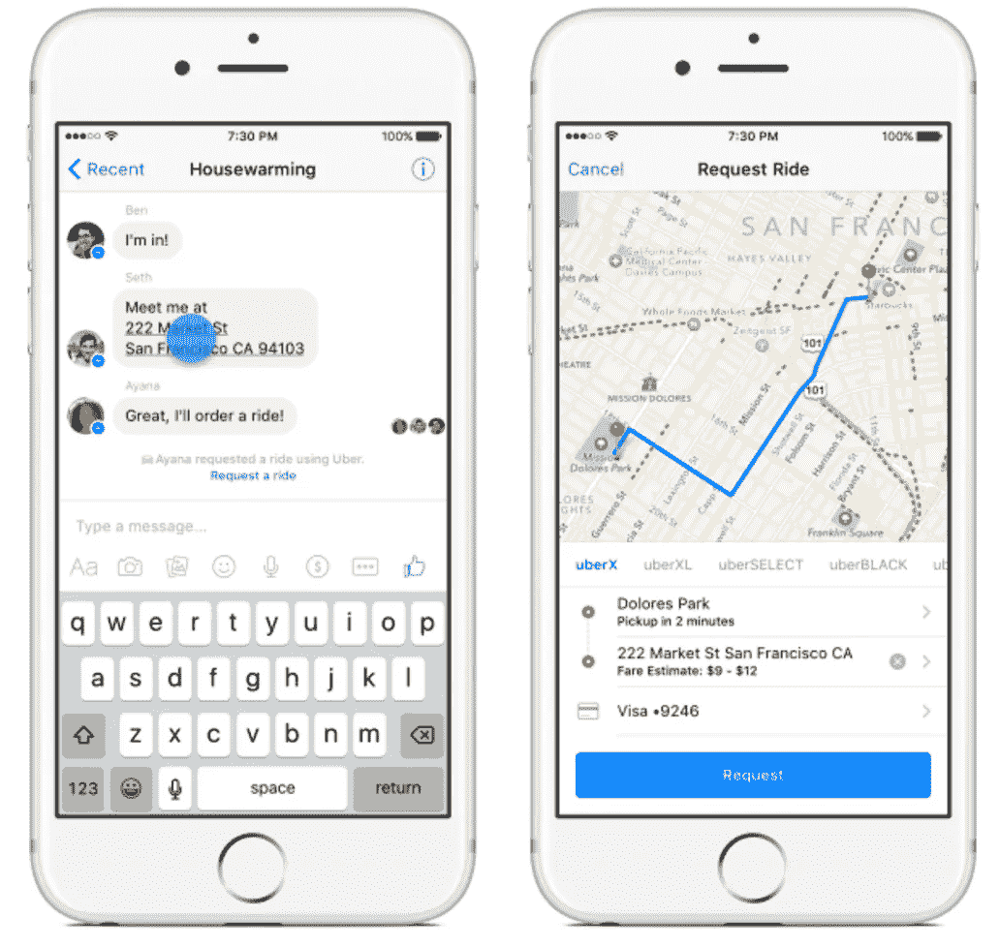
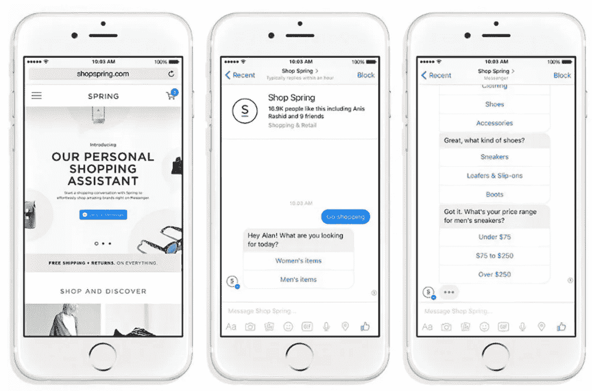

# 聊天机器人:物联网的美好未来？

> 原文：<https://itnext.io/chatbots-a-bright-future-in-iot-f9f6cc8e12a9?source=collection_archive---------0----------------------->

本文是关于聊天机器人和机器学习系列的第一部分。本系列中发表的其他文章可以在此处找到:

> #2: [自然语言处理和机器学习:现代智能聊天机器人的核心](/natural-language-processing-and-machine-learning-the-core-of-the-modern-smart-chatbot-9ff82405ed43)
> 
> [#3:机器学习、神经网络和算法](/machine-learning-neural-networks-and-algorithms-4cd27a105b89)

到 2020 年，[估计](http://www.gartner.com/newsroom/id/3165317)物联网环境中可以发现大约 200 亿个“互联物”。这将是一项具有挑战性的任务，建立接口，可以处理大量的事情和数据，随着这一发展。在本文中，我将详细阐述聊天机器人在这种环境中可能扮演的角色。

## 聊天机器人到底是什么？

已经有众所周知的 AI 和聊天机器人的例子，例如 [Cleverbot](http://www.cleverbot.com/) 、 [Cortana](https://www.google.nl/url?sa=t&rct=j&q=&esrc=s&source=web&cd=3&cad=rja&uact=8&ved=0ahUKEwjghbbJtLLPAhXL0hoKHcAVATIQFggrMAI&url=https%3A%2F%2Fen.wikipedia.org%2Fwiki%2FCortana_(software)&usg=AFQjCNFNjJXizE1m8SUM31T0Hz81usi4Hw&sig2=fdIx7lijnrfPBWqHjdlTPA) 或 [Tay](https://www.google.nl/url?sa=t&rct=j&q=&esrc=s&source=web&cd=1&cad=rja&uact=8&ved=0ahUKEwia673TtLLPAhVEWhoKHY6bAoYQFggcMAA&url=https%3A%2F%2Fen.wikipedia.org%2Fwiki%2FTay_(bot)&usg=AFQjCNHh0vViwxqSWL2cmYOYxixQX7FV-Q&sig2=zqKQ7Qz7xICPwTdW76a5TA&bvm=bv.134052249,d.d2s) 。Tay 是微软首次公开实验 Twitter 机器人，它非常成功，以至于开始模仿它的追随者。然而，在“存活”了 16 个小时后，微软不得不拔掉泰的插头，因为它已经变成了一个抨击种族主义仇外心理的女权主义者。尽管它被认为是一个失败，但它显示了智能聊天机器人技术的进步。Tay 可以对问题给出连贯而有意义的回答，甚至参与整个对话。

聊天机器人使用对话系统与人对话。聊天机器人处理人类信息需要经过几个步骤:

第一步是将人类的输入转换成聊天机器人可以理解的上下文。这是通过*输入识别器*和*解码器*完成的，它们可以分析语音、文本甚至手势。下一步是应用*自然语言处理*来分析纯文本并搜索语义。输入始终由对话管理器管理和处理，以确保来自和去往参与者的信息的正确流动。

对话管理器还确保问题被分配给正确的任务管理器并得到解决。任务解决后，输出管理器将解决方案翻译成“类似人类的输出”。这是通过*自然语言发生器*模仿人类语言来完成的。然后，所呈现的输出将调节如何传达输出，例如通过音频、语音以及视觉格式。

根据自然语言处理及其信息处理引擎的发展状况，聊天机器人因此能够模仿人类语言，并有效地进行解释和交流。那么，聊天机器人如何对物联网环境有所帮助呢？

## **物联网环境的接口？**

在物联网环境中，聊天机器人可以作为一个接口来理解所有数据，并使其更易于访问。

[Facebook Messenger 的](http://thenextweb.com/dd/2016/04/12/facebook-messenger-chatbot-platform/#gref) chatbot SDK 为公司提供了一个平台，他们可以在 Messenger 应用程序的可访问性范围内集成自己的服务。下面，我用优步和一家鞋类零售商的例子来说明如何使用信使:

*结合 Facebook Messenger 和优步，让脸书更轻松地预订出租车。*

Messenger 会识别对话中的地址，并自动突出显示。以优步为例，用户点击一个地址，就可以在几分钟内乘车到达指定地址。另一方面，show retailer 是一个很好的例子，说明了如何将聊天机器人技术与电子商务解决方案相结合。用户可以与他们的聊天机器人进行对话，然后通过提问来确定他们喜欢哪种鞋子。

*结合春季鞋履购物与脸书的《脸书信使》*

另一个有趣的例子是 [Amazon Echo](https://www.youtube.com/watch?v=jJopb09ieV8) 是一个在你的聊天机器人体验中集成语音的例子，它将允许你从 Amazon webshop 订购任何东西。一份新的[报告](http://files.ctctcdn.com/150f9af2201/f4d466bb-0ef8-4568-9918-b8648e6375e1.pdf)称，亚马逊已经销售了近 300 万个亚马逊 Echo 智能扬声器，这支持了聊天机器人是物联网和零售的未来的观点，看看零售商在未来几年还会推出什么将是很有趣的。

*亚马逊回声由* [*哈什沙阿*](https://www.google.nl/url?sa=i&rct=j&q=&esrc=s&source=images&cd=&cad=rja&uact=8&ved=0ahUKEwiWgtuqr7LPAhXLbhQKHTEyDoAQjB0IBg&url=http%3A%2F%2Fwww.slideshare.net%2Fharshitshah161%2Famazon-echo-50129378&bvm=bv.134052249,d.ZGg&psig=AFQjCNGTn8wKoCNB2aUqxI2e25ZHY5JXqg&ust=1475162183371029)