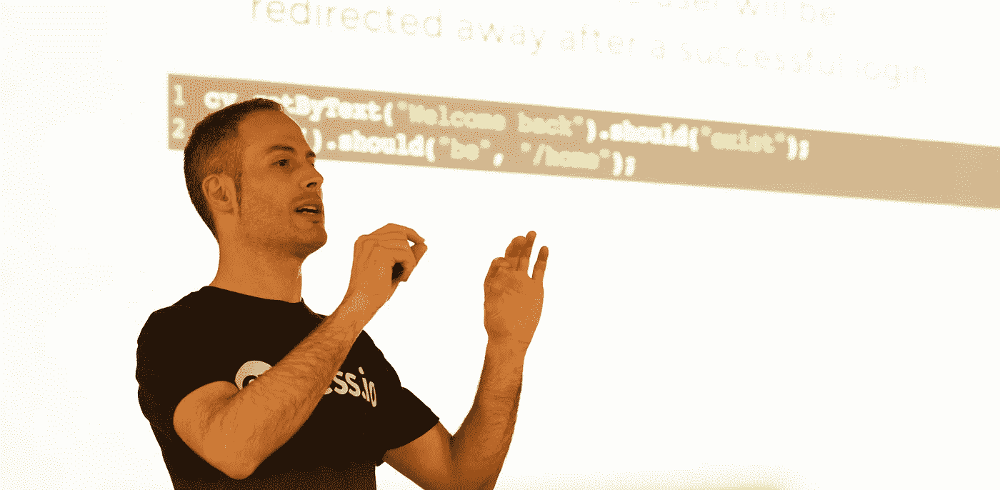

# 选择不学什么，一次专注于一件事

> 原文：<https://itnext.io/choose-what-not-to-study-and-focus-on-one-thing-at-a-time-b7304ac2a125?source=collection_archive---------1----------------------->

做一个多面手在满足感和渊博的知识方面没有回报，在这里你可以找到我作为一名前端开发人员选择专注于一件事情至少一个月的经历。

我在米兰前端演讲。感谢 Jaga Santagostino 的照片。

作为一名前端工程师，我习惯了阅读大量的文章，几乎每天都要研究一些新的东西，并且饱受 [FOMO](https://en.wikipedia.org/wiki/Fear_of_missing_out) 之苦。这是我工作的一个重要部分，但结果是，很多时候我被迫只了解很多主题的表面，而没有深入其中任何一个。

回到 2019 年 1 月，我需要为我正在工作的一个后台引入一个可靠的测试策略，认真深化测试世界的想法在我脑海中存在了很长时间……这就是为什么我做出了一个明确的选择:**一个月只研究一件事**。

我花了整整一个月的时间只研究[赛普拉斯](https://www.cypress.io/)和 UI 测试界，不关心所有的前端大新闻。我不关心 React 发布，也不关心 React Hooks 公告，也不关心我通常不想错过的数百篇帖子。只有 Cypress 和 UI 测试，一个月。

请记住:不仅如此，尤其是在前端世界中，你不必选择学什么，而是选择不学什么。一次专注于一个主题，回到你错过的内容只是几分钟/几小时的事情，并不能让你成为更好的开发者！即使你没有错过你的 Twitter feed 上的任何东西，你也只是让你了解了发展世界中每天发生的极其有限的一部分事情，所以接受 FOMO 是不可避免的这一观点😉

关于 Cypress:对学习的强烈热情，对授予高质量和始终更高质量的产品的热情，对自动化人工检查和浏览器操作的热情，对进入测试世界的热情，使我的旅程变得令人惊奇。

我也渴望尝试一种新的学习方式，由以下人员组成:

*   堆栈溢出时应答
*   强化公众演讲
*   开始教学

## 堆栈溢出时应答

我不擅长仅仅为了学习而创建辅助项目，因为我从一开始就太在意最终结果的质量。因此，我失去了自己的思考和设计项目的细节，而不是专注于推动我创建项目本身的主题。

所以我问自己:**如果我创建一个兼职项目，我能学到什么？**错误与问题**，显而易见。当某些东西不工作时，你会意识到仅仅知道框架的文档和你使用的工具是不够的。于是你开始谷歌搜索，混合来自堆栈溢出问题、GitHub 问题、Medium 帖子等信息。最后:**我需要**用例以及相关的**问题**！**

你猜怎么着？有一个巨大的网站**人们免费给你他们的问题**，包括制作项目和附带项目！它的名字叫栈溢出！

在阅读了 Cypress 的文档之后，在聚会和会议上发言之前，Stack Overflow 成为了我最大的研究来源。许多开发人员使用 Cypress 提出了许多问题，但没有 React 或 Javascript 这样的通用主题那么多，所以您通常有时间创建一个本地项目，使用它，编写一个好的自述文件，并准备一个详细的长答案，即使您需要在有限的业余时间中度过两个阳光明媚的日子。

关于堆栈溢出的一些注意事项:大约 40%的问题可以通过了解文档来回答，大约 20%的问题需要一遍又一遍的“请提供更多的细节和一个孤立的例子”注释(作者通过隔离错误找到了解决方案)，大约 20%的问题是非常特殊的情况，剩下的大约 30%的问题可以让你学习。

堆栈溢出方法包含了一个更普遍的趋势:[公开学习](https://www.swyx.io/writing/learn-in-public/)(嗨，Shawn👋).本质是

*   其他人不知道你刚刚学到的东西，暴露它(在 Twitter 上，在媒体上，公开讲话，等等。)帮助他们
*   暴露东西让你意识到你不知道很多重要的细节，你会在把自己暴露给公众之前研究它们
*   如果你揭露的是错的，读者会帮你改正！因此，你将填补你的知识空白！

## 强化公众演讲

我很久以前就习惯了公开演讲，但自 2012 年以来，我再也没有说过话。在踏上柏树之旅之前，我重新开始在聚会上讲话，但是柏树时期给了我一个动力。该产品对许多开发人员来说很有吸引力，我在现场获得的经验已经被证明对我演讲的与会者非常有价值。

公开演讲是帮助人们的自然进化，它会帮助你扩大你的人际网络。最近一年我认识了很多人，也知道了很多好的公司。网络可能是游戏中最有趣的部分。在聚会上发言更容易，可以让你直接和很多人联系，在会议上发言很好，但更难，因为他们会收到很多建议。

无论如何，公开演讲是一个很好的健身房，向其他人解释事情迫使你关心与会者会问你的许多细节。记住，如果你不能向别人解释某事，你就不会真正了解它。

## 开始教学

从一开始，这就是我的最终目标，这是最耗时的活动，但也是最有收获的活动之一，因为:

*   学习过程:公开讲述迫使你学习，但教学迫使你完全掌握一个主题。课程准备让我问了自己很多以前忽略的细节，并加深了学员可能会问的所有问题
*   设计过程:准备课程是令人惊奇的，因为你必须关心如何以尽可能清晰的方式解释主题，如何在六个多小时内保持高度关注，并提前准备一切，因为你不知道舞台上会发生什么(例如。你知道代码不能工作，但你不能让自己失去参与者的注意力)
*   挣钱:我们都是为了钱而工作，除了把娱乐和挣钱混在一起，我别无所求。所有其他活动对金钱没有直接影响，但教学有。

# 结果呢

旅程的主要目标是学习，副产品如下:

*   我在**的 10 次聚会上讲过话，**大部分是在意大利，除了在卢加诺、伦敦和维也纳
*   我在**的三个会议**上讲过话
*   我在**的 3 门课程**授课，其中一门是为意大利 React 会议开设的
*   我已经写了 **12 篇文章**，到目前为止已经有 5 万的浏览量
*   我承诺在 GitHub 上写一本关于 UI 测试最佳实践的“书”
*   我在 NPM 上分享了 **10 个包，目前下载量超过 30 万次/月**
*   我的 OSS 项目获得了 700 多颗星
*   推特上大约有 200 到 600 名粉丝
*   我在 GitHub 上养了很多 pr
*   在一次意大利聚会上发言后，我去了一家新公司，并认识了我现在的同事❤️
*   我学到了很多东西，其中大部分现在都留在了我的脑海里
*   我见过数百人，认识数十人，其中大多数是高级专业人士
*   我帮助了成千上万的开发者，他们中的很多人联系我只是为了向我问好和感谢❤️
*   我与赛普拉斯团队建立了关系，他们甚至想雇用我，但官僚主义的原因阻止了这件事

# 谁启发了我？

*   昆西·拉森的[技能/声誉/网络推文](https://mobile.twitter.com/ossia/status/1079942716480344065?s=19)
*   王自如的[当众学习](https://www.swyx.io/writing/learn-in-public/)
*   肯特·c·多兹[有意的职业生涯建设](https://kentcdodds.com/blog/intentional-career-building/)

# 隐藏的努力

没有什么是免费的，但我不想称之为“牺牲”，他们只是努力，因为我有很多乐趣实现我上面列出的。总之:

*   我提前一个小时通勤，从早上 7 点到 9 点，我超级专注于学习、帮助别人、准备聚会等等。
*   从下午 6 点到 7 点，通勤回家也是如此
*   为此，我与吉米·乔伊(Soylent 的兄弟)共进早餐，而不是像往常一样吃健康早餐
*   在周末，我花了 2 到 4 个小时参加各种活动
*   第一个 bug 课程之前的一个月，我做了很多额外的艰苦工作

# 下一步是什么？

嗯，我认为**研究你在工作中使用的东西非常重要**，目前我正在开发的产品非常庞大，我们有一个专门的质量保证团队。因此，我不能在工作中使用柏树。我继续担任 Cypress 大使，因为我热爱这个产品，也因为我的知识和我对来自我所帮助的开发人员的生产相关问题的阐述。所以我必须选择下一个研究课题，AST 吸引了我，但我还没有决定😊。无论我选择什么题目，学习的道路都和我上面描述的相似。

你好👋我是斯特凡诺·马尼，我是一名热情的**反应和打字开发者**，一名**赛普拉斯大使**和一名**讲师**。我是 WorkWave 的高级前端工程师。我喜欢创造高质量的产品，测试和自动化一切，学习和分享我的知识，帮助别人，在会议上发言，以及面对新的挑战。
你可以在 [Twitter](https://twitter.com/NoriSte?source=post_page---------------------------) 、 [GitHub](https://github.com/NoriSte?source=post_page---------------------------) 、 [LinkedIn](https://www.linkedin.com/in/noriste/?source=post_page---------------------------) 上找到我。你可以找到我最近所有的投稿/演讲等。在[上我的 GitHub 总结](https://github.com/NoriSte/all-my-contributions)。