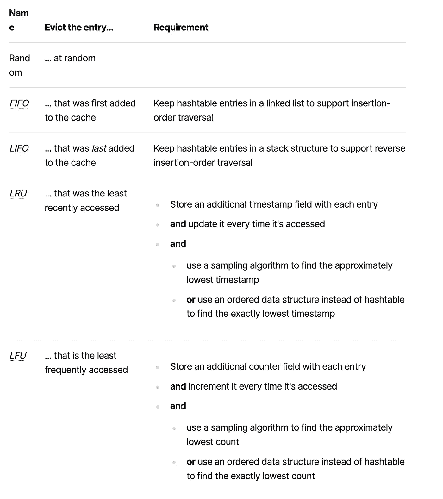

# 选择缓存—功能

> 原文：<https://itnext.io/choosing-a-cache-capabilities-1-547f741ac862?source=collection_archive---------2----------------------->

今天，我想就如何选择缓存解决方案提供一些帮助。我将把它分为两部分:

*   在本帖中，我们将列出缓存必须具备的特性以及它可以选择提供的特性。大多数标准都是通用的，可以在不考虑技术栈的情况下使用，而有几个标准是特定于 JVM 的。
*   在第二部分中，我将列出提供者并验证它们各自的能力

# 为什么要缓存？

首先，让我们打破一个常见的神话。使用缓存并不是设计糟糕的系统*本身*的标志，尽管事实可能如此。与许多设计决策一样，缓存是一种权衡。

我最喜欢的例子是通过微服务架构实现的电子商务商店。每个功能都是一个微服务:

*   目录
*   手推车
*   检验
*   定价
*   支付

现在，假设用户的购物车中有商品，点击结账。在服务器端， *checkout* 服务向 *pricing* 服务发送请求，以获取购物车的报价。此时，我们有两个要求:

1.  定价数据必须**可用**:如果定价服务停止，结账和销售都会失败。
2.  定价数据必须快速可用:如果服务启动，但用户等待时间太长，他们可能会放弃。虽然术语“长”是主观的，但 100 毫秒的延迟对销售有决定性的影响。

从科学的角度来说，错误的数据是很可怕的。从一个电商来说，卖稍微过时的价格总比销量下降好。

因此，缓存是一种折衷，即接受陈旧数据以使它们可用/快速。

# 强制缓存功能

你可能对这句名言很熟悉，“不要开发自己的加密库”。它暗示设计这样一个库乍看起来可能很简单，但是如果您不是安全专家，您可能会犯一个重大的安全错误——即使如此。您也不应该设计自己的缓存，但原因略有不同。

您可能认为缓存只是内存中的键值存储。这就是哈希表数据结构的确切含义。根据语言的不同，结构有不同的名称:Go 中的 [map](https://golang.org/ref/spec#Map_types) ，Python 中的[dictionary](https://docs.python.org/3/tutorial/datastructures.html#dictionaries)，Java 中的[T0](https://docs.oracle.com/javase/8/docs/api/java/util/HashMap.html)和 [Rust](https://doc.rust-lang.org/std/collections/struct.HashMap.html) ，Ruby 中的 [Hash](https://ruby-doc.org/core-3.0.2/Hash.html) 等。无论堆栈是什么，我们都可以用这样的结构来建模一个缓存。

作为一名初级开发人员，我也相信这一点，但从那以后我改变了主意。专业缓存提供了普通哈希表所没有的额外功能。

# 尺寸限制

先说一个简单的特性。

应用程序运行的时间越长，其缓存可能会增长得越大。根据确切的用途，例如，如果用不同的关键字缓存许多条目，它甚至可以增长更多。无限制的缓存会与您的应用程序在内存使用方面发生竞争，直到再也没有可用的内存。这是你想要避免的！

# 驱逐策略

当缓存达到其大小限制时，当新条目到达时，我们应该删除哪个条目？选择要移除的条目被称为**驱逐**策略。一些这样的策略非常普遍:

你可以在维基百科上找到其他可能的策略。

# 生存时间

你可能知道这句名言:

> *计算机科学有两个硬东西:*
> 
> *1。缓存失效*
> 
> *2。命名事物*
> 
> *3。和一个误差*

它与缓存在删除某个条目之前认为该条目有效的时间有关。当您将条目添加到缓存中时，您应该设置条目过期后的持续时间。

一种可能的实现是为每个条目添加一个字段:条目将过期的时间戳(当前时间+ TTL)。线程可能偶尔会访问条目，并急切地删除过期的条目。或者，当高速缓存需要更多空间时，它可以缓慢地驱逐过期的条目。

# 其他标准

其他标准是可选的，但仍然值得考虑。他们在这里，没有特定的顺序。

# 配置

虽然配置不是一个特性，但它会影响*开发者体验*。因此，它应该是任何有关缓存选择的分析的一部分。

有些缓存可能能够使用合理的默认值即时运行，但其他缓存可能需要显式配置。在所有情况下，您可能都需要配置几个参数，比如大小限制。

有两种选择:基于文件的配置和编程配置。当然，第三种选择是两者都提供。

# 与缓存抽象的集成

JVM 生态系统有一个官方的缓存 API，被称为 [JCache](https://github.com/jsr107/jsr107spec) ，或 JSR 107。它是一个 API 规范，描述了四个注释，*，即*、`@CacheResult`、`@CachePut`、`@CacheRemove`和`@CacheRemoveAll`。供应商将实施该规范。

Spring 框架在 JVM 生态系统中相当普遍。它还提供了一个缓存 API。从历史上看，它早于 JCache。虽然有所不同，但这个 API 与 JCache 非常相似。Spring 为几个缓存提供了现成的集成代码，而其他几个确实提供了 Spring 集成。

# 缓存模式

我在下面的演讲中描述了几种缓存模式。

因为挺长的，这里总结一下:

*   备用缓存
*   缓存直通
*   通读
*   提前刷新
*   提前缓存

通常，人们从缓存备用开始，*即*，应用程序在缓存和真实来源之间编排读/写。然而，缓存的真正威力在于更高级的模式。

# 分布式与本地

早期的缓存与应用程序共享相同的运行时。然后，架构师设计了在他们的进程中运行的缓存。并行地，您可以从单节点和分布式缓存中进行选择，分布式缓存由属于同一个集群的节点组成。

分布式缓存背后的想法是将多个节点汇集在一起，作为单个存储单元出现。如果需要更多存储，可以添加更多节点。这就是*水平缩放*背后的原理。

虽然在概念上很简单，但它提供了许多新的选择。例如，您可以*跨多个节点复制*条目，这样一个节点的故障并不意味着数据丢失。另一种可能的能力是根据条目的属性将条目放在特定的节点上:这种能力被称为*分片*。这样，查找条目变得更快，因为缓存不需要向每个节点请求数据，但知道数据位于哪个节点上。当然，集群可以提供复制和分片。

此外，如果有足够大的存储容量，可以将缓存用作内存数据库。缓存是一个键值存储:通常的用例是通过键值来检索条目。历史上，数据库有更大的范围，并提供查询能力，*，即*，`SELECT * FROM Foo`。因此，分布式缓存也可以通过专用的 API 或类似 SQL 的语法提供这样的功能。

一旦缓存能够跨节点共享内存，它也可以共享 CPU。此时，缓存已经变成了一个*数据网格*。可以发送任务，集群在其节点上并行执行这些任务。最重要的是，缓存可以确保任务在它们访问的数据附近运行，从而消除网络流量。

对于分布式缓存，体系结构是客户机-服务器:应用程序是客户机；缓存就是服务器。为了最大化您的投资，您可能希望在多个客户端之间共享您的数据。客户端可以属于不同的语言，Java 和 JVM 语言，但也可以是其他语言:C#、C、C++、Ruby、Python、Go、Rust、Erlang 等。有必要检查一下缓存提供了哪些关于您正在使用的语言的绑定。

当然，这些功能都不是“免费”的。分布式缓存是一个分布式系统，并带有所有的缺陷。要研究的一个重要标准是节点如何在网络上形成集群。例如:

*   有自动发现机制吗？
*   如果有，可以禁用吗？
*   能否在同一个网络上配置多个集群？
*   对 Kubernetes 有效吗？
*   等等。

# 非阻塞 API

缓存的目的是提高性能，因为访问本地内存中的数据比访问磁盘上或网络上的数据更快。如果数据访问需要很长时间，无论是读还是写，阻塞都会降低整个客户端代码的速度。为了解决这个问题，缓存可以提供一个非阻塞的 API。

你需要考虑几个方面；最重要的是缓存使用的 API。比如`CompletableFuture`需要 Java 8。根据您正在使用的堆栈，您可能更喜欢集成了 RxJava、Project Reactor、Kotlin coroutines 或其任意组合的缓存。

# 标准项目的健康指标

除了上面提到的所有标准，我建议你考虑应该成为每个产品评估一部分的指标:

*   **许可**:主要是开源和商业许可，但根据您的使用情况，并不是每个开源许可都兼容
*   **定价**，如果是商业性的
*   **项目成熟度**:检查项目的开始日期。理由是，比起昨天创建的项目，你可能更依赖于一个“老”项目。
*   **活动**:核心*提交者的数量*—[总线因素](https://en.wikipedia.org/wiki/Bus_factor)，非核心提交者的数量，提交者的提交历史，开放问题的数量，修复它们的平均时间，如果核心提交者停止了项目工作，等等。
*   **文档**:虽然这个术语非常通用，但是好的文档是由*参考资料*、*教程*、*操作指南*和*解释*组成的。如果你以前从未遇到过这些术语，请阅读此[页面](https://documentation.divio.com/)或观看此[视频](https://www.youtube.com/watch?v=t4vKPhjcMZg)。我是在看完讲座后才开始获取文档的。
*   社区:有多大？有多活跃？有多大帮助？
*   **支持**:支持渠道有哪些？Stackoverflow？Google Groups？懈怠？问题多久会有答案？
*   等等。

# 结论

在这篇文章中，我描述了几个选择缓存提供者的标准。在下一篇文章中，我将尝试列出并比较 JVM 生态系统中最常见的开源缓存提供者。

非常感谢我的同事 Marko Topolnik 的评论。

**更进一步:**

*   [缓存上的维基百科页面](https://en.wikipedia.org/wiki/Cache_(computing))
*   [缓存替换策略列表](https://en.wikipedia.org/wiki/Cache_replacement_policies)
*   [缓存模式指南(视频)](https://www.youtube.com/watch?v=na2HqjBexbU)
*   [JCache](https://hazelcast.com/glossary/jcache-java-cache/)
*   [Spring 的缓存抽象](https://docs.spring.io/spring-framework/docs/5.3.x/reference/html/integration.html#cache)

*原载于* [*一个 Java 极客*](https://blog.frankel.ch/choose-cache/1/)*2021 年 10 月 24 日*