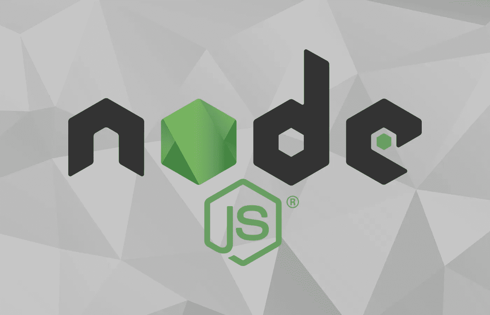
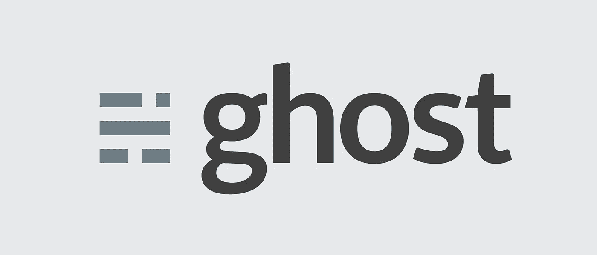

# 选择 NodeJS 框架

> 原文：<https://itnext.io/choosing-a-nodejs-framework-for-your-project-d7ba84b584a0?source=collection_archive---------1----------------------->

[nodejs.org](https://nodejs.org/en/)

近年来，NodeJS 已经成为现代 web 应用程序开发的首选框架，它提供了一个运行时环境，允许在客户端和服务器端应用程序代码中使用 JavaScript。

虽然 [W3Tech 的报告](https://w3techs.com/technologies/comparison/ws-apache,ws-nginx,ws-nodejs)比较了 NodeJS 与 Nginx 和 Apache 的使用情况，目前显示 NodeJS 仅占 0.4%，但通过提供跨整个应用程序开发栈使用一种编程语言的能力，它是 JavaScript 开发人员的完美选择。

它的架构的其他好处是使用 JavaScript 事件循环，对于那些构建基于事件、数据驱动的单页面和/或实时应用程序的人来说，这是一个很有吸引力的选择。

与任何 web 技术一样，在最初采用之后，许多框架、模块和库已经兴起来帮助支持高质量的开发。

在本文中，我将重点介绍一些最常用的框架，它们可以处理任何复杂程度的项目，其中一些框架比其他框架提供更多的功能，然后简要介绍各种满足特定站点需求的定制解决方案。

# MVC 框架

【https://github.com/expressjs/expressjs.com 

[**express js**](http://expressjs.com/)**大概是最广为人知的 NodeJS 框架了，虽然有很多原因——其中一个明显突出的就是性能。**

**ExpressJS 采用尽可能轻量级和最小化框架的方法，同时仍然提供根据您的需求配置、构建和部署应用程序的功能。**

**Express' [generator](http://expressjs.com/en/starter/generator.html) 特性对于新项目来说也是一个很好的特性，其中有各种各样的应用程序框架可以用来帮助您立即投入使用。**

****

**[https://github.com/meteor/meteor](https://github.com/meteor/meteor)**

**[**Meteor**](https://www.meteor.com/) 为应用程序开发提供了比 ExpressJS 更重型的实用工具带，提供了与 MongoDB 的集成支持，例如处理数据驱动的应用程序。**

**与列出的其他 MVC 一样，Meteor 与 React 和 Angular 等客户端框架无关，这使得使用您选择的客户端框架变得很容易。**

**Meteor 还集成了 Apache Cordova，提供了将项目包装和发布为本地应用程序的能力。借助 Meteor 中的 Cordova 集成，您可以使用现有的应用程序，通过几个简单的命令在 iOS 或 Android 设备上运行它。**

****

**[https://github.com/balderdashy/sails](https://github.com/balderdashy/sails)**

**[**SailsJS**](https://sailsjs.com/) 以其“特别适合构建聊天等实时功能”而自豪—从这个角度来看，Sails JS 最适合那些开发实时应用程序(如聊天室和多人游戏)的人，他们对此也很感兴趣。**

**Sails 构建在 Node.js、Express 和 Socket.io 之上。**

# **定制框架**

**除了前面提到的框架之外，还有各种各样的框架服务于更具体的项目焦点，如果您当前或即将到来的项目符合标准，它们可能比上面的更好。**

****

**[https://github.com/tryghost/ghost](https://github.com/tryghost/ghost)**

**[**Ghost**](https://ghost.org/) 为你的博客/出版需求提供了一个框架。想想 Wordpress，只在 NodeJS 上。**

**由于它最初是作为一个开源博客平台发布的，项目背后的组织已经开发了这个框架，现在他们可以向新用户提供托管 Ghost 解决方案。**

**尽管他们建议使用该服务，但他们也提供了设置自托管 Ghost 应用程序的文档。他们用于高级服务的源代码也是开源应用程序的代码，所以随着时间的推移，您可以期待一致的更新和改进。**

****

**[https://github.com/reactioncommerce/reaction](https://github.com/reactioncommerce/reaction)**

**[**反应商务**](https://reactioncommerce.com/) 顾名思义，适合开发用 NodeJS 搭建的电子商务网站。他们的 Github 知识库上的描述将其描述为“一个用 JavaScript (ES6)构建的事件驱动、实时反应的商业平台。它与 npm、Docker 和 React 配合得很好。”。**

**它似乎是一个 NodeJS 项目，开发类似于 Apache 的 Magento 框架。**

****

**[https://github.com/jnordberg/wintersmith](https://github.com/jnordberg/wintersmith)**

**当您的网站不需要 API 或数据库等功能来提供动态内容时， [**Wintersmith**](http://wintersmith.io/) 可能适合您作为静态网站生成器的需求。**

**由于支持使用 Jade 模板或 Markdown 进行渲染，它对于博客或作品集等网站来说是一个有效的轻量级解决方案，在这些网站中，您不需要其他框架提供的功能。**

**— — —**

***有没有使用其他没有提到的框架的经验？如果您想提出文章中所列内容的替代方案，我很想听听您的想法。***