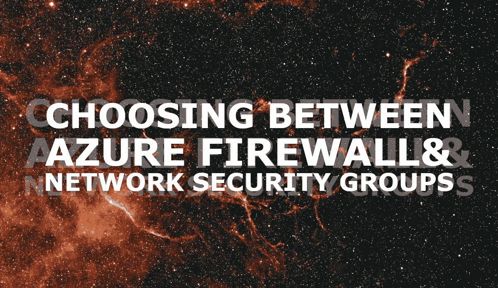
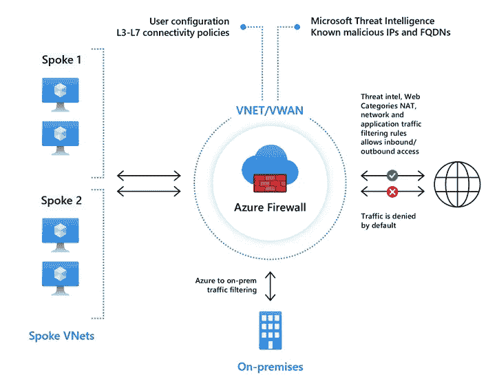
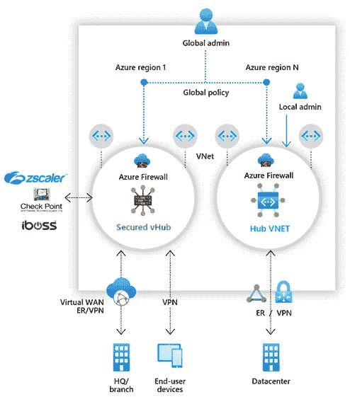
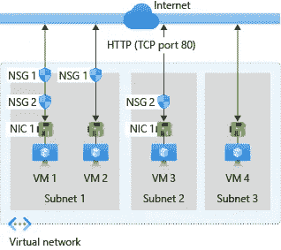
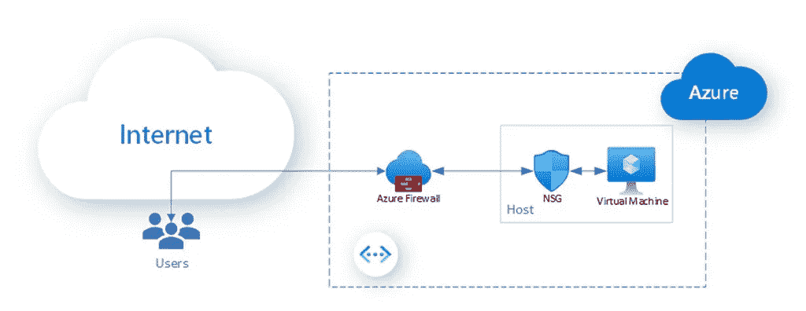

# 在 Azure 防火墙和网络安全组之间选择

> 原文：<https://itnext.io/choosing-between-azure-firewall-and-network-security-groups-b3ed1e6eedbd?source=collection_archive---------0----------------------->

一个经常讨论的话题是 Azure 防火墙和 Azure 网络安全组织(NSG)之间的区别，特别是在特定情况下为什么选择一个而不是另一个。

在本文中，我将解释这些服务是什么，它们的区别是什么，哪些考虑因素导致在这些服务之间进行选择，以及如何将它们结合起来使用以实现零信任。

# 什么是 Azure 防火墙？

Azure 防火墙是一种云原生的智能网络防火墙安全服务，可以保护在 Azure 中运行的云工作负载免受威胁。它提供东西向流量(数据中心之间或内部)和南北向流量(进出数据中心)的流量控制。Azure 防火墙是一个有状态的防火墙，内置高可用性和无限的可扩展性。

Azure 防火墙旨在分析和过滤[第 3 层](https://docs.microsoft.com/en-us/windows-hardware/drivers/network/windows-network-architecture-and-the-osi-model#network-layer)、[第 4 层](https://docs.microsoft.com/en-us/windows-hardware/drivers/network/windows-network-architecture-and-the-osi-model#transport-layer)和[第 7 层](https://en.wikipedia.org/wiki/OSI_model#Layer_7:_Application_layer)流量。与网络安全组不同，Azure 防火墙支持基于威胁的过滤。此外，Azure Firewall 还支持 FQDN(完全限定的域名)标记，应用程序规则使用这些标记通过防火墙路由所需的传出流量。

*图片由* [*微软*](https://www.microsoft.com/en-us) *上* [*微软*](https://docs.microsoft.com/en-us/azure/firewall/overview#azure-firewall-standard) 文档组成

## Azure 防火墙高级版

除了 Azure 防火墙标准提供的功能之外，Azure Firewall Premium 还允许您访问基于签名的 IDPS(入侵检测和防御系统)的更多高级功能。它使您能够持续搜索特定模式来检测攻击。

*图片由* [*微软*](https://www.microsoft.com/en-us) *上* [*微软*](https://docs.microsoft.com/en-us/azure/firewall/overview#azure-firewall-premium) 文档组成

## Azure 防火墙管理器

您可以使用 Azure 防火墙管理器以集中方式管理多个 Azure 防火墙，即使它们存在于多个订阅中。它使用防火墙策略将网络和应用程序规则及配置应用于您的租户中的防火墙。

防火墙管理器支持 VNet(虚拟网络)和安全虚拟集线器(VPN)环境中的防火墙。安全的虚拟集线器使用[虚拟广域网路由自动化解决方案](https://docs.microsoft.com/en-us/azure/virtual-wan/about-virtual-hub-routing)来简化将流量路由到防火墙的过程，只需点击几下鼠标。

*图片由* [*微软*](https://www.microsoft.com/en-us) *上* [*微软*](https://docs.microsoft.com/en-us/azure/firewall-manager/overview)

# 什么是网络安全组？

网络安全组用于过滤进出 Azure 虚拟网络中 Azure 资源的网络流量。它们包含允许或拒绝各种类型 Azure 资源的入站网络流量或出站网络流量的安全规则。评估这些安全规则的优先级，并包含允许或拒绝流量的五元组详细信息(源、源端口、目的地、目的地端口和协议)。因此，不应该存在具有相同优先级和方向的安全规则。

*图片由* [*微软*](https://www.microsoft.com/en-us) *上* [*微软*](https://docs.microsoft.com/en-us/azure/virtual-network/network-security-group-how-it-works) 文档组成

Azure 会在您创建的每个网络安全组中创建默认规则。这些规则的优先级不能调整，但是优先级是这样的，有足够的空间来“否决”这些规则。这些默认规则可以在微软文档中找到。

> 如果你想了解更多关于网络安全组供应和部署的信息，我推荐你看看我以前的一篇关于 Azure 网络安全组入门的文章。

# 选择其中一个

在任何网络中，总是建议对网络流量进行分段和过滤。默认情况下，为每个网络及其子网提供网络安全组是有意义的，除非这不兼容(例如，在 Azure 防火墙、网关或 Azure Bastion 的子网中)。网络安全组可以免费使用，并显著提高了安全级别。您应该始终使用网络安全组。

Azure Firewall 默认提供了一些安全功能，如基本的流量监控、访问控制列表等。如果您需要使用基于威胁的过滤功能来过滤去往(甚至在)VNET 的流量，您可以使用 Azure Firewall。如果你需要支持应用程序 FQDN 标签，你可以使用 Azure 防火墙。如果您需要屏蔽源和目标网络地址，您可以使用 Azure 防火墙。如果你想在传输层或应用层过滤流量，你可以使用 Azure 防火墙。

## 第三方防火墙呢？

一个常见的问题是，为什么有人选择 Azure Firewall 而不是来自 CheckPoint、Palo Alto 或 Fortinet 等供应商的第三方 NVAs(网络虚拟设备)。

第三方 NVA 是一种 IaaS 实施，由一个带有来自供应商的自定义映像的虚拟机组成。吞吐量取决于虚拟机的大小。Azure 防火墙是一种托管服务，以主动/主动方式运行，并根据流量自动扩展。Azure Firewall 完全通过 Azure Resource Manager 进行管理，并支持您在 Azure Firewall 中使用相同的代码结构/框架对环境进行更改和更新。因此，与第三方 nva 相比，部署没有那么复杂。此外，Azure Firewall 为各种 Azure 服务提供了托管服务标签，从而可以轻松更新规则来批准/拒绝本地 Azure 服务的流量。像许多防火墙供应商一样，Azure Firewall 具有几个内置规则引擎和威胁智能的逻辑。微软的对等物是智能安全 API。如果使用其他支持服务，如 Azure Monitor 和 Sentinel for SIEM/SOC，则可以利用这一点。第三方 nva 不能做到这一点或更少，使 Azure 防火墙的选择更加合理，因为你可以在现有知识的基础上建立仪表板和监控点。

## 第三方防火墙不好吗？

不会。如果您的混合环境中存在基于供应商选择的现有防火墙，那么您的整个环境就有一套现有的规则。链接来自同一个防火墙供应商的 NVA 非常简单明了，所以在 Azure 中重用它是有意义的。如果混合环境的情况持续一段时间，网络和安全操作会变得更加容易。虽然 Azure Firewall 提供了许多好处，但拥有多个防火墙提供商会使故障排除变得困难和低效，因为规则集必须在几个地方更新。

## 为什么 Azure 防火墙这么贵？

真的不是。如果读完这篇文章后，你仍然认为你没有得到你的 Azure 防火墙的钱的价值，那么 Azure 防火墙不适合你。找到一个满足你需求的解决方案或服务，如果这能让你选择 Azure Firewall，那么其他选择也不会更便宜。为了降低成本，提供了分配和取消分配方法，可以通过 Azure PowerShell 使用这些方法来停止防火墙计费，并在根据您的要求映射或取消映射防火墙时重新开始。

# 结合 Azure 防火墙和网络安全组

Azure 通过静态加密(服务器端加密)、流量过滤(网络安全组)等提供了出色的安全性。然而，这通常不足以满足现代业务需求。企业使用持续的互联网连接，因此防火墙云安全。

Azure 防火墙和网络安全小组共同努力实现零信任和深度网络安全。它们共同提供了多层防御。如果一层失败了，另一层可以代替它。

*图片由* [*阿米尔·达汗，Azure 网络高级项目经理*](https://azure.microsoft.com/en-us/blog/author/amirdahan/) *上传* [*微软 Azure 博客并更新*](https://azure.microsoft.com/en-us/blog/enabling-zero-trust-with-azure-network-security-services/)

# 结论

在这篇文章中，你已经了解了什么是 Azure Firewall，什么是网络安全组，它们之间的区别是什么，以及它们如何相互补充。最终，公司的网络和安全需求会导致正确的设计和解决方案，因此可以肯定地说，在 Azure 防火墙和网络安全组之间永远不会有选择。相反，两者相辅相成。网络安全组是一个卫生因素，Azure 防火墙或第三方 NVA 是任何有自尊的公司都必须小心对待其数据的。