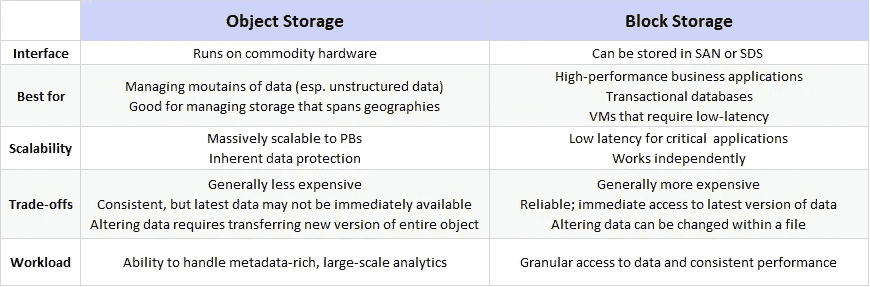

# 在对象存储和块存储之间选择

> 原文：<https://itnext.io/choosing-between-object-and-block-storage-810b15709368?source=collection_archive---------6----------------------->

丹尼·米勒在 [Unsplash](https://unsplash.com/?utm_source=unsplash&utm_medium=referral&utm_content=creditCopyText) 上的照片

我们处理的数据量每天都在增长，导致数据管理变得不堪重负。因此，需要一种专用且合适的存储形式。

有多种类型的存储可供选择，每种类型都有自己独特的体系结构和用途。

在本文中，我们将研究对象存储和块存储，并了解它们之间的区别，以便您知道根据您的需求选择哪一种。

# 块存储器

块存储是更传统的方式，因为它是最古老的，所以让我们从它开始。这是一种存储类型，其中数据被写入存储上的原始块中，各个服务器通过[存储区域网络(SAN)](https://www.snia.org/education/storage_networking_primer/san/what_san) 访问数据。

访问数据的服务器可以在同一个网络上，也可以在不同的网络上，但是它们只能通过 SAN 连接到存储设备。

在这种类型的存储中，数据被分解成单独的块，并作为单独的片段存储，每个片段都有一个唯一的标识符。信息分布在多个环境中，可以更好地为数据服务。SAN 将承担这一职责，并将数据块放在最有效的地方。

因为每个数据块都独立存在，所以可以对其进行分区，以便与不同的操作系统一起工作，这使得所有者可以完全自由地配置他们的数据。

**用例:**

就性能而言，块存储在数据检索方面提供了最低的可能延迟，并且通常是高度冗余的。大多数数据块存储服务都提供内置的功能，数据在卷间是冗余的。因此，如果一个卷出现故障，您可以从其他地方检索数据。

因此，块存储最适合以下情况:

*   事务数据库、关系数据库等工作负载需要极低的延迟和高且一致的 I/O 性能。
*   引导卷:您可以从安装在块存储卷上的磁盘映像进行引导，从而提供了一种经济高效的映像维护方式。
*   热插拔驱动器:块存储卷可以像连接到云实例一样快速地从云实例中分离。

**缺点**

说到缺点，最突出的是:

*   块存储的成本非常高——每千兆字节很贵，所以当您需要存储大量数据(我们说的是兆兆字节)时，它不是一个很好的选择。
*   有限的可扩展性会增加这种基础设施的复杂性。

# 对象存储

[对象存储](https://lakefs.io/object-storage/#What_is_object_storage?)，或基于对象的存储，比块存储更新，代表一种平面结构，其中文件被分成称为对象的片段。这些对象存储在单个存储库中，而不是作为块保存在服务器上。同时，这些对象可以分布在多个网络系统中。

基于对象的存储允许您以高度可扩展的方式存储大量非结构化数据。这是因为每个对象都接收一个唯一的 ID 和一组元数据，这些元数据表示关于存储在对象存储器中的文件的信息。

与此同时，应用程序通过使用唯一的 ID 直接访问对象来管理所有对象。尽管如此，他们也可以利用元数据进行更好的识别和分类。

虽然您必须首先将卷连接到操作系统才能访问**块**存储卷，但是您可以通过 API 或 HTTP 调用直接访问**对象**存储设备上的数据。

**用例:**

与每个对象相关联的元数据标签代表了对象存储的一个重要优势，包括年龄、隐私、安全性和访问权限等细节。您还可以通过添加极其详细的信息来扩展它。例如，如果您将照片存储在对象存储中，您可以利用元数据标记来添加有关您使用的相机、地理位置等信息。

它是一种现收现付的解决方案，您只需为您使用的内容付费。它的每千兆字节成本也很低。

因此，对象存储最适合以下情况:

*   公共云存储。
*   大量非结构化和静态数据(媒体类型)，如图像、视频、音乐等。
*   数据恢复:因为对象存储提供了一种安全且经济高效的方式来保存数据，所以它非常适合备份、数据库转储或日志文件。
*   可扩展的基础设施:扁平的特性使得这种类型的架构可以很好地扩展到海量数据。

**缺点**

像任何其他类型的存储一样，对象存储并不完美。它有利也有弊。以下是一些最显著的缺点:

*   一个对象不能被修改:如果一个对象需要被修改，它只是被存储为一个新的对象。同时，如果启用了版本控制，则出于历史目的会保存对象的先前版本。否则，先前的版本将被删除。
*   性能:编写对象是一个缓慢的过程。

下表总结了对象存储和块存储之间的差异:

[图像来源](https://www.google.com/url?sa=i&url=https%3A%2F%2Fwww.inxero.com%2Fchannels%2Fzunesis-com%2Fshowcase%2F4015-storage-trends-and-insights&psig=AOvVaw3dli3iPMQEfserFd3Zf3Vt&ust=1611831417494000&source=images&cd=vfe&ved=0CA0QjhxqFwoTCPCJqZH6u-4CFQAAAAAdAAAAABAJ)

# 结论

当谈到块存储和对象存储时，最关键的区别是它们处理元数据的方式。在对象存储中，您可以自定义元数据，以包含有关存储在对象中的数据文件的其他详细信息。在块存储中，元数据仅限于主文件属性。

每种类型的存储都是为特定目的和解决特定问题而开发的。找到最适合你的解决方案的第一步是对你的项目有很好的了解并理解你的需求。

您需要存储少量数据还是大型数据集？数据是否结构化？它需要额外的元数据吗？这些只是您在选择存储机制之前应该自己回答的几个问题。