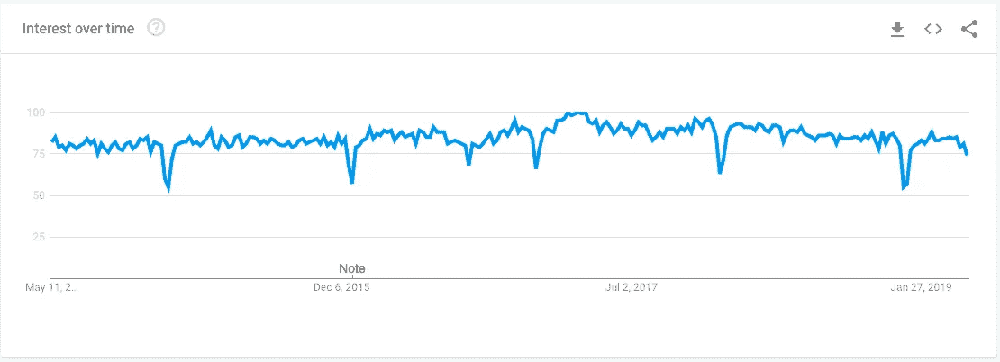
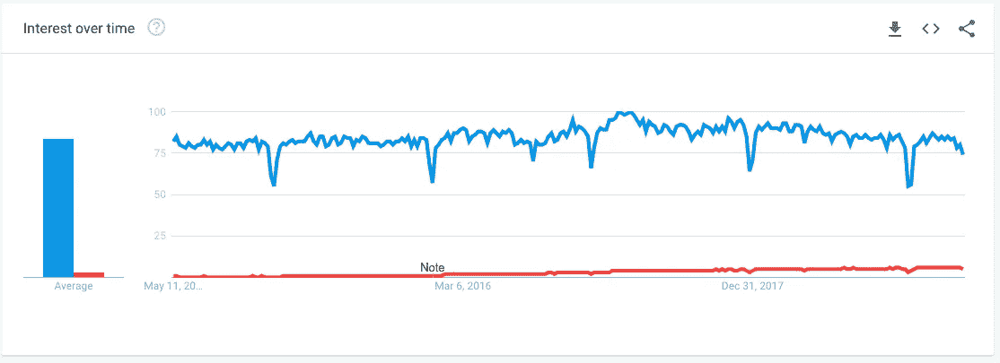
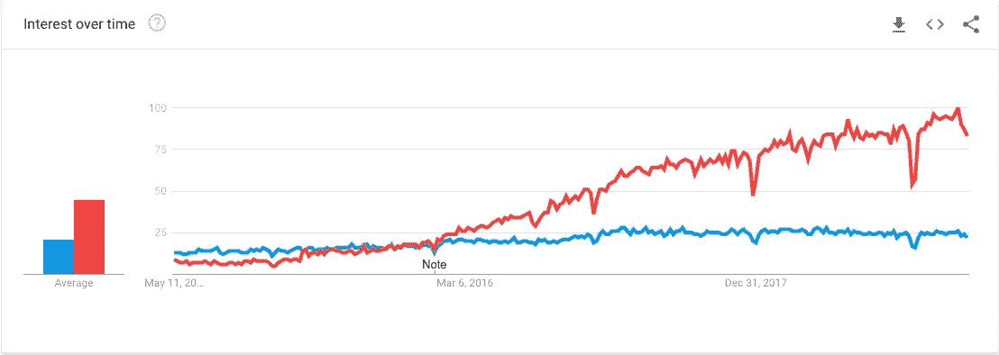
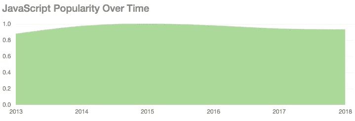
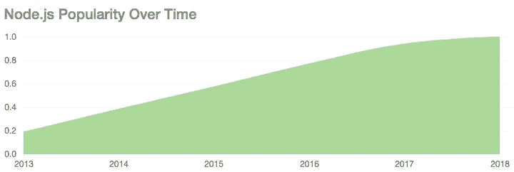

# 在 TypeScript 和 JavaScript 之间选择:技术，流行度

> 原文：<https://itnext.io/choosing-typescript-vs-javascript-technology-popularity-ea978afd6b5f?source=collection_archive---------0----------------------->

TypeScript 相对来说是 JavaScript 领域的新手，是 JavaScript 编程的一个有前途的补充。价值主张是增加一些 JavaScript 中所缺乏的严格性、类型检查和其他编译时检查。像这样的检查应该有助于我们编写更健壮的代码，尤其是在大型应用程序中。

*这是摘自*[***node . js 应用中使用 Typescript 的快速入门***](https://www.amazon.com/dp/B07S87X4ZK/ref=as_li_ss_tl?ie=UTF8&linkCode=ll1&tag=davidherron-20&linkId=eabbbd433e78d1bc02665917e27b6625&language=en_US)

*这是系列文章的一部分—参见* [***如何用 Node.js***](https://medium.com/@7genblogger/how-to-set-up-typescript-compiler-and-editing-environment-with-node-js-68952aebbe1d?postPublishedType=initial) 设置类型脚本编译器和编辑环境

JavaScript 编程的松散本质非常适合快速编码，但从理论上来说，它不适合大型应用程序。在一个小的应用程序中，一个程序员可以很容易地检查代码以发现编码错误，但是在一个大型团队开发的大型应用程序中，手动发现编码错误要困难得多。一个常见的问题是定义一个匿名对象，在一组协作函数中使用，然后改变其中一个函数而不改变其他函数。

在许多语言中，编译器在捕捉某些类别的编码错误方面发挥着作用。以刚才提到的例子为例，在其他语言中，不仅编译器会发现这个错误，IDE 还具有重构功能，可以主动帮助程序员确保类型更改传播到所有受影响的代码。

随着 JavaScript 被用于越来越大的应用程序，更严格应该是一件好事。

TypeScript 正在迅速普及。因此 TypeScript 开始流行了吗？JavaScript 正在失去人气吗？程序员对 TypeScript 提供的东西满意吗？JavaScript 开发人员是否希望他们的代码更加严谨？

# 理论:通过编译时检查实现更好的程序

为什么 TypeScript 很重要？为什么不直接使用 JavaScript 继续工作呢？这与我们用 JavaScript 编写大型应用程序的能力有关。

最初，JavaScript 是为网页上的小而简单的代码片段设计的，以帮助 Java 小程序更好地与网页集成。这个名字， *JavaScript* ，是因为网景公司和太阳微系统公司之间的一个营销协议，其中 JavaScript 将是 Java 小程序的脚本语言。在一小段代码中，任何有能力的程序员都可以很容易地检查代码，看看它做了什么，并通过肉眼捕捉错误。

在过去的几年里，用 JavaScript 编写的基于浏览器的应用程序变得越来越复杂。此外，还有一个叫做 Node.js 的小东西，它让我们有机会用 JavaScript 编写服务器端代码，人们可以用它来编写大规模的服务器端应用程序。从理论上讲，在一个大型应用程序中，左手很容易不知道右手在做什么，这意味着一个模块中的变化可能会打乱另一个模块中的假设，并使应用程序崩溃，变成一堆散落一地的比特。

理论上，企业级系统需要像 Java、C#或 C++这样的严格类型语言所具有的严格性。

理论上，在小型应用程序中，严格的类型/代码检查并不重要，因为具有松散类型字段的匿名对象在小型程序中是可管理的。

理论上，一个拥有数百万行代码的软件系统只有在编译器和运行时系统帮助程序员找到 bug 的情况下才能工作。

理论上，具有强类型和其他特性的语言可以防止某些类型的编程错误。

这是 TypeScript 占据的位置，即一种足够严格的编程语言，可以防止程序员搬起石头砸自己的脚，但又具有 JavaScript 的易用性。TypeScript 编译器生成的代码可部署到现代(ES5 和更高版本)JavaScript 环境(web 浏览器和 Node.js ),因此它可以为构建在 JavaScript 平台上的日益复杂的应用程序带来严谨性..

# 流行度竞赛——JavaScript vs . TypeScript

作为一名软件工程师，你如何判断使用哪种技术？还有技术评估——技术是否如其所言，是否适合您的项目？对于这项技术是否有“腿”也有一个更宽松的评估，这意味着它将在未来 10 年或更长时间内使用吗？

TypeScript 具有坚实的技术优势。它为 JavaScript 增加了许多有用的特性，正如你所料，因为首席工程师是从 Delphi 到 C#的一系列流行编程语言的幕后推手。对于希望为大型 JavaScript 项目增加严谨性的团队来说，这似乎是一个非常好的解决方案。现在我们假设 TypeScript 有技术上的优点。在这篇文章的后面，我们将浏览一些博客文章，这些文章给出了更多关于技术优点的数据。

TypeScript 到底有多受欢迎？

让我们从谷歌趋势开始——它向我们展示了搜索查询的趋势。下面的图表将总结全球搜索结果，涵盖 2019 年 5 月 7 日之前的最后五年。

过去五年的打字稿——来源:[谷歌趋势](https://trends.google.com/trends/explore?date=today%205-y&q=%2Fm%2F0n50hxv)

过去五年的 JavaScript 来源:[谷歌趋势](https://trends.google.com/trends/explore?date=today%205-y&q=%2Fm%2F02p97)

过去五年 JavaScript 与 TypeScript 的对比——来源: [Google Trends](https://trends.google.com/trends/explore?date=today%205-y&q=%2Fm%2F02p97,%2Fm%2F0n50hxv)

从这些数据中我们可以看出，人们对 JavaScript 的兴趣远远大于对 TypeScript 的兴趣。人们对 JavaScript 的兴趣充其量只是停滞不前，或者略有下降，而对 TypeScript 的兴趣正在强劲增长。

因为相关性不是因果关系，我们还没有证明除了打字稿以外的任何东西。

对 TypeScript 感兴趣的一个重要原因是 Angular 2 使用 TypeScript。在谷歌趋势页面上，它显示了相关的查询，组合“angular2 typescript”非常受欢迎。

TypeScript(蓝色)，Node.js(黄色)，TypeScript+Node.js(红色)——来源:[谷歌趋势](https://trends.google.com/trends/explore?date=today%205-y&q=TypeScript,typescript%20node.js,node.js)

鉴于 Node.js 通常用于大型应用程序，有趣的是 Node.js 和 TypeScript 的组合并没有显示出太多的搜索兴趣。同样令人好奇的是对 Node.js 的兴趣停滞/下降。

Express.js(蓝色)TypeScript(红色)——来源:[谷歌趋势](https://trends.google.com/trends/explore?date=today%205-y&q=%2Fm%2F0_v2szx,%2Fm%2F0n50hxv)

类似地，如果我们选择 Express.js，Node.js 的流行应用程序框架之一，我们会看到类似的模式。Express.js 的兴趣充其量是停滞不前，而 TypeScript 的兴趣正在起飞。

我们证明了什么？TypeScript 的兴趣正在起飞，而其他工具充其量是停滞不前。

骰子技能中心对不同技术的相对受欢迎程度给出了不同的看法。

JavaScript 流行度—来源:[骰子技能中心](https://www.dice.com/skills/Javascript)

和 Google Trends 一样，这表明 JavaScript 的受欢迎程度很高(不足为奇),但是停滞不前或者在下降。

打字本人气—来源:[骰子技能中心](https://www.dice.com/skills/TypeScript)

和 Google Trends 一样，TypeScript 越来越受欢迎。

Node.js 人气—来源:[骰子技能中心](https://www.dice.com/skills/Node.js)

谷歌趋势显示 Node.js 的兴趣趋于平稳，这表明它正在强劲增长——并在 2018 年开始平稳。在谷歌趋势图中，同期 Node.js 的兴趣比这更停滞不前。

不同之处在于，Dice 技能图显示的是需要特定技能的职位列表数量，而 Google Trends 显示的是搜索查询。

绘制 Github 项目中使用的语言的趋势或者 StackOverflow 问题的趋势难道不是很酷吗？不幸的是，我找不到这样的图表来源。

# 其他程序员在说什么？

评估一项技术的另一部分是寻找关于这项技术的博客文章。其他程序员是在抱怨这个工具，还是在赞美它？他们对不同技术选择的技术价值有什么看法？

我先从我自己的一篇文章说起

 [## 为什么一个 Java 的家伙对 Node.js 和 JavaScript 这么感兴趣？

### 在 Sun Microsystems 的 Java SE 团队中工作了 10 多年的人难道不应该研究 Java 字节码并成为…

blog . sourcer . io](https://blog.sourcerer.io/why-is-a-java-guy-so-excited-about-node-js-and-javascript-7cfc423efb44) 

我在 Sun Microsystems 的 Java 团队工作了 10 多年，这意味着我完全沉浸在 Java 的这个和那个之中。作为`java.net`上的一个博客作者，我强烈地为 Java 辩护，反对人们推广 JavaScript。但在离开 Sun 之后，大约 10 年前，我发现了 Node.js，并完全转向了 JavaScript 编程，并写了几本关于 Node.js 编程的书。底线是，用 Spring 开发 web 应用程序的几年让我确信，Java 生态系统被许多臃肿的层所掩盖，而使用 Node.js 的 JavaScript 是一股新鲜空气。这篇文章非常受欢迎，人们要么在权衡这篇文章是否“正确”,要么认为我完全糊涂了，不应该放弃 Java。一些回复表明 TypeScript 是这些方法之间的一个很好的中间地带。

从那以后，我做了一点打字稿编码的工作，感觉很复杂。让编译器捕捉一些错误是件好事。但是因为它不支持运行时类型检查，所以很有可能出错。

 [## JavaScript 注定要被 TypeScript 篡夺吗？

### 随着 TypeScript 越来越受欢迎，它能与它的母语言和网络共存吗？

www.techrepublic.com](https://www.techrepublic.com/article/is-javascript-about-to-be-superseded-by-typescript/) 

这篇文章引用了许多领先的技术行业评论员的话，他们说:

*   “TypeScript 正在慢慢成为新的和改进的 JavaScript，”— TIOBE
*   “TypeScript 是 JavaScript 的严格类型超集，因此很高兴看到 TypeScript 的采用率上升，因为它有助于满足 JavaScript 开发人员的需求，这些开发人员希望在编译时而不是运行时获得更多的类型安全性和对应用程序中潜在问题的洞察力。”JS 基金会的 Kris Borchers

 [## 静态类型令人震惊的秘密

### 最近 TypeScript 的人气真的爆发了。我喜欢 TypeScript，我喜欢静态类型。我不使用…

medium.com](https://medium.com/javascript-scene/the-shocking-secret-about-static-types-514d39bf30a3) 

Eric Elliot 的这篇文章指出，虽然静态类型非常有用，但它们不是捕获 bug 的解决方案。他说，对大量开源代码库的代码质量研究表明，对于使用静态类型的语言，“错误密度”并没有提高。相反，有助于减少 bug 密度的是“TDD”或测试驱动开发。

 [## 静态类型在检测公共漏洞中的有效性

### ICSE 2017 年的一篇论文的项目页面，打字还是不打字:量化 JavaScript 的可检测错误

ttendency.cs.ucl.ac.uk](http://ttendency.cs.ucl.ac.uk/projects/type_study/) 

这项研究检查了几个开源项目，查看项目中发现的错误，然后插入类型定义，看看 TypeScript 是否会在编译时发现错误。他们发现了很多编译器可以捕捉到错误的例子。

任何专业的软件工程师都知道，越早发现缺陷，修复缺陷的成本就越低。在编译时捕获的 bug 是修复起来最便宜的。

 [## 使用 TypeScript | Joyent 轻松进入 Node.js

### 这篇博客文章介绍了 TypeScript 语言，包括它与…

www.joyent.com](https://www.joyent.com/blog/easing-into-nodejs-with-typescript) 

本文演示了 TypeScript 在描述类型和对象内容方面是多么有用。直到结束前一切看起来都很好。

文章中陈述的缺点:

*   **编译**——开发人员的工作流程有点复杂，因为他们现在必须编译他们的代码。
*   **调试**——使用带有由 TypeScript 生成的代码的调试器并不简单。

这是 Node.js 的发明者 Ryan Dahl 关于 Node.js 和他对 Node.js 感到遗憾的事情的非常有见解的讲话。这些观点很有趣，但在结尾他描述了一个新项目:

 [## 德诺

### 用 V8、Rust 和 Tokio 构建的 JavaScript 和 TypeScript 的安全运行时

德诺.兰德](https://deno.land/) 

它是一个基于 V8 构建的新的编程运行时，使用 Rust 而不是 C++，Deno 的用户用 TypeScript 编写他们的代码。在上面的谈话中，Dahl 非常热情地谈到了 TypeScript，他对 TypeScript 的偏爱通过让 Deno 运行时的用户用 TypeScript 编写他们的代码得到了证明。

 [## 什么时候应该使用 TypeScript？

### 这篇文章现在有日文版和中文版。

medium.freecodecamp.org](https://medium.freecodecamp.org/when-should-i-use-typescript-311cb5fe801b) 

这篇文章是由一个似乎来自 C#/的工程师写的。NET 背景。因此，TypeScript 和 C#之间的相似之处受到了欢迎。他让一组 C#开发人员加入进来，他们能够快速使用 TypeScript。

本文列举了一些缺点，包括前面列出的编译和调试问题。

# 拥抱/伸展/熄灭

TypeScript 项目看起来完全是一个正确执行的开源项目，令人兴奋不已。但是我们不得不提出微软过去的一个问题，这个问题在 Eric Elliots 早先链接的博客文章中提到过。

微软并不总是开源运动的好公民。在公司历史的大部分时间里，公司对开源努力持极度否定态度，对于我们这些在 20 世纪 80-90 年代成长起来的人来说，微软是他们的敌人。

微软的标志性策略是*拥抱*，或者引入新技术，*扩展*，或者给引入的技术增加功能，*消灭*，或者通过推广不兼容的版本使原有技术变得无关紧要。

从一个角度来看，TypeScript 正处于该策略的扩展阶段。

在是否采用 TypeScript 的问题上，这种考虑很重要。通过采用 TypeScript，你是否在助长一系列事件，导致 JavaScript 变得无关紧要？我们不知道这是不是微软的计划，但我们只是指出这是老微软的计划。

老微软和新微软是不同的动物。新微软对开源项目非常开放，已经启动或参与了其中的许多项目。例如，当微软投入大量工程专业知识确保 Node.js 在 Windows 上运行良好时，node . js 获得了巨大的推动。然后是 Visual Studio Code IDE，另一个开源项目，已经变得非常流行。

旧的微软不会做这些事情。让我们希望 TypeScript 是新微软的标志性项目之一。

例如，微软可以向 ECMAScript 委员会推荐为 TypeScript 开发的特性，使之成为该语言的标准部分。

# 结论

我们开始的问题是注意到 TypeScript 越来越流行，所以我们是否应该考虑在我们自己的项目中采用它。我们建议评估应该包括*技术优点*、*知名度*和*项目的未来*。我们已经发现并总结了许多信息，所以让我们试着把它们归纳成几个要点。

*   TypeScript 在 JavaScript 之上有一些有用的特性，它是 JavaScript 的一个严格的语法超集。
*   类型检查和其他特性被广泛认为非常有用，尤其是在大型项目中。
*   一些人声称编译时类型检查有助于发现 bug，而另一些人则声称没有。根据经验，任何使用过严格类型检查编译器的程序员都知道编译器会检测某些类型的错误。
*   由于 TypeScript 不进行运行时类型检查，切换到 TypeScript 的好处就减少了。
*   当 JavaScript 生态系统中的其他技术停滞或衰退时，TypeScript 的受欢迎程度却在快速增长。
*   TypeScript 项目得到了大公司微软的支持。
*   TypeScript 语言是一位工程师的心血结晶，他在开发非常有用的编程平台方面有着良好的记录。
*   TypeScript 语言熟悉 Java、C#和其他语言，因此更容易学习。

David Herron 是一名居住在硅谷的独立软件开发人员和作家。他写过几本关于 Node.js 编程的书，写过关于[*【TechSparx.com】*](https://techsparx.com)*的技术，写过关于*[*green transportation . info*](https://greentransportation.info)*的电动汽车。*