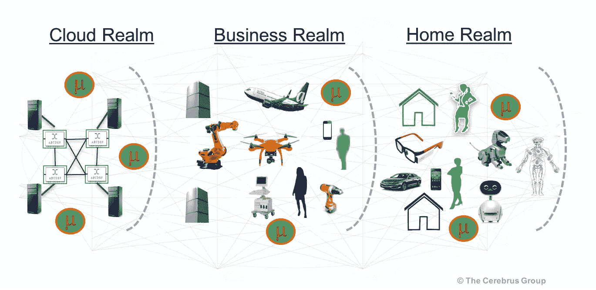
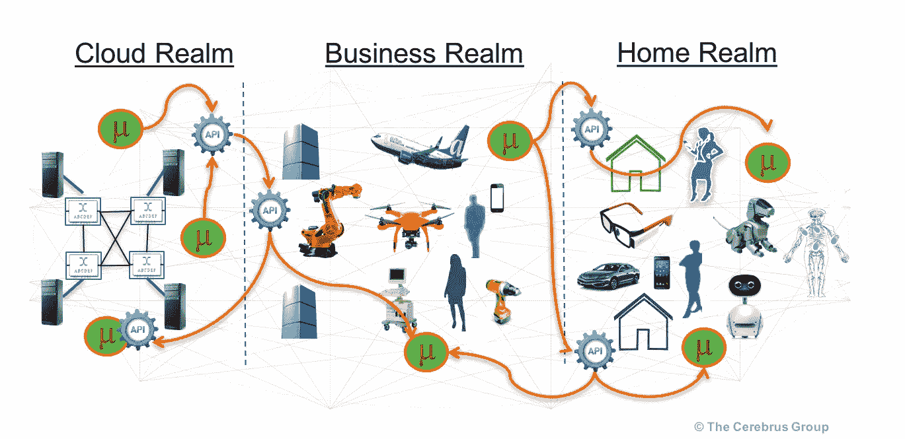

# 编排微服务比统治七大王国还难

> 原文：<https://itnext.io/choreographing-microservices-is-harder-than-ruling-the-seven-kingdoms-2cc34856d880?source=collection_archive---------0----------------------->

发展速度和自主性的承诺是有代价的。

编排微服务比统治七大王国还难

我们被无拘无束地编码的想法所折服。我们可以写出漂亮的代码。每一个都是一个小部件，运行在某个虚拟化计算复合体上的健壮的小容器中，实际上是相互连接的。从里到外都是安全的。

看起来是这样的。

在这里，开发人员是他或她的领域的主人。他们土地的看守人。我是说，他们的数据和地址空间。它们调用外部服务的 API，就好像它们在用消息发送乌鸦一样。他们是微型奴才，在他们的小领域里保存数据并处理它；为他人提供服务。

这是童话般的生活，直到世界在“行动”中崩溃。

哎呀！在《Dev》中一切都很完美。在"行动"中事情变得很糟糕。

为什么？行动中会发生一些事情。这是现实生活。

# 微服务不是独狼！

业务逻辑片段可以单独创建，但是让业务逻辑片段一起工作需要协作。发布、变更管理、审计、集成、调优中的协作……协作不是独狼的专利。

什么！我们有那么多自由，却不能自己做一件事？！

没错。如果你是一个独狼程序员，而我们依赖于你的微服务，我们都会发现自己陷入了困境。

# 代码重用不会产生微服务

独狼扔了毛巾，说:“好吧。那我就只关注代码重用了。”

听起来不错？这就像收养了另一个王国的恶狼，并试图在我们的王国驯服它，在杀死我们自己的信差渡鸦后给它我们所有的食物。

> 你会和另一只恶狼分享你宝贵的数据和地址空间吗？这只狼能接触到另一个王国的数据吗？这难道不违背分布式业务逻辑的自治片段的真正目的吗？

我们回到了分开的数据和地址空间王国。回去好好表现吧。回到协作，以避免运营中的“糟糕”。

不行，重用先生！

我们该怎么办？

# 舞蹈指导在哪里？

进入国王之手。

他或她编排您的逻辑，使用 API 缝合片段，使领域作为一个整体运行。很快，乌鸦飞得到处都是。

像这样:

编排微服务

问题解决了？好吧，国王之手也许是一位配器大师，但他们不是巫师。这个问题不会随着魔杖的晃动而消失。

当运营中出现问题时(我们知道它会发生！)他们是如何诊断问题的。是微服务本身吗？是集装箱吗？是集成结构吗？是虚拟网络连接器(它本身是一个 VNF，虚拟化的网络功能)？

# 我们应该没有服务器吗？

没问题。感觉已经没有国王了。还不如去无服务器，并希望新的 RPC(远程过程调用)修复我们的问题。

是的，一些运营问题是可以避免的，例如资源调配和扩展。不过，你必须设计好你的爪牙。接下来是运行时成本和每条消息的交易成本的小问题，以及锁定的大问题，如果您对能够随时从一个云领域签出并签入到另一个云领域感到偏执的话。

# 这个故事的寓意

其实很多道德。

*   做微服务，但不要独行侠
*   有一个舞蹈指导或成为一个
*   思考运营和故障排除
*   故意选择何时不使用服务器