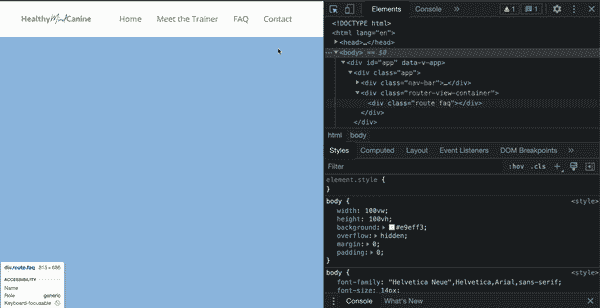
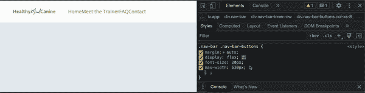

# Chrome 开发工具提示:暴力 CSS

> 原文：<https://itnext.io/chrome-dev-tool-tip-brute-force-css-2a6d2bb05d85?source=collection_archive---------1----------------------->

[附身摄影](https://unsplash.com/@possessedphotography?utm_source=medium&utm_medium=referral)在 [Unsplash](https://unsplash.com?utm_source=medium&utm_medium=referral) 上拍照

有没有发现自己对 css 有点挠头，想知道为什么你的元素没有按照你期望的方式排列？询问类似这样的问题:“是内联式还是内联块式？”，或者“边框还是内容框？”。这里有一个快速找到答案的小技巧，我喜欢称之为强力 CSS。

# 通过 Chrome 开发工具添加 CSS 样式

你可能已经注意到了，但是在 Chrome 开发工具中，你可以给任何网页添加 css 样式。我发现最有效的方法是:

1.  **⌘ + c** 这个快捷方式将切换到元素选择模式，您可以在您的网页上选择一个元素，它将在开发工具元素选项卡中突出显示所选的元素。这个命令也打开开发工具，如果还没有打开的话，所以不需要事先按 F12。
2.  选择一个元素后，您应该在 dev tools 面板中看到该元素的样式。如果没有，您可能需要调整面板的大小。
3.  在“样式”面板中找到要添加 css 规则的 css 选择器，然后在最后一个样式的正下方单击。这将允许您编写新的 css 规则

通过 chrome 开发工具添加 css 的例子

# 暴力 CSS

当你选择了你的元素并且样式面板打开后，你就可以开始强力操作了。

假设您忘记了正确对齐元素所需的 justify-content 值。首先你应该输入 *justify-content，*按 enter 键，你应该看到 Chrome 给出了 justify-content 可以接收的可能值的列表。

然后，只需使用上下箭头键在这些选项之间循环，您应该会看到应用到元素的样式，而不必按 enter 并提交其中一个选项。就这么一直过下去，蛮力的回答。

暴力 css 的例子

# 结论

当我不记得一个 css 属性的名字，或者被一个 css 问题困住，似乎无法在谷歌上找到答案时，我发现这个技巧非常方便。有时，我会循环显示值，看看我的问题是否会得到解决，但值得注意的是，在继续之前，您应该始终尝试理解为什么该显示值会解决您的问题。强力 css 是一种帮助你找到答案的技术。总是试图理解你写的每一点代码，把你遇到的问题作为一个工程师学习和成长的机会。