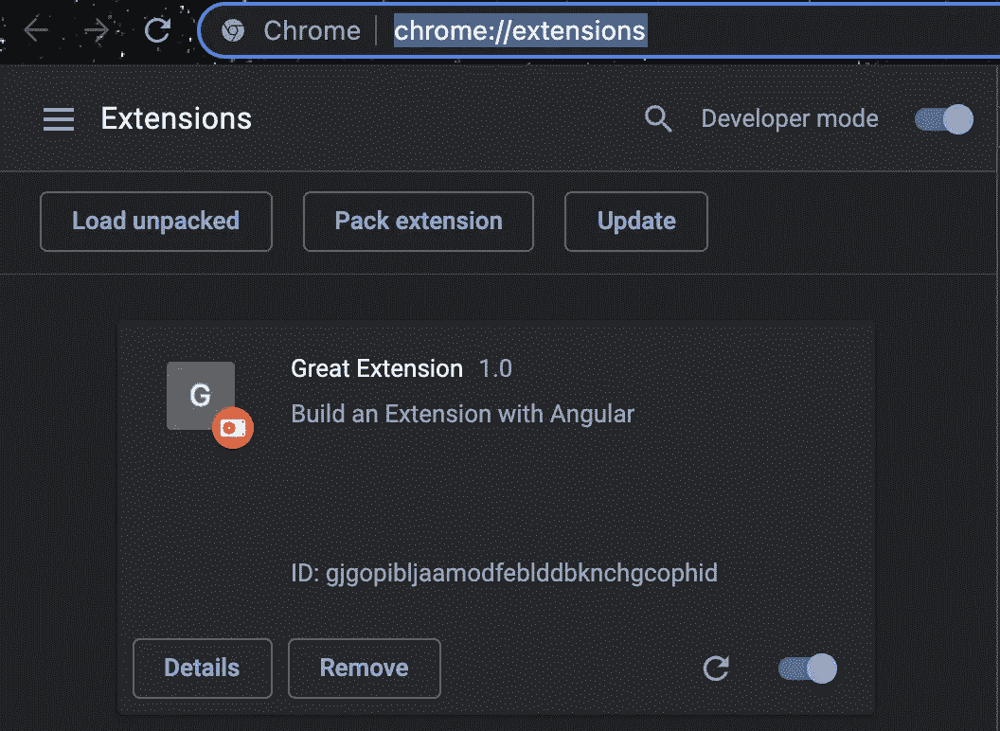
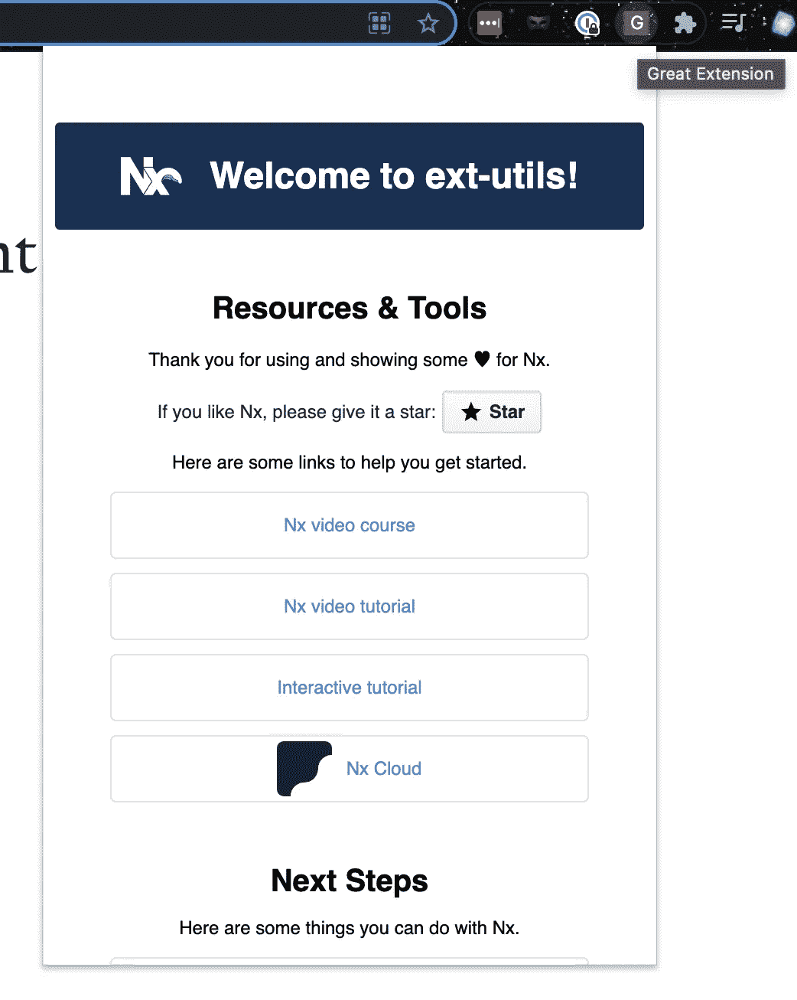

# 使用 Nx Workspace 和 Angular v13 开发 Chrome 扩展—第 1 部分

> 原文：<https://itnext.io/chrome-extension-development-with-nx-workspace-angular-v13-48cf3d2c2a41?source=collection_archive---------0----------------------->


我试图为个人使用创建一个简单的 Chrome 扩展。然后指出这可以使用 HTML、CSS & JavaScript 来完成。

[**第 1 部分:入门**](/chrome-extension-development-with-nx-workspace-angular-v13-48cf3d2c2a41)[**第 2 部分:更改背景颜色**](https://medium.com/@dalenguyen/chrome-extension-development-with-nx-workspace-angular-v13-f9163e545c8f)[**第 3 部分:添加上下文菜单**](https://medium.com/@dalenguyen/chrome-extension-development-with-nx-workspace-angular-v13-part-3-f824c0baf75f)[**第 4 部分:发送 HTTP 请求**](https://medium.com/@dalenguyen/chrome-extension-development-with-nx-workspace-angular-v13-part-4-948fcc51e0f8)
[**第 5 部分:添加内容脚本**](https://dalenguyen.medium.com/chrome-extension-development-with-nx-workspace-angular-v13-part-5-7245829ea87c)

[Github 示例](https://github.com/dalenguyen/dalenguyen.github.io/tree/dev/apps/ext-utils)

如果只使用 HTML、CSS 和 JavaScript 就可以完成，为什么我不能通过使用 Angular & Nx Workspace 将它放在 monorepo 中来使它变得“复杂”呢？🤔

对于个人项目，我希望把所有东西都放在一个地方——就像一些大家伙在 monorepo 中有几百万行代码一样。我猜这也会让我看起来很大🤷‍♂

**创建一个新的工作空间(如果您还没有)**

```
npx create-nx-workspace@latest
```

只要回答他们的问题，你就会有一个准备好的 Angular 项目的工作空间。

**为镀铬延伸件准备必要的部件**

> 扩展是由不同的、但是内聚的组件组成的。组件可以包括[后台脚本](https://developer.chrome.com/docs/extensions/mv3/background_pages/)、[内容脚本](https://developer.chrome.com/docs/extensions/mv3/content_scripts/)、一个[选项页面](https://developer.chrome.com/docs/extensions/mv3/options/)、 [UI 元素](https://developer.chrome.com/docs/extensions/mv3/user_interface/)以及各种逻辑文件。扩展组件是用 web 开发技术创建的:HTML、CSS 和 JavaScript。扩展的组件将取决于它的功能，可能不需要每个选项。

扩展以它们的清单[开始。创建一个名为`manifest.json`的文件，并包含以下代码。](https://developer.chrome.com/docs/extensions/mv3/manifest/)

```
// ...src/manifest.json{
  "name": "Great Extension",
  "version": "1.0",
  "description": "Build an Extension with Angular",
  "manifest_version": 3,
  "action": {
    // this is the popup where click on the extension icon      
    "default_popup": "index.html"
  }
}
```

添加 manifest.json 后，不要忘记将它放在 angular.json 文件中。

```
// ...angular.json"assets": [
   "apps/ext-utils/src/favicon.ico",
   "apps/ext-utils/src/assets",
 **"apps/ext-utils/src/manifest.json"** ],
```

准备好后，你就可以构建你的 Angular 应用了

```
yarn build
```

它将在“dist/apps”文件夹下为生产应用程序创建一个文件夹

**安装镀铬延伸件**

您可以访问“chrome://extensions/”来管理您的扩展。

然后开启开发者模式-> `Load unpacked`以便导入你新编译的 app。请记住导入整个文件夹，而不仅仅是文件。



添加插件后，点击图标，瞧，扩展开始工作了🔥



现在你已经做好了一切准备，可以用 Nx & Angular 开发你的 chrome 扩展了。如果你想知道什么具体的，请放在评论区。我很高兴为它创建另一个帖子。

干杯🍻

[**在 Twitter 上关注我**](https://twitter.com/dale_nguyen) 了解 Angular、JavaScript & WebDevelopment 的最新内容👐