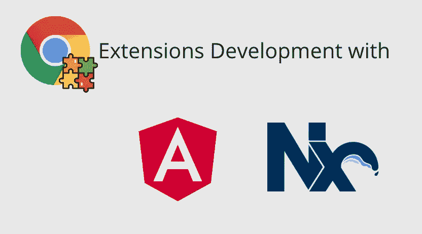
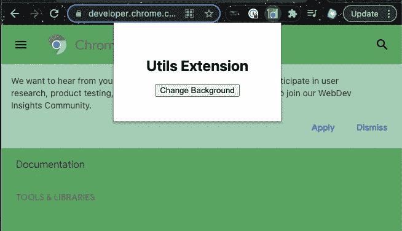
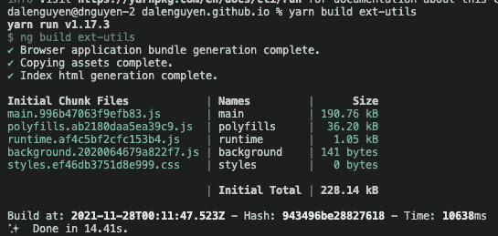
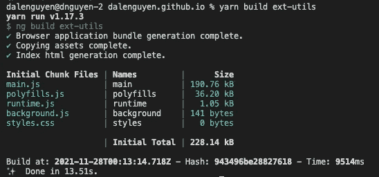
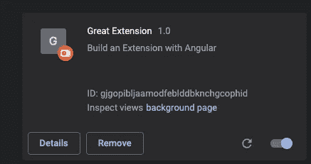
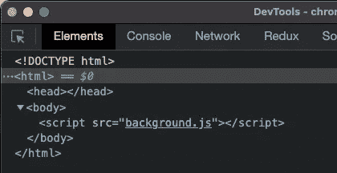

# 使用 Nx Workspace 和 Angular v13 开发 Chrome 扩展—第 2 部分

> 原文：<https://itnext.io/chrome-extension-development-with-nx-workspace-angular-v13-f9163e545c8f?source=collection_archive---------2----------------------->



我试图为个人使用创建一个简单的 Chrome 扩展。然后指出这可以使用 HTML、CSS & JavaScript 来完成。

[**第 1 部分:入门**](/chrome-extension-development-with-nx-workspace-angular-v13-48cf3d2c2a41)[**第 2 部分:更改背景颜色**](https://medium.com/@dalenguyen/chrome-extension-development-with-nx-workspace-angular-v13-f9163e545c8f)[**第 3 部分:添加上下文菜单**](https://medium.com/@dalenguyen/chrome-extension-development-with-nx-workspace-angular-v13-part-3-f824c0baf75f)[**第 4 部分:发送 HTTP 请求**](https://medium.com/@dalenguyen/chrome-extension-development-with-nx-workspace-angular-v13-part-4-948fcc51e0f8)
[**第 5 部分:添加内容脚本**](https://dalenguyen.medium.com/chrome-extension-development-with-nx-workspace-angular-v13-part-5-7245829ea87c)

[Github 示例](https://github.com/dalenguyen/dalenguyen.github.io/tree/dev/apps/ext-utils)

在上一篇文章中，我介绍了用 Nx & Angular 开发 chrome 扩展的基本结构。在这一集里，我将向你展示一些真实的行动。

在[这个例子](https://developer.chrome.com/docs/extensions/mv3/getstarted/)中，我将创建一个按钮，以便用绿色更新站点的背景色。



**安装@types/chrome**

在 Angular 中输入非常有用，因此您将看到对您的实现的建议

```
yarn add -D @types/chrome
```

**创建后台脚本**

> 扩展是基于事件的程序，用于修改或增强 Chrome 浏览体验。事件是浏览器触发器，例如导航到新页面、移除书签或关闭标签。扩展在其后台脚本中监控这些事件，然后根据指定的指令做出反应。

```
// src/background.ts/// <reference types="chrome"/>const color = '#3aa757'chrome.runtime.onInstalled.addListener(() => {
  chrome.storage.sync.set({ color })
  console.log('Default background color set to %cgreen', `color: ${color}`)
})
```

该脚本以一个监听事件`onInstalled`开始，然后为存储设置一个颜色值——记住将**存储**添加到 manifest.json 中的权限中

此时，您的 manifest.json 将如下所示

```
{
  "name": "Great Extension",
  "version": "1.0",
  "description": "Build an Extension with Angular",
  "manifest_version": 3,
  "action": {
    "default_popup": "index.html",
    "default_icon": {
      "16": "assets/images/get_started16.png",
      "32": "assets/images/get_started32.png",
      "48": "assets/images/get_started48.png",
      "128": "assets/images/get_started128.png"
    }
  },
  "icons": {
    "16": "assets/images/get_started16.png",
    "32": "assets/images/get_started32.png",
    "48": "assets/images/get_started48.png",
    "128": "assets/images/get_started128.png"
  },
  "background": {
    "service_worker": "**background.js**"
  },
  "permissions": ["**storage**", "activeTab", "scripting"]
}
```

**在 Angular 项目中准备背景脚本**

由于`background.js`与`main.js`相比是一个独立的脚本，我们需要一个自定义的流程，而不是将脚本直接导入到`main.ts`。它将被编译成卡盘并由`index.html`加载。

在 Angular 中，我们有自定义 webpack 构建器，可以将自定义 webpack 文件添加到构建选项中。

```
yarn add -D @angular-builders/custom-webpack
```

然后在 angular.json 中，您已经从`**@ angular-devkit/build-angular**切换到`**@ angular-builders/custom-webpack**`,并包含了您的自定义 web pack 的路径。

```
// angular.json"architect": {
   "build": {
      "builder": "[**@angular**](http://twitter.com/angular)**-builders/custom-webpack:browser**",
      "outputs": ["{options.outputPath}"],
      "options": {
          ....
          "aot": true,
          **"customWebpackConfig": { "path": "apps/ext-utils/custom-webpack.config.js" }**
},
```

你的自定义网络包包含了`background.ts`的路径

```
// custom-webpack.config.jsmodule.exports = {
  entry: { background: 'apps/ext-utils/src/background.ts' },
  optimization: {
 **runtimeChunk: false,**  },
}
```

不要忘记在 tsconfig.app.json 中包含 background.ts & types

```
// tsconfig.app.json{
  "extends": "./tsconfig.json",
  "compilerOptions": {
    "outDir": "../../dist/out-tsc",
    **"types": ["chrome"]**
  },
  "files": ["src/main.ts", "src/polyfills.ts", **"src/background.ts"**],
  "include": ["src/**/*.d.ts"],
  "exclude": ["**/*.test.ts", "**/*.spec.ts"]
}
```

现在，我们构建扩展，你会看到背景作为一个单独的文件。



为了保持原来的文件名，不要忘记更改`outputHashing`。

```
"configurations": {
  "production": {
       ...
       **"outputHashing": "none"**
   },
},
```



之后，您可以重新加载扩展并检查是否包含了`background.js`。



**添加层逻辑**

扩展现在有一个弹出窗口，我们需要添加一个按钮进行交互。

```
// app.component.html<h1>Utils Extension</h1>
<button (click)="changeBackground()">Change Background</button>
```

将函数添加到组件中。这个函数将从存储器中获取颜色，并更新你所浏览的任何网站的背景。

```
// app.component.tsexport class AppComponent {
  async changeBackground() {
    const [tab] = await chrome.tabs.query({ active: true, currentWindow: true })if (tab.id != null) {
      chrome.scripting.executeScript({
        target: { tabId: tab.id },
        func: () => {
          chrome.storage.sync.get('color', ({ color }) => {
            document.body.style.backgroundColor = color
          })
        },
      })
    }
  }
}
```

不要忘记，清单需要`[activeTab](https://developer.chrome.com/docs/extensions/mv3/manifest/activeTab/)`权限来允许扩展临时访问当前页面，还需要`[scripting](https://developer.chrome.com/docs/extensions/reference/scripting/)`权限来使用脚本 API 的`[executeScript](https://developer.chrome.com/docs/extensions/reference/scripting#method-executeScript)`方法。

就是这样。现在你知道如何通过改变背景来与网站互动。如果你有任何问题或要求，请在评论区提出。

[**在 Twitter 上关注我**](https://twitter.com/dale_nguyen) 了解 Angular、JavaScript & WebDevelopment 的最新内容👐