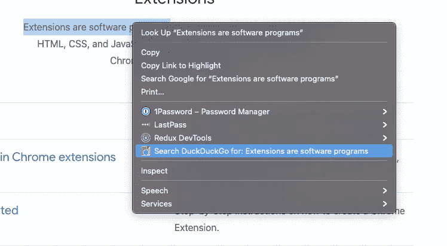

# 使用 Nx Workspace 和 Angular v13 开发 Chrome 扩展—第 3 部分

> 原文：<https://itnext.io/chrome-extension-development-with-nx-workspace-angular-v13-part-3-f824c0baf75f?source=collection_archive---------3----------------------->


我试图为个人使用创建一个简单的 Chrome 扩展。然后指出这可以使用 HTML、CSS & JavaScript 来完成。

[**第一部分:入门**](/chrome-extension-development-with-nx-workspace-angular-v13-48cf3d2c2a41)[**第二部分:更改背景颜色**](https://medium.com/@dalenguyen/chrome-extension-development-with-nx-workspace-angular-v13-f9163e545c8f)[**第三部分:添加上下文菜单**](https://medium.com/@dalenguyen/chrome-extension-development-with-nx-workspace-angular-v13-part-3-f824c0baf75f)[**第四部分:发送 HTTP 请求**](https://medium.com/@dalenguyen/chrome-extension-development-with-nx-workspace-angular-v13-part-4-948fcc51e0f8)[**第五部分:添加内容脚本**](https://dalenguyen.medium.com/chrome-extension-development-with-nx-workspace-angular-v13-part-5-7245829ea87c)

[Github 示例](https://github.com/dalenguyen/dalenguyen.github.io/tree/dev/apps/ext-utils)

> 使用`chrome.contextMenus` API 向 Google Chrome 的上下文菜单添加项目。您可以选择上下文菜单附加内容适用于哪些类型的对象，如图像、超链接和页面。

在本文中，我将向您展示如何创建搜索功能。当您在网站上选择一个单词或短语时，您可以右键单击并在 DuckDuckGo 中搜索这些单词。



请确保您遵循前面的部分，以便为 chrome 扩展开发设置 Angular & Nx。

**第一步:为上下文菜单添加权限**

```
// manifest.json"permissions": ["storage", "activeTab", "scripting", "**contextMenus**"]
```

您可以为 contextMenus 指定图标，即 icons 对象下的 16x16 像素图标。

**步骤 2:创建新的上下文菜单**

您可以通过更新`background.ts`文件来创建新的上下文菜单。

```
// background.tschrome.runtime.onInstalled.addListener(() => {
  // create new menu
  chrome.contextMenus.create({
    id: 'searchForWord',
    title: 'Search DuckDuckGo for: %s',
    contexts: ['selection'],
  })
})// function that handles selection search
const searchForWord = (info: chrome.contextMenus.OnClickData, tab: chrome.tabs.Tab | undefined) => { // create a new tab with selection text for searching 
 chrome.tabs.create({
    url: '[https://duckduckgo.com/?q='](https://duckduckgo.com/?q=') + info.selectionText,
  })
}// event handling for menu
chrome.contextMenus.onClicked.addListener(searchForWord)
```

创建一个新的上下文菜单非常简单。之后，您只需要重新构建并重新加载扩展。

[**在 Twitter 上关注我**](https://twitter.com/dale_nguyen) 了解 Angular、JavaScript & WebDevelopment 的最新内容👐