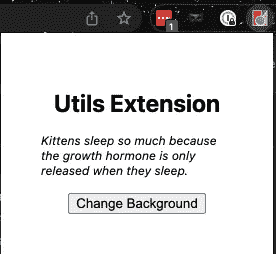

# 使用 Nx Workspace 和 Angular v13 开发 Chrome 扩展—第 4 部分

> 原文：<https://itnext.io/chrome-extension-development-with-nx-workspace-angular-v13-part-4-948fcc51e0f8?source=collection_archive---------3----------------------->


我试图为个人使用创建一个简单的 Chrome 扩展。然后指出这可以使用 HTML、CSS & JavaScript 来完成。

[**第 1 部分:入门**](/chrome-extension-development-with-nx-workspace-angular-v13-48cf3d2c2a41)[**第 2 部分:更改背景颜色**](https://medium.com/@dalenguyen/chrome-extension-development-with-nx-workspace-angular-v13-f9163e545c8f)[**第 3 部分:添加上下文菜单**](https://medium.com/@dalenguyen/chrome-extension-development-with-nx-workspace-angular-v13-part-3-f824c0baf75f)[**第 4 部分:发送 HTTP 请求**](https://medium.com/@dalenguyen/chrome-extension-development-with-nx-workspace-angular-v13-part-4-948fcc51e0f8)
[**第 5 部分:添加内容脚本**](https://dalenguyen.medium.com/chrome-extension-development-with-nx-workspace-angular-v13-part-5-7245829ea87c)

[Github 示例](https://github.com/dalenguyen/dalenguyen.github.io/tree/dev/apps/ext-utils)

在本文中，我将向您展示如何从 chrome 扩展发送 HTTP 请求。具体来说，每次打开扩展弹出窗口，都会显示来自[每日猫事实](https://alexwohlbruck.github.io/cat-facts/docs/endpoints/facts.html)的随机猫事实。



说实话，过程和正常的角度应用没什么区别。

**第一步:将 HttpClientModule 导入 app.module.ts**

```
**import { HttpClientModule } from '@angular/common/http'**[@NgModule](http://twitter.com/NgModule)({
  declarations: [AppComponent],
  imports: [BrowserModule, **HttpClientModule**,...],
  providers: [],
  bootstrap: [AppComponent],
})
export class AppModule {}
```

**步骤 2:从组件**发送 HTTP 请求

```
import { HttpClient } from '[@angular/common](http://twitter.com/angular/common)/http'
import { Component } from '[@angular/core](http://twitter.com/angular/core)'
import { Observable } from 'rxjs'// create interface for Cat Fact in order to use it in the template
interface CatFact {
  status: { verified: null; sentCount: number }
  _id: string
  type: 'cat'
  deleted: false
  user: string
  text: string
  createdAt: string
  updatedAt: string
  __v: number
}...
export class AppComponent { // get a random fact as Observable
  // not a best pratice to put the request here FYI randomFact$ = this.http.get('[https://cat-fact.herokuapp.com/facts/random'](https://cat-fact.herokuapp.com/facts/random')) as Observable<CatFact> constructor(private http: HttpClient) {} ...
}
```

**第三步:在模板中显示随机猫事实**

```
// app.component.html// use async pipe, so the template will handle the subscribe & unsubsribe process
<em>{{ (randomFact$ | async)?.text }}</em>
```

这就是开发 chrome 扩展时发送 HTTP 请求所需的一切。

***注意*** *:如果你遇到 CORS 问题，很可能是服务器问题——而不是客户端问题。*

[**在 Twitter 上关注我**](https://twitter.com/dale_nguyen) 了解 Angular、JavaScript & WebDevelopment 的最新内容👐