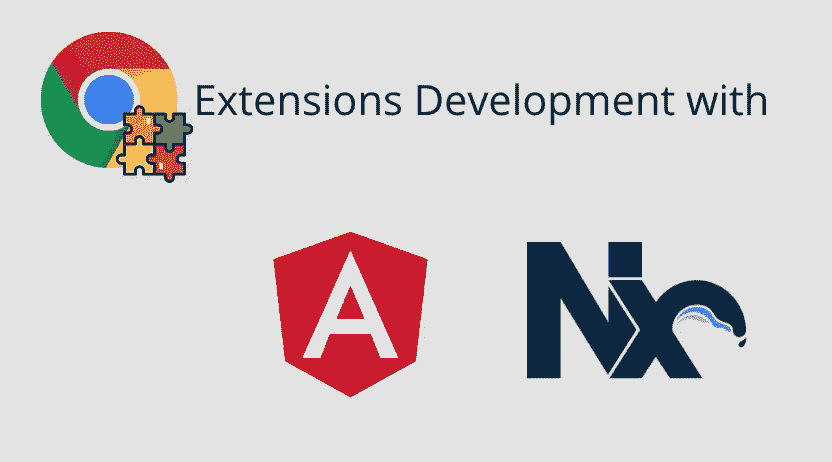
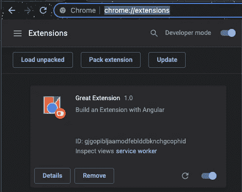
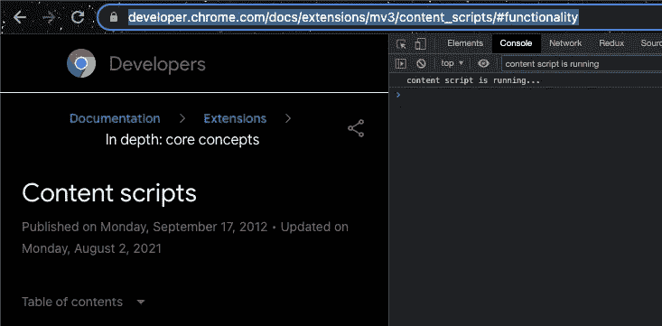

# 使用 Nx Workspace 和 Angular v13 开发 Chrome 扩展—第 5 部分

> 原文：<https://itnext.io/chrome-extension-development-with-nx-workspace-angular-v13-part-5-7245829ea87c?source=collection_archive---------2----------------------->



我试图为个人使用创建一个简单的 Chrome 扩展。然后指出这可以使用 HTML、CSS & JavaScript 来完成。

[**第 1 部分:入门**](/chrome-extension-development-with-nx-workspace-angular-v13-48cf3d2c2a41)[**第 2 部分:更改背景颜色**](https://medium.com/@dalenguyen/chrome-extension-development-with-nx-workspace-angular-v13-f9163e545c8f)[**第 3 部分:添加上下文菜单**](https://medium.com/@dalenguyen/chrome-extension-development-with-nx-workspace-angular-v13-part-3-f824c0baf75f)[**第 4 部分:发送 HTTP 请求**](https://medium.com/@dalenguyen/chrome-extension-development-with-nx-workspace-angular-v13-part-4-948fcc51e0f8)[**第 5 部分:添加内容脚本**](https://dalenguyen.medium.com/chrome-extension-development-with-nx-workspace-angular-v13-part-5-7245829ea87c)

[Github 示例](https://github.com/dalenguyen/dalenguyen.github.io/tree/dev/apps/ext-utils)

在本文中，我将展示如何添加 [**内容脚本**](https://developer.chrome.com/docs/extensions/mv3/content_scripts/) 。

> 内容脚本是在网页环境中运行的文件。通过使用标准的[文档对象模型](https://www.w3.org/TR/DOM-Level-2-HTML/) (DOM)，它们能够读取浏览器访问的网页的细节，对它们进行修改，并将信息传递给它们的父扩展。

简单地说，这是一个脚本，我们可以嵌入和操纵任何网站的内容。例如，我可以添加一个内容脚本，将站点的样式更改为黑暗模式。

**添加内容脚本文件**

在`src`文件夹下创建一个文件名`content-script.ts`

```
// src/content-script.tsconsole.log('content script is running...')// Turn on dark mode
// This is a simple example. It may not work in all cases
document.body.style.background = '#000'
document.body.style.color = '#fff'
```

**向所有网站添加内容脚本**

该文件必须在`manifest.json`中声明。脚本可以静态地声明[或者编程地注入](https://developer.chrome.com/docs/extensions/mv3/content_scripts/#functionality)。在这个例子中，我将静态地将它添加到所有站点。

```
// manifest.json"content_scripts": [
    {
      "matches": ["<all_urls>"], // matches all URLs
     ** "js": ["content-script.js"],**
      "all_frames": true
    }
 ]
```

**更新 Webpack 配置**

为了让扩展识别新脚本，您需要在 ts config . app . JSON & custom-web pack . config . js 中声明它

```
// custom-webpack.config.jsbackground: 'apps/ext-utils/src/background.ts',
'content-script': 'apps/ext-utils/src/content-script.ts',
```

将内容脚本添加到 TSConfig

```
// tsconfig.app.json"files": [
  "src/main.ts", 
  "src/polyfills.ts", 
  "src/background.ts", 
 **"src/content-script.ts"** ],
```

**构建&刷新扩展**

每次更新扩展时，您都需要构建它并刷新扩展才能看到变化。



刷新扩展

之后，你可以从`content-script.ts`看到控制台日志，网站的背景颜色变成了黑色。



[**在 Twitter 上关注我**](https://twitter.com/dale_nguyen) 了解 Angular、JavaScript & WebDevelopment 的最新内容👐