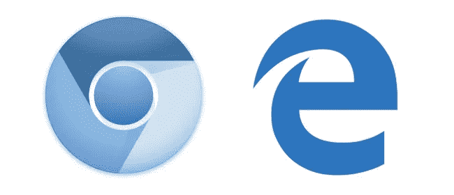
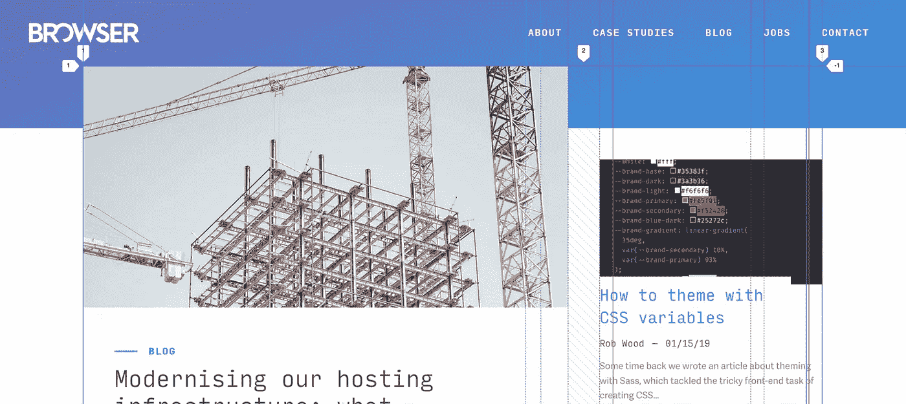

# 铬正在侵蚀开放网络，我们有责任阻止它

> 原文：<https://itnext.io/chromium-is-eroding-the-open-web-and-its-our-responsibility-to-stop-it-b577e121a4a9?source=collection_archive---------3----------------------->

去年年底，[微软宣布](https://www.theverge.com/2018/12/6/18128648/microsoft-edge-chrome-chromium-browser-changes)他们将重建他们的 Edge 浏览器，在谷歌的 Chromium 渲染引擎上运行——他们称此举将“为许多不同的受众提供更好的网络体验”。

虽然这是出于好意，但作为 web 开发人员和技术行业的人，我们需要认识到单一渲染引擎上的融合可能带来的潜在负面影响，以及我们可以做些什么来避免这种影响。

# 为什么开放网络受到威胁

开放网络的指导原则之一是，没有任何一个实体可以垄断我们如何体验网络——标准的实施和采用应该是一系列企业力量和其他组织如 [W3C](https://www.w3.org/) 合作的结果。

这种合作的结果，以及用户对浏览器的选择(以及他们使用的渲染引擎的选择)，对这种体验有着非常实际的影响。它决定了我们在消费内容时有多安全，并最终决定了我们给公司多少控制权来决定我们看到什么。

Edge 转向 Chromium 意味着权力的天平进一步向一方倾斜，这一方可以越来越多地成为哪些想法应该被开发、哪些标准应该被接受以及哪些可用性问题最重要的仲裁者。W3C 会议的席位不应该被基于 Chromium 的平台占据 70%,谷歌也不应该对开源项目拥有否决权。

这种垄断阻碍了创新，由此产生的自满也带来了后果。虽然开发者可以少担心一个渲染引擎，但我们和我们的用户仍然在为大约 15 年前 Internet Explorer 的市场主导地位付出代价。

# 我们能做什么？

现实情况是，在科技行业之外，这个问题可能仍不为人所知。像我们这样的[网站开发者](https://www.browserlondon.com/services/design-development/)应该尽我们所能来促进非 Chromium 浏览器的健康发展。

这意味着[在 Firefox 等浏览器中彻底测试我们制作的](https://www.browserlondon.com/blog/2016/04/30/real-people-real-feedback-user-testing-digital-products/)以确保用户没有理由放弃它们。也许我们可以有意识地在朋友、同事之间以及向客户演示项目时使用它们。我最近因为写了包含 Chrome 开发工具截图的[文章而感到内疚——也许，在未来，我可以在 Firefox 中使用它们(顺便说一下，Mozilla 开发工具非常棒)。](https://www.browserlondon.com/blog/2019/01/15/css-variables-theming/)

*Firefox 允许你在页面上覆盖网格线，使得调试 CSS 网格变得容易*

我们还可以为浏览器多样性找到更广泛相关的论据。人们越来越怀疑像谷歌这样的互联网巨头，他们已经掌握了比我们大多数人想要的更多的个人信息。诸如此类的关注有助于为维护浏览器多元化的好处创造一个易于接受的受众群体。

无论我们选择什么方法，我们都有责任尽力而为。我们(理所当然地)关心我们社区和工作场所的多样性——网络值得同样多的思考。

## 关于浏览器

我们为更好、更高效的工作场所创建企业网络应用。我们已经帮助壳牌、英国航空公司和英国政府等客户提高效率，简化业务。访问我们的 [Browser London](http://www.browserlondon.com) 。

*原载于 2019 年 2 月 11 日*[*www.browserlondon.com*](https://www.browserlondon.com/blog/2019/02/11/chromium-eroding-open-web/)*。*