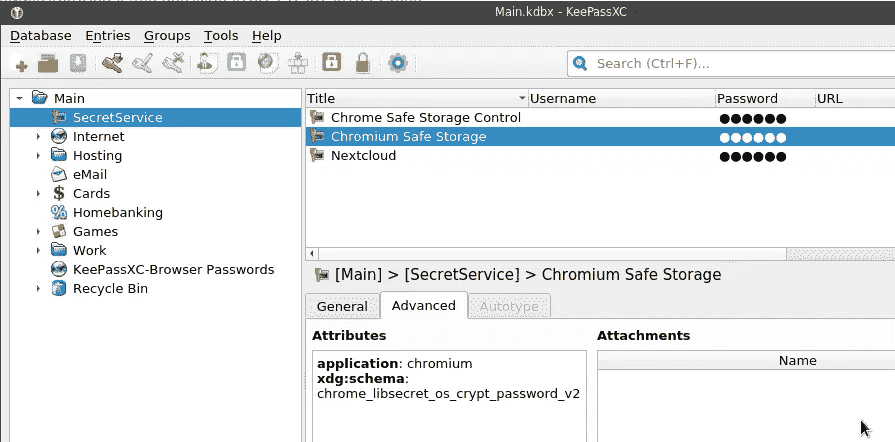

# 铬:Linux，钥匙圈和秘密服务，密码加密和存储

> 原文：<https://itnext.io/chromium-linux-keyrings-secret-service-passwords-encryption-and-store-d2b30d87ec08?source=collection_archive---------5----------------------->


深入研究密匙环(参见[什么是:Linux 密匙环、gnome-密匙环、秘密服务和 D-Bus post](https://rtfm.co.ua/en/what-is-linux-keyring-gnome-keyring-secret-service-and-d-bus/) )的动机之一是，如果 Linux 系统没有启用密匙环和/或秘密服务，Chromium 会保持密码不加密。

所以，让我们试着找出 Chromium 如何存储密码，在哪里存储密码，以及主要的问题——它们是加密存储的，还是不加密？

*   [铬和钥匙圈](https://rtfm.co.ua/en/chromium-linux-keyrings-secret-service-passwords-encryption-and-store/#Chromium_and_keyring)
*   [没有钥匙圈的铬](https://rtfm.co.ua/en/chromium-linux-keyrings-secret-service-passwords-encryption-and-store/#Chromium_without_a_keyring)
*   [带钥匙圈的铬](https://rtfm.co.ua/en/chromium-linux-keyrings-secret-service-passwords-encryption-and-store/#Chromium_with_a_keyring)
*   [铬密码解密](https://rtfm.co.ua/en/chromium-linux-keyrings-secret-service-passwords-encryption-and-store/#Chromium_passwords_decrypt)
*   [铬 v10 vs v11](https://rtfm.co.ua/en/chromium-linux-keyrings-secret-service-passwords-encryption-and-store/#Chrome_v10_vs_v11)
*   [Python 脚本获取 Chromium 的密码](https://rtfm.co.ua/en/chromium-linux-keyrings-secret-service-passwords-encryption-and-store/#Python_script_to_obtain_Chromiums_passwords)
*   [铬& &特勤](https://rtfm.co.ua/en/chromium-linux-keyrings-secret-service-passwords-encryption-and-store/#Chromium_Secret_Service)
*   [总结](https://rtfm.co.ua/en/chromium-linux-keyrings-secret-service-passwords-encryption-and-store/#Summary)

## 铬和钥匙圈

[文档](https://chromium.googlesource.com/chromium/src/+/master/docs/security/faq.md#Does-the-Password-Manager-store-my-passwords-encrypted-on-disk)指出:

> 在 Linux 上，Chrome 以前将凭证直接存储在用户的 Gnome Keyring 或 KWallet 中，但由于技术原因，它已经将凭证存储在 Chrome 用户配置文件目录的“登录数据”中，但在磁盘上用一个密钥加密，然后存储在用户的 Gnome Keyring 或 KWallet 中。如果没有可用的 Keyring 或 KWallet，数据在存储时不会加密。

即:

1.  Chromium 将密码存储在一个名为“登录数据”(`'/home/setevoy/.config/chromium/Default/Login Data'`)的本地 SQLite 数据库中
2.  如果安装了`gnome-keyring`或 KWallet，那么 Chromium 将使用一个生成的密码对其数据库中的密码进行加密，该密码将存储在这样一个密钥环中
3.  在其他情况下，如果特勤局根本不活动，密码将保持“原样”，纯文本

嗯——让我们检查一下。

## 没有钥匙圈的铬

首先，当系统没有配置密匙环时，让我们尝试从 SQLite 获取密码。

要指定使用哪个后端，我们可以添加`google-chrome --password-store=basic`选项，将密码存储为“纯文本”。

此外，检查其他参数— *gnome* 或 *kwallet，*参见`man chromium`:

```
--password-store=<basic|gnome|kwallet>
Set the password store to use. The default is to automatically
detect based on the desktop environment. basic selects the
built in, unencrypted password store. gnome selects Gnome
keyring. kwallet selects (KDE) KWallet. (Note that KWallet may
not work reliably outside KDE.)
```

除此之外，让我们检查 D-Bus 服务，以确保我们没有启用秘密服务:

```
$ qdbus — session org.freedesktop.DBus / org.freedesktop.DBus.GetConnectionUnixProcessID org.freedesktop.secrets
Error: org.freedesktop.DBus.Error.NameHasNoOwner
Could not get PID of name ‘org.freedesktop.secrets’: no such name
```

好吧。

现在，为 Chromium 的数据创建一个新目录:

```
$ mkdir /tmp/data-chrome-test-1
```

运行浏览器，将此目录作为主目录，并使用— password-store=basic 选项来保持密码“不加密”:

```
$ chromium — user-data-dir=/tmp/data-chrome-test-1 — password-store=basic
```

现在，登录到某个网站，关闭浏览器，并检查其数据库:

```
$ sqlite3 /tmp/data-chrome-test-1/Default/Login\ Data ‘select username_value, password_value from logins;’
testuser|v10�#�c�yF�b�f���
```

酷 SQLite 数据库的`password_value`字段现在存储了一些密码。

顺便说一下，您可以使用`.schema`命令获得表格的方案:

```
$ sqlite3 ~/.config/chromium/Default/Login\ Data ‘.schema logins’
CREATE TABLE IF NOT EXISTS “logins” (origin_url VARCHAR NOT NULL, action_url VARCHAR, \
username_element VARCHAR, username_value VARCHAR, password_element VARCHAR, password_value BLOB \
…));
CREATE INDEX logins_signon ON logins (signon_realm);
```

## 带钥匙圈的铬合金

现在，让我们进一步尝试在启用密匙环时从 Chromium 的 SQLite 数据库获取密码。为此，[在 KeePass](https://rtfm.co.ua/en/what-is-linux-keyring-gnome-keyring-secret-service-and-d-bus/#KeePass) 中启用特勤支持，我们将使用 KeePass 代替“standard”`gnome-keyring`，并为 Chromium 的数据创建一个新目录:

```
$ mkdir /tmp/data-chrome-test-2
```

再次运行浏览器，但这次指定`--password-store=gnome`，并将`user-data-dir`更改为使用一个新的、清晰的 SQLite 数据库:

```
$ chromium — user-data-dir=/tmp/data-chrome-test-2 — password-store=gnome
```

再次登录某个地方，保存密码，检查数据库:

```
$ sqlite3 /tmp/data-chrome-test-2/Default/Login\ Data ‘select username_value, password_value from logins;’
testuser|v11���H!@���2�jA�
```

啊哈！

首先，这里的前缀是 *v11* ，而不是 *v10* ，因为它是来自“未加密”数据库的密码，其次，字符串本身更长。

所以，密码以不同的方式存储。但是——他们的加密技术如何？

## 铬密码解密

让我们试着弄清楚以下问题:

1.  首先，我们从“未加密”存储中获取密码，而不是明文形式，为什么会这样呢？
2.  第二，我们如何从“加密”存储中获取可读的密码？

为了看到这一点，让我们来看看 Chromium 的[源代码](https://cs.chromium.org/chromium/src/components/os_crypt/)。

## Chrome v10 与 v11

首先，v10 和 v11 前缀是什么？

转到`os_crypt_linux.cc`文件内容-[https://cs . chromium . org/chromium/src/components/OS _ crypt/OS _ crypt _ Linux . cc？l=38](https://cs.chromium.org/chromium/src/components/os_crypt/os_crypt_linux.cc?l=38) :

```
...
// Password version. V10 means that the hardcoded password will be used.
// V11 means that a password is/will be stored using an OS-level library (e.g
// Libsecret). V11 will not be used if such a library is not available.
// Used for array indexing.
enum Version {
  V10 = 0,
  V11 = 1,
};
...
```

啊哈，所以 *v10* 是未加密密码的前缀，而 *v11* —是加密的。

虽然在这两种情况下，我们得到的密码是一些奇怪的符号串，而不是一个明确的密码。

现在明白为什么了。

从文件的结尾开始，从`DecryptString()`功能开始:

1.  `DecryptString()`:在`version`变量( *v10* или *v11* 中存储一个版本；

```
… if (base::StartsWith(ciphertext, kObfuscationPrefix[Version::V10], base::CompareCase::SENSITIVE)) { version = Version::V10; …
```

1.  [https://cs . chromium . org/chromium/src/components/OS _ crypt/OS _ crypt _ Linux . cc？l=197](https://cs.chromium.org/chromium/src/components/os_crypt/os_crypt_linux.cc?l=197)
2.  `DecryptString()`试图通过调用`GetEncryptionKey()`函数传递版本来获取加密密钥

```
… std::unique_ptr<crypto::SymmetricKey> encryption_key( GetEncryptionKey(version)); if (!encryption_key) { VLOG(1) << “Decryption failed: could not get the key”; return false; } …
```

1.  [https://cs . chromium . org/chromium/src/components/OS _ crypt/OS _ crypt _ Linux . cc？gsn = GetEncryptionKey&l = 211](https://cs.chromium.org/chromium/src/components/os_crypt/os_crypt_linux.cc?gsn=GetEncryptionKey&l=211)
2.  `GetEncryptionKey()`依次调用`g_get_password()`函数:

```
… std::string* password = g_get_password[version](); if (!password) return nullptr; …
```

1.  [https://cs . chromium . org/chromium/src/components/OS _ crypt/OS _ crypt _ Linux . cc？gsn = GetEncryptionKey&l = 119](https://cs.chromium.org/chromium/src/components/os_crypt/os_crypt_linux.cc?gsn=GetEncryptionKey&l=119)
2.  а `g_get_password()`是指向`GetPasswordV10()`和`GetPasswordV11()`功能的指针:

```
… std::string* (*g_get_password[])() = { &GetPasswordV10, &GetPasswordV11, }; …
```

1.  [https://cs . chromium . org/chromium/src/components/OS _ crypt/OS _ crypt _ Linux . cc？l=109](https://cs.chromium.org/chromium/src/components/os_crypt/os_crypt_linux.cc?l=109)
2.  还有里面的`GetPasswordV10()`...我们看到了...什么？？？密码？！？

```
… if (!g_cache.Get().password_v10_cache.get()) { g_cache.Get().password_v10_cache.reset(new std::string(“peanuts”)); } …
```

1.  [https://cs . chromium . org/chromium/src/components/OS _ crypt/OS _ crypt _ Linux . cc？l=86](https://cs.chromium.org/chromium/src/components/os_crypt/os_crypt_linux.cc?l=86)

所以，这就简单多了:

1.  如果存在一个密匙环服务，那么 Chromium 将会生成一个密码，并将它存储在这个密匙环中
2.  如果没有钥匙圈和/或没有启用秘密服务，那么 Chromium 将使用硬编码的主密码“*花生*

并且以后使用这个密码—将构造一个主密钥，用于加密 SQLite 数据库中的密码。

## Python 脚本获取 Chromium 的密码

现在，让我们在实践中检查所有这些，看看它是否如我们在上面的代码中建议的那样工作。

此外，我们可以看到这里使用了 AES 128 位 CBC 加密:

```
...
// Key size required for 128 bit AES.
const size_t kDerivedKeySizeInBits = 128;
...
```

接下来，在`GetEncryptionKey()`中，我们可以看到加密密钥是如何构造的:

```
...
  // Create an encryption key from our password and salt.
  std::unique_ptr<crypto::SymmetricKey> encryption_key(
      crypto::SymmetricKey::DeriveKeyFromPasswordUsingPbkdf2(
          crypto::SymmetricKey::AES, *password, salt, kEncryptionIterations,
          kDerivedKeySizeInBits));
  DCHECK(encryption_key);

  return encryption_key;
...
```

因此，要从数据库中解密一条记录，我们需要在下面的数据中，这是在文件的 const 变量中设置的:

1.  主密码—将返回给`GetPasswordV10()`或`GetPasswordV11()`
2.  盐— `const char kSalt[] = "saltysalt"`
3.  迭代— `const size_t kEncryptionIterations = 1`
4.  钥匙的尺寸— `const size_t kDerivedKeySizeInBits = 128`

为了解密密码——谷歌了这样一个简单的脚本[这里> > >](https://stackoverflow.com/a/23727331/2720802) ，在为自己使用进行了一点更新之后，我得到了下面的代码:

```
#! /usr/bin/env python3                                                                                                                                                                                                                       

import sqlite3

from Crypto.Cipher import AES
from Crypto.Protocol.KDF import PBKDF2

def get_encrypted_data(db_path):

    # choose a database
    conn = sqlite3.connect(db_path)
    cursor = conn.cursor()
    # connect and egt exncypted data
    data = cursor.execute('SELECT action_url, username_value, password_value FROM logins')

    return data

# to get rid of padding
def clean(x): 
    return x[:-x[-1]].decode('utf8')

def get_decrypted_data(encrypted_password):

    print("Decrypting the string: {}".format(encrypted_password))

    # trim off the 'v10' that Chrome/ium prepends
    encrypted_password = encrypted_password[3:]

    # making the key
    salt = b'saltysalt'
    iv = b' ' * 16
    length = 16
    iterations = 1
    pb_pass = "peanuts".encode('utf8')

    key = PBKDF2(pb_pass, salt, length, iterations)
    cipher = AES.new(key, AES.MODE_CBC, IV=iv)

    decrypted = cipher.decrypt(encrypted_password)
    print(clean(decrypted))

if __name__ == "__main__":

    db_path = '/tmp/data-chrome-test-1/Default/Login Data'
    for url, user, encrypted_password in get_encrypted_data(db_path):
        get_decrypted_data(encrypted_password)
```

运行它:

```
./get_chrome_pass.py
Decrypting the string: b’v10\xd4#\xd6c\xabyF\xc6b\xdef\x06\xce\x14\xe3\xc5'
test911911
```

太好了——我们从未加密的数据库中获得了密码。

## 铬&特勤局

现在，在 KeePass 中启用秘密存储支持(参见[什么是:Linux keyring，gnome-keyring，Secret Service，и D-Bus](https://rtfm.co.ua/what-is-linux-keyring-gnome-keyring-secret-service-i-d-bus/#KeePass) )来模拟一个已安装的`gnome-keepass`并重启 KeePass。

为 Chromium 的数据添加一个新目录:

```
$ mkdir /tmp/data-chrome-test-2/
```

使用*data-chrome-test-2*data-directory 运行 chrome 并指定`--password-store=gnome`选项:

```
$ chromium — user-data-dir=/tmp/data-chrome-test-2/ — password-store=gnome
```

在某处登录，再次保存密码，现在我们可以观察到 Chromium 在 KeePass 数据库中创建了两个新记录:

1.  *铬安全储存控制*
2.  *铬的安全储存*

请检查它们的属性，了解有关每个属性的更多信息:



此外，您可以检查 D-Bus 和特勤局，看看现在使用的是哪个集合:

```
$ secret-tool search Title ‘Chromium Safe Storage’
[/org/freedesktop/secrets/collection/Main/f0fdc4706ef44958b716e28c13d66bed]
label = Chromium Safe Storage
secret = P5pUwxbWaIBBVU0+LATOcw==
…
schema = chrome_libsecret_os_crypt_password_v2
…
attribute.Title = Chromium Safe Storage
…
attribute.application = chromium
…
attribute.Path = /Chromium Safe Storage
```

现在，让我们尝试使用来自 *Chromium 安全存储*条目的 *secret* 属性的密码作为脚本中`pb_pass`变量的值。

从 Chromium 中退出以解锁数据库，否则，您会看到以下错误:

```
$ ./get_chrome_pass.py
Traceback (most recent call last):
File “./get_chrome_pass.py”, line 50, in <module>
for url, user, encrypted_password in get_encrypted_data(db_path):
File “./get_chrome_pass.py”, line 15, in get_encrypted_data
data = cursor.execute(‘SELECT action_url, username_value, password_value FROM logins’)
sqlite3.OperationalError: database is locked
```

更新脚本—数据库的路径:

```
...
if __name__ == "__main__":

#   db_path = '/tmp/data-chrome-test-1/Default/Login Data'
    db_path = '/tmp/data-chrome-test-2/Default/Login Data'

    for url, user, encrypted_password in get_encrypted_data(db_path):
        get_decrypted_data(encrypted_password)
```

并且密码-代替`pb_pass`中的“*花生*”，设置从 KeePass 的*铬安全存储*条目中获取的值:

```
...
#    pb_pass = "peanuts".encode('utf8')                                                                                                                                                                                                       
    pb_pass = "P5pUwxbWaIBBVU0+LATOcw==".encode('utf8')
...
```

试试看:

```
$ ./get_chrome_pass.py
Decrypting the string: b’v11\xfc\x82\xf7H\n!@\x86\xb7\x982\xa8\x1fjA\xfd’
test911911
```

酷！我们得到了解密的密码。

## 摘要

实际上，我试图弄清楚的主要事情是:Chromium 的 SQLite 数据库中的密码总是以加密的方式存储，而不仅仅是明文。

只是对于没有密匙环服务的系统，比如启用了秘密服务的`gnome-keyring`,用于加密的密码将是 Chromium 的同一个用户，这显然不能被认为是一种安全的方法。

*最初发布于* [*RTFM: Linux、DevOps 和系统管理*](https://rtfm.co.ua/en/chromium-linux-keyrings-secret-service-passwords-encryption-and-store/) *。*