# CI/CD 作为代码。NET 核心应用程序和 Kubernetes 使用 Azure DevOps +YAML。

> 原文：<https://itnext.io/ci-cd-as-a-code-for-net-core-application-and-kubernetes-using-azure-devops-yaml-26b3adeb8ace?source=collection_archive---------1----------------------->

为建立 CI/CD 流程。NET 核心应用程序可能会很复杂，尤其是当你处理 Kubernetes 和 Docker 时，如果你需要包含代码风格分析、单元测试和代码覆盖报告。

在这篇文章中，我将解释为现有的构建简单的 CI/CD 管道的过程。net 核心应用程序，使用 Azure DevOps 将其迁移到 Azure Kubernetes 服务。最终的管道将易于理解和重用。

## 部署架构

部署过程包括以下步骤:从 Git 库获取代码，构建应用程序，恢复 NuGet 包，运行单元测试，构建单元测试和代码覆盖报告，将 docker 镜像推送到注册表，部署到 AKS 集群。

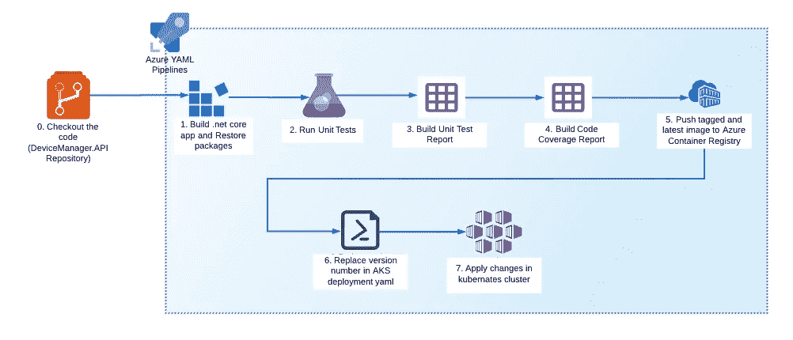

## Azure Kubernetes 群集设置

我使用了简单的 AKS 集群，具有包含 [Ingress-nginx](https://github.com/kubernetes/ingress-nginx) 负载平衡器的 3 节点架构。还可以使用 [Traefik.io](https://docs.traefik.io/v1.7/user-guide/kubernetes/) 、 [istio.io](https://istio.io/docs/concepts/traffic-management/) 甚至[标准 Azure 负载均衡器](https://docs.microsoft.com/en-us/azure/aks/load-balancer-standard)。

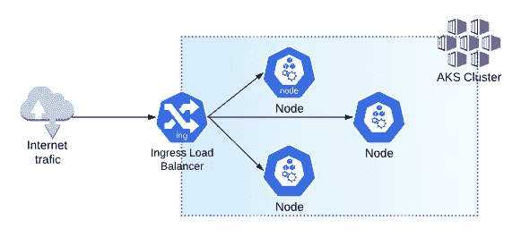

如何设置 AKS 集群的详细说明，包括入口设置和[部署脚本](https://github.com/Boriszn/DeviceManager.Api/tree/develop/aks-deployment)可在[这里](https://github.com/Boriszn/DeviceManager.Api/tree/develop#kubernates-minikube-cluster-setup)找到。

在部署 AKS 之后，主要的资源组将如下图所示。

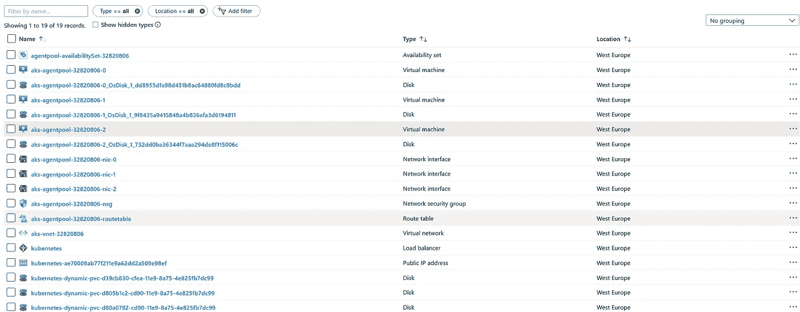

## 设置服务连接

在开始配置主要管道步骤之前，Azure Container Registry(ACR)和 Azure Kubernetes 服务之间的连接需要通过向 ACR 授予 AKS 服务主体的访问权限来授予。Azure DevOps 的 RBAC 服务主体已经创建，一切都已准备就绪，可以在管道中推拉 docker 映像。或者，你可以在 Azure DevOps 服务连接中这样做，我将在下一节课中解释。

[在这里](https://docs.microsoft.com/en-us/azure/aks/cluster-container-registry-integration)您可以找到如何配置 ACR 和 AKS 之间连接的详细说明。

## Azure DevOps 服务与 Azure Kubernetes 服务和 Azure 容器注册表的连接。

通过使用服务连接，您可以将 Azure DevOps 连接到您已经部署的 AKS 集群、Azure Container Registry、Docker Registry (Docker Hub)和许多其他服务。

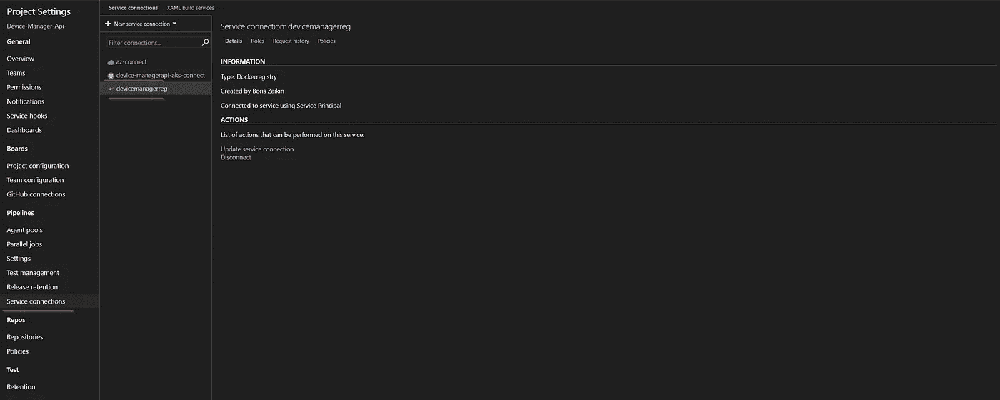

创建到 ACR 的连接非常简单，您只需要指定一个连接名、一个订阅和一个注册表名，就这样。

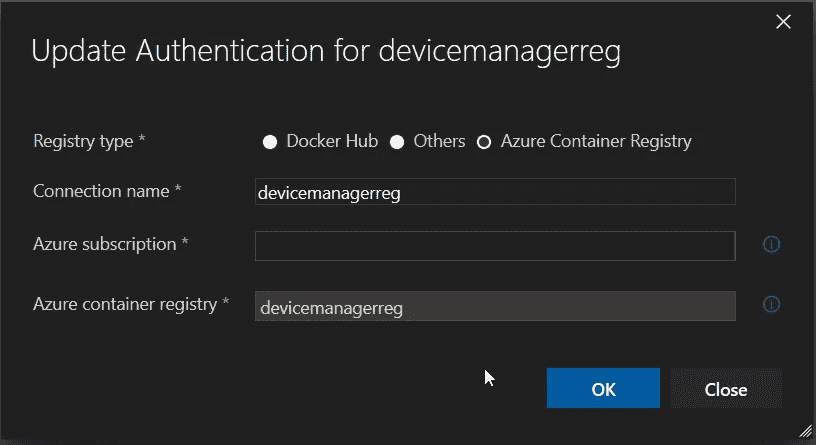

您可以使用 Kubeconfig、服务帐户和 Azure 订阅连接(并验证)您的 AKS 群集。在我的项目中，我使用了 Kubeconfig，作为快速选项之一，因为你只需要找到 kubeconfig JSON，复制它并选择你的集群上下文。

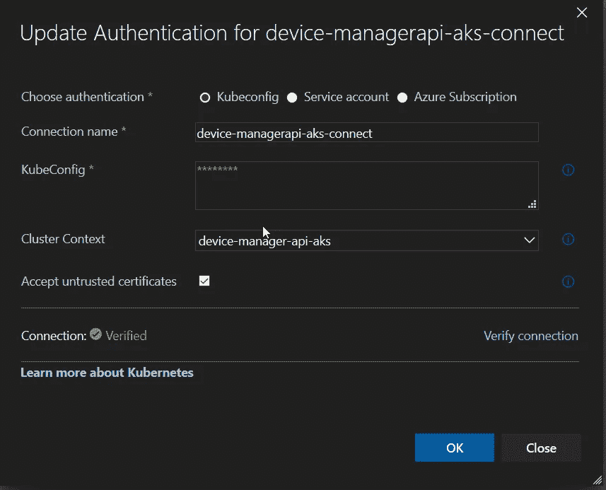

你可以在下面的目录中找到 KubeConfig(在 Windows 中):`C:\Users\your_user_name\.kube\config` [这里的](https://kubernetes.io/docs/concepts/configuration/organize-cluster-access-kubeconfig/)是关于如何在 Linux 和 Mac 上找到和使用 KubeConfig 的文档。

## 流水线步骤

Finlay 我正在进行管道步骤，第一步是使用一个脚本来恢复所有 NuGet 依赖项/包，构建. net 核心应用程序，运行单元测试，构建代码覆盖报告。还请注意，我使用了系统变量 [**$(Build。BuildNumber)**](https://docs.microsoft.com/en-us/azure/devops/pipelines/build/variables?view=azure-devops&tabs=yaml) 作为标签用于覆盖报告的生成。最后，测试结果将作为工件发布，Azure DevOps 可以构建可视化分析图表。

下面你可以在 Azure DevOps 的测试部分看到带有统计数据和测试结果的测试刀片

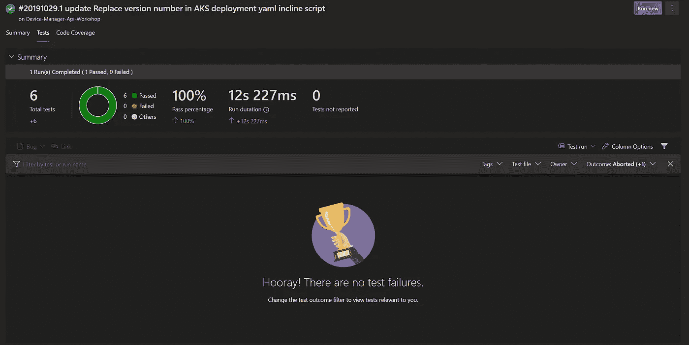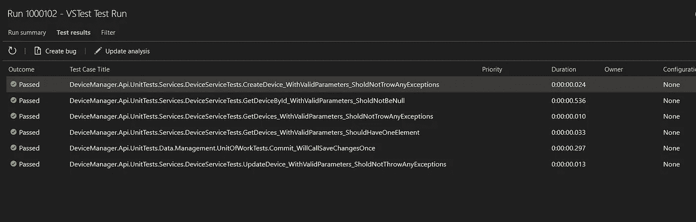

## 步骤 2 -代码覆盖率结果

下一步是将代码覆盖结果发布到*DefaultWorkingDirectory*。整个过程基于 [Cubertura 报表生成器](https://github.com/danielpalme/ReportGenerator)，一个. Net 核心库。

第一批统计结果已经出来了:

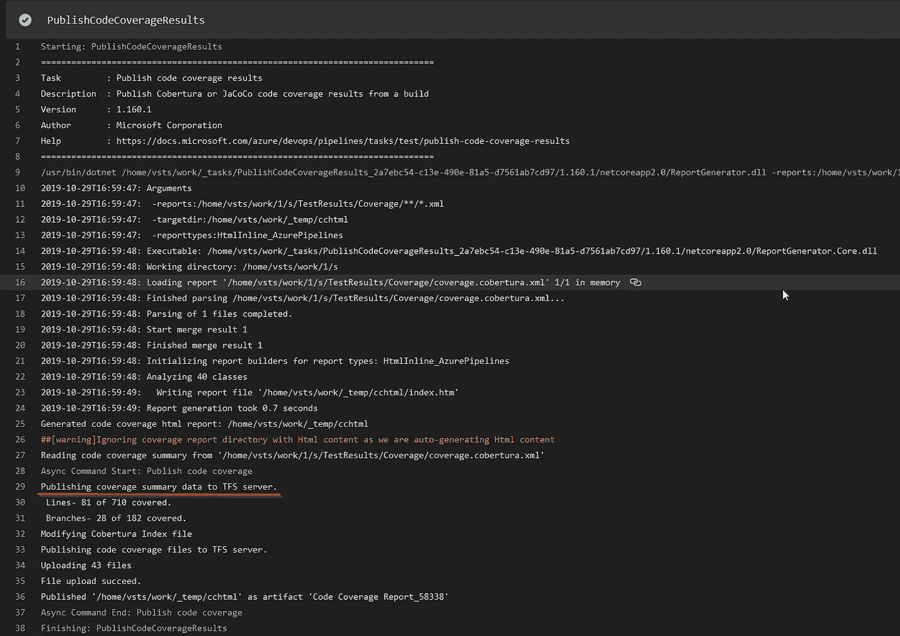

您可以在代码覆盖率选项卡上找到详细的逐文件报告。该报告基于生成的 xml 报告。

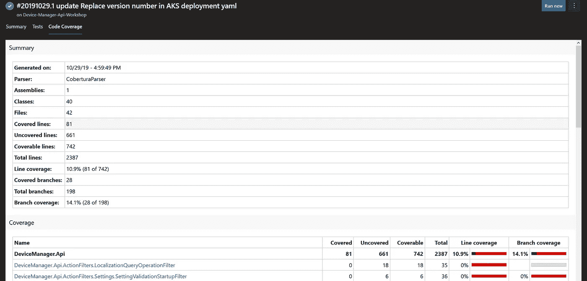

## 第 3 步和第 4 步—构建集装箱并将其推送到 ACR

完成前面的步骤后，项目将被放入容器中。为此，我将使用版本 1 Docker 步骤。您需要指定 Docker 文件的路径，就像我在这里做的那样，提供图像名称，例如**Boris Zn/devicemanagerapi**和标签— **1.102.1。，**最后一步是指定一个容器注册表，例如，**devicemanagerreg . azure Cr . io .**

对于标签创建，我使用了语义版本化，并硬编码了一些版本号来简化管道，但是您也可以使用不同的方法来构建 a 标签，例如使用运行管道所需的变量，或者从 git 版本中获取。

下一步是将我们的 dockerised 应用程序推送到 Azure 容器注册中心。在这里，我指定了要推送的命令和图像。你应该考虑到我推送了 2 张图片，第一张图片标签为 **1.58338.4** ，第二张图片标签为:**最新**。

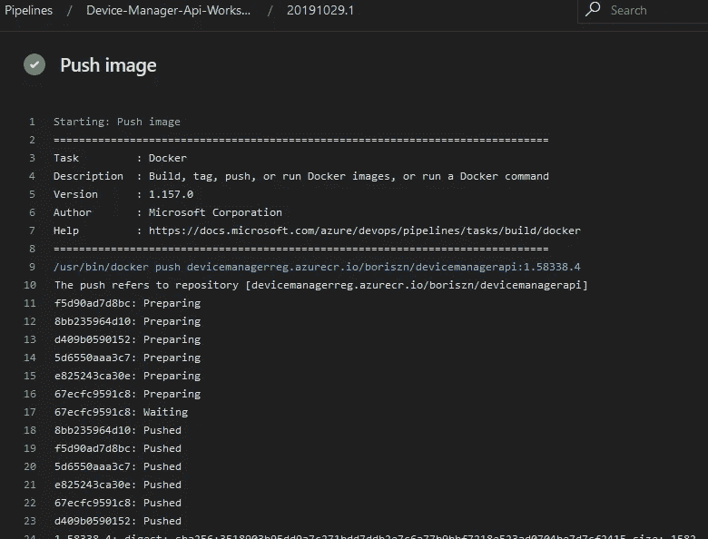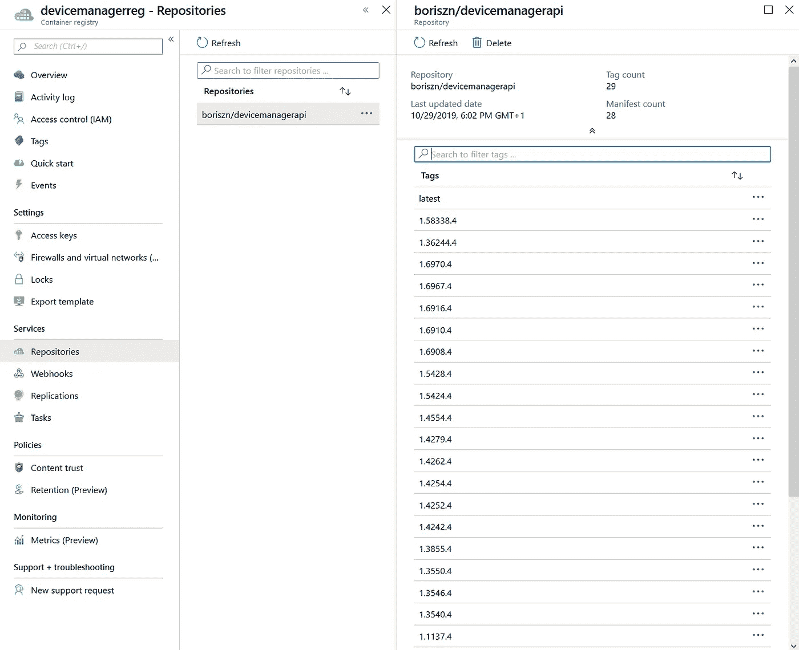

## AKS 部署步骤

对于 Azure Kubernetes 部署，您需要替换 AKS 部署 yaml 文件中的内部版本号，并在成功执行后显示在 Azure DevOps 中。

之后，对 AKS 集群运行“应用”命令。

这里的两个重要参数是我的集群部署 YAML 脚本的路径(*)。/deployment/aks-deployment . YAML*)和一个集群名( *device-manager-api-aks* )。其他参数已在前面的章节中解释过。

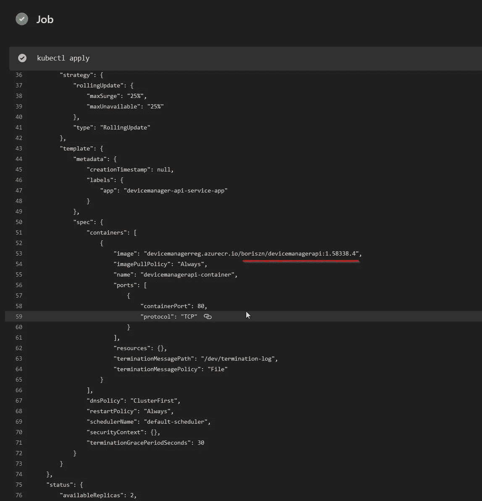

就是这样！下面我列出了我们在前面几节中配置的完整的 YAML 管道，它很容易导入到您的 Azure DevOps 项目中。如果您有任何问题，请在评论中联系我们！