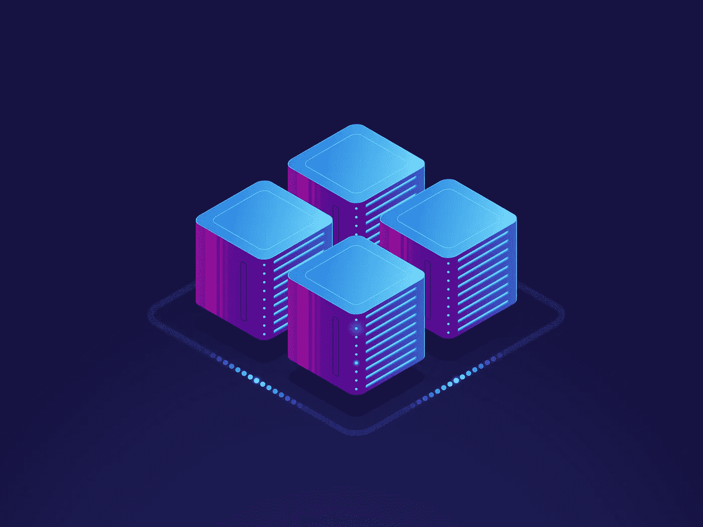
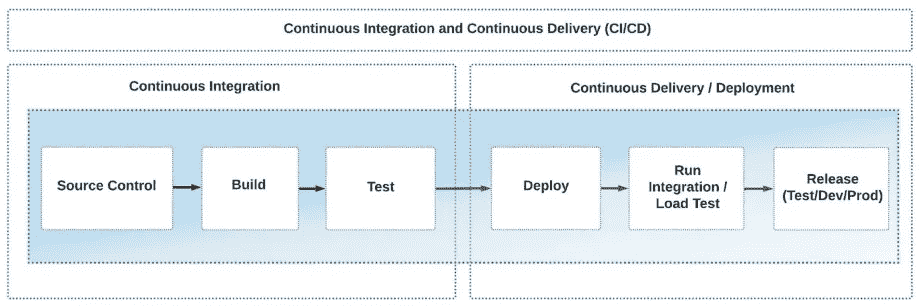
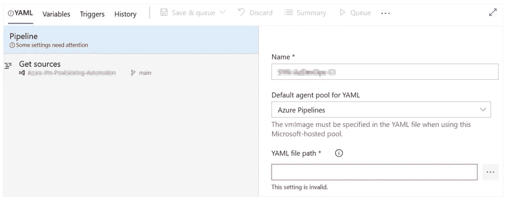
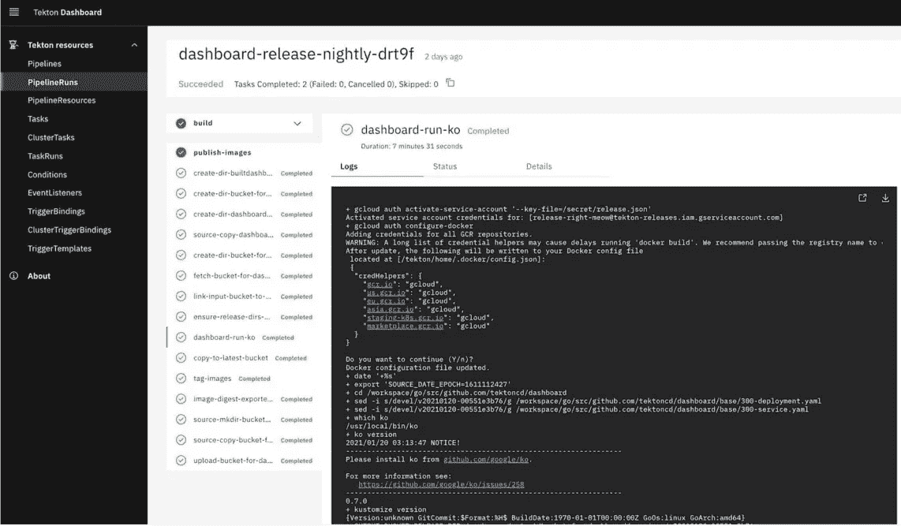

# 云原生应用的 CI/CD

> 原文：<https://itnext.io/ci-cd-for-cloud-native-applications-ba433a48149f?source=collection_archive---------0----------------------->

## 定义持续集成和持续交付，回顾 CI/CD 管道中的步骤，并探索用于构建 CI/CD 流程的 DevOps 和 IaC 工具。



🙂持续集成(CI)和持续交付(CD)是开发和维护任何云原生应用的关键部分。从我的经验来看，恰当地采用工具和过程会使 CI/CD 管道变得简单、安全和可扩展。原生云(或基于云)仅仅意味着应用程序利用云服务。例如，云原生应用程序可以是通过 Docker 容器部署的 web 应用程序，并使用部署到 Azure Kubernetes 服务的 Azure 容器注册表，或者使用亚马逊 EC2、AWS Lambda 或亚马逊 S3 服务。

在本文中，我们将:

*   定义持续集成和持续交付
*   查看 CI/CD 管道中的步骤
*   探索用于构建 CI/CD 流程的 DevOps 和 IaC 工具

# CI/CD 概述

持续集成过程是指软件工程师在将经过测试的应用程序发布到开发、测试或生产阶段之前，将代码的所有部分结合起来进行验证。CI 包括以下步骤:

1.  **源代码控制** —从源代码控制中获取应用程序的最新源代码。
2.  **构建**——编译、构建和验证代码——或者根据 JavaScript/Python 代码创建包和“林挺”。
3.  **测试** —运行单元测试并验证编码风格。

CI 之后是连续交付流程，包括以下步骤:

1.  **部署** —将准备好的代码放入测试(或阶段)环境中。
2.  **测试** —运行集成和/或负载测试。这一步是可选的，因为应用程序可以很小，没有很大的负载。
3.  **发布** —将应用程序部署到开发、测试和生产阶段。

在我看来，CI 和 CD 是一个过程的两个部分。然而，在云原生世界中，您可以在没有 CI 的情况下实现 CD。您可以在下图中看到整个 CI/CD 流程:



*图 1*

# CI/CD 在云原生应用开发中的重要性

构建成功的云原生 CI/CD 流程依赖于基础架构即代码(IaC)工具集。许多云原生应用程序集成了 CI/CD 流程，其中包括构建和部署应用程序以及调配和管理其云资源的步骤。

# IAC 如何支持 CI/CD

基础设施即代码是一种描述和管理应用程序基础设施配置的方法。许多 DevOps 平台支持 IaC 方法，将其直接集成到场地中——例如，Azure DevOps、GitHub、GitLab 和 Bitbucket 支持 YAML 管道。借助 YAML 管道，您可以通过基础设施部署为您的应用构建 CI/CD 流程。下面，您可以看到可以轻松与 IaC 工具集成的 DevOps 平台:

*   Azure 资源经理、Bicep 和 Farmer
*   将（行星）地球化（以适合人类居住）
*   泰克顿
*   普鲁米
*   自动气象站云形成

# 构建成功的云原生 CI/CD 流程

在许多情况下，云原生应用程序的 CI/CD 流程包括使用 IaC 方法记录和部署基础架构。IaC 方法允许您:

*   在部署应用程序之前，为其准备基础结构。
*   添加新的云资源和配置。
*   管理现有配置，解决“环境漂移”等问题

当团队不得不手动支持多个环境时，环境漂移问题就出现了。漂移会导致环境设置不一致，从而导致应用程序停机。IaC 的成功 CI/CD 流程依赖于您使用的工具和平台。

让我们来看看最流行的 DevOps 和 IaC 工具的组合。

# Azure DevOps

Azure DevOps 是一个广泛使用的工具，用于组织和构建您的云原生 CI/CD 流程，尤其是针对 Azure Cloud。它支持基于 UI 和 YAML 的管道构建方法。在为 Azure Cloud 构建自动化 CI/CD 流程时，我更喜欢使用这个工具。让我们看一个简单的 YAML 管道，它在 [Azure DevTest Labs](https://docs.microsoft.com/en-us/azure/devtest-labs/devtest-lab-overview) 中创建了一个虚拟机(VM):

```
. . . . . .
jobs:
- deployment: deploy
  displayName: Deploy
  pool:
    vmImage: 'ubuntu-latest'
  environment: ${{ parameters.environment }}

  strategy:
    runOnce:
      deploy:
        steps:
        - checkout: self
        - task: AzurePowerShell@4
          displayName: 'Check vm-name variable exists'
          continueOnError: true
          inputs:
            azureSubscription: ${{ parameters.azSubscription }}
            scriptType: "inlineScript"
            azurePowerShellVersion: LatestVersion
            inline: |
              $vm_name="$(vm-name)"
              echo $(vm-name) - $vm_name
              #if ([string]::IsNullOrWhitespace($vm_name))
              {
                  throw "vm-name is not set"
              }

        - task: AzureResourceManagerTemplateDeployment@3
          displayName: 'New deploy VM to DevTestLab'
          inputs:
            deploymentScope: 'Resource Group'
            azureResourceManagerConnection: ${{ parameters.azSubscription }}
            subscriptionId: ${{ parameters.idSubscription }}
            deploymentMode: 'Incremental'
            resourceGroupName: ${{ parameters.resourceGroup }}
            location: '$(location)'
            templateLocation: 'Linked artifact'
            csmFile: templates/vm.json
            csmParametersFile: templates/vm.parameters.json
            overrideParameters: '-labName "${{parameters.devTestLabsName}}"
                                 -vmName ${{parameters.vmName}} -password ${{parameters.password}}
                                 -userName ${{parameters.user}}
                                 -storageType
. . . . . .
```

为了简化管道列表，我缩短了上面的例子。如您所见，管道代码也可以是通用的；因此，您可以在多个项目中重用它。管道的前两步是内嵌的 PowerShell 脚本，用于验证和打印所需的变量。然后，这个管道可以很容易地集成到 Azure DevOps 中，如下图所示:



*图二*

最后一步使用 [Azure 资源管理器](https://docs.microsoft.com/en-us/azure/azure-resource-manager/management/overview) (ARM)模板在 Azure DevTest Labs 中创建虚拟机，并通过 [JSON 格式](https://docs.microsoft.com/en-us/azure/templates/microsoft.devtestlab/2015-05-21-preview/labs/virtualmachines?tabs=json)表示。这一步非常简单:它将变量发送(覆盖)到 ARM 脚本中，Azure 使用这些脚本在 DevTest 实验室中创建一个 VM。

# 自动气象站云形成

[AWS CloudFormation](https://docs.aws.amazon.com/AWSCloudFormation/latest/UserGuide/Welcome.html) 是来自 AWS 云堆栈的 IaC 工具，旨在提供 EC2、DNS、S3 桶等资源。CloudFormation 模板以 JSON 和 YAML 格式表示；因此，它们是构建可靠的云原生 CI/CD 流程的绝佳选择。此外，许多工具，如 Azure DevOps、GitHub、Bitbucket 和 [AWS CodePipelines](https://docs.aws.amazon.com/codepipeline/latest/userguide/welcome.html) 都有针对 CloudFormation 的集成选项。

下面是一个 AWS CloudFormation 模板的例子，为了适合本文，我对它进行了简化:

```
{
  "AWSTemplateFormatVersion" : "2010-09-09",
  "Parameters" : {
     "AccessControl" : {
     "Description" : " The IP address range that can be used to access the CloudFormer tool. NOTE:
We highly recommend that you specify a customized address range to lock down the tool.",
      "Type": "String",
      "MinLength": "9",
      }
  },
      "Mappings" : {
        "RegionMap" : {
        "us-east-1" : { "AMI" : "ami-21341f48" },
        }
  }
  "Resources" : {
     "CFNRole": {
     "Type": "AWS::IAM::Role",
     "Properties": {
     "AssumeRolePolicyDocument": {
            "Statement": [{
            "Effect": "Allow",
            "Principal": { "Service": [ "ec2.amazonaws.com" ] },
            "Action": [ "sts:AssumeRole" ]
            }]
      },
      "Path": "/"
      }
      },
  }
}
```

[云形成模板](https://docs.aws.amazon.com/AWSCloudFormation/latest/UserGuide/template-anatomy.html#:~:text=set%20of%20outputs-,Template%20sections,-Templates%20include%20several)包含以下部分:

*   `Parameters`–您可以指定输入参数以从 CLI 运行模板或从 AWS CodePipeline(或任何其他 CI/CD 工具)传递数据。
*   `Mappings`–您可以根据地区将关键字与特定值(或一组值)匹配。
*   `Resources`–您可以声明包含的资源，回答“将提供什么”的问题，并且您可以使用参数根据您的需求调整资源。

AWS CloudFormation 模板看起来类似于 Azure ARM 模板，因为它们做相同的工作，但针对不同的云提供商。

# 谷歌云部署管理器

谷歌云(GC)提供了[云部署管理器](https://cloud.google.com/deployment-manager/docs)，这是一个一体化的工具，包括描述供应资源的模板和构建 CI/CD 管道的模板。模板支持:

*   [Python 3.x](https://docs.python.org/3/)
*   [Jinja 2.10.x](https://jinja.palletsprojects.com/en/2.10.x/)
*   YAML

让我们使用 Jinja 模板来探索虚拟机的部署——这在 YAML 看来很常见:

```
resources:
- type: compute.v1.instance
  name: {{env["project"]}}-deployment-vm
  properties:
     zone: {{properties["zone"]}}
     machineType:https://www.googleapis.com/compute/v1/projects/{{env["project"]}}/zones/
{{properties["zone"]}}/machineTypes/f1-micro
     disks:
     - deviceName: boot
     type: PERSISTENT
     boot: true
     autoDelete: true
     initializeParams:
     sourceImage: https://www.googleapis.com/compute/v1/projects/debian-cloud/global/images/family/
debian-9
     networkInterfaces:
     - network: https://www.googleapis.com/compute/v1/projects/{{env["project"]}}/global/networks/
default
     accessConfigs:
     - name: External NAT
     type: ONE_TO_ONE_NAT
```

上面的例子类似于 ARM 和 CloudFormation 模板，因为它描述了要部署的资源。在我看来，YAML/Jinja 2.10.x 格式比基于 JSON 的结构更好，因为:

*   YAML 增长迅速，阅读速度比 JSON 快得多
*   团队可以在 YAML 和 Jinja 中比在 JSON 中更快地找到并修复错误
*   YAML 管道(稍加修改)可以在许多其他平台上重用

你可以在 GitHub gist 中找到这个例子的扩展版本。

# 泰克顿和库伯内特

[Tekton](https://tekton.dev/) ，由 [CD 基金会](https://cd.foundation/)([Linux 基金会](https://www.linuxfoundation.org/projects/)的一部分)支持，定位为基于 Kubernetes 的云原生应用的开源 CI/CD 框架。Tekton 框架的组件包括:

*   **Tekton 管道** —最基本的管道，旨在根据 [Kubernetes 定制资源](https://kubernetes.io/docs/concepts/extend-kubernetes/api-extension/custom-resources/)构建 CI/CD 管道。
*   **Tekton 触发器** —基于事件驱动的方法提供运行管道的逻辑。
*   **Tekton CLI** —构建在 Kubernetes CLI 之上，允许您运行管道、检查状态和管理其他选项。
*   [**tek ton Dashboard**](https://github.com/tektoncd/dashboard/blob/main/README.md)**和**[**Hub**](https://hub.tekton.dev/)**—**使用基于 web 的图形界面运行管道，并观察管道执行日志、资源详细信息和整个集群的资源(参见图 3 中的仪表板)。



*图 3*

我喜欢 Tekton Hub 背后的想法——您可以共享您的管道和其他可重用组件。让我们看一个 Tekton 管道示例:

```
apiVersion: tekton.dev/v1beta1
kind: Pipeline
metadata:
  name: say-things
spec:
  tasks:
    - name: first-task
      params:
        - name: pause-duration
          value: "2"
        - name: say-what
          value: "Hello, this is the first task"
      taskRef:
        name: say-something
    - name: second-task
      params:
        - name: say-what
          value: "And this is the second task"
      taskRef:
        name: say-something
```

上面的管道代码是以本地 Kubernetes 格式/清单编写的，代表一组任务。因此，您可以构建本机跨云 CI/CD 流程。在任务中，您可以添加操作 Kubernetes 资源、构建图像、打印信息和许多其他操作的步骤。你可以在这里找到 Tekton 管道[的完整教程。](https://developers.redhat.com/blog/2021/01/13/getting-started-with-tekton-and-pipelines#run_in_parallel_or_sequentially)

# Terraform、Azure 二头肌和 Farmer

Terraform 是基于 IaC 方法构建可靠 CI/CD 流程的领先平台。我不会深入讨论 Terraform，因为它需要一篇单独的文章(甚至是一本书)。Terraform 使用一种特定的语言来简化 CI/CD 模板的构建。此外，它允许您重用代码部分，为 CI/CD 流程增加了动态的味道。因此，您可以构建比 ARM/JSON 模板好得多的模板。让我们来看一个 Terraform 模板代码的基本示例:

```
terraform {
  required_providers {
  }
  backend "remote" {
    organization = "YOUR_ORGANIZATION_NAME"
    workspaces {
      name = "YOUR_WORKSPACE_NAME"
    }
  }
}
```

上面的基本模板包含资源、提供者和工作空间定义。同样的方法遵循 Azure 二头肌和农民工具。这些地形模拟可以极大地改善和缩短您的代码。让我们看看下面的二头肌例子:

```
param location string = resourceGroup().location
param storageAccountName string = 'toylaunch${uniqueString(resourceGroup().id)}'resource storageAccount 'Microsoft.Storage/storageAccounts@2021-06-01' = {
  name: storageAccountName
  location: location
  sku: {
    name: 'Standard_LRS'
  }
  kind: 'StorageV2'
  properties: {
    accessTier: 'Hot'
  }
}
```

上面的 Bicep 代码在美国地区部署存储帐户。你可以看到 [JSON ARM 示例](https://docs.microsoft.com/en-us/azure/azure-resource-manager/bicep/overview?tabs=json)也是如此。在我看来，Terraform 和 Azure 二头肌比 ARM 模板更短，也更容易理解。 [Farmer](https://compositionalit.github.io/farmer/) 工具还可以在可读性和类型安全代码方面展示令人印象深刻的结果:

```
// Create a storage account with a container
let myStorageAccount = storageAccount {
    name "myTestStorage"
    add_public_container "myContainer"
}// Create a web app with application insights that's connected to the storage account.
let myWebApp = webApp {
    name "myTestWebApp"
    setting "storageKey" myStorageAccount.Key
}// Create an ARM template
let deployment = arm {
    location Location.NorthEurope
    add_resources [
        myStorageAccount
        myWebApp
    ]
}// Deploy it to Azure!
deployment
|> Writer.quickDeploy "myResourceGroup" Deploy.NoParameters
```

上面，你可以看到如何用 20 行易读易扩展的代码将你的 web 应用部署到 Azure。

# 普鲁米

Pulumi 框架遵循一种不同的方法来构建和组织 CI/CD 流程:它允许您使用自己喜欢的编程语言来部署应用程序和基础设施。Pulumi 支持 Python、C#、TypeScript、Go 和许多其他语言。让我们看看下面的例子:

```
public MyStack()
{
    var app = new WebApplication("hello", new()
    {
        DockerImage = "strm/helloworld-http"
    });

    this.Endpoint = app.Endpoint;
}
```

这部分代码将 web 应用部署到 Azure cloud，并使用 Docker 容器来运行 web 应用。你可以在 AKS 集群中以及 Docker 容器[这里](https://www.pulumi.com/registry/packages/azure-native/how-to-guides/azure-cs-net5-aks-webapp/)找到如何启动 web 应用的例子。

# 结论

如果您不知道最适合这样做的原则、工具和框架，为您的应用程序构建云原生 CI/CD 管道可能是一个永无止境的故事。人们很容易迷失在各种工具、提供商和术语中，因此本文旨在解释什么是 CI/CD 云原生应用程序，并向您介绍构建可靠 CI/CD 管道的广泛使用的工具和原则。拥有本指南有助于您在设计 CI/CD 流程和为您的云原生应用选择合适的工具时感到舒适。

> *这是 DZone 's 2022 DevOps 趋势报告中的一篇文章。*
> 
> *更多:*
> 
> [*读报告*](https://dzone.com/trendreports/devops-3)