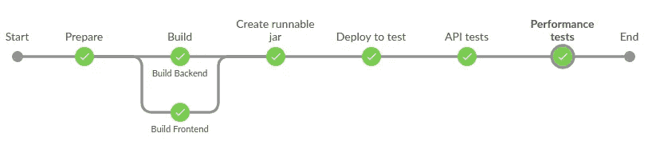
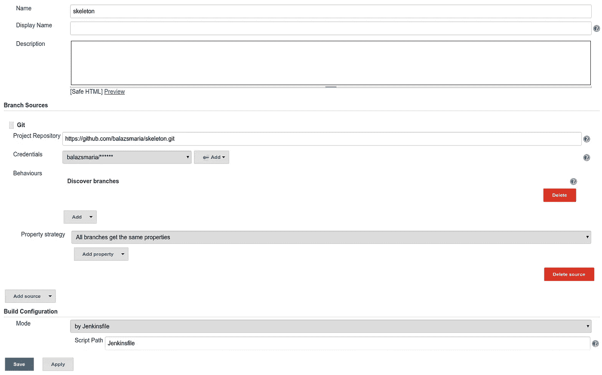

# Jenkins 和 Ansible 的 CI/CD

> 原文：<https://itnext.io/ci-cd-with-jenkins-and-ansible-f41ef2b33977?source=collection_archive---------1----------------------->

现在是 2018 年。Kubernetes 赢得了容器编排之战。我们中的一些人正在嫉妒地阅读硅谷创业公司的文章(是的，也许他们也已经在你的城市了！)但是我们又回到了我们良好的旧的遗留系统。

基于主干的开发，云中的容器在路线图上，但在短期内它们根本不可能实现。

向 DevOps 方向迈进的一步是消除孤岛(开发、质量保证、运营),因此我们必须以一种能让每个角色轻松协作的方式构建代码。

我读过很多非常好的文章，关于如何用一些单页 Javascript 应用程序构建 Spring Boot 后端，也关于配置管理、基础设施供应、持续集成和交付，但现在我将所有这些结合起来，并提供一些脚手架供您构建。

## 设置

我手头上有一个 [Jenkins](https://jenkins.io/) 实例、ssh 和一个漂亮的可运行的 [Spring Boot](https://spring.io/projects/spring-boot) jar。还有一个 [RedHat7](https://www.redhat.com/en/technologies/linux-platforms/enterprise-linux) VM 和一个 [Nexus](https://www.sonatype.com/nexus-repository-sonatype) 作为工件库。所以我想我应该高兴我不再部署耳朵了！


詹金斯和 ansi ble——一个简单但强大的组合

现在，我将使用这些工具构建一个[部署管道](https://martinfowler.com/bliki/DeploymentPipeline.html),并将一切置于版本控制中，这样团队中的每个人都可以访问一切，并且知道他们的代码从提交到部署发生了什么(在这种情况下，直到测试环境)。

我使用以下结构:

```
parent
+- backend
+- frontend
+- deployment
Jenkinsfile
```

为了简单起见，`backend` —一个 Spring Boot 应用程序—包含了`frontend` [ReactJS](https://reactjs.org/) 应用程序，`deployment`是工具持续交付的地方，根目录中的`[Jenkinsfile](https://jenkins.io/doc/book/pipeline/jenkinsfile/)`是我们管道的声明性描述符。


Spring Boot 与 React——web 应用程序的共同选择

让我们稍微了解一下这些模块！

## 后端

首先，它继承了 Spring Boot 的父代:

```
<**parent**>
    <**groupId**>org.springframework.boot</**groupId**>
    <**artifactId**>spring-boot-starter-parent</**artifactId**>
    <**version**>2.0.3.RELEASE</**version**>
    <**relativePath**/>
</**parent**>
```

让我们将`frontend`应用程序包括在其他依赖项中:

```
<**dependencies**>
... 
  <**dependency**>
        <**groupId**>com.company.skeleton</**groupId**>
        <**artifactId**>frontend</**artifactId**>
        <**version**>0.0.1-SNAPSHOT</**version**>
    </**dependency**>
...
</**dependencies**>
```

我还使用`[Spotbugs](https://github.com/spotbugs/spotbugs)`、`[Checkstyle](http://checkstyle.sourceforge.net/)`和`[Jacoco](https://www.eclemma.org/jacoco/)`进行静态分析和代码覆盖，所以我们也必须包含那些插件。注意 `[Spotbugs](http://find-sec-bugs.github.io/)`的[安全插件，是安全](http://find-sec-bugs.github.io/)上的一个小[左移。](https://www.twistlock.com/2017/05/31/shift-left-security/)

```
<**build**>
    <**plugins**>
        <**plugin**>
            <**groupId**>org.springframework.boot</**groupId**>
            <**artifactId**>spring-boot-maven-plugin</**artifactId**>
            <**configuration**>
                <**executable**>true</**executable**>
            </**configuration**>
        </**plugin**>
        <**plugin**>
            <**groupId**>com.github.spotbugs</**groupId**>
            <**artifactId**>spotbugs-maven-plugin</**artifactId**>
            <**version**>3.1.3.1</**version**>
            <**configuration**>
                <**effort**>Max</**effort**>
                <**threshold**>Low</**threshold**>
                <**failOnError**>true</**failOnError**>
                <**plugins**>
                    <**plugin**>
                        <**groupId**>com.h3xstream.findsecbugs</**groupId**>
                        <**artifactId**>findsecbugs-plugin</**artifactId**>
                        <**version**>LATEST</**version**>
                    </**plugin**>
                </**plugins**>
            </**configuration**>
        </**plugin**>
        <**plugin**>
            <**groupId**>org.apache.maven.plugins</**groupId**>
            <**artifactId**>maven-checkstyle-plugin</**artifactId**>
            <**version**>3.0.0</**version**>
        </**plugin**>
        <**plugin**>
            <**groupId**>org.jacoco</**groupId**>
            <**artifactId**>jacoco-maven-plugin</**artifactId**>
            <**version**>0.8.1</**version**>
            <**configuration**>
                <**fileSets**>
                    <**fileSet**>
                        <**directory**>${project.build.directory}</**directory**>
                        <**includes**>
                            <**include**>*.exec</**include**>
                        </**includes**>
                    </**fileSet**>
                </**fileSets**>
            </**configuration**>
            <**executions**>
                <**execution**>
                    <**id**>default-prepare-agent</**id**>
                    <**phase**>process-classes</**phase**>
                    <**goals**>
                        <**goal**>prepare-agent</**goal**>
                    </**goals**>
                    <**configuration**>
                        <**destFile**>${project.build.directory}/jacoco.exec</**destFile**>
                    </**configuration**>
                </**execution**>

                <**execution**>
                    <**id**>pre-integration-test</**id**>
                    <**phase**>pre-integration-test</**phase**>
                    <**goals**>
                        <**goal**>prepare-agent</**goal**>
                    </**goals**>
                    <**configuration**>
                        <**destFile**>${project.build.directory}/jacoco-it.exec</**destFile**>
                        <**propertyName**>failsafeArgLine</**propertyName**>
                    </**configuration**>
                </**execution**>
                <**execution**>
                    <**id**>post-integration-test</**id**>
                    <**phase**>post-integration-test</**phase**>
                    <**goals**>
                        <**goal**>report</**goal**>
                    </**goals**>
                    <**configuration**>
                        <**dataFile**>${project.build.directory}/jacoco-it.exec</**dataFile**>
                        <**outputDirectory**>${project.reporting.outputDirectory}/jacoco-it</**outputDirectory**>
                    </**configuration**>
                </**execution**>
            </**executions**>
        </**plugin**>
        <**plugin**>
            <**groupId**>pl.project13.maven</**groupId**>
            <**artifactId**>git-commit-id-plugin</**artifactId**>
        </**plugin**>
    </**plugins**>
</**build**>
```

现在我们准备搬到`frontend.`

## 前端

由于我们需要一个可以作为 maven 依赖项包含的库，我们将把构建的资源复制到带有`maven-resources-plugin`的 jar 的`public`目录中。

但是首先我们也需要构建和测试这个模块。我们将使用`frontend-maven-plugin`来完成这两个步骤，但是如果不喜欢 maven 方法，这两个步骤都可以用脚本或者直接在`Jenkinsfile`中完成。

```
<**build**>
    <**plugins**>
        <**plugin**>
            <**artifactId**>maven-resources-plugin</**artifactId**>
            <**version**>3.0.2</**version**>
            <**executions**>
                <**execution**>
                    <**id**>prepare-package</**id**>
                    <**phase**>prepare-package</**phase**>
                    <**goals**>
                        <**goal**>copy-resources</**goal**>
                    </**goals**>
                    <**configuration**>
                        <**outputDirectory**>${basedir}/target/classes/public</**outputDirectory**>
                        <**resources**>
                            <**resource**>
                                <**directory**>${project.basedir}/build</**directory**>
                            </**resource**>
                        </**resources**>
                    </**configuration**>
                </**execution**>
            </**executions**>
        </**plugin**>
        <**plugin**>
            <**groupId**>com.github.eirslett</**groupId**>
            <**artifactId**>frontend-maven-plugin</**artifactId**>
            <**version**>1.6</**version**>
            <**executions**>
                <**execution**>
                    <**id**>install node and yarn</**id**>
                    <**goals**>
                        <**goal**>install-node-and-yarn</**goal**>
                    </**goals**>
                    <**configuration**>
                        <**nodeVersion**>v9.9.0</**nodeVersion**>
                        <**yarnVersion**>v1.5.1</**yarnVersion**>
                    </**configuration**>
                </**execution**>
                <**execution**>
                    <**id**>yarn</**id**>
                    <**goals**>
                        <**goal**>yarn</**goal**>
                    </**goals**>
                    <**phase**>prepare-package</**phase**>
                    <**configuration**>
                    </**configuration**>
                </**execution**>
                <**execution**>
                    <**id**>yarn build</**id**>
                    <**goals**>
                        <**goal**>yarn</**goal**>
                    </**goals**>
                    <**phase**>prepare-package</**phase**>
                    <**configuration**>
                        <**arguments**>build</**arguments**>
                    </**configuration**>
                </**execution**>
                <**execution**>
                    <**id**>test</**id**>
                    <**goals**>
                        <**goal**>yarn</**goal**>
                    </**goals**>
                    <**phase**>test</**phase**>
                    <**configuration**>>
                        <**arguments**>test</**arguments**>
                        <**environmentVariables**>
                            <**CI**>true</**CI**>
                        </**environmentVariables**>
                    </**configuration**>
                </**execution**>
            </**executions**>
        </**plugin**>
    </**plugins**>
</**build**>
```

现在让我们和 Jenkins 一起构建一切！

## 詹金斯文件

我们将在这里创建以下管道:



我们用声明的方式。

在`Build`阶段，我们并行构建`frontend`和`backend`。

当然，我们必须记住`backend`依赖于`frontend`模块产生的工件，因此我们必须在两个并行构建之后包含另一个步骤来创建 runnable jar，但是这次我们可以跳过运行测试。

```
pipeline {
    agent { label 'RHEL' }
    tools {
        maven 'Maven 3.3.9'
        jdk 'jdk1.8.0'
    }
    stages {
        stage('Build') {
            parallel {
                stage('Build Backend'){
                    steps {
                        dir('backend'){
                            sh 'mvn clean test spotbugs:spotbugs checkstyle:checkstyle'
                        }
                    }
                    post {
                        always {
                            junit 'backend/target/surefire-reports/*.xml'
                            findbugs canComputeNew: false, defaultEncoding: '', excludePattern: '', healthy: '', includePattern: '', pattern: '**/spotbugsXml.xml', unHealthy: ''
                            checkstyle canComputeNew: false, defaultEncoding: '', healthy: '', pattern: '**/checkstyle-result.xml', unHealthy: ''
                            jacoco()
                        }
                    }
                }
                stage('Build Frontend'){
                    steps {
                        dir('frontend'){
                            sh 'mvn clean install'
                        }
                    }
                }
            }
        }
        stage('Create runnable jar'){
             steps {
                dir('backend'){
                    sh 'mvn deploy -DskipTests'
                }
            }
        }        
    }
}
```

可能你已经注意到我使用了`mvn deploy`而不是`mvn install`，这是因为我们在这里使用了一个工件库，也就是 Nexus。

那是我们唯一的真相来源，我们所有的人造物品都存放在那里。这是我们在所有环境中提取工件的地方。

这个工件库必须在`backend`的`pom.xml`中定义。

```
<**distributionManagement**>
    <**repository**>
        <**uniqueVersion**>true</**uniqueVersion**>
        <**id**>Releases</**id**>
        <**layout**>default</**layout**>
        <**url**>http://nexus.edudoo.com/</**url**>
    </**repository**>
    <**snapshotRepository**>
        <**uniqueVersion**>false</**uniqueVersion**>
        <**id**>Snapshots</**id**>
        <**layout**>default</**layout**>
        <**url**>http://nexus.edudoo.com/</**url**>
    </**snapshotRepository**>
</**distributionManagement**>
```

## 部署

正如我提到的，我有一个 RedHat7 虚拟机和 ssh 访问。只需要 ssh 访问的最简单的工具是 [Ansible](https://www.ansible.com/) ，所以我们使用它，它必须安装在 Jenkins 节点上。


简单的 IT 自动化

另一个要做的决定是如何运行我们的应用程序。我们可以创建一些 shell 脚本来启动/停止 java jar，但是更复杂一点的解决方案是使用流程/服务管理器。

我可以选择 [Supervisor](http://supervisord.org/index.html) 或其他，但这不是我们的 RedHat Linux 机器所支持的，所以让我们继续使用 [systemd](https://en.wikipedia.org/wiki/Systemd) 。

我们每次将要执行的步骤如下:

*   通过安装所需的软件包来准备环境，
*   准备并推送应用程序的配置，
*   把罐子从 Nexus 拉出来，
*   创建(或更新)并(重新)启动 systemd 服务。

在我们的例子中，创建环境意味着更新包并安装 java。这些在角色`common`中定义:

```
- **name:** Ensure kernel is at the latest version
  **yum:** name=kernel state=latest

- **name:** Install latest Java 8
  **yum:** name=java-1.8.0-openjdk.x86_64 state=latest
```

`deploy`角色包含剩下的部分，首先我们将 jar 放入`/opt`的一个目录中:

```
- **name:** Create skeleton directory
  **file:** path=/opt/skeleton state=directory

- **name:** Download skeleton runnable jar
  **get_url:
    url:** http://nexus.edudoo.com/artifact/maven/content?g=com.edudoo.skeleton&a=backend&v=0.0.1-SNAPSHOT&r=snapshots
    **dest:** /opt/skeleton/skeleton.jar
    **backup:** yes
    **force:** yes
```

现在配置管理部分:

```
- **name:** Ensure app is configured
  **template:
    src:** application.properties.j2
    **dest:** /opt/skeleton/application.properties

- **name:** Ensure logging is configured
  **template:
    src:** logback-spring.xml.j2
    **dest:** /opt/skeleton/logback-spring.xml
```

Spring boot 应用程序是由 runnable jar 旁边的`application.properties`文件配置的。有了上面的`template`，我们可以从一个环境到另一个环境替换它的内容。

让我们来看看模板本身:

```
server.port={{skeleton_port}}
logging.config=/opt/skeleton/logback-spring.xml
logging.file=/opt/skeleton/skeleton.log
```

当我们运行 ansible 脚本时，`skeleton_port`将被一个提供的值替换。我们稍后再回到这个话题。

(这同样适用于日志配置。)

最后是关于服务的部分:

```
- **name:** Install skeleton systemd unit file
  **template:** src=skeleton.service.j2 dest=/etc/systemd/system/skeleton.service

- **name:** Start skeleton
  **systemd:** state=restarted name=skeleton daemon_reload=yes
```

模板目前实际上不包含任何变量(但是可以，例如，java args 来动态控制内存消耗):

```
[Unit]
Description=Skeleton Service

[Service]
User=root
WorkingDirectory=/opt/skeleton/
ExecStart=/usr/bin/java -Xmx256m -jar skeleton.jar
SuccessExitStatus=143
TimeoutStopSec=10
Restart=always
RestartSec=5

[Install]
WantedBy=multi-user.target
```

剩下要定义的是一个包含环境的清单文件(例如`dev-servers`):

```
[test]
11.22.33.44[prod]
11.22.33.45
11.22.33.46
```

以及一个包含所有步骤的剧本(`site.yml`):

```
---
- **hosts:** test
  **remote_user:** clouduser
  **roles:** - common
     - deploy

  **vars:** - **skeleton_port:** 80
```

注意，我们在这里为变量`skeleton_port`定义了一个值，它将在 application.properties 文件的模板中被替换。

因此，让我们将它添加到我们的`Jenkinsfile`:

```
...
stage('Deploy to test'){
    steps {
        dir('deployment'){ //do this in the deployment directory!
            echo 'Deploying to test'
            sh 'ansible-playbook -i dev-servers site.yml'
        }
    }
}
...
```

现在我们已经准备好了，我们只需要将所有东西提交到一个 git 存储库中，并让 Jenkins 知道可以从那里取出`Jenkinsfile`。

## 配置 Jenkins

在 Jenkins 中，您应该创建一个新的`Multibranch Pipeline`，在配置页面上，唯一需要设置的是源:



詹金斯构型

保存、运行和享受！

该代码可在[https://github.com/balazsmaria/skeleton](https://github.com/balazsmaria/skeleton)获得