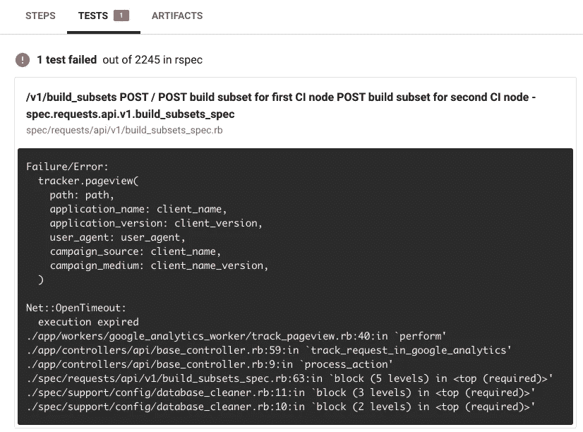

# CircleCI 并行测试 RSpec 与 JUnit XML 报告合并

> 原文：<https://itnext.io/circleci-parallel-testing-rspec-with-junit-xml-reports-merged-5f91e773ff3e?source=collection_archive---------3----------------------->

您将学习如何在 **CircleCI** 上用并行作业为您的 **Ruby on Rails** 项目运行 **RSpec** 测试，以缩短您的 CI 构建的运行时间。此外，您将学习如何配置 **JUnit** formatter 来为您的测试生成 XML 报告，以便在 CircleCI web UI 中很好地显示失败的 RSpec 测试示例。最后，您将看到如何自动检测慢速 spec 文件，并在并行作业之间划分它们的测试示例，以消除花费太多时间运行测试的瓶颈作业。


# Ruby gems 来配置您的 RoR 项目

以下是您需要的关键要素:

*   [rspec _ JUnit _ formatter](https://github.com/sj26/rspec_junit_formatter)—这是一个 ruby gem，它为已执行的测试生成一个 XML 报告，其中包含关于测试失败的信息。CircleCI 可以自动读取该报告，并将其显示在 CircleCI web UI 中。无需再浏览冗长的 RSpec 输出——只需查看`TESTS`选项卡中突出显示的不合格规格:)



*   [backpack _ pro](https://knapsackpro.com/?utm_source=medium&utm_medium=blog_post&utm_campaign=rspec-testing-parallel-jobs-with-circleci-and-junit-xml-report)—这是一个 Ruby gem，用于在并行 CI 作业上运行测试，以确保所有作业在相似的时间完成工作，从而尽可能地节省您的时间并消除瓶颈。
*   背包 Pro 使用[队列模式在并行作业](https://docs.knapsackpro.com/2020/how-to-speed-up-ruby-and-javascript-tests-with-ci-parallelisation)之间动态拆分测试文件。
*   backpack Pro 还可以[检测你的慢速 RSpec 测试文件，并通过测试实例](https://knapsackpro.com/faq/question/how-to-split-slow-rspec-test-files-by-test-examples-by-individual-it?utm_source=medium&utm_medium=blog_post&utm_campaign=rspec-testing-parallel-jobs-with-circleci-and-junit-xml-report)在并行作业之间进行划分。如果您想在 CircleCI:上并行容器之间分割工作，您不必手动将大的 spec 文件分割成较小的文件

把以上宝石加到你的`Gemfile`里就行了。

```
group :test **do**
  gem 'rspec'
  gem 'rspec_junit_formatter'
**end**

group :test, :development **do**
  gem 'knapsack_pro'
**end**
```

对于[背包专业版，你需要一个 API 令牌](https://knapsackpro.com/?utm_source=medium&utm_medium=blog_post&utm_campaign=rspec-testing-parallel-jobs-with-circleci-and-junit-xml-report)，你需要按照[安装指南](https://docs.knapsackpro.com/knapsack_pro-ruby/guide/)来配置你的项目。

如果您在队列模式下使用 CircleCI 的`knapsack_pro` gem，您可能想要收集元数据，比如关于您的 RSpec 测试套件的 JUnit XML 报告。CircleCI 的重要步骤是将 XML 报告复制到`$CIRCLE_TEST_REPORTS`目录。下面是你的`spec_helper.rb`文件的完整配置(来自 FAQ 的[源代码):](https://knapsackpro.com/faq/question/how-to-use-junit-formatter?utm_source=medium&utm_medium=blog_post&utm_campaign=rspec-testing-parallel-jobs-with-circleci-and-junit-xml-report#how-to-use-junit-formatter-with-knapsack_pro-queue-mode)

```
*# spec_helper.rb or rails_helper.rb*

*# This must be the same path as value for rspec --out argument*
*# Note: the path should not contain '~' sign, for instance path ~/project/tmp/rspec.xml may not work.*
*# Please use full path instead.*
TMP_RSPEC_XML_REPORT **=** 'tmp/rspec.xml'
*# move results to FINAL_RSPEC_XML_REPORT*
*# so that the results won't accumulate with duplicated xml tags in TMP_RSPEC_XML_REPORT*
FINAL_RSPEC_XML_REPORT **=** 'tmp/rspec_final_results.xml'

KnapsackPro**::**Hooks**::**Queue.**after_subset_queue** **do** **|**queue_id, subset_queue_id**|**
  **if** File.**exist?**(TMP_RSPEC_XML_REPORT)
    FileUtils.**mv**(TMP_RSPEC_XML_REPORT, FINAL_RSPEC_XML_REPORT)
  **end**
**end**
```

您需要上述逻辑来将 XML 报告从一个地方移动到另一个地方，以避免意外损坏您的 XML 文件。当 backpack Pro 在队列模式下运行您的测试时，它会从 backpack Pro 队列 API 中获取一组测试文件，然后运行它并生成 XML 报告。之后，从 Queue API 获取另一组测试文件，并在磁盘上更新 XML 报告。如果报告已经存在于磁盘上，它可能会由于覆盖同一个文件而损坏。这就是为什么在来自 Queue API 的每组测试被执行之后，您需要将文件移动到不同的位置。

# RSpec 的 CircleCI YML 配置

这是完整的 rcleCI YML 配置文件，用于 RSpec、backpackage Pro 和 JUnit 格式化程序。

```
*# Ruby CircleCI 2.0 configuration file*
*#*
*# Check* [*https://circleci.com/docs/2.0/language-ruby/*](https://circleci.com/docs/2.0/language-ruby/) *for more details*
*#*
version: 2
jobs:
  build:
    parallelism: 10
    *#* [*https://circleci.com/docs/2.0/configuration-reference/#resource_class*](https://circleci.com/docs/2.0/configuration-reference/#resource_class)
    resource_class: small
    docker:
      *# specify the version you desire here*
      - image: circleci/ruby:2.7.1-node-browsers
        environment:
          PGHOST: 127.0.0.1
          PGUSER: my_db_user
          RAILS_ENV: test
          *# Split slow RSpec test files by test examples*
          *#* [*https://knapsackpro.com/faq/question/how-to-split-slow-rspec-test-files-by-test-examples-by-individual-it*](https://knapsackpro.com/faq/question/how-to-split-slow-rspec-test-files-by-test-examples-by-individual-it)
          KNAPSACK_PRO_RSPEC_SPLIT_BY_TEST_EXAMPLES: true

      *# Specify service dependencies here if necessary*
      *# CircleCI maintains a library of pre-built images*
      *# documented at* [*https://circleci.com/docs/2.0/circleci-images/*](https://circleci.com/docs/2.0/circleci-images/)
      - image: circleci/postgres:10.6-alpine-ram
        environment:
          POSTGRES_DB: my_db_name
          POSTGRES_PASSWORD: ""
          POSTGRES_USER: my_db_user
          *# Rails verifies Time Zone in DB is the same as time zone of the Rails app*
          TZ: "Europe/Warsaw"

      - image: redis:6.0.7

    working_directory: ~/repo
    environment:
      TZ: "Europe/Warsaw"

    steps:
      - checkout

      *# Download and cache dependencies*
      - restore_cache:
          keys:
          - v2-dependencies-bundler-{{ checksum "Gemfile.lock" }}-{{ checksum ".ruby-version" }}
          *# fallback to using the latest cache if no exact match is found*
          - v2-dependencies-bundler-

      - run:
          name: install ruby dependencies
          command: |
            bundle install --jobs=4 --retry=3 --path vendor/bundle

      - save_cache:
          paths:
            - ./vendor/bundle
          key: v2-dependencies-bundler-{{ checksum "Gemfile.lock" }}-{{ checksum ".ruby-version" }}

      *# Database setup*
      - run: bin/rails db:prepare

      - run:
          name: run tests
          command: |
            export CIRCLE_TEST_REPORTS=/tmp/test-results
            mkdir $CIRCLE_TEST_REPORTS
            bundle exec rake "knapsack_pro:queue:rspec[--format documentation --format RspecJunitFormatter --out tmp/rspec.xml]"

      *# collect reports*
      - store_test_results:
          path: /tmp/test-results
      - store_artifacts:
          path: /tmp/test-results
          destination: test-results
```

# 摘要

你刚刚学会了如何让你的 CircleCI 构建更快！现在，您的 RSpec 测试可以在许多并行机器上自动运行，以节省您的时间。如果有帮助或者有任何问题，请告诉我们。欢迎[在背包专业版](https://knapsackpro.com/?utm_source=medium&utm_medium=blog_post&utm_campaign=rspec-testing-parallel-jobs-with-circleci-and-junit-xml-report)或下面报名，亲自尝试。


*原载于 2021 年 2 月 23 日 https://docs.knapsackpro.com**[*。*](https://docs.knapsackpro.com/2021/rspec-testing-parallel-jobs-with-circleci-and-junit-xml-report)*