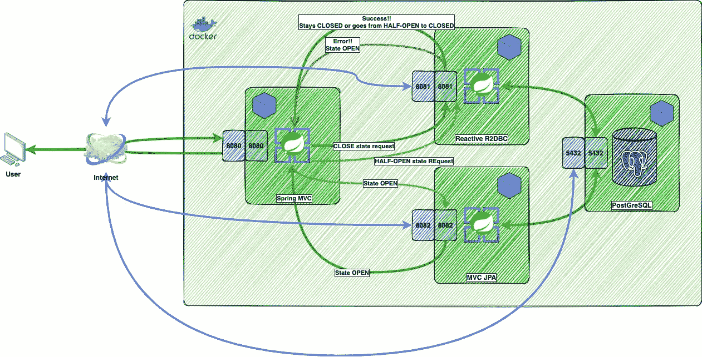
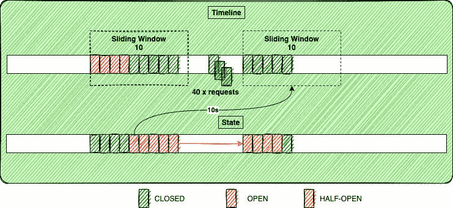
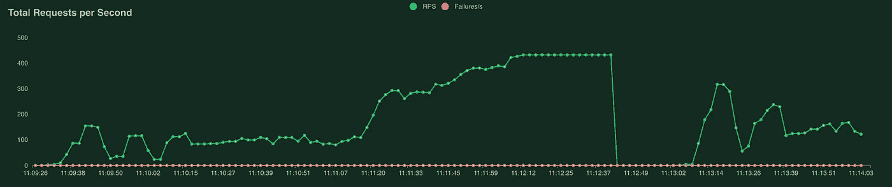
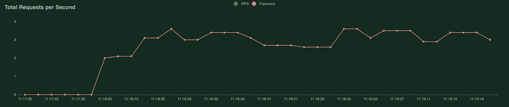

# 城市图书馆——科特林断路器高级指南

> 原文：<https://itnext.io/city-library-an-advanced-guide-to-circuit-breakers-in-kotlin-256393213bdf?source=collection_archive---------3----------------------->


我一直对断路器以及它们如何在软件架构中工作非常感兴趣。我还参与过使用这种设计模式的一个实现的项目。即对于网上大型分销店，很多公司都爱用 Hystrix。然而，海斯特里克斯已经走到了路的尽头，一种新的替代品被称为 [resilience4j](https://github.com/resilience4j/resilience4j) 。不管怎样，我已经看到了使用 Hystrix 的许多方式。可能性是相当广泛的，但是在实践中，在我的职业生涯中，我发现断路器设计模式实现的潜力还不到一半。像[resilie 4j](https://github.com/resilience4j/resilience4j)一样，这种软件设计模式有许多不同的实现，如[故障保护](https://github.com/failsafe-lib/failsafe)、[断路器](https://github.com/sony/gobreaker)、[Scala 断路器](https://github.com/FaKod/Circuit-Breaker-for-Scala)以及许多其他的实现。

提醒我们自己[断路器](https://en.wikipedia.org/wiki/Circuit_breaker)的概念自 19 世纪就已经存在，那时候它与电流增加到不可接受的水平时开关如何切断电路有关。快进到 2017 年，[迈克尔·尼加德](https://twitter.com/mtnygard)出版**发行！设计和部署生产就绪软件(实用程序员)**在这里，他将断路器设计模式的思想带到了软件开发中。

在本文中，我假设您已经知道断路器到底是什么，以及这种设计模式的基本内容是什么。这种设计模式允许多种类型的配置，在我们进行的过程中，我们将看看其中最重要的一些。我还假设你非常熟悉 Spring T1 的工作方式，并且对性能测试工具 T2 蝗虫 T3 的工作方式有所了解。了解一下[反应式编程](https://en.wikipedia.org/wiki/Reactive_programming)在 [Spring WebFlux](https://docs.spring.io/spring-framework/docs/current/reference/html/web-reactive.html) 中是如何使用的也很重要。我们将要看到的实现位于 [GitHub](https://github.com/jesperancinha/advanced-library-management) 上。

# 1.情况

出于演示的目的，我们将建造一个城市图书馆！。我们本质上是要向图书馆提供一本或多本书，只是为了阅读的目的而在线提供给用户。在我们实际构建我们的库的软件之前，我们马上就要考虑这个库是否能满足弹性期望。由于许多用户将使用图书馆，它必须不断地提供给用户。图书馆有一个完美的服务，已经在云中使用了反应式 Spring WebFlux 技术。唯一的缺点是，云提供商有时会进入维护模式。不过，图书馆有一个后备服务。阁楼上一台非常旧的服务器也是为高可用性而设计的。虽然它是一个本地安装，但对于普通的库用户来说已经足够好了。如果需要这种回退，预计库用户将会经历一些延迟。


案件的草图

# 2.断路器

在本节中，我们将通过我设计的单元测试来分析断路器的具体特性。我们将检查断路器状态如何变化，并了解如何通过 Spring health 端点看到这一点。最后，我们将对一起工作的断路器进行彻底的分析，并对结果进行图形分析。



已实施项目概述

为了继续我们的例子，重要的是我们首先看一下一些重要的实现基础。理解以下内容也很重要:在 Kotlin 代码中，我们的断路器设置实际上没有什么变化，因此，我们将只看一下测试 1 中断路器实现的实现。

使用已实施的断路器 almr_testcase_1 实施案例 1 服务

查看这个类，我们看到测试用例 1 的断路器名称是 ***almr_testcase_1*** 。这个实现很容易理解。我们只需要看到回退方法能够接收原始方法的输入参数，并且可以在备选方法调用中使用该参数。例如，如果我们试图获取 Id=1 的书，然后我们得到一个 ***TimeoutException*** ，我们将陷入重载方法 ***getBookByIdJPA*** ，该方法试图调用我们的 JPA 服务。在我们的例子中，我们假设 JPA 服务总是可用的。这一切都是可能的，因为我们已经用***circuit breaker***注释了我们的原始方法，即名为***getBookCBById***的方法。这样，如果我们调用***getBookViaReactiveServiceById***并且成功，我们就不必使用回退方法。然而，如果确实如此，那么我们就陷入了 ***电路断路器*** 算法，这就是本文的目的。

为了了解这个项目的幕后，我们了解我们的***webclient interface***是做什么的也很重要。在这种情况下，检查在运行容器时发生的实现是很重要的。

正如我们之前看到的，这是我们创建我们的发布者或 ***Mono 的*** 的地方。它们将调用反应服务或非反应服务，这取决于与断路器算法的交互。

现在是时候检查测试中发生了什么。在这种情况下，单元测试非常广泛，所以我不会像往常一样在本文中展示整个类。在这种情况下，为了便于说明，将只显示代码的重要部分。但是可以在 [GitHub](https://github.com/jesperancinha/advanced-library-management/tree/main/advanced-library-mngmt-gate/src/test/kotlin/org/jesperancinha/management/gate/services) 上查看代码。

# *2.1。门 1 测试—* almr_testcase_1 *—一般属性。*

在这次测试中，我们检查了`registerHealthIndicator`、`slidingWindowSize`、`slidingWindowSizeType`、`minimumNumberOfCalls`、
、`automaticTransitionFromOpenToHalfOpenEnabled`和`waitDurationInOpenState`。

```
 **registerHealthIndicator**: true
**slidingWindowSize**: 10
**slidingWindowType**: "COUNT_BASED"
**minimumNumberOfCalls**: 5
**failureRateThreshold**: 50
slowCallRateThreshold: 50
**automaticTransitionFromOpenToHalfOpenEnabled**: true
**waitDurationInOpenState**: 1s
**recordExceptions**:
  - org.springframework.web.client.HttpServerErrorException
  - java.util.concurrent.TimeoutException
  - java.io.IOException
  - org.jesperancinha.management.gate.exception.ReactiveAccessException
**ignoreExceptions**:
  - org.jesperancinha.management.gate.exception.IgnoredException 
```

第一步是登记健康指标。该功能对于检查 ***断路器*** 的状态非常重要。为了实现这一点，我们需要激活 Spring actuator 提供的正确的管理端点:

```
management:
  endpoints.web.exposure.include: "*"
  endpoint.health.show-details: *always* health:
    circuitbreakers.enabled: true
    ratelimiters.enabled: true
```

这将使我们的致动器端点可用于:

```
[http://localhost:8080/api/almg/actuator/health](http://localhost:8080/api/almg/actuator/health)
```

这将产生这样的结果:

```
{
   "status":"UP",
   "components":{
      "circuitBreakers":{
         "status":"UP",
         "details":{
            "almr_testcase_3":{
               "status":"UP",
               "details":{
                  "failureRate":"-1.0%",
                  "failureRateThreshold":"50.0%",
                  "slowCallRate":"-1.0%",
                  "slowCallRateThreshold":"50.0%",
                  "bufferedCalls":3,
                  "slowCalls":0,
                  "slowFailedCalls":0,
                  "failedCalls":0,
                  "notPermittedCalls":0,
                  "state":"CLOSED"
               }
            },
(...) },
      "diskSpace":{
         "status":"UP",
         "details":{
            "total":62725623808,
            "free":56340504576,
            "threshold":10485760,
            "exists":true
         }
      },
      "ping":{
         "status":"UP"
      },
      "rateLimiters":{
         "status":"UNKNOWN"
      }
   }
}
```

这只是断路器健康状态的简短形式。我们通常可以看到所有断路器的所有状态。在这种情况下，我们只看到 almr_testcase_3 ***断路器*** 的状态。注意在这种情况下**上升**与**关闭**相同。

为了使我们的单元测试工作，并且这对我们所有的测试用例都有效，我创建了一个特定于健康状态的域模型，以便获得每个 ***断路器*** 的状态属性。这位于 [GitHub](https://github.com/jesperancinha/advanced-library-management/tree/main/advanced-library-mngmt-gate/src/main/kotlin/org/jesperancinha/management/gate/domain) 上。

我们现在可以看看其余的属性。***sliding window size***， **slidingWindowSizeType** ，**minimumnumberofcallows**，**automaticttransitionfromopentohalfopenenabled，failureRateThreshold，**和 **waitDurationInOpenState，**都是我们需要配置的必备属性。Resilience4J 团队提供的文档非常广泛，并且很好地记录了这一点。尽管如此，快速浏览这些属性还是很重要的。也许我们需要考虑的第一件事是断路器如何决定我们何时进入**断开**状态。一旦发生故障，它总是进入**打开**状态。随之而来的逻辑问题是它如何知道从**打开**状态回到**关闭**状态？答案是，不会。它首先需要进入一个半开的 T21 状态。这发生在超时之后。这个超时是由我们的第一个属性决定的:**waitDurationInOpenState***。*一旦发生这种情况，状态从**打开**变为**半开**。在那里，**断路器**会将呼叫重定向到原始服务。这里，它可以回到关闭状态**或仅仅回到打开状态**。这是由我们的下一个属性 **failureRateThreshold** 决定的。在某些情况下，该失败率也决定了从**关闭**到**打开**的成功请求。故障率是通过使用其他配置参数计算的数字。 **minimumNumberOfCalls** 代表开始执行该计算所需的最小调用。***sliding window size****既可以用秒来表示，也可以用多个请求来表示。在计算失败请求的比率时，会考虑落在此滑动窗口内的所有请求。到目前为止，我们只知道如何确定一种失败的请求。这些是我们不能忽略的属性 **ignoreExceptions。**最后，我们看到属性**automatictransfroopentohalfopenenabled**为真。这仅仅意味着我们不需要等待一个请求被完成来自动地使开关从**打开**状态变为**半开**状态。它用于拐角情况。*

*现在是时候看看第一次测试了。这是对属性`recordExceptions`和`ignoreExceptions`的简单测试。*

```
*@Test
fun testGetBookByIdTestWhenIgnoredExceptionThenNull() {
    *every* **{** webClient.getBookViaReactiveServiceById(100L) **}** returns Mono.error(IgnoredException())
    *every* **{** webClient.getBookViaJpaServiceById(100L) **}** returns Mono.just(BookDto(0L, "Solution"))

    val bookById = almG1BookService.getBookById(100L)
    *repeat*(10) **{** val bookById = almG1BookService.getBookCBById(100L)
        bookById.*shouldNotBeNull*()
        bookById.blockOptional().ifPresent **{** book **->** book.title.*shouldBe*("Solution")
            getCBStatus().*shouldBe*("UP")
        **}
    }** getCBStatus().*shouldBe*("UP")

    bookById.*shouldNotBeNull*()
    bookById.blockOptional().ifPresent **{** book **->** book.title.*shouldBe*("Solution") **}** }*
```

*在这种情况下，我们看到 ***断路器*** 状态保持**断开**，即使我们抛出了异常。我们的**ignore exception**当然被忽略了。*

*我们现在可以看看我们的第一个完整的测试。请注意，以下所有测试都将作为该测试的参考。*

```
**every* **{** webClient.getBookViaReactiveServiceById(100L) **}** returns Mono.error(ReactiveAccessException())
*every* **{** webClient.getBookViaJpaServiceById(100L) **}** returns Mono.just(BookDto(0L, "SolutionOpen"))

getCBStatus().*shouldBe*("UP")
*repeat*(4) **{** val bookById = almG1BookService.getBookCBById(100L)
    bookById.*shouldNotBeNull*()
    bookById.blockOptional().ifPresent **{** book **->** book.title.*shouldBe*("SolutionOpen")
    **}
}***
```

*在第一个实例中，我们创建了 4 个针对被动服务失败的请求。我们从非反应式服务得到预测的响应: **SolutionOpen。***

```
*getCBStatus().*shouldBe*("UP")
*every* **{** webClient.getBookViaReactiveServiceById(100L) **}** returns Mono.just(BookDto(0L, "SolutionClosed"))

*runBlocking* **{** val bookById = almG1BookService.getBookCBById(100L)
    bookById.*shouldNotBeNull*()
    bookById.blockOptional().ifPresent **{** book **->** book.title.*shouldBe*("SolutionClosed")
    **}
}***
```

*此时，我们发出一个请求，该请求通过反应服务顺利通过。如果你还没有注意到，我们只是提出了 4 个不成功的请求，然后是一个成功的请求。我们的**minimumnumberofcols**设置为 5，费率设置为 **50%** *。*我们现在显然已经超过了最低可接受速率。*

```
*getCBStatus().*shouldBe*("CIRCUIT_OPEN")

*repeat*(3) **{** val bookById = almG1BookService.getBookCBById(100L)
    bookById.*shouldNotBeNull*()
    bookById.blockOptional().ifPresent **{** book **->** book.title.*shouldBe*("SolutionOpen")
    **}
}** getCBStatus().*shouldBe*("CIRCUIT_OPEN")*
```

*这就是为什么电路现在对于剩余的 3 个成功呼叫保持打开。在这个平衡的比率之后，我们应该能够回到**关闭**的状态。*

```
**repeat*(40) **{** val bookById = almG1BookService.getBookCBById(100L)
    bookById.*shouldNotBeNull*()
    bookById.blockOptional().ifPresent **{** book **->** book.title.*shouldBe*("SolutionOpen")
    **}
}***
```

*在 **40 调用**后，我们不会回到关闭状态，因为它们都发生在不到 1 秒钟内，这是我们为 **waitDurationInOpenState 配置的。***

```
*sleep(1000)
getCBStatus().*shouldBe*("CIRCUIT_HALF_OPEN")
*repeat*(4) **{** val bookById = almG1BookService.getBookCBById(100L)
    bookById.*shouldNotBeNull*()
    bookById.blockOptional().ifPresent **{** book **->** book.title.*shouldBe*("SolutionClosed")
    **}
}***
```

*等待 1 秒后，我们现在处于**半开**状态，但是因为我们回来了，所以滑动窗口被重置。我们还需要一个请求来返回到打开状态。*

```
*getCBStatus().*shouldBe*("CIRCUIT_HALF_OPEN")

*runBlocking* **{** val bookById = almG1BookService.getBookCBById(100L)
    bookById.*shouldNotBeNull*()
    bookById.blockOptional().ifPresent **{** book **->** book.title.*shouldBe*("SolutionClosed")
    **}
}** getCBStatus().*shouldBe*("UP")*
```

*这个测试展示了如何使用所有这些简单的属性。我们现在要深入研究其他不太为人所知但同样重要的属性。*

**

*断路器的滑动窗口图*

# **2.2。门 2 测试—*almr _ test case _ 2—automatictransfroopentohalfopenenabled*

*通过比较这个测试和测试一，我们只想测试
的**automatictransfroopentohalfopenenabled**属性的效果。*

```
***registerHealthIndicator**: true
**slidingWindowSize**: 10
**slidingWindowType**: "COUNT_BASED"
**minimumNumberOfCalls**: 5
**failureRateThreshold**: 50
**slowCallRateThreshold**: 50
**automaticTransitionFromOpenToHalfOpenEnabled**: false
**waitDurationInOpenState**: 1s
**recordExceptions**:
  - org.springframework.web.client.HttpServerErrorException
  - java.util.concurrent.TimeoutException
  - java.io.IOException
  - org.jesperancinha.management.gate.exception.ReactiveAccessException
**ignoreExceptions**:
  - org.jesperancinha.management.gate.exception.IgnoredException*
```

*除了我们没有自动返回到**半开**之外，该测试案例与案例 1 完全相同。*

```
**repeat*(40) **{** val bookById = almG2BookService.getBookCBById(100L)
    bookById.*shouldNotBeNull*()
    bookById.blockOptional().ifPresent **{** book **->** book.title.*shouldBe*("SolutionOpen")
    **}
}** sleep(1000)
getCBStatus().*shouldBe*("CIRCUIT_OPEN")
*repeat*(4) **{** val bookById = almG2BookService.getBookCBById(100L)
    bookById.*shouldNotBeNull*()
    bookById.blockOptional().ifPresent **{** book **->** book.title.*shouldBe*("SolutionClosed")
    **}
}***
```

*当我们在不到一秒钟的时间内发送了 40 个电话后，我们像前面的例子一样等待一秒钟。然而，这次我们得到一个**打开**的状态。*

```
*getCBStatus().*shouldBe*("CIRCUIT_HALF_OPEN")

*runBlocking* **{** val bookById = almG2BookService.getBookCBById(100L)
    bookById.*shouldNotBeNull*()
    bookById.blockOptional().ifPresent **{** book **->** book.title.*shouldBe*("SolutionClosed")
    **}
}***
```

*在一个或多个请求之后，它最终跳转到**半开**状态。*

# **2.3。闸门 3 测试—* almr_testcase_3 —慢速呼叫*

*在测试中，我们检查属性`slowCallDurationThreshold`和`slowCallRateThreshold`*

```
***registerHealthIndicator**: true
**slowCallRateThreshold**: 50f
**slowCallDurationThreshold**: 100
**slidingWindowSize**: 10
**slidingWindowType**: "COUNT_BASED"
**minimumNumberOfCalls**: 5
**failureRateThreshold**: 50
**automaticTransitionFromOpenToHalfOpenEnabled**: true
**waitDurationInOpenState**: 1s
**recordExceptions**:
  - org.springframework.web.client.HttpServerErrorException
  - java.util.concurrent.TimeoutException
  - java.io.IOException
  - org.jesperancinha.management.gate.exception.ReactiveAccessException
**ignoreExceptions**:
  - org.jesperancinha.management.gate.exception.IgnoredException*
```

*我们可以计算的另一种错误是基于慢速收集的错误。这通过**slowcallrateshold**和**slowCallDurationThreshold***来管理。*这些是以百分比和毫秒来衡量的。*

```
**every* **{** webClient.getBookViaReactiveServiceById(100L) **}** returns Mono.just(BookDto(0L, "SolutionSlow"))
    .delayElement(
        Duration.ofMillis(200)
    )
*every* **{** webClient.getBookViaJpaServiceById(100L) **}** returns Mono.just(BookDto(0L, "SolutionOpen"))

getCBStatus().*shouldBe*("UP")
*repeat*(4) **{** val bookById = almG3BookService.getBookCBById(100L)
    bookById.*shouldNotBeNull*()
    bookById.blockOptional().ifPresent **{** book **->** book.title.*shouldBe*("SolutionSlow")
    **}
}***
```

*除此之外，这个测试与测试用例 1 没有什么不同。唯一的区别是，这一个是基于超时的，我们可以看到，它处理超时的方式与所有其他可接受的异常相同。*

# ***2.4*。门 4 测试—almr _ test case _ 4—permittednumberofcallsinhalfonstate****

*在中对比检验我们`permittedNumberOfCallsInHalfOpenState`的财产。*

```
***registerHealthIndicator**: true
**slidingWindowSize**: 10
**slidingWindowType**: "COUNT_BASED"
**minimumNumberOfCalls**: 5
**failureRateThreshold**: 50
**slowCallRateThreshold**: 50
**automaticTransitionFromOpenToHalfOpenEnabled**: true
**waitDurationInOpenState**: 1s
**permittedNumberOfCallsInHalfOpenState**: 2
**recordExceptions**:
  - org.springframework.web.client.HttpServerErrorException
  - java.util.concurrent.TimeoutException
  - java.io.IOException
  - org.jesperancinha.management.gate.exception.ReactiveAccessException
**ignoreExceptions**:
  - org.jesperancinha.management.gate.exception.IgnoredException*
```

*属性**permittednumberofcallsinhalpopenstate，**意味着**半开**状态将保持到所配置的最大调用数。*

```
**repeat*(40) **{** val bookById = almG4BookService.getBookCBById(100L)
    bookById.*shouldNotBeNull*()
    bookById.blockOptional().ifPresent **{** book **->** book.title.*shouldBe*("SolutionOpen")
    **}
}** sleep(1000)
getCBStatus().*shouldBe*("CIRCUIT_HALF_OPEN")
*repeat*(4) **{** val bookById = almG4BookService.getBookCBById(100L)
    bookById.*shouldNotBeNull*()
    bookById.blockOptional().ifPresent **{** book **->** book.title.*shouldBe*("SolutionClosed")
    **}
}** getCBStatus().*shouldBe*("UP")*
```

*在我们的例子中，我们配置了两个调用。因为他们成功了，我们通过了 2 阈值，这意味着我们直接进入**关闭**状态。应该小心使用该属性，因为它可能会绕过我们可能会用到的某些计算。*

# ***2.5*。门 5 测试— almr_testcase_5 —基于时间****

*T 估计`slidingWindowType`的`TIME_BASED`值。*

```
***registerHealthIndicator**: true
**slidingWindowSize**: 1
**slidingWindowType**: "TIME_BASED"
**minimumNumberOfCalls**: 5
**failureRateThreshold**: 50
**slowCallRateThreshold**: 50
**automaticTransitionFromOpenToHalfOpenEnabled**: true
**waitDurationInOpenState**: 1s
**recordExceptions**:
  - org.springframework.web.client.HttpServerErrorException
  - java.util.concurrent.TimeoutException
  - java.io.IOException
  - org.jesperancinha.management.gate.exception.ReactiveAccessException
**ignoreExceptions**:
  - org.jesperancinha.management.gate.exception.IgnoredException*
```

*如果**滑动窗口类型**是基于**时间的** ，那么我们就不能轻易预测将要发生什么。我们基本上只是说我们的窗口以时间的有序方式滑动。时间是一个不容易跟上的变量，因此案例 5 的单元测试在预期结果方面包含了许多变化。*

```
*getCBStatus() *shouldBeIn listOf*("UP", "CIRCUIT_OPEN")

*repeat*(40) **{** val bookById = almG5BookService.getBookCBById(100L)
    bookById.*shouldNotBeNull*()
    bookById.blockOptional().ifPresent **{** book **->** book.title *shouldBeIn listOf*("SolutionClosed", "SolutionOpen")
    **}
}** sleep(1000)
getCBStatus() *shouldBeIn listOf*("UP", "CIRCUIT_OPEN", "CIRCUIT_HALF_OPEN")
*repeat*(4) **{** val bookById = almG5BookService.getBookCBById(100L)
    bookById.*shouldNotBeNull*()
    bookById.blockOptional().ifPresent **{** book **->** book.title.*shouldBe*("SolutionClosed")
    **}
}***
```

# *5.运行示例*

*为了让事情变得简单，我创建了一些脚本来运行整个应用程序。它一步到位，然后你要做的就是启动轨迹。*

1.  *启动 docker-撰写*

```
*make docker-clean-build-start*
```

*2.开始蝗虫*

```
*make locust-start*
```

*3.进入蝗虫主页 [http://0.0.0.0:8089/](http://0.0.0.0:8089/)*

**

*蝗虫主页*

*4.做出选择。对我来说，拥有 10 个用户和每秒 10 个用户的产卵率会更好。*

*5.您可以选择创建一本书或几本书。查看[回购](https://github.com/jesperancinha/advanced-library-management)获取更多示例。*

```
*curl -X POST -H "Content-Type: application/json" --data '{"id": 1,
    "title": "Wild",
    "authors": [
      "Chery Strayed"
    ],
    "year": 2012,
    "publisher": "Uitgeverij Rainbow B.V."
  }' http://localhost:8080/api/almg/books/g1*
```

# ***6。蝗虫图形***

*L ocust 是一个非常容易学习的工具，尤其是对于这个例子来说。请查看 [locust 文档](https://locust.io/)中的安装说明。我已经进行了一些测试，结果可以在 [GitHub](https://github.com/jesperancinha/advanced-library-management/tree/main/docs/reports) 上获得。*

**

*waitDurationInOpenState = 1s*

*我们的默认示例运行在一个为 1s 的 **waitDurationInOpenState** 上。这并没有提供很好的结果，纯粹是因为在**打开**状态下的 1 秒是很难想象的。在我们没有收到任何请求的这段时间里，我关闭了反应式服务，然后是 MVC-JPA 服务。为了停止这些服务，我为此创建了一些脚本。所以如果想停止反应式服务，可以使用`make docker-stop-reactive`。如果你想停止 MVC 服务，你可以运行`make docker-stop-mvc`。*

*过去的结果是我在**docker**Spring**profile 中将该值增加到 10s 的原因。***

**

*waitDurationInOpenState = 10s*

*这张图表分成三个非常明显的部分。左边部分是我启动 docker 映像和停止反应服务的地方。正如您所看到的，在测试开始时，似乎有一个大约 10 秒的较高的速率间隔，由一个低速率的小间隔隔开。所有 5 个断路器仍然彼此相当同步，并且它们都保持在**打开**状态 10 秒钟，然后返回到**半** - **打开**状态，在那里它们试图达到成功率。这从来没有发生过，相反，他们达到超时。这有助于提高下一个周期的答复率。因为所有这些断路器都有稍微不同的规则，所以它们各自对成功请求的总体比率的贡献在 11:10.15 和 11:11.07 之间变得混杂和相当同质。这是我重新激活反应服务的地方。这使得**断路器**回到**闭合**状态。成功消息的比率变高有两个原因。我们现在通过反应服务获得响应，并且电路也是**闭合的。**如果电路是**闭合的**，我们不需要引入任何测试成本。在 11:12.37 左右的某个时刻，我再次停止了被动服务。发送的大量消息会导致 gate 在大约 20 秒内看起来没有反应。在时间戳 11:13.02，速率以与开始时相同的模式上下波动。**断路器**再次从**打开**切换到**半开**以及从**半开**切换到**打开。**正如我们之前所看到的，这些都是昂贵的操作，一旦反应服务重新上线，我们需要看看是否能让网关尽可能高效地工作。*

*完整执行测试期间零故障(假设内部服务没有故障)*

*这张表可能是我们的结果中最令人惊讶的。正如我们所看到的，尽管我们看到了对 gate 的成功请求率的巨大变化，但是没有一个失败。*

**

*waitDurationInOpenState =10(没有可用的支持服务)*

*作为控制测试，我们确实看到，如果 gate 正在运行，请求确实会失败，但是 reactive 和 MVC 服务都关闭了。*

# *6.结论*

*在本文中，我们看到了断路器通过不同的配置以多种方式为我们服务。这个例子与真实场景的共同点是对其他服务和数据源的短路。断路器可以让你觉得它很像一个负载平衡器。然而，尽管有一些相似之处，差别还是相当大的。这两种解决方案都可以为我们所知的提供相同信息的数据源提供另一条路径。*

*然而，这是相似之处的终点。在断路器的情况下，这实际上取决于需求，但是替代数据源不一定必须提供与原始数据源相同的数据。当主要源头出现问题时，它就会被激活。例如，主要来源可以是一组服务。如果某个连接出了问题，断路器的工作就是检测到这一点，并把所有的流量重定向到新的源头。这时我们说我们的断路器进入状态**打开**。*

*正如我们所看到的，我们也有一个检测算法，一旦它再次可用，就再次返回到主源。反过来，这可能取决于错误频率给定缓慢的请求或只是后端的错误。我们还可以定义重要的错误，以及我们可以忽略的错误。我们也可以将其配置为简单的超时工作。使用超时，我们可以强制断路器尝试连接到原始源。这当然是有成本的，但是它也可以使从**半开**状态回到**关闭**状态更快。*

*我们的断路器检测的方式可以非常简单，也可以非常复杂。在这种情况下，我们需要使用像[蝗虫](https://locust.io/)、[加特林](https://gatling.io/)、 [JMeter](https://jmeter.apache.org/) 或其他工具，精确地研究我们希望这种配置如何对我们最有利。*

*我已经把这个应用程序的所有源代码放在了 GitHub 上*

*我希望你能像我喜欢写这篇文章一样喜欢它。我尽量让它简洁明了，并省略了许多小细节。*

*我很想听听你的想法，所以请在下面留下你的评论。*

*提前感谢您的帮助，感谢您的阅读！*

# *7.参考*

 *[## 介绍

### Resilience4j 是一个轻量级、易于使用的容错库，受 Netflix Hystrix 的启发，但专为 Java 8…

resilience4j.readme.io](https://resilience4j.readme.io/docs)* *[](https://locust.io/) [## locust——现代负载测试框架

### 编辑描述

locust.io](https://locust.io/) [](https://www.luminis.eu/blog/building-resilient-connections-using-a-circuit-breaker/) [## 使用断路器建立弹性连接-照明

### 软件系统是越来越多的集成系统。它们与数据存储、日志和监控系统相集成…

www.luminis.eu](https://www.luminis.eu/blog/building-resilient-connections-using-a-circuit-breaker/) [](https://www.webagesolutions.com/blog/how-to-use-resilience4j-to-implement-circuit-breaker) [## 如何用 Resilience4j 实现断路器？

### 本课程改编自网络时代课程通过 Spring Boot 和 Spring Cloud 掌握微服务。电路…

www.webagesolutions.com](https://www.webagesolutions.com/blog/how-to-use-resilience4j-to-implement-circuit-breaker)  [## Apache Camel 帮助您集成 300 多个不同的系统！

### 配置滑动窗口的类型，当断路器处于…状态时，滑动窗口用于记录呼叫结果

camel.apache.org](https://camel.apache.org/components/latest/eips/resilience4jConfiguration-eip.html)*