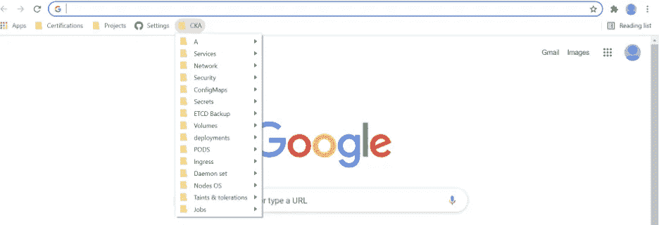
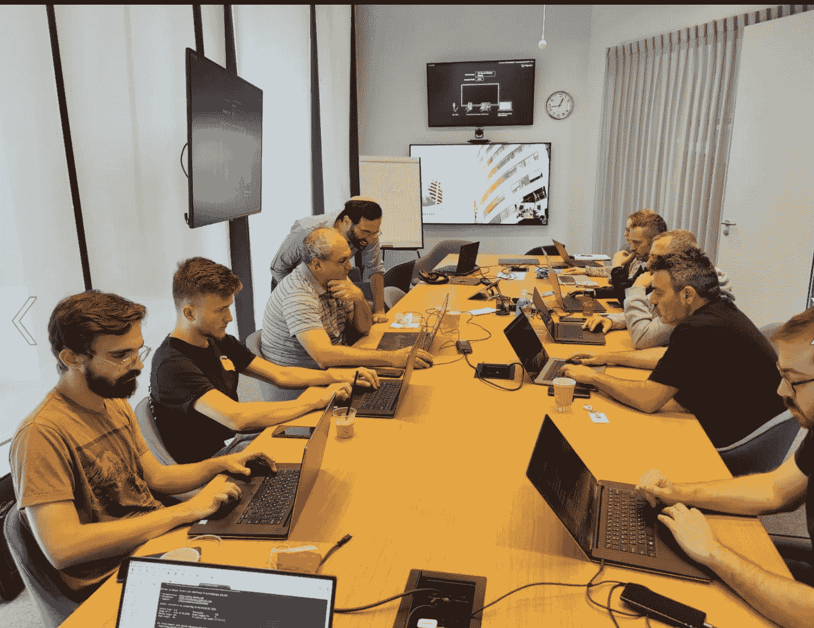
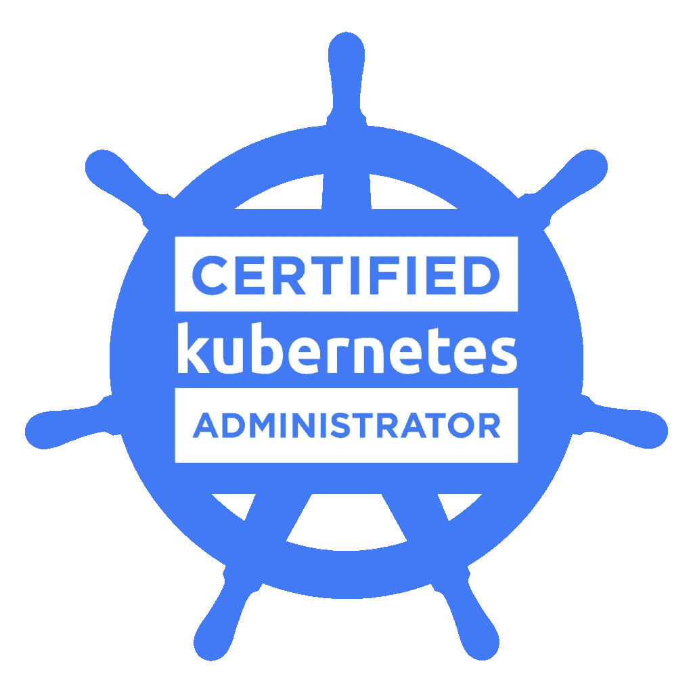

# CKA 证明了正确的方法

> 原文：<https://itnext.io/cka-certified-the-right-way-bc85e347c3cc?source=collection_archive---------0----------------------->

# CKA 之路

作为评分最高的开源项目之一，Kubernete 的使用量简直是爆炸！
**云本地计算基金会**致力于发展 Kubernetes 管理员社区，从而允许使用 Kubernetes 的众多公司和组织持续发展。

[认证是这一过程中的关键一步](https://www.cncf.io/announcement/2016/11/08/cloud-native-computing-foundation-launches-certification-training-managed-service-provider-program-kubernetes/)，认证管理员可以快速建立自己在就业市场上的信誉和价值，公司也可以更快地雇佣高质量的团队来支持他们的发展。

# 考试结构

根据官方认证课程的课程设置和考试细节，通常有五个类别:

集群架构、安装和配置，25%

工作负载和时间安排，15%

服务和网络，20%

存储，10%

故障排除，30%

考试需要 2 个小时，而我的情况是，有 17 道题。问题的数量可能不同。

# 不要低估这些主题

在学习过程中，人们倾向于关注 Kubectl 的应用环境，避免学习 Kubernetes 与 IT 相关的方面。
**巨大的错误！**
请确保您至少了解与 IT 相关的主题:

> etcd 备份/恢复
> 
> 使用 kubectl top
> 
> kubeadm 升级

# 了解你的医生！

考试期间，您可以使用以下网站:

[https://kubernetes.io/doc](https://kubernetes.io/docs)

[https://github.com/kubernetes](https://github.com/kubernetes)

[https://kubernetes.io/blog](https://kubernetes.io/blog)

绝大多数问题的答案都在这些文件中。
你需要知道如何在这些文档中快速导航
学习如何在 K8s 文档中有效地找到自己的路，当你找到一个想要的主题的有用页面时，你可以**将它加入书签**。考试中允许有书签！
不要错过让你的考试体验更高效、更轻松的机会！



我的书签

# 你的首选武器

在考试期间，Kubectl 是你的“最好的朋友”和与 Kubernetes 互动的主要工具。

Kubernetes 提供了两种定义/管理配置的方法:

1-命令式—使用 CLI 管理 Kubernetes 对象—命令式命令
2-声明式—通过以 YAML 文件格式定义 Kubernetes 对象。

大多数任务都可以通过使用 Kubectl 这种“命令式方法”来完成，并为您节省大量时间。

> [Kubectl 参考文档(kubernetes.io)](https://kubernetes.io/docs/reference/generated/kubectl/kubectl-commands)

此外，确保您知道如何利用 Kubectl 工具生成 YAML 模板，如下例所示:
*用****Nginx****image 和****label env = prod****:*生成 pod 的 YAML 文件

```
kubectl run nginx --image=nginx --labels=env=pro --dry-run=client -o yaml > nginx_pod.yaml
```

# 了解考试的环境

截至 2021 年 6 月， [killer.sh](https://killer.sh/) 网站是市场上最好的模拟器之一，在你注册考试时，它会为你提供免费课程。
请利用这个强大的工具，并在考试前使用它来保持你的动力，它将帮助你以更强的技术和更大的驱动力&信心参加考试。

> [Linux Foundation Kubernetes 认证现在包括考试模拟器|云本地计算基础(cncf.io)](https://www.cncf.io/announcements/2021/06/02/linux-foundation-kubernetes-certifications-now-include-exam-simulator/?utm_content=168763729&utm_medium=social&utm_source=linkedin&hss_channel=lcp-12893459)

此外，看看这个官方的 CNCF 短片，以了解考试的环境将会是什么样子

> [https://www.youtube.com/watch?v=9UqkWcdy140](https://www.youtube.com/watch?v=9UqkWcdy140)

# 苦尽甘来(奖金)

如果你有时间，请阅读 Kubernetes the hard way
*Kubernetes the hard way*将带你完成手动安装过程。您将学习如何安装、配置和创建组件之间的加密连接。

这是一个了解不同的 Kubernetes 组件如何协同工作的好机会。

# 考试那天

1-在考试当天，您将有一个基于网络的终端和一个基于网络的记事本可以使用。Kubectl 的自动补全功能将是最省时的功能之一。由于一些难以理解的奇怪原因，考试环境并不总是自动配置它。
帮自己一个大忙，把这一页收藏起来[https://kubernetes.io/docs/reference/kubectl/cheatsheet/](https://kubernetes.io/docs/reference/kubectl/cheatsheet/)):
在开始考试时运行这些命令:

```
*# setup autocomplete in bash into the current shell, bash-completion package should be installed first.* source <(kubectl completion bash)
*# add autocomplete permanently to your bash shell.* echo "source <(kubectl completion bash)" >> ~/.bashrc 
```

2-在考试的环境中，你会得到五个左右的集群 k8s，hk8s，mk8s，wk8 等。对于每个问题，您都将获得切换到正确上下文的命令，如下所示

```
kubectl config use-context k8s
```

对于每一个问题，每次都要转换环境，每次都要转换环境，每次都要转换环境，一开始可能会很烦人，但是安全总比后悔好。

3-这听起来可能很滑稽，但是**去厕所**，不像其他不实用的考试，如果你要遇到技术问题，你不会有那么多时间，省下一大堆问题，直接去做

4-有很多问题超级容易做，会花你一分钟左右的时间。如果你看到一个问题要花你 4-5 分钟以上的时间，就把它标记出来，在你解决了前面所有简单或简短的问题后再回来。

# 现场或缩放培训

如果您是 R&D、DevOps 或 IT 团队的一员，并且您希望您的团队获得以下领域的认证或知识:
容器、Kubernetes 和其他 DevOps 工具，请不要犹豫，与我联系。我和我的团队将为您的需求提供最佳的定制解决方案。



我的 Kubernetes 课程

[或 Maman | LinkedIn](https://www.linkedin.com/in/ormaman/)

or.maman@nice.com

# 快乐学习者体验**😃**:

> [Post-1 | LinkedIn](https://www.linkedin.com/posts/ormaman_philips-docker-sela-activity-6634499640211451905-Rwna/) —菲利普斯医疗保健公司的 Docker 课程
> 
> [Post-2 | LinkedIn](https://www.linkedin.com/posts/ormaman_rhinops-kubernetes-docker-activity-6803346745167290369-TJKg/)—Finastra 的 Kubernetes 课程
> 
> [Post-3 | LinkedIn](https://www.linkedin.com/posts/ormaman_informatica-docker-sela-activity-6627298485681160192-rMXB/)—Informatica 的 Docker 课程

