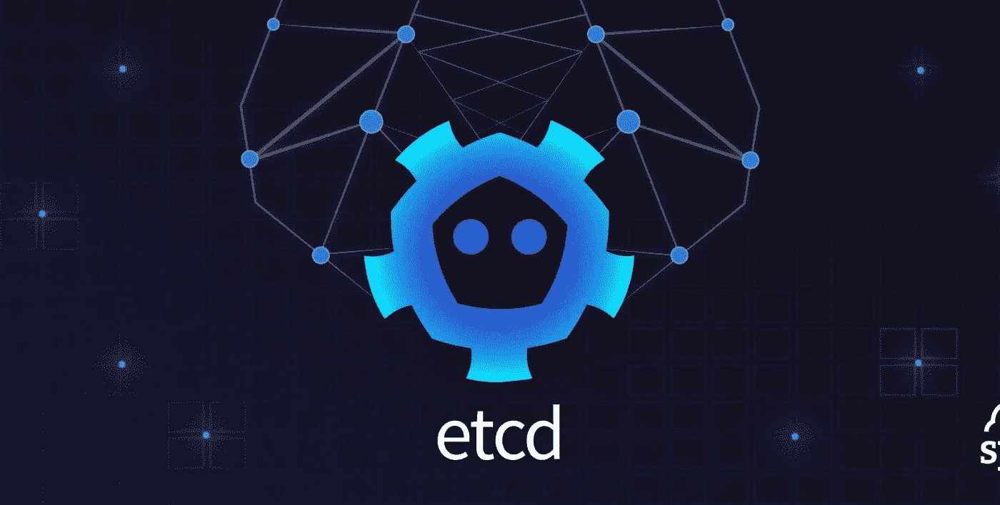
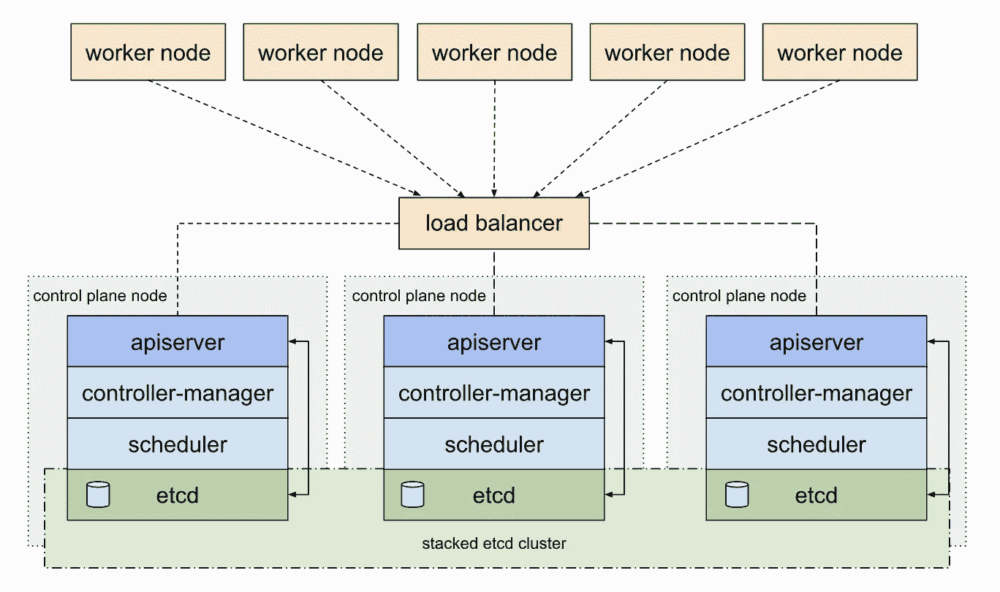
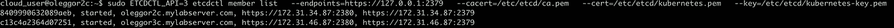
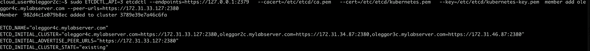
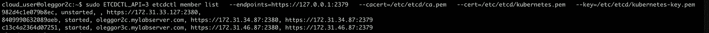
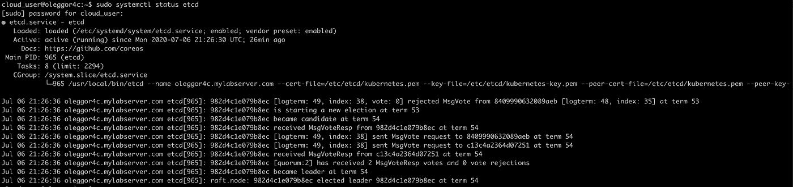
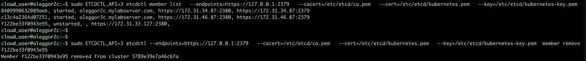
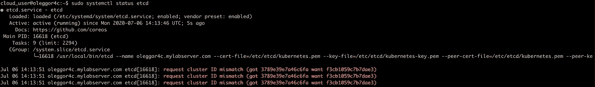
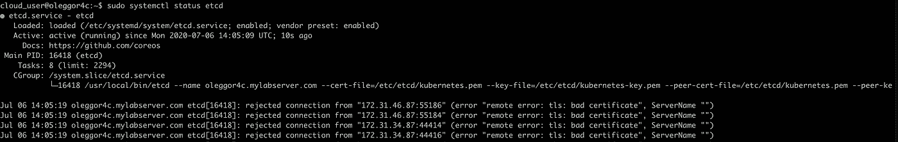

# CKA/CKAD 考试:管理 ETCD 集群

> 原文：<https://itnext.io/cka-ckad-exam-managing-etcd-cluster-fc3feecfab5c?source=collection_archive---------4----------------------->



# 一点上下文。

作为准备 Kubernetes 认证管理员(CKA)和认证 Kubernetes 应用程序开发员(CKAD)考试的一部分，我必须深入管理 Etcd 集群例程，并完成安装、添加、删除节点、管理证书等所有手动过程。Etcd 对我来说并不陌生，我以前使用过 Etcd 集群，并在一些项目中使用过它，但是最近还没有机会使用 Etcd。换句话说，几年没碰了。令我惊讶和敬畏的是，Etcd 已经发展成为一个相当先进和成熟的产品。因此，这个关于如何管理 Etcd 集群的小故事和我偶然发现的一些障碍，当然，都是在准备考试的背景下。

# 让我们做一些蚀刻

众所周知，Etcd 是 Kubernetes 的一个关键组件，因为它存储了集群的整个状态:配置、规格和正在运行的工作负载的状态。你可能会认为这是对 Kubernetes 的回忆。这里是 Etc [操作指南](https://etcd.io/docs/v3.4.0/op-guide/)的快速链接，我将在接下来的章节中大量引用。此外，链接到经典的[kubernes The Hard Way](https://github.com/kelseyhightower/kubernetes-the-hard-way)，虽然凯尔西的指南使用一些 GCP CLI 命令和 GCP 环境，我的部署在 AWS 环境中，所以你会看到一些差异。还有一个相关链接[管理 kubernetes.io 上的 Etcd 集群](https://kubernetes.io/docs/tasks/administer-cluster/configure-upgrade-etcd/)。

我的学习集群的部署架构看起来是这样的: **3 个控制器/主节点、2 个工作节点和 1 个负载平衡器节点**。而且，您可能知道，我们将只需要在主/控制器节点上部署 Etcd。



主节点上的 Etcd。资料来源:Kubernetes docs

还有非常酷的在线 Etcd 游乐场 [play.etcd.io](http://play.etcd.io/) 。

# 先决条件

好吧，首先..让我们为节点编写环境脚本(假设节点已启动并准备就绪)，每个节点由 3 个变量描述`<node type>_HOST` - DNS 节点名称、`<node type>_IP` -节点的私有 IP 和`<node type>_IP_PUB` -节点的公共 IP，以便从您的笔记本电脑连接到它。

```
# env.sh
#!/usr/bin/env bash# load balancer
export LB_HOST=oleggor1c.mylabserver.com
export LB_IP=172.31.43.80
export LB_IP_PUB=54.245.131.142# master 1
export CONTROLLER0_HOST=oleggor2c.mylabserver.com
export CONTROLLER0_IP=172.31.34.87
export CONTROLLER0_IP_PUB=54.149.219.59# master 2
export CONTROLLER1_HOST=oleggor3c.mylabserver.com
export CONTROLLER1_IP=172.31.46.87
export CONTROLLER1_IP_PUB=52.41.230.156# master 3
export CONTROLLER2_HOST=oleggor4c.mylabserver.com
export CONTROLLER2_IP=172.31.33.127
export CONTROLLER2_IP_PUB=35.163.200.225# worker 1
export WORKER0_HOST=oleggor5c.mylabserver.com
export WORKER0_IP=172.31.35.78
export WORKER0_IP_PUB=52.27.6.98# worker 2
export WORKER1_HOST=oleggor6c.mylabserver.com
export WORKER1_IP=172.31.47.59
export WORKER1_IP_PUB=54.184.144.135
```

确保您的工作目录中有这个`env.sh`。这样做是为了方便和加快速度，所以每次我们销毁节点并启动新的节点时，我们只需更新`env.sh`脚本中的 IPs，然后重新运行所有其他脚本，正如您在下面几节中看到的。

为了避免任何类型的复制过去错误，我将为每个控制器节点打开 3 个终端(或终端选项卡),并对控制器节点#0 使用 SSH，例如:

```
source env.sh && ssh cloud_user@$CONTROLLER0_IP_PUB
```

这也有助于考试，尤其是如果你使用 tmux 或类似的工具。

# 生成证书

对于那些经历过凯尔西的艰难历程的人来说，是时候获得证书了。我将使用下面的脚本`generate-certs.sh`:

```
#!/usr/bin/env bash
source ./env.shcat > ca-config.json << EOF
{
  "signing": {
    "default": {
      "expiry": "8760h"
    },
    "profiles": {
      "kubernetes": {
        "usages": ["signing", "key encipherment", "server auth", "client auth"],
        "expiry": "8760h"
      }
    }
  }
}
EOFcat > ca-csr.json << EOF
{
  "CN": "Kubernetes",
  "key": {
    "algo": "rsa",
    "size": 2048
  },
  "names": [
    {
      "C": "US",
      "L": "Portland",
      "O": "Kubernetes",
      "OU": "CA",
      "ST": "Oregon"
    }
  ]
}
EOF
cfssl gencert -initca ca-csr.json | cfssljson -bare cacat > admin-csr.json << EOF
{
  "CN": "admin",
  "key": {
    "algo": "rsa",
    "size": 2048
  },
  "names": [
    {
      "C": "US",
      "L": "Portland",
      "O": "system:masters",
      "OU": "Kubernetes The Hard Way",
      "ST": "Oregon"
    }
  ]
}
EOF
cfssl gencert \
  -ca=ca.pem \
  -ca-key=ca-key.pem \
  -config=ca-config.json \
  -profile=kubernetes \
  admin-csr.json | cfssljson -bare admincat > ${WORKER0_HOST}-csr.json << EOF
{
    "CN": "system:node:${WORKER0_HOST}",
    "key": {
      "algo": "rsa",
      "size": 2048
    },
    "names": [
      {
        "C": "US",
        "L": "Portland",
        "O": "system:nodes",
        "OU": "Kubernetes The Hard Way",
        "ST": "Oregon"
      }
    ]
  }
EOF
cfssl gencert \
  -ca=ca.pem \
  -ca-key=ca-key.pem \
  -config=ca-config.json \
  -hostname=${WORKER0_IP},${WORKER0_HOST} \
  -profile=kubernetes \
  ${WORKER0_HOST}-csr.json | cfssljson -bare ${WORKER0_HOST}cat > ${WORKER1_HOST}-csr.json << EOF
{
    "CN": "system:node:${WORKER1_HOST}",
    "key": {
      "algo": "rsa",
      "size": 2048
    },
    "names": [
      {
        "C": "US",
        "L": "Portland",
        "O": "system:nodes",
        "OU": "Kubernetes The Hard Way",
        "ST": "Oregon"
      }
    ]
  }
EOF
cfssl gencert \
    -ca=ca.pem \
    -ca-key=ca-key.pem \
    -config=ca-config.json \
    -hostname=${WORKER1_IP},${WORKER1_HOST} \
    -profile=kubernetes \
    ${WORKER1_HOST}-csr.json | cfssljson -bare ${WORKER1_HOST}cat > kube-controller-manager-csr.json << EOF
{
      "CN": "system:kube-controller-manager",
      "key": {
        "algo": "rsa",
        "size": 2048
      },
      "names": [
        {
          "C": "US",
          "L": "Portland",
          "O": "system:kube-controller-manager",
          "OU": "Kubernetes The Hard Way",
          "ST": "Oregon"
        }
      ]
}
EOF
cfssl gencert \
    -ca=ca.pem \
    -ca-key=ca-key.pem \
    -config=ca-config.json \
    -profile=kubernetes \
    kube-controller-manager-csr.json | cfssljson -bare kube-controller-managercat > kube-proxy-csr.json << EOF
{
  "CN": "system:kube-proxy",
  "key": {
    "algo": "rsa",
    "size": 2048
  },
  "names": [
    {
      "C": "US",
      "L": "Portland",
      "O": "system:node-proxier",
      "OU": "Kubernetes The Hard Way",
      "ST": "Oregon"
    }
  ]
}
EOF
cfssl gencert \
  -ca=ca.pem \
  -ca-key=ca-key.pem \
  -config=ca-config.json \
  -profile=kubernetes \
  kube-proxy-csr.json | cfssljson -bare kube-proxycat > kube-scheduler-csr.json << EOF
{
  "CN": "system:kube-scheduler",
  "key": {
    "algo": "rsa",
    "size": 2048
  },
  "names": [
    {
      "C": "US",
      "L": "Portland",
      "O": "system:kube-scheduler",
      "OU": "Kubernetes The Hard Way",
      "ST": "Oregon"
    }
  ]
}
EOF
cfssl gencert \
  -ca=ca.pem \
  -ca-key=ca-key.pem \
  -config=ca-config.json \
  -profile=kubernetes \
  kube-scheduler-csr.json | cfssljson -bare kube-schedulerCERT_HOSTNAMES=10.32.0.1,${CONTROLLER0_IP},${CONTROLLER0_HOST},${CONTROLLER1_HOST},${CONTROLLER1_IP},${CONTROLLER2_HOST},${CONTROLLER2_IP},${LB_IP},${LB_HOST},${LB_IP_PUB},127.0.0.1,localhost,kubernetes.defaultcat > kubernetes-csr.json << EOF
{
  "CN": "kubernetes",
  "key": {
    "algo": "rsa",
    "size": 2048
  },
  "names": [
    {
      "C": "US",
      "L": "Portland",
      "O": "Kubernetes",
      "OU": "Kubernetes The Hard Way",
      "ST": "Oregon"
    }
  ]
}
EOF
cfssl gencert \
  -ca=ca.pem \
  -ca-key=ca-key.pem \
  -config=ca-config.json \
  -hostname=${CERT_HOSTNAMES} \
  -profile=kubernetes \
  kubernetes-csr.json | cfssljson -bare kubernetescat > service-account-csr.json << EOF
{
  "CN": "service-accounts",
  "key": {
    "algo": "rsa",
    "size": 2048
  },
  "names": [
    {
      "C": "US",
      "L": "Portland",
      "O": "Kubernetes",
      "OU": "Kubernetes The Hard Way",
      "ST": "Oregon"
    }
  ]
}
EOF
cfssl gencert \
  -ca=ca.pem \
  -ca-key=ca-key.pem \
  -config=ca-config.json \
  -profile=kubernetes \
  service-account-csr.json | cfssljson -bare service-account
```

请注意用于生成`kubernetes.pem`证书的变量`CERT_HOSTNAMES`，我稍后会用到它。

执行该脚本后，您应该看到 CA 证书和 8 对 TLS 证书:

```
ca-config.json
ca-csr.json
ca.pem
ca-key.pem
ca.csr
admin-csr.json
admin.pem
admin-key.pem
admin.csr
oleggor5c.mylabserver.com-csr.json
oleggor5c.mylabserver.com.pem
oleggor5c.mylabserver.com-key.pem
oleggor5c.mylabserver.com.csr
oleggor6c.mylabserver.com-csr.json
oleggor6c.mylabserver.com.pem
oleggor6c.mylabserver.com-key.pem
oleggor6c.mylabserver.com.csr
kube-controller-manager-csr.json
kube-controller-manager.pem
kube-controller-manager-key.pem
kube-controller-manager.csr
kube-proxy-csr.json
kube-proxy.pem
kube-proxy-key.pem
kube-proxy.csr
kube-scheduler-csr.json
kube-scheduler.pem
kube-scheduler-key.pem
kube-scheduler.csr
kubernetes-csr.json
kubernetes.pem
kubernetes-key.pem
kubernetes.csr
service-account-csr.json
service-account.pem
service-account-key.pem
service-account.csr
```

为了设置 Etcd 集群，我们只需要 3 个文件:`ca.pem kubernetes-key.pem kubernetes.pem`。剩余的证书&密钥用于多个 Kubernetes 服务。

# 分发证书

下一步是将 CA 和 TLS 证书复制到控制器节点。为此，有一个方便的脚本`distribute-certs.sh`:

```
#!/usr/bin/env bash
source ./env.shscp env.sh ca.pem ca-key.pem kubernetes-key.pem kubernetes.pem \
    service-account-key.pem service-account.pem \
    user@${CONTROLLER0_IP_PUB}:~/
scp env.sh ca.pem ca-key.pem kubernetes-key.pem kubernetes.pem \
    service-account-key.pem service-account.pem \
    user@${CONTROLLER1_IP_PUB}:~/
scp env.sh ca.pem ca-key.pem kubernetes-key.pem kubernetes.pem \
    service-account-key.pem service-account.pem \
    user@${CONTROLLER2_IP_PUB}:~/
```

它使用`user`帐户将证书上传到主目录的节点上，因此我们将不得不在以后将证书放在适当的位置。如你所见，这也上传了环境脚本(`env.sh`)，这将帮助我们在接下来的步骤中加快速度。

# 在主节点上部署 Etcd

下一步是将 Etcd 二进制文件放到每个节点上，并将证书放到正确的位置。在节点`${CONTROLLER0_IP_PUB} ${CONTROLLER1_IP_PUB} ${CONTROLLER2_IP_PUB}`上运行以下程序:

```
wget -q --show-progress --https-only --timestamping \
  "[https://github.com/coreos/etcd/releases/download/v3.3.5/etcd-v3.3.5-linux-amd64.tar.gz](https://github.com/coreos/etcd/releases/download/v3.3.5/etcd-v3.3.5-linux-amd64.tar.gz)"
tar -xvf etcd-v3.3.5-linux-amd64.tar.gz
sudo mv etcd-v3.3.5-linux-amd64/etcd* /usr/local/bin/
sudo mkdir -p /etc/etcd /var/lib/etcd
sudo cp ca.pem kubernetes-key.pem kubernetes.pem /etc/etcd/
```

并且，确认所有证书都在正确的位置:

```
ls -ltr /etc/etcd/*
```

# 引导 Etcd 节点

**以下步骤只能在** `**${CONTROLLER0_IP_PUB} ${CONTROLLER1_IP_PUB}**` **上执行！原因是——我们将练习在 Etcd 集群中添加和删除节点。**

设置一些环境变量:

```
ETCD_NAME=$(hostname)
INTERNAL_IP=$(curl [http://169.254.169.254/latest/meta-data/local-ipv4](http://169.254.169.254/latest/meta-data/local-ipv4))
INITIAL_CLUSTER=${CONTROLLER0_HOST}=[https://${CONTROLLER0_IP}:2380,${CONTROLLER1_HOST}=https://${CONTROLLER1_IP}:2380](https://${CONTROLLER0_IP}:2380,${CONTROLLER1_HOST}=https://${CONTROLLER1_IP}:2380)
```

然后，生成 Etcd 服务配置文件:

```
cat << EOF | sudo tee /etc/systemd/system/etcd.service
[Unit]
Description=etcd
Documentation=[https://github.com/coreos](https://github.com/coreos)
[Service]
ExecStart=/usr/local/bin/etcd \\
  --name ${ETCD_NAME} \\
  --cert-file=/etc/etcd/kubernetes.pem \\
  --key-file=/etc/etcd/kubernetes-key.pem \\
  --peer-cert-file=/etc/etcd/kubernetes.pem \\
  --peer-key-file=/etc/etcd/kubernetes-key.pem \\
  --trusted-ca-file=/etc/etcd/ca.pem \\
  --peer-trusted-ca-file=/etc/etcd/ca.pem \\
  --peer-client-cert-auth \\
  --client-cert-auth \\
  --initial-advertise-peer-urls [https://${INTERNAL_IP}:2380](/${INTERNAL_IP}:2380) \\
  --listen-peer-urls [https://${INTERNAL_IP}:2380](/${INTERNAL_IP}:2380) \\
  --listen-client-urls [https://${INTERNAL_IP}:2379,https://127.0.0.1:2379](https://${INTERNAL_IP}:2379,https://127.0.0.1:2379) \\
  --advertise-client-urls [https://${INTERNAL_IP}:2379](/${INTERNAL_IP}:2379) \\
  --initial-cluster-token etcd-cluster-0 \\
  --initial-cluster ${INITIAL_CLUSTER} \\
  --initial-cluster-state existing \\
  --data-dir=/var/lib/etcd
Restart=on-failure
RestartSec=5
[Install]
WantedBy=multi-user.target
EOF
```

然后，启动 Etcd 服务:

```
sudo systemctl daemon-reload && sudo systemctl start etcd
sudo systemctl enable etcd
```

并且，检查它的状态:

```
sudo systemctl status etcd
```

如果您看到任何错误消息，您可能希望通过键入以下命令来检查日志:

```
sudo tail -50 /var/logs/system
```

如果没有错误，通过在其中一个主服务器上运行以下命令来检查 Etcd 集群的成员(`$**CONTROLLER0_IP_PUB**` 或`**$CONTROLLER1_IP_PUB**`)

```
sudo ETCDCTL_API=3 etcdctl member list \
  --endpoints=[https://127.0.0.1:2379](https://127.0.0.1:2379) \
  --cacert=/etc/etcd/ca.pem \
  --cert=/etc/etcd/kubernetes.pem \
  --key=/etc/etcd/kubernetes-key.pem
```

这应该会产生类似如下的输出



双节点 Etcd 集群

如果您遇到一些错误，请参考底部的故障排除部分，我在那里列出了可能的问题以及如何解决它们，或者看看我在最后发布的链接，它们可能会有所帮助。更多关于 Etcd 安全和引导的话题请点击[T21 链接。](https://etcd.io/docs/v3.4.0/op-guide/security/)

# 将节点添加到 Etcd 集群

SSH 到一个现有的控制器节点，并确保在一个现有的 etcd 节点上执行`member add`命令，比如说在`$CONTROLLER0_HOST`上:

```
$ sudo ETCDCTL_API=3 etcdctl --endpoints=[https://127.0.0.1:2379](https://127.0.0.1:2379)   --cacert=/etc/etcd/ca.pem   --cert=/etc/etcd/kubernetes.pem   --key=/etc/etcd/kubernetes-key.pem  member add oleggor4c.mylabserver.com --peer-urls=[https://172.31.33.127:2380](https://172.31.33.127:2380)
```

这应该会给你类似于:



并且，如果您再次运行`member list`命令，它应该给出 3 个成员，其中一个(新的)处于未启动状态:



SSH 到新节点`$CONTROLLER2_IP_PUB` ，检查`/etc/etcd`下是否有所有正确的证书。

```
ca.pem
kubernetes.pem
kubernetes-key.pem
```

在继续下一步之前，还要运行一次检查。如果我能早点想到这一点，我就可以节省几个小时的故障排除时间..

当 SSH 连接到新节点(`172.31.33.127`)时，运行`member list` 命令并使用*控制器节点#0 的私有 IP*(`$CONTROLLER0_HOST`)，在本例中为`172.31.34.87`。

```
sudo ETCDCTL_API=3 etcdctl member list \
  --endpoints=https://172.31.34.87:2379 \
  --cacert=/etc/etcd/ca.pem \
  --cert=/etc/etcd/kubernetes.pem \
  --key=/etc/etcd/kubernetes-key.pem
```

这将确保:1)节点上的证书是正确的，2)新节点的名称和 IP 包含在`kubernetes.pem`证书中。

让我们继续新节点的其余设置。设置环境变量并记下`INITIAL_CLUSTER`，因为它包括`$CONTROLLER2_HOST`

```
ETCD_NAME=$(hostname)
INTERNAL_IP=$(curl [http://169.254.169.254/latest/meta-data/local-ipv4](http://169.254.169.254/latest/meta-data/local-ipv4))
INITIAL_CLUSTER=${CONTROLLER0_HOST}=https://${CONTROLLER0_IP}:2380,${CONTROLLER1_HOST}=https://${CONTROLLER1_IP}:2380,${CONTROLLER2_HOST}=https://${CONTROLLER2_IP}:2380
```

在本例中，`INTERNAL_IP`被设置为新节点的私有 IP 172 . 31 . 33 . 127。

生成 etcd 系统配置文件 `/etc/systemd/system/etcd.service`。注:参数`—-initial-cluster-state` 变更为`existing`。

```
cat << EOF | sudo tee /etc/systemd/system/etcd.service
[Unit]
Description=etcd
Documentation=[https://github.com/coreos](https://github.com/coreos)
[Service]
ExecStart=/usr/local/bin/etcd \\
  --name ${ETCD_NAME} \\
  --cert-file=/etc/etcd/kubernetes.pem \\
  --key-file=/etc/etcd/kubernetes-key.pem \\
  --peer-cert-file=/etc/etcd/kubernetes.pem \\
  --peer-key-file=/etc/etcd/kubernetes-key.pem \\
  --trusted-ca-file=/etc/etcd/ca.pem \\
  --peer-trusted-ca-file=/etc/etcd/ca.pem \\
  --peer-client-cert-auth \\
  --client-cert-auth \\
  --initial-advertise-peer-urls [https://${INTERNAL_IP}:2380](/${INTERNAL_IP}:2380) \\
  --listen-peer-urls [https://${INTERNAL_IP}:2380](/${INTERNAL_IP}:2380) \\
  --listen-client-urls [https://${INTERNAL_IP}:2379,https://127.0.0.1:2379](https://${INTERNAL_IP}:2379,https://127.0.0.1:2379) \\
  --advertise-client-urls [https://${INTERNAL_IP}:2379](/${INTERNAL_IP}:2379) \\
  --initial-cluster-token etcd-cluster-0 \\
  --initial-cluster ${INITIAL_CLUSTER} \\
  --initial-cluster-state existing \\
  --data-dir=/var/lib/etcd
Restart=on-failure
RestartSec=5
[Install]
WantedBy=multi-user.target
EOF
```

然后，运行 systemctl 命令:

```
sudo systemctl daemon-reload && sudo systemctl start etcd
sudo systemctl enable etcd
sudo systemctl status etcd
```

如果状态显示错误或服务停止，检查`/var/log/system`日志文件，因为它包含更多故障排除信息。

如果一切顺利，并且您看到类似这样的东西，那么您就可以开始了。



再次运行 etcd `member list` 命令，确认所有集群成员。

# 从 Etcd 集群中删除节点

运行`member list`命令获取成员 ID，这是第一列。然后运行`member remove`命令并传递 ID 给它:



# 解决纷争

## 用例 1

Etcd 服务正在运行，但出现错误`request cluster ID mismatch`



这意味着节点上的 etcd 服务创建了自己的本地集群，并将配置存储在本地磁盘上。您需要移除本地配置/目录，确保在服务配置`—-initial-cluster-state`中设置为`existing`并重启服务:

```
$ sudo rm -rf /var/lib/etcd  && sudo systemctl daemon-reload && sudo systemctl restart etcd
```

## 用例 2

Etcd 服务正在运行(或崩溃)并抛出错误`rejected connection from “172.31.46.87:55186” (error “remote error: tls: bad certificate”, ServerName “”)`



这意味着，最有可能的问题是证书。在我的例子中，这是在`CERT_HOSTNAMES`变量中的打字错误(参见第一步:生成证书)，它丢失了新节点的私有 IP 地址。确认`CERT_HOSTNAMES`包含新节点的私有 IP 和 DNS 名称，重新生成证书(参见第一步)，将它们分发给节点，并确保它们最终到达每个节点上的`/etc/etcd`目录。然后，要获取新证书，请在每个节点上运行以下命令来重新启动 etcd 服务:

```
sudo systemctl daemon-reload && sudo systemctl restart etcd
```

“向 Etcd 集群添加节点”一节中提到的快速检查点有助于消除任何与证书相关的问题。

# 有用的链接

一些链接极大地帮助了我调查这些问题..

[](https://github.com/etcd-io/etcd/issues/8298) [## 向现有 etcd 添加成员(检查对等时不匹配的成员)问题#8298 …

### 解散 GitHub 是超过 5000 万开发者的家园，他们一起工作来托管和审查代码，管理项目，以及…

github.com](https://github.com/etcd-io/etcd/issues/8298) [](https://stackoverflow.com/questions/56515078/adding-removed-etcd-member-in-kubernetes-master) [## 在 Kubernetes master 中添加删除的 etcd 成员

### 我遵循 Kelsey Hightower 的 kubernetes-the-hard-way repo，成功创建了一个包含 3 个主节点的集群…

stackoverflow.com](https://stackoverflow.com/questions/56515078/adding-removed-etcd-member-in-kubernetes-master) [](https://github.com/etcd-io/etcd/issues/8603) [## tls 显示错误“传输:远程错误:TLS:错误证书”的 ETCD 证书…

### 解散 GitHub 是超过 5000 万开发者的家园，他们一起工作来托管和审查代码，管理项目，以及…

github.com](https://github.com/etcd-io/etcd/issues/8603) [](https://github.com/etcd-io/etcd/issues/9398) [## 3.2/3.3 带有 tls 的 etcd 服务器会以错误“TLS:错误证书”问题#9398 启动…

### 解散 GitHub 是超过 5000 万开发者的家园，他们一起工作来托管和审查代码，管理项目，以及…

github.com](https://github.com/etcd-io/etcd/issues/9398) 

# 摘要

本文的目的不是深入研究 etcd 和操作的各个方面，而是稍微解释一下如何为 CKA 考试设置它，并提供一些故障排除的指导。

一如既往，感谢您阅读本文，希望您能发现这有所帮助！请随意鼓掌并关注我以获取更多的文章和阅读！干杯！