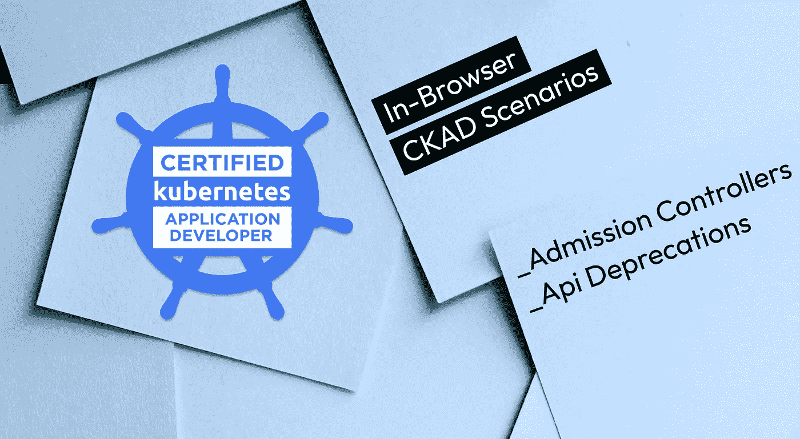
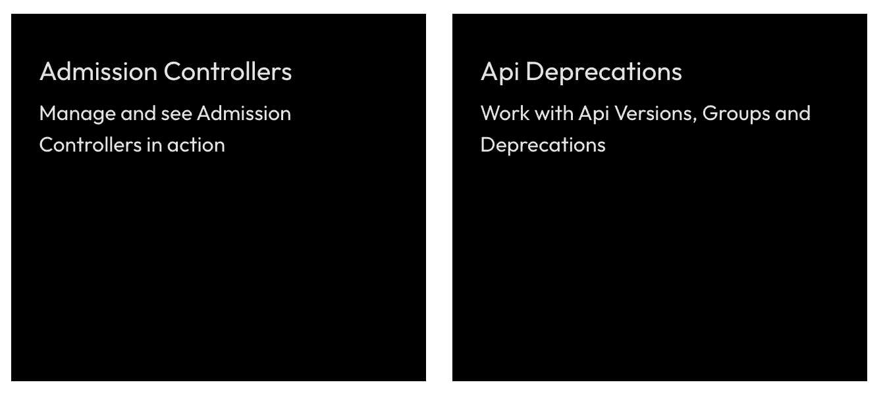
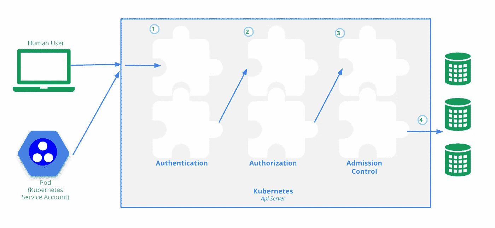

# 关于准入控制器和 Api 弃用的 CKAD 场景

> 原文：<https://itnext.io/ckad-scenarios-about-admission-controllers-and-api-deprecations-3633b3ba222e?source=collection_archive---------2----------------------->

## 根据 2021 年更新的关于准入控制器和 Api 弃用的 CKAD 的场景

# 免费 CKAD 场景？是啊！

(我们也已经有 [CKA](https://killercoda.com/killer-shell-cka) 和 [CKS](https://killercoda.com/killer-shell-cks) 的)

[**killercoda.com/killer-shell-ckad**](https://killercoda.com/killer-shell-ckad)

# 本周的情景

本周我们增加了这些场景:

# 准入控制器

[访问场景](https://killercoda.com/killer-shell-ckad/scenario/admission-controllers)

在这个场景中，我们将学习如何列出、启用和禁用准入控制器插件。我们也看到准入控制者可以做什么和控制什么。

> 准入控制模块是可以修改或拒绝请求的软件模块。除了授权模块可用的属性之外，准入控制模块还可以访问正在创建或修改的对象的内容。([来源](https://kubernetes.io/docs/concepts/security/controlling-access/))

发送到 k8s api 的每个请求都将经历三个阶段([源](https://kubernetes.io/docs/concepts/security/controlling-access/))

准入控制器可以拒绝某些资源定义(如少于 2 个副本的部署)，或者它们甚至可以改变/变异资源(如总是向 pod 添加某些标签)。

安装准入控制器插件更多是管理员的任务，但对于应用程序开发人员来说，详细理解这一点仍然很重要。

# Api 弃用

[访问场景](https://killercoda.com/killer-shell-ckad/scenario/api-deprecations)

在这个场景中，我们将了解 Api 版本、组和弃用。

Kubernetes 处于持续的大规模开发中，这意味着事情一直在变化。但是这些不会从一个版本到另一个版本改变，例如从`1.23`到`1.24`，人们有更多的时间来转换。

例如，如果`CronJob`的定义发生变化，那么它将首先在不同的 Api 版本下完成，比如`batch/v1beta1`。旧版本和新版本将共存一段时间。然后在公众反馈之后，随着时间的推移，变更将在`batch/v1`下发布。

[在这里](https://kubernetes.io/docs/reference/using-api/deprecation-guide/)你可以看到当前降价的概况。

作为基于 K8s 的应用程序开发人员，了解应该使用哪个版本以及如何更新应用程序的资源非常重要。

# 保持最新和通知！

[推特](https://twitter.com/killercoda)

[领英](https://www.linkedin.com/company/killercoda)

# 结束了

[killercoda.com](https://killercoda.com/)|[killer . sh](https://killer.sh/)