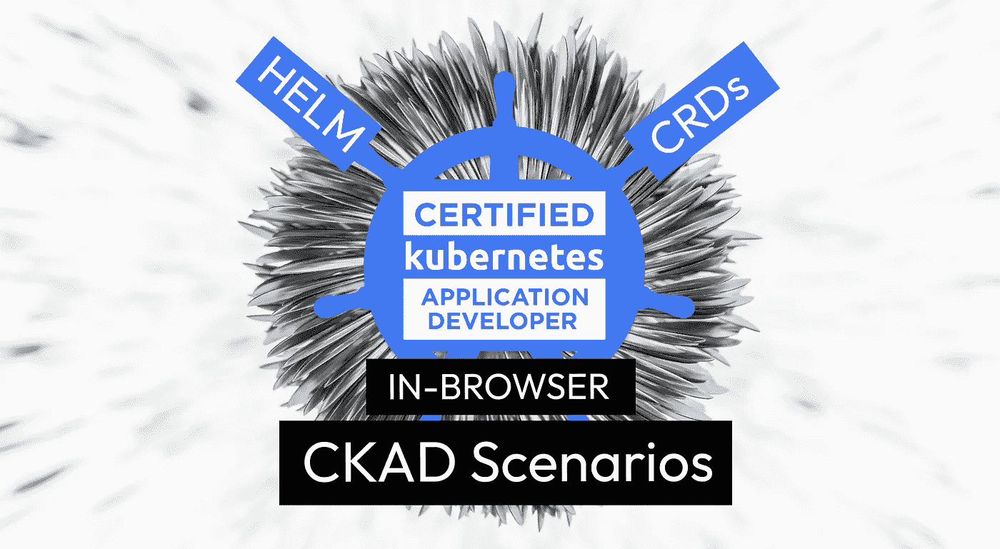
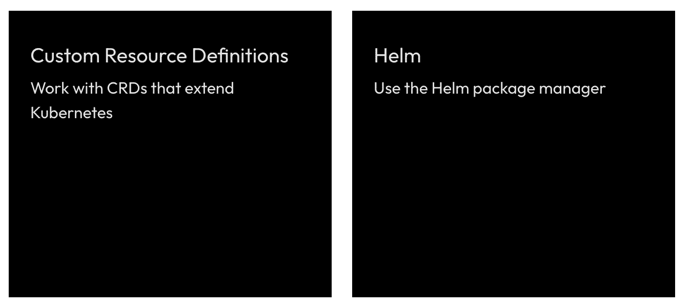

# 关于 CRDs 和 Helm 的 CKAD 场景

> 原文：<https://itnext.io/ckad-scenarios-about-crds-and-helm-f87e2d14e81a?source=collection_archive---------1----------------------->

## 自定义资源定义和头盔被添加到最近的 CKAD 考试更新，让我们了解这些！



# 免费 CKAD 场景？是啊！

(我们也已经有了 [CKA](https://killercoda.com/killer-shell-cka) 和 [CKS](https://killercoda.com/killer-shell-cks) 的)

【killercoda.com/killer-shell-ckad】T5[T6](https://killercoda.com/killer-shell-ckad)

# 本周情景

CKAD 最近进行了更新，增加了新的主题，其中有两个主题是我们本周增加的场景:

[](https://killercoda.com/killer-shell-ckad)

# 自定义资源定义

[访问场景](https://killercoda.com/killer-shell-ckad/scenario/crd)

自定义资源定义允许每个人扩展 Kubernetes。有各种默认的 K8s 资源，著名的是一个 Pod 或一个部署。有一堆像这样的内置资源，总是取决于你的 K8s 版本。

使用 CRDs 可以创建自己的资源，例如一个名为 Abc 的资源。每个想使用你的资源的人只需要安装你的 CRD 定义，也许还需要控制器。

如果 CRDs 在 K8s 最开始的时候确实存在，那么所有现存的资源，比如吊舱，都可能被定义为 CRD。

对于 CKAD 来说，重要的是[发现和使用扩展 Kubernetes (CRD)](https://github.com/cncf/curriculum) 的资源，这就是我们在这个场景中所做的。

# 头盔包管理器

[访问场景](https://killercoda.com/killer-shell-ckad/scenario/helm)

```
**Helm Chart**: Kubernetes YAML template-files combined into a single package, Values allow customisation

**Helm Release**: Installed instance of a Chart

**Helm Values**: Allow to customise the YAML template-files in a Chart when creating a Release**Helm Registry**: Collection of Helm Charts
```

如果你使用 K8s 集群并且发现自己想要安装一些东西，比如 Grafana，大多数时候最简单的方法就是使用 Helm。Helm 是 K8s 的一个包管理器，它允许从不同的 Helm 注册表安装 Helm 图表。

对于 CKAD 来说，能够[使用 Helm 包管理器来部署现有的包](https://github.com/cncf/curriculum)是很重要的，这就是我们在这个场景中所做的。

# 下一步是什么？

我们计划每周创建新的 CKAD 挑战，并在此发布。接下来你想看什么主题？请在评论中告诉我们！

# 保持最新和通知！

[推特](https://twitter.com/killercoda)

[领英](https://www.linkedin.com/company/killercoda)

# 结束了

[killercoda.com](https://killercoda.com/)|[killer . sh](https://killer.sh/)