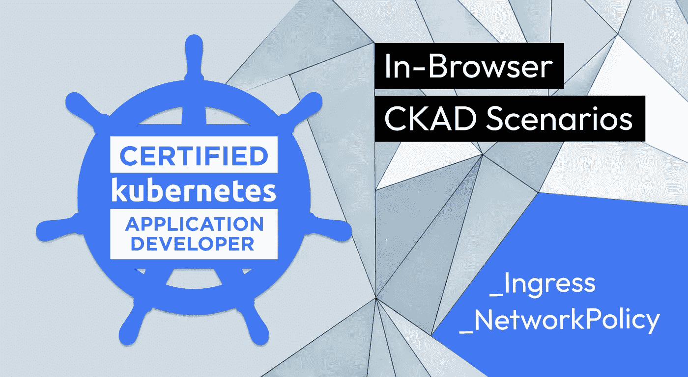
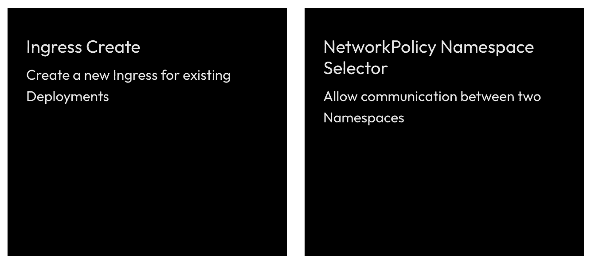

# 关于入口和网络策略的 CKAD 方案

> 原文：<https://itnext.io/ckad-scenarios-about-ingress-and-networkpolicy-155ce958c9ce?source=collection_archive---------4----------------------->

## 关于入口和网络策略的浏览器内 CKAD 场景

# 免费 CKAD 场景？是啊！

(我们也已经有了 [CKA](https://killercoda.com/killer-shell-cka) 和 [CKS](https://killercoda.com/killer-shell-cks) 的)

【killercoda.com/killer-shell-ckad】T5[T6](https://killercoda.com/killer-shell-ckad)

# 本周的情景

本周我们增加了这些场景:

# 进入

[访问场景](https://killercoda.com/killer-shell-ckad/scenario/ingress-create)

Kubernetes Ingress 是一个 K8s 资源，用于管理对集群的外部访问。有各种不同的入口控制器，如 Nginx 或 HAProxy。

例如，如果我们在集群中安装 Nginx 入口控制器，然后创建一个新的入口资源(针对 Nginx 类型)，这些事情将会自动为我们完成:

*   nginx 配置将根据我们在入口 YAML 中所说的内容自动生成
*   可能通过部署创建一个或多个 nginx 单元(Nginx 入口控制器单元)
*   将创建一个指向 nginx pods 的服务，可能是 LoadBalancer 类型

我们也可以在没有任何入口的情况下做上述所有事情。但是你自己写过一次 nginx 配置吗？没错。使用 Ingress 只是让事情变得容易多了。

我写了一篇关于 Ingress 的[详细文章](https://wuestkamp.medium.com/kubernetes-ingress-simply-visually-explained-d9cad44e4419?source=friends_link&sk=e8ca596700f5b58c7ab0d85d4dab6386)如果你想了解更多。

# 网络策略

[访问场景](https://killercoda.com/killer-shell-ckad/scenario/networkpolicy-namespace-communication)

在 K8s 中，NetworkPolicies 可以看作是集群的防火墙规则。在这里，我们可以说哪些 pod 被允许与哪些命名空间中的哪些 pod 进行对话，等等。

通读整个文档是一个很好的主意，因为小的错误配置会导致大的安全问题！

为了学习，你可以在 cilium 使用令人惊奇的[网络策略编辑器](https://editor.cilium.io/)。

同样需要注意的是，网络策略只有在集群内部使用的 CNI(如 Weave 或 Calico)支持时才有效。如果你使用一个不支持它的 CNI，在创建 NPs 的过程中不会显示错误，他们只是不会做任何事情。在 CKAD 考试中，你可以确定 CNI 是支持它的。

# 下一步是什么？

我们计划每周创建新的 CKAD 挑战，并在此发布。接下来你想看什么主题？请在评论中告诉我们！

# 保持最新和通知！

[推特](https://twitter.com/killercoda)

[领英](https://www.linkedin.com/company/killercoda)

# 结束了

【killercoda.com】|[killer . sh](https://killer.sh/)