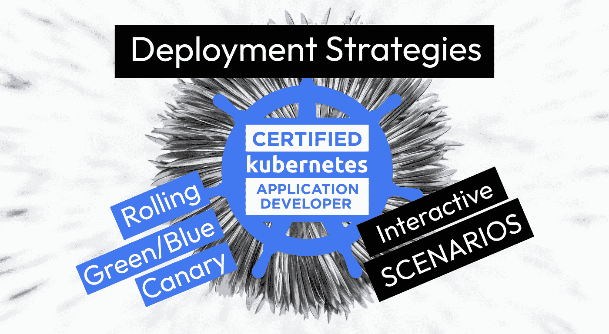
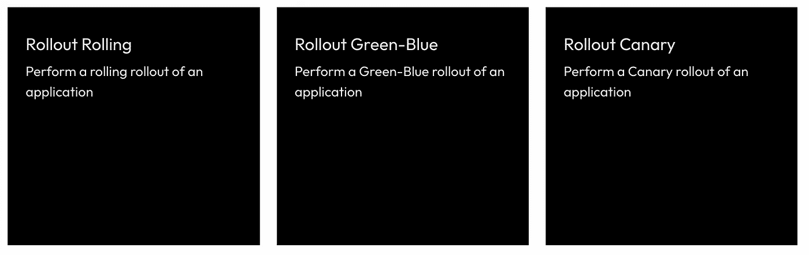

# CKAD 场景部署推广策略

> 原文：<https://itnext.io/ckad-scenarios-deployment-rollout-strategies-a996a53b59e1?source=collection_archive---------0----------------------->

## 关于滚动、淡黄色和绿/蓝色部署的 CKAD 交互场景

## 免费 CKAD 场景？是啊！

(我们也已经有了 [CKA](https://killercoda.com/killer-shell-cka) 和 [CKS](https://killercoda.com/killer-shell-cks) 的)

【killercoda.com/killer-shell-ckad】T5[T6](https://killercoda.com/killer-shell-ckad)

# 推广策略

本周，我们增加了三个关于不同部署策略的场景，这可能对 CKAD(和 DevOps 世界)很重要。

# 滚动展示

在这个场景中，我们使用“**滚动展示**”或“**滚动更新**”策略来执行应用程序的更新。这是 Kubernetes 中的默认设置，如果您更新部署资源的映像，就会出现这种情况。

[访问场景](https://killercoda.com/killer-shell-ckad/scenario/rollout-rolling)

> 滚动更新通过用新的 Pods 实例增量更新 Pods 实例，允许部署的更新在零停机的情况下进行。([来源](https://kubernetes.io/docs/tutorials/kubernetes-basics/update/update-intro))

# 绿色/蓝色卷展栏

在此场景中，我们执行“**绿色/蓝色部署**”，其中我们同时拥有两个部署资源，但只有一个为流量提供服务。我们可以立即将所有流量(新请求)切换到新版本。

[访问场景](https://killercoda.com/killer-shell-ckad/scenario/rollout-green-blue)

这个想法是让两个部署同时运行，一个使用旧的(绿色)映像，另一个使用新的(蓝色)映像。但是只有一个部署接收流量，而不是两个同时接收。

只有**一个**服务，而且只指向**一个**部署的吊舱。一旦我们将服务指向新部署的单元，所有新的请求都将到达新的映像。

# 展示金丝雀

在这个场景中，我们执行了一个“**金丝雀部署**”，在这里我们逐渐将流量切换到新版本。

[访问场景](https://killercoda.com/killer-shell-ckad/scenario/rollout-canary)

Canary 部署非常适合在生产环境中测试新的应用程序版本。例如，我们可以向新版本发送 10%的流量(新请求)。如果有错误，那么至少不是所有的用户都受到影响，我们可以检查日志中的线索来修复。

Canary 部署可能需要几分钟甚至几天时间，直到切换超过 100%，这始终取决于所实施的更改和应用程序架构。

# 下一步是什么？

我们计划每周创建新的 CKAD 挑战，并在此发布。接下来你想看什么主题？请在评论中告诉我们！

# 保持最新和通知！

[推特](https://twitter.com/killercoda)

[领英](https://www.linkedin.com/company/killercoda)

# 结束了

【killercoda.com】|[killer . sh](https://killer.sh/)