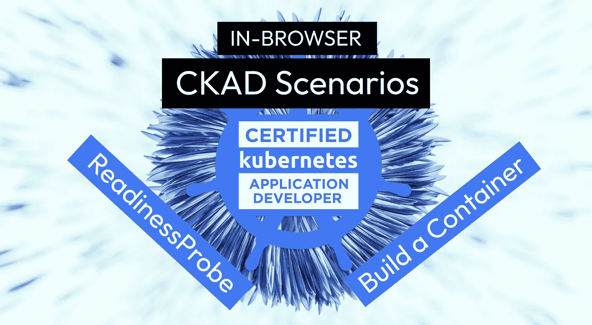
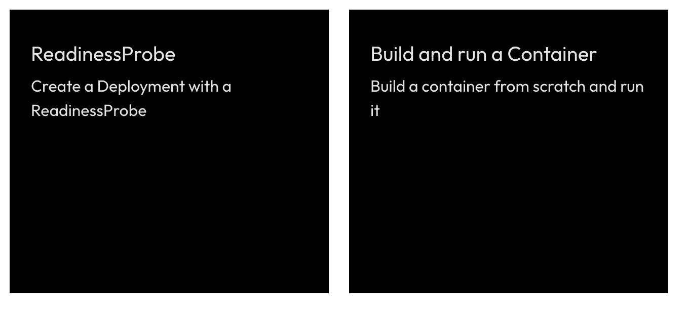

# CKAD 场景就绪探测和容器构建

> 原文：<https://itnext.io/ckad-scenarios-readinessprobe-and-container-build-6c73a835d9b7?source=collection_archive---------3----------------------->

## CKAD 关于 ReadinessProbes 和使用 Podman 或 Docker 构建容器的交互式场景

# 免费 CKAD 场景？是啊！

(我们也已经有了 [CKA](https://killercoda.com/killer-shell-cka) 和 [CKS](https://killercoda.com/killer-shell-cks) 的)

[**killercoda.com/killer-shell-ckad**](https://killercoda.com/killer-shell-ckad)

# 本周情景

本周我们增加了两个场景:

# ReadinessProbe

[访问场景](https://killercoda.com/killer-shell-ckad/scenario/readiness-probe)

在这个场景中，要求您创建 image `httpd`的部署，这是 Apache HTTP 服务器。如果没有为 Pod 定义 ReadinessProbe，一旦容器启动，K8s 服务就会向 Pod 发送流量。

但是启动 Apache 或在 Pod 中运行的其他工具可能需要时间，或者在启动过程中可能会出现错误。为此，定义一个 ReadinessProbe 非常重要。

## 探针概述

ReadinessProbes 和 LivenessProbes 将一直定期执行**。**

如果定义了 StartupProbe，ReadinessProbes 和 LivenessProbes 将不会执行，直到 StartupProbe 成功。

**就绪探测失败*** : Pod 不会被标记为就绪，也不会接收任何流量

**LivenessProbe 失败***:Pod 内的容器将重新启动

**StartupProbe 失败***:Pod 内的容器将重新启动

*失败:失败次数超过使用`failureThreshold`配置的次数

# 构建并运行容器

[访问场景](https://killercoda.com/killer-shell-ckad/scenario/container-build)

在这个场景中，您需要从头开始创建一个非常简单的容器。你可以用 Docker 或者 Podman 来做这个。CKAD 考试可能需要知识来[定义、构建和修改容器图像](https://github.com/cncf/curriculum)。

## 容器术语

*docker file/container file*:命令列表，从该列表可以构建*图像*

*镜像*:二进制文件，包含所有要作为*容器*运行的数据/需求

*容器*:运行*图像*的实例

*注册表*:我们可以推/拉*图像*的地方

# 下一步是什么？

我们计划每周创建新的 CKAD 挑战，并在此发布。接下来你想看什么主题？请在评论中告诉我们！

# 保持最新和通知！

[推特](https://twitter.com/killercoda)

[领英](https://www.linkedin.com/company/killercoda)

# 结束了

【killercoda.com】|[killer . sh](https://killer.sh/)