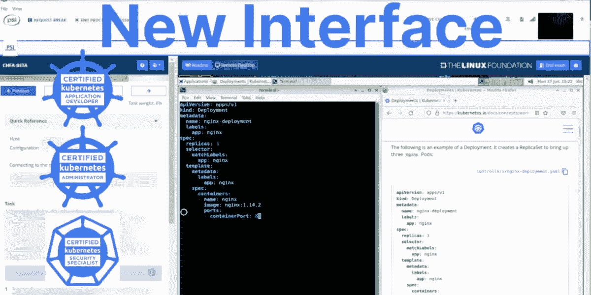
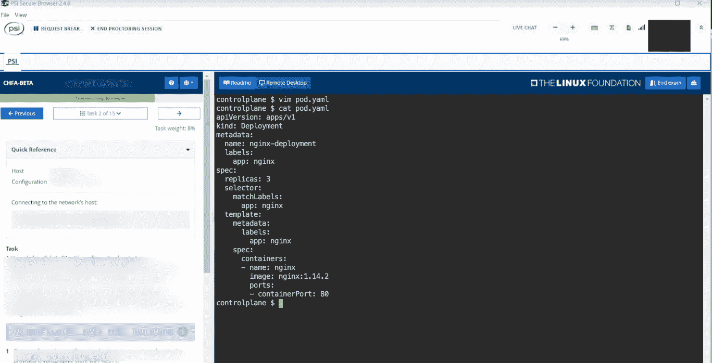
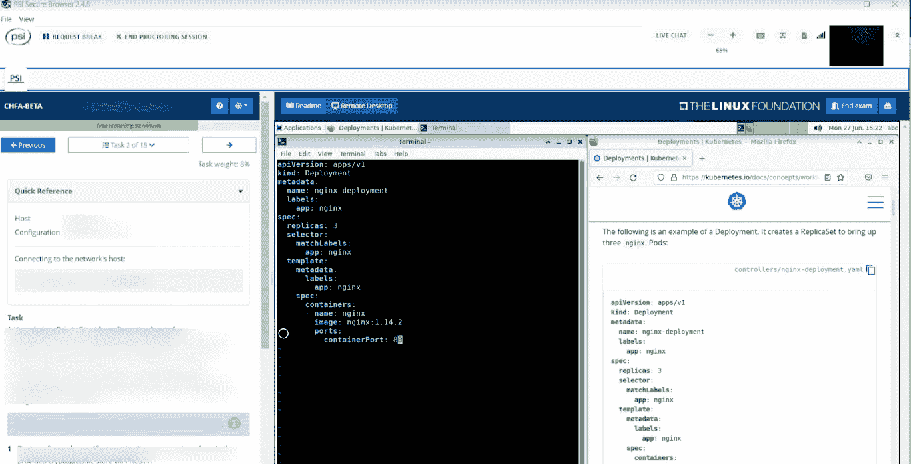
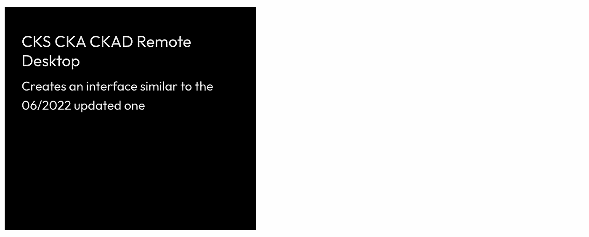
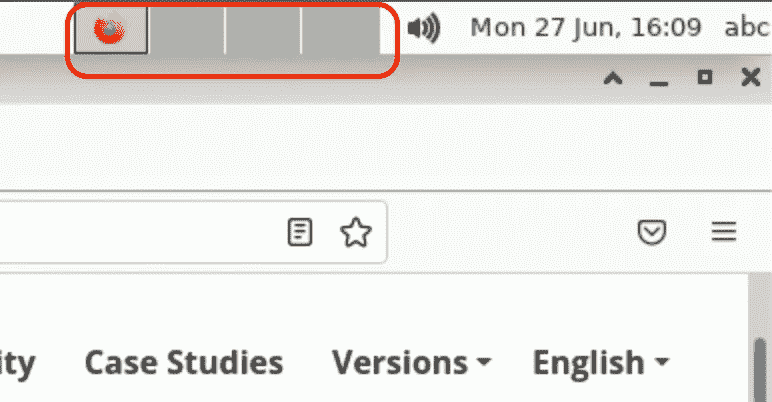

# CKS CKA CKAD 改变终端到远程桌面

> 原文：<https://itnext.io/cks-cka-ckad-changed-terminal-to-remote-desktop-157a26c1d5e?source=collection_archive---------0----------------------->

## 考试于 2022 年 6 月转移到 PSI 桥，该桥现在提供到远程桌面的 VNC 连接



这不是真实考试的截图。部分摘自[此处](https://docs.linuxfoundation.org/tc-docs/certification/lf-handbook2/exam-user-interface#lf_remote_desktop69fKd8/s/-M5QaeeC1mG9VndIpgJe/certification/lf-handbook2/exam-user-interface#lf_remote_desktop)

# TL；速度三角形定位法(dead reckoning)

*   远程终端被远程桌面取代
*   在 [Killercoda 场景](https://killercoda.com/kimwuestkamp/scenario/cks-cka-ckad-remote-desktop)中测试新界面
*   对于非 Linux 用户，复制和粘贴会有所不同
*   VNC 的速度预计会比以前慢

# 改变了什么？

内容没有改变，考试仍然遵循[现行课程](https://github.com/cncf/curriculum)。但是你需要使用 Kubernetes 的浏览器界面已经发生了很大的变化。

# 之前->之后

以前你只能访问一个大型的浏览器终端。您可以在本地浏览器**的另一个标签或窗口中打开 K8s 文档**:



**之前**(这不是来自真考的截图。部分摘自[此处](https://docs.linuxfoundation.org/tc-docs/certification/lf-handbook2/exam-user-interface#lf_remote_desktop69fKd8/s/-M5QaeeC1mG9VndIpgJe/certification/lf-handbook2/exam-user-interface#lf_remote_desktop)

现在您可以访问一个完整的远程 XFCE 桌面，您将在其中运行终端应用程序和 Firefox。您将在**远程浏览器**中打开 K8s 文档。您可以随意排列窗口:



**后**(这不是来自真考的截图。部分摘自[此处](https://docs.linuxfoundation.org/tc-docs/certification/lf-handbook2/exam-user-interface#lf_remote_desktop69fKd8/s/-M5QaeeC1mG9VndIpgJe/certification/lf-handbook2/exam-user-interface#lf_remote_desktop)

# 什么不再可能？

*   使用任何预先创建的个人书签
*   使用多台显示器

# 自己试试吧

我们在 Killercoda 上创建了一个场景，它有一个类似于考试环境的远程桌面环境。

但是只使用这个**来得到一个想法和感觉**来期待什么。**真实考试界面可能会有所不同**。

[](https://killercoda.com/kimwuestkamp/scenario/cks-cka-ckad-remote-desktop)

[killer corda . com/kimwuestkamp/scenario/cks-cka-ckad-remote-desktop](https://killercoda.com/kimwuestkamp/scenario/cks-cka-ckad-remote-desktop)

# 为什么改了？

*(所有猜测和非官方原因)*

可能主要是为了通过增加公平性和防止作弊来保持考试的安全性和良好的声誉。

*   为每位与会者提供**完全相同的环境**。创建很多浏览器书签或者安装一些本地浏览器插件应该不会有什么优势。
*   通过使用远程虚拟机，使用本地安装的应用程序作弊变得更加困难。更好地防止复制内容等。[来源](https://www.psionline.com/en-gb/platforms/psi-bridge)
*   不再需要共享您的本地屏幕并向监考人提供对您数据的访问权限。因此**更好的数据隐私**。[来源](https://www.psionline.com/en-gb/platforms/psi-bridge)
*   远程虚拟机中的 Firefox 会自动阻止访问被禁止的 URL，这让 proctor 更加容易。
*   在未来的更新中，有可能将考试转移到一个更加图形用户界面的方式。比如能够在浏览器中可视化地打开 Ingress/K8s-Dashboard 服务，而不是 curl。

# 速度

从您的本地桌面，您会注意到在远程桌面滞后。比如在移动窗口或滚动 K8s 文档时。这是你对 VNC 连接的期望，你应该在几分钟后适应它。但是许多用户报告了巨大的滞后，使得工作无法进行。根据 Linux 基金会[的说法，这个问题应该得到解决](https://training.linuxfoundation.org/blog/update-on-certification-exam-proctoring-migration/?utm_source=lftraining&utm_medium=twitter&utm_campaign=blog)。

# 终端应用

您将使用 XFCE 终端模拟器。您可以打开多个终端，并将它们并排或上下排列。在此之前，只有像`tmux`这样的东西才有可能。你也可以改变字体大小和颜色等，这是伟大的可访问性。

# 可视文本编辑器

例如，鼠标垫可用作编辑 YAML 的可视编辑器。但是您不能访问与终端相同的文件系统(参见下一步)。

# 文件系统/主机

终端仿真器访问与 XFCE 不同的主机(并通过该文件系统),例如鼠标垫编辑器或文件管理器。

这意味着你不能轻易地在鼠标垫中编辑文件，然后在终端中编辑这些文件。你可以在鼠标垫上写/编辑 YAML，然后复制&粘贴到 vim，然后`kubectl apply`它。

# 记事本消失(从考试界面)

考试界面上的记事本不见了，在那里你可以存储例如关于问题的笔记以便以后解答。现在你可以简单地使用鼠标垫应用程序。PSI 安全浏览器本身在右上角也有一个记事本，但是你不能在记事本和远程桌面之间复制和粘贴。

# 复制和粘贴

许多用户对此有疑问，也阅读了 Linux Foundation 的文章。

什么总是有效:使用鼠标右键上下文菜单复制+粘贴

什么在终端中起作用:`Ctrl+Shift+c and Ctrl+Shift+v`

火狐之类的其他应用中的工作原理:`Ctrl+c and Ctrl+v`

如果左边的问题有可复制的单词，那么您可以点击它们进行复制，并使用上下文菜单或`Ctrl+Shift+v`粘贴到终端中。

在终端内部，也可以用鼠标标记文本，然后按下鼠标中键进行插入。这只在停留在终端内时有效。

请确保在您的`.vimrc`中设置这些，否则粘贴时缩进会非常混乱(**考试现在也默认有这些配置设置，但能够键入它们也无妨**):

```
:set expandtab
:set tabstop=2
:set shiftwidth=2
```

每次你想从火狐拷贝东西到终端，它会显示一个警告“不安全粘贴”。你可以证实这一点。您也可以在终端`Preferences->General->Show unsafe paste dialog`中禁用此功能。

# Firefox 和允许的站点

远程桌面中的浏览器是 Firefox，它会自动限制对除允许的站点之外的任何站点的访问。它也会显示允许的网站列表，但是为了安全起见，请记住 https://kubernetes.io/docs。

你可以打开多个标签页和窗口，这很好，因为已经实现了自动 url 检查。

# 多个虚拟桌面

XFCE 允许您使用多个虚拟桌面，并通过鼠标点击在它们之间切换。你可以在一个上面放一个大的终端，在另一个上面放一个大的 bowser。或者您可以只使用一个虚拟桌面。



可能有在虚拟桌面之间切换的组合键。假设如果你不小心碰到这个，看起来你所有的窗户都不见了。在这种情况下，只需点击顶部的正确选项。

# 接口技术

*   XFCE 4.14
*   鳄梨色拉酱
*   XFCE 终端模拟器(黑色背景，白色字体)
*   Ubuntu 20.04
*   火狐浏览器

# 我的看法

最初这篇文章还包含了我对这个新变化的看法，我已经完全删除了。我将集中精力为与会者提供他们在新的 UI 中掌握考试所需的所有事实和信息。

# 链接/来源

[Linux 基金会文章](https://training.linuxfoundation.org/blog/update-on-certification-exam-proctoring-migration/?utm_source=lftraining&utm_medium=twitter&utm_campaign=blog)

[Linux 基础考试 UI](https://docs.linuxfoundation.org/tc-docs/certification/lf-handbook2/exam-user-interface#lf_remote_desktop69fKd8/s/-M5QaeeC1mG9VndIpgJe/certification/lf-handbook2/exam-user-interface#lf_remote_desktop)

https://training.linuxfoundation.org/bridge-migration-2021

【https://www.psionline.com/en-gb/platforms/psi-bridge 