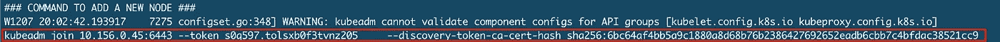
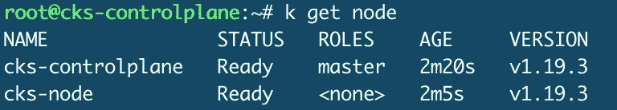

# UCKS 考试系列#1 创建群集和安全性最佳实践

> 原文：<https://itnext.io/cks-exam-series-1-create-cluster-security-best-practices-50e35aaa67ae?source=collection_archive---------1----------------------->

## Kubernetes CKS 示例考试问题系列


> [CKS 考试系列](https://killer.sh/r?d=cks-series) | [CKA 考试系列](https://killer.sh/r?d=cka-series) | [CKAD 考试系列](https://killer.sh/r?d=ckad-series)

**## # # # # # # # # # # # # # # # # # # # ##**

**此挑战不会在此更新，将移至:**

[https://killercoda.com/killer-shell-cks](https://killercoda.com/killer-shell-cks)

**## # # # # # # # # # # # # # # # # # # # # # # ##**

# 内容

1.  [创建集群&安全最佳实践](https://wuestkamp.medium.com/cks-exam-series-1-create-cluster-security-best-practices-50e35aaa67ae?source=friends_link&sk=8bc466dae0ea90412251e32d4eaf7539)
2.  [pod、机密和服务帐户](https://wuestkamp.medium.com/cks-exam-series-2-pods-and-secrets-3d92a6fba331?source=friends_link&sk=379fa6e196233c73ef7845d84a3aa34d)
3.  [不可变豆荚](https://wuestkamp.medium.com/cks-exam-series-3-immutable-pods-3812cf76cff4?source=friends_link&sk=ed1231a0382d97bd5c8267afe75f14ac)
4.  [崩溃那个 Apiserver &检查日志](https://wuestkamp.medium.com/cks-exam-series-4-crash-that-apiserver-5f4d3d503028?source=friends_link&sk=3ccd9bf1b728e85f86157ef1af23d455)
5.  [ImagePolicyWebhook/admission controller](https://wuestkamp.medium.com/cks-exam-series-5-imagepolicywebhook-8d09f1ceee70?source=friends_link&sk=93017beeae20f640f52db41d20d3ffcd)
6.  [用户和证书签名请求](https://wuestkamp.medium.com/cks-exam-series-6-users-and-certificatesigningrequests-368a5b2c6a3f)
7.  [服务帐户令牌安装](https://wuestkamp.medium.com/cks-exam-series-7-serviceaccount-tokens-1158c93612d4?source=friends_link&sk=1064eaf2f3d4d03576bcde207eaf7cfb)
8.  [基于角色的访问控制(RBAC)](https://wuestkamp.medium.com/cks-exam-series-8-rbac-db8a0984059e?source=friends_link&sk=8a1abe2d51275faed47f3d36858b14d5)
9.  [基于角色的访问控制(RBAC) v2](https://wuestkamp.medium.com/cks-exam-series-9-rbac-v2-23ee24dd77cd?source=friends_link&sk=2a6027eb75fbcf7876216cab222fa953)
10.  [容器硬化](https://wuestkamp.medium.com/cks-exam-series-10-container-hardening-177588b8bbfe?source=friends_link&sk=dbdddc1ee9321a946ee2e3f778c0711a)
11.  [网络策略(默认拒绝+允许列表)](https://wuestkamp.medium.com/cks-exam-series-11-networkpolicies-default-deny-and-allowlist-b2ce4186551f?source=friends_link&sk=bdcc071a32f26b93d6c4a51b9a9436a7)

~~~~~~~~~~~~~~~~~~~~~~~~~~~~~~~~~~

→查看 Udemy 上的 [**全 CKS 课程**](https://killer.sh/r?d=cks-course)

~~~~~~~~~~~~~~~~~~~~~~~~~~~~~~~~~~

# 规则！

1.  速度要快，避免从头开始手动创建 yaml
2.  仅使用[kubernetes.io/docs](https://kubernetes.io/docs/home/)进行帮助。
3.  完成您的解决方案后，请查看我们的解决方案。你可能有一个更好的！

# 今天的任务:创建一个用于研究和检查安全最佳实践的 CKS 集群

这是本系列的第一个任务，因此这将是一个准备工作，而不是自己解决问题。我们认为学习 CKS 的最好方法是手头有自己的集群。

这可以只是一个简单的集群、一个控制平面(主)、一个节点(工作节点)，并使用`kubeadm`进行安装。在 CKS 考试中，您将使用这种完全相同的集群设置。

1.  创建两个虚拟机
2.  使用`kubeadm`安装**控制面板**
3.  使用`kubeadm`安装**节点**
4.  将节点添加到群集
5.  观看 Kubernetes 最佳实践，做好心理准备！

# 解决办法

我们在这个系列中会用到 Gcloud，因为它很容易，很简单，而且是免费的(免费信用)。但是您可以在任何地方创建必要的两个虚拟机！

> hree 也是由普雷斯顿·谢尔登创作的流浪回购，人们可以用[https://github.com/pksheldon4/cks-cluster](https://github.com/pksheldon4/cks-cluster)

## 1.创建两个虚拟机

要在 Gcloud 中创建虚拟机，我们可以运行:

创建`cks-controlplane`:

```
gcloud compute instances create cks-controlplane --zone=europe-west3-c \
--machine-type=e2-medium \
--image=ubuntu-1804-bionic-v20201014 \
--image-project=ubuntu-os-cloud \
--boot-disk-size=50GB
```

创造`cks-node`:

```
gcloud compute instances create cks-node --zone=europe-west3-c \
--machine-type=e2-medium \
--image=ubuntu-1804-bionic-v20201014 \
--image-project=ubuntu-os-cloud \
--boot-disk-size=50GB
```

你也可以选择一个离你近的不同区域:[https://cloud.google.com/compute/docs/regions-zones](https://cloud.google.com/compute/docs/regions-zones)

## 2.使用 Kubeadm 安装控制面板

这个挑战系列有一个[库](https://github.com/killer-sh/cks-challenge-series)。

```
gcloud compute ssh cks-controlplane
> sudo -i
> bash <(curl -s [https://raw.githubusercontent.com/killer-sh/cks-challenge-series/master/cluster-setup/latest/install_controlplane.sh](https://raw.githubusercontent.com/killer-sh/cks-challenge-series/master/cluster-setup/latest/install_controlplane.sh))[)](https://raw.githubusercontent.com/killer-sh/cks-challenge-series/master/cluster-setup/latest/install_controlplane.sh)) exit
sudo -i # login again to get nicer bash with autocompletion
```

## 3.使用 Kubeadm 安装节点

```
gcloud compute ssh cks-node
> sudo -i
> bash <(curl -s [https://raw.githubusercontent.com/killer-sh/cks-challenge-series/master/cluster-setup/latest/install_node.sh](https://raw.githubusercontent.com/killer-sh/cks-challenge-series/master/cluster-setup/latest/install_node.sh))[)](https://raw.githubusercontent.com/killer-sh/cks-challenge-series/master/cluster-setup/latest/install_node.sh))exit
sudo -i # login again to get nicer bash with autocompletion
```

## 4.向群集中添加节点

将`install_controlplane.sh`脚本在 controlplane-VM 上输出的`kubeadm join`命令复制到 node-VM 上，并在那里执行:



我们还可以用:`kubeadm token create -—print-join-command —-ttl 0`创建一个新的 join 令牌。

事后我们应该看到:



## 5.观看 Kubernetes 安全最佳实践

…做好心理准备！

**总是在不使用的时候停止你的实例**，只在需要的时候再启动，比如:

```
gloud compute instances stop cks-controlplane cks-node
gloud compute instances start cks-controlplane cks-node
```

这为您节省了宝贵的云资源！

# 你有不同的解决方法？

在下面写个评论让我们知道吧！

# — — —结尾————

第一次会议到此为止。现在，您应该已经有了一个良好的 K8s 集群作为基础，可以用来研究和学习。

下次再见，祝学习愉快！

# 准备好加入黑仔壳牌了吗？

## 完整的 CKS 课程

[](https://killer.sh/r?d=cks-course)

[链接](https://killer.sh/r?d=cks-course)

## …或者 CKS 模拟器

[](https://killer.sh/cks)

[https://killer.sh/cks](https://killer.sh/cks)