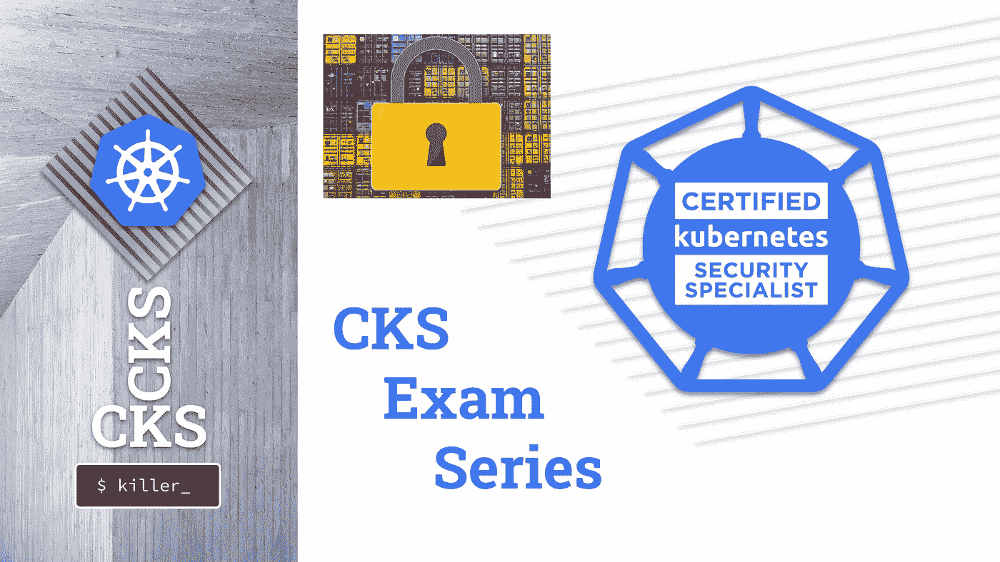

# CKS 考试系列#10 容器硬化

> 原文：<https://itnext.io/cks-exam-series-10-container-hardening-177588b8bbfe?source=collection_archive---------0----------------------->

## Kubernetes CKS 示例考试问题系列



> [CKS 考试系列](https://killer.sh/r?d=cks-series) | [CKA 考试系列](https://killer.sh/r?d=cka-series) | [CKAD 考试系列](https://killer.sh/r?d=ckad-series)

**## # # # # # # # # # # # # # # # # # # # ##**

**此挑战不会在此更新，将移至:**

[https://killercoda.com/killer-shell-cks](https://killercoda.com/killer-shell-cks)

**## # # # # # # # # # # # # # # # # # # # # # # ##**

# 内容

1.  [创建集群&安全最佳实践](https://wuestkamp.medium.com/cks-exam-series-1-create-cluster-security-best-practices-50e35aaa67ae?source=friends_link&sk=8bc466dae0ea90412251e32d4eaf7539)
2.  [pod、机密和服务帐户](https://wuestkamp.medium.com/cks-exam-series-2-pods-and-secrets-3d92a6fba331?source=friends_link&sk=379fa6e196233c73ef7845d84a3aa34d)
3.  [不可变豆荚](https://wuestkamp.medium.com/cks-exam-series-3-immutable-pods-3812cf76cff4?source=friends_link&sk=ed1231a0382d97bd5c8267afe75f14ac)
4.  [崩溃那个 Apiserver &检查日志](https://wuestkamp.medium.com/cks-exam-series-4-crash-that-apiserver-5f4d3d503028?source=friends_link&sk=3ccd9bf1b728e85f86157ef1af23d455)
5.  [ImagePolicyWebhook/admission controller](https://wuestkamp.medium.com/cks-exam-series-5-imagepolicywebhook-8d09f1ceee70?source=friends_link&sk=93017beeae20f640f52db41d20d3ffcd)
6.  [用户和证书签名请求](https://wuestkamp.medium.com/cks-exam-series-6-users-and-certificatesigningrequests-368a5b2c6a3f)
7.  [服务帐户令牌安装](https://wuestkamp.medium.com/cks-exam-series-7-serviceaccount-tokens-1158c93612d4?source=friends_link&sk=1064eaf2f3d4d03576bcde207eaf7cfb)
8.  [基于角色的访问控制(RBAC)](https://wuestkamp.medium.com/cks-exam-series-8-rbac-db8a0984059e?source=friends_link&sk=8a1abe2d51275faed47f3d36858b14d5)
9.  [基于角色的访问控制(RBAC) v2](https://wuestkamp.medium.com/cks-exam-series-9-rbac-v2-23ee24dd77cd?source=friends_link&sk=2a6027eb75fbcf7876216cab222fa953)
10.  [容器硬化](https://wuestkamp.medium.com/cks-exam-series-10-container-hardening-177588b8bbfe?source=friends_link&sk=dbdddc1ee9321a946ee2e3f778c0711a)
11.  [网络策略(默认拒绝+允许列表)](https://wuestkamp.medium.com/cks-exam-series-11-networkpolicies-default-deny-and-allowlist-b2ce4186551f?source=friends_link&sk=bdcc071a32f26b93d6c4a51b9a9436a7)

~~~~~~~~~~~~~~~~~~~~~~~~~~~~~~~~~~

→查看 Udemy 上的 [**全 CKS 课程**](https://killer.sh/r?d=cks-course)

~~~~~~~~~~~~~~~~~~~~~~~~~~~~~~~~~~

# 规则！

1.  速度要快，避免从头开始手动创建 yaml
2.  仅使用[kubernetes.io/docs](https://kubernetes.io/docs/home/)进行帮助。
3.  完成您的解决方案后，请查看我们的解决方案。你可能有一个更好的！

# 今天的任务:强化一个给定的 Docker 容器

```
FROM ubuntu
RUN apt-get update
RUN apt-get -y install curl
ENV URL my-service-url.com?secret-token
CMD ["sh", "-c", "curl --head $URL=2e064aad-3a90-4cde-ad86-16fad1f8943e"]
```

这是一个简单的容器，它试图对一个虚构的 api 进行 curl 调用，同时传递一个秘密令牌。

1.  对基础映像使用特定版本
2.  Curl 应该至少是版本`7.67.0`(或者您的基础映像包含的任何其他版本)
3.  使用`apt-get`移除层缓存问题
4.  移除硬编码的秘密值`2e064aad-3a90–4cde-ad86–16fad1f8943e`。秘密值应该在运行时传递到容器中
5.  使用`bash`使`docker exec`或`kubectl exec`无法进入容器

# 解决办法

你应该熟悉 [Docker 最佳实践](https://docs.docker.com/develop/develop-images/dockerfile_best-practices)。

要构建和运行容器，我们可以:

```
docker build -t app . && docker run app
```

## 1.+ 2.特定包版本

```
FROM ubuntu**:20.10**
RUN apt-get update
RUN apt-get -y install curl**>=7.67.0**
ENV URL my-service-url.com?secret-token
CMD ["sh", "-c", "curl --head $URL=2e064aad-3a90-4cde-ad86-16fad1f8943e"]
```

要查找包版本，您可以运行:

```
docker run app apt-cache show curl
```

## 3.图层缓存

```
FROM ubuntu:20.10
**RUN apt-get update && apt-get -y install curl>=7.67.0**
ENV URL my-service-url.com?secret-token
CMD ["sh", "-c", "curl --head $URL=2e064aad-3a90-4cde-ad86-16fad1f8943e"]
```

每个运行线创建一个新的图像层。如果*更新*和*安装*不在同一行，则可能是*更新*层过期。更多信息请点击这里:[https://docs . docker . com/develop/develop-images/docker file _ best-practices/# run](https://docs.docker.com/develop/develop-images/dockerfile_best-practices/#run)

## 4.作为运行时环境变量的秘密

```
FROM ubuntu:20.10
RUN apt-get update && apt-get -y install curl>=7.67.0
ENV URL my-service-url.com?secret-token
CMD ["sh", "-c", "curl --head $URL=**$SECRET**"]
```

然后运行:

```
docker build -t app .docker run **-e SECRET=2e064aad-3a90-4cde-ad86-16fad1f8943e** app
```

**5。阻止 Bash exec**

(与其删除二进制文件，不如从一个临时容器开始，只添加运行应用程序所需的二进制文件)

```
FROM ubuntu:20.10
RUN apt-get update && apt-get -y install curl>=7.67.0
ENV URL my-service-url.com?secret-token
**RUN rm /usr/bin/bash**
CMD ["sh", "-c", "curl --head $URL=$SECRET"]
```

测试它:

```
docker build -t appdocker run -d -e SECRET=2e064aad-3a90-4cde-ad86-16fad1f8943e app sleep 1d **# run in background**docker ps | grep appdocker exec -it 4a848daec2e2 bash **# fails**docker exec -it 4a848daec2e2 sh **# works**
```

# 你有不同的解决方法？

在下面写个评论让我们知道吧！

# — — —结尾————

本次会议到此为止。下次再见，祝学习愉快！

# 准备好加入黑仔壳牌了吗？

## 完整的 CKS 课程

[](https://killer.sh/r?d=cks-course)

[链接](https://killer.sh/r?d=cks-course)

## …或者 CKS 模拟器

[](https://killer.sh/cks)

[https://killer.sh/cks](https://killer.sh/cks)