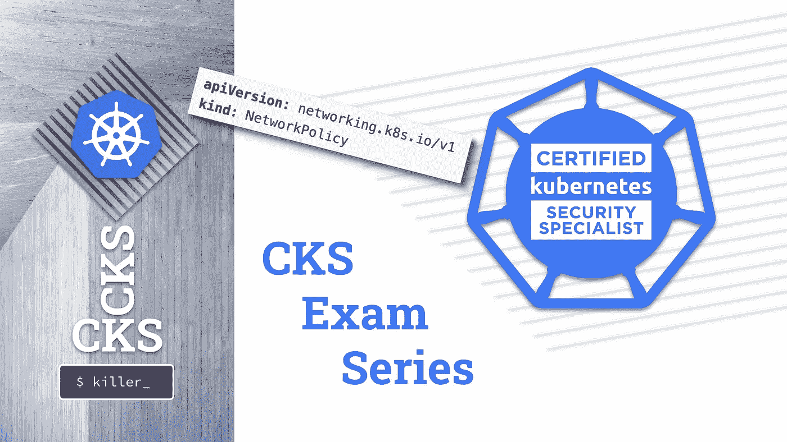

# CKS 考试系列#11 网络策略默认拒绝和允许列表

> 原文：<https://itnext.io/cks-exam-series-11-networkpolicies-default-deny-and-allowlist-b2ce4186551f?source=collection_archive---------1----------------------->

## Kubernetes CKS 示例考试问题系列



> [CKS 考试系列](https://killer.sh/r?d=cks-series) | [CKA 考试系列](https://killer.sh/r?d=cka-series) | [CKAD 考试系列](https://killer.sh/r?d=ckad-series)

**## # # # # # # # # # # # # # # # # # # # ##**

**此挑战不会在此更新，将移至:**

[https://killercoda.com/killer-shell-cks](https://killercoda.com/killer-shell-cks)

**## # # # # # # # # # # # # # # # # # # # # # # ##**

# 内容

1.  [创建集群&安全最佳实践](https://wuestkamp.medium.com/cks-exam-series-1-create-cluster-security-best-practices-50e35aaa67ae?source=friends_link&sk=8bc466dae0ea90412251e32d4eaf7539)
2.  [pod、机密和服务帐户](https://wuestkamp.medium.com/cks-exam-series-2-pods-and-secrets-3d92a6fba331?source=friends_link&sk=379fa6e196233c73ef7845d84a3aa34d)
3.  [不可变豆荚](https://wuestkamp.medium.com/cks-exam-series-3-immutable-pods-3812cf76cff4?source=friends_link&sk=ed1231a0382d97bd5c8267afe75f14ac)
4.  [崩溃那个 Apiserver &检查日志](https://wuestkamp.medium.com/cks-exam-series-4-crash-that-apiserver-5f4d3d503028?source=friends_link&sk=3ccd9bf1b728e85f86157ef1af23d455)
5.  [ImagePolicyWebhook/admission controller](https://wuestkamp.medium.com/cks-exam-series-5-imagepolicywebhook-8d09f1ceee70?source=friends_link&sk=93017beeae20f640f52db41d20d3ffcd)
6.  [用户和证书签名请求](https://wuestkamp.medium.com/cks-exam-series-6-users-and-certificatesigningrequests-368a5b2c6a3f)
7.  [服务帐户令牌安装](https://wuestkamp.medium.com/cks-exam-series-7-serviceaccount-tokens-1158c93612d4?source=friends_link&sk=1064eaf2f3d4d03576bcde207eaf7cfb)
8.  [基于角色的访问控制(RBAC)](https://wuestkamp.medium.com/cks-exam-series-8-rbac-db8a0984059e?source=friends_link&sk=8a1abe2d51275faed47f3d36858b14d5)
9.  [基于角色的访问控制(RBAC) v2](https://wuestkamp.medium.com/cks-exam-series-9-rbac-v2-23ee24dd77cd?source=friends_link&sk=2a6027eb75fbcf7876216cab222fa953)
10.  [容器硬化](https://wuestkamp.medium.com/cks-exam-series-10-container-hardening-177588b8bbfe?source=friends_link&sk=dbdddc1ee9321a946ee2e3f778c0711a)
11.  [网络策略(默认拒绝+允许列表)](https://wuestkamp.medium.com/cks-exam-series-11-networkpolicies-default-deny-and-allowlist-b2ce4186551f?source=friends_link&sk=bdcc071a32f26b93d6c4a51b9a9436a7)

~~~~~~~~~~~~~~~~~~~~~~~~~~~~~~~~~~

→查看 Udemy 上的 [**全 CKS 课程**](https://killer.sh/r?d=cks-course)

~~~~~~~~~~~~~~~~~~~~~~~~~~~~~~~~~~

# 规则！

1.  速度要快，避免从头开始手动创建 yaml
2.  仅使用[kubernetes.io/docs](https://kubernetes.io/docs/home/)进行帮助。
3.  完成您的解决方案后，请查看我们的解决方案。你可能有一个更好的！

# 今天的任务:创建一个默认的拒绝网络策略，然后允许列表中的更多流量

测试你的每一个策略。

1.  创建*名称空间*
2.  默认情况下，*名称空间* `applications`中的所有*pod*都不应该有任何传出流量
3.  默认情况下，*名称空间* `applications`中的所有*pod*应该仍然能够使用 Kubernetes DNS
4.  标签为`very=important`的*命名空间*中的*pod*应该能够有任何传出流量
5.  *网络策略*不会强制执行传入流量
6.  查看[https://editor . cilium . io](https://editor.cilium.io/)

# 解决办法

## 1.命名空间

```
alias k=kubectlk create ns applications
```

为了进行测试，我们创建了一个 *Pod* :

```
k -n applications run test --image=nginxk -n applications exec test -- curl killer.sh **# YES**k -n applications exec test -- sh -c "apt-get update && apt-get -y install dnsutils" **# to use nslookup**
```

## 2.出口默认拒绝

```
apiVersion: networking.k8s.io/v1
kind: NetworkPolicy
metadata:
  name: default-deny-egress
  namespace: applications
spec:
  podSelector: {}
  policyTypes:
    - Egress
```

为了测试:

```
k -n applications exec test -- nslookup killer.sh **# NO**ping killer.sh **# get IP**k -n applications exec test -- curl killer.sh **# NO**k -n applications exec test -- curl 35.227.196.29 **# NO**
```

## **3。允许 DNS**

我们可以调整现有的 *NP* 或者再创建一个。这里我们创建一个新的。

```
apiVersion: networking.k8s.io/v1
kind: NetworkPolicy
metadata:
  name: allow-dns
  namespace: applications
spec:
  podSelector: {}
  policyTypes:
    - Egress
  egress:
    - to:
      ports:
        - port: 53
          protocol: UDP
        - port: 53
          protocol: TCP
```

为了测试:

```
k -n applications exec test -- nslookup killer.sh **# YES**k -n applications exec test -- nslookup kubernetes.default **# YES**k -n applications exec test -- curl killer.sh **# NO**k -n applications exec test -- curl 35.227.196.29 **# NO**
```

## 4.允许一些吊舱的所有出口

```
apiVersion: networking.k8s.io/v1
kind: NetworkPolicy
metadata:
  name: allow-egress
  namespace: applications
spec:
  podSelector:
    matchLabels:
      very: important
  policyTypes:
    - Egress
  egress:
    - to:
      - ipBlock:
          cidr: 0.0.0.0/0
```

为了测试:

```
k -n applications exec test -- curl killer.sh **# NO**k -n applications label pod test very=importantk -n applications exec test -- curl killer.sh **# YES**
```

## 5.忽略入口流量

因为我们没有为入口流量指定任何*NP*，所以什么也不做。

## 6.网络策略编辑器

[https://editor . cilium . io](https://editor.cilium.io/)

这个对于学习和理解来说是很牛逼的，记住不能在考试中用就行了。

# 你有不同的解决方法？

在下面写个评论让我们知道吧！

# — — —结尾————

本次会议到此为止。下次再见，祝学习愉快！

# 准备好加入黑仔壳牌了吗？

## 完整的 CKS 课程

[](https://killer.sh/r?d=cks-course)

[链接](https://killer.sh/r?d=cks-course)

## …或者 CKS 模拟器

[](https://killer.sh/cks)

[https://killer.sh/cks](https://killer.sh/cks)