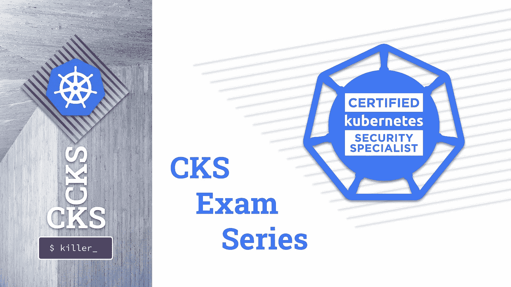
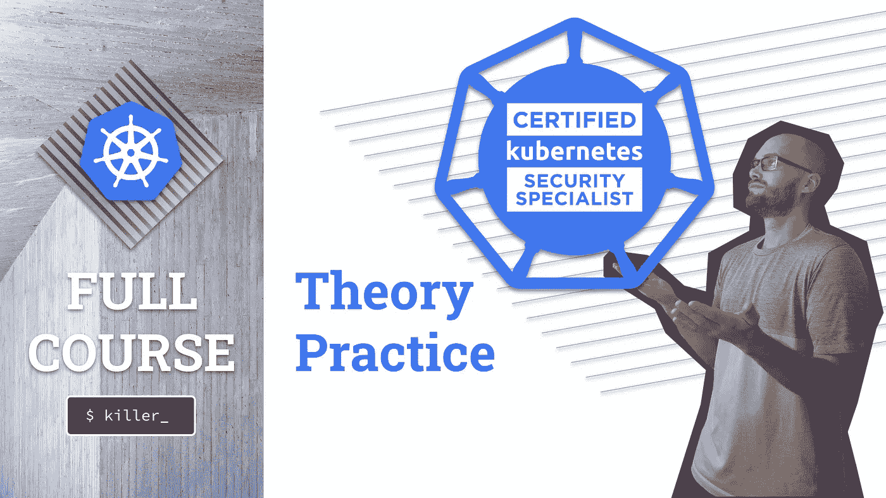
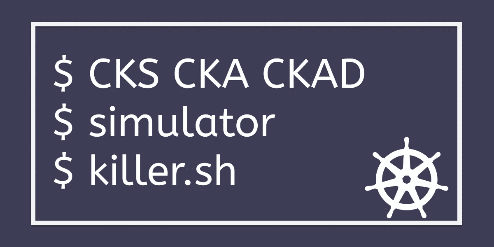

# CKS 考试系列#2 豆荚，秘密和服务帐户

> 原文：<https://itnext.io/cks-exam-series-2-pods-and-secrets-3d92a6fba331?source=collection_archive---------1----------------------->

## Kubernetes CKS 示例考试问题系列



> [CKS 考试系列](https://killer.sh/r?d=cks-series) | [CKA 考试系列](https://killer.sh/r?d=cka-series) | [CKAD 考试系列](https://killer.sh/r?d=ckad-series)

**## # # # # # # # # # # # # # # # # # # # ##**

**此挑战不会在此更新，将移至:**

[https://killercoda.com/killer-shell-cks](https://killercoda.com/killer-shell-cks)

**## # # # # # # # # # # # # # # # # # # # # # # ##**

# 内容

1.  [创建集群&安全最佳实践](https://wuestkamp.medium.com/cks-exam-series-1-create-cluster-security-best-practices-50e35aaa67ae?source=friends_link&sk=8bc466dae0ea90412251e32d4eaf7539)
2.  [pod、机密和服务帐户](https://wuestkamp.medium.com/cks-exam-series-2-pods-and-secrets-3d92a6fba331?source=friends_link&sk=379fa6e196233c73ef7845d84a3aa34d)
3.  [不可变豆荚](https://wuestkamp.medium.com/cks-exam-series-3-immutable-pods-3812cf76cff4?source=friends_link&sk=ed1231a0382d97bd5c8267afe75f14ac)
4.  [崩溃那个 Apiserver &检查日志](https://wuestkamp.medium.com/cks-exam-series-4-crash-that-apiserver-5f4d3d503028?source=friends_link&sk=3ccd9bf1b728e85f86157ef1af23d455)
5.  [ImagePolicyWebhook/admission controller](https://wuestkamp.medium.com/cks-exam-series-5-imagepolicywebhook-8d09f1ceee70?source=friends_link&sk=93017beeae20f640f52db41d20d3ffcd)
6.  [用户和证书签名请求](https://wuestkamp.medium.com/cks-exam-series-6-users-and-certificatesigningrequests-368a5b2c6a3f)
7.  [服务帐户令牌安装](https://wuestkamp.medium.com/cks-exam-series-7-serviceaccount-tokens-1158c93612d4?source=friends_link&sk=1064eaf2f3d4d03576bcde207eaf7cfb)
8.  [基于角色的访问控制(RBAC)](https://wuestkamp.medium.com/cks-exam-series-8-rbac-db8a0984059e?source=friends_link&sk=8a1abe2d51275faed47f3d36858b14d5)
9.  [基于角色的访问控制(RBAC) v2](https://wuestkamp.medium.com/cks-exam-series-9-rbac-v2-23ee24dd77cd?source=friends_link&sk=2a6027eb75fbcf7876216cab222fa953)
10.  [容器硬化](https://wuestkamp.medium.com/cks-exam-series-10-container-hardening-177588b8bbfe?source=friends_link&sk=dbdddc1ee9321a946ee2e3f778c0711a)
11.  [网络策略(默认拒绝+允许列表)](https://wuestkamp.medium.com/cks-exam-series-11-networkpolicies-default-deny-and-allowlist-b2ce4186551f?source=friends_link&sk=bdcc071a32f26b93d6c4a51b9a9436a7)

~~~~~~~~~~~~~~~~~~~~~~~~~~~~~~~~~~

→查看 Udemy 上的 [**全 CKS 课程**](https://killer.sh/r?d=cks-course)

~~~~~~~~~~~~~~~~~~~~~~~~~~~~~~~~~~

# 规则！

1.  速度要快，避免从头开始手动创建 yaml
2.  仅使用[kubernetes.io/docs](https://kubernetes.io/docs/home/)进行帮助。
3.  完成您的解决方案后，请查看我们的解决方案。你可能有一个更好的！

# 今天的任务:Pod 与服务帐户使用秘密

1.  创建新的*名称空间* `ns-secure`并在其中执行所有其他操作
2.  创建*服务账户*
3.  用你选择的任何文字内容创建*秘密*T2
4.  用你选择的任何文件内容创建*秘密* `sec-a2`(如`/etc/hosts`)
5.  创建使用新 *SA* 的*Pod*图像 nginx
6.  使*秘密* `sec-a1`作为环境变量`SEC_A1`可用
7.  将*秘密*挂载到`/etc/sec-a2`下的只读 Pod 中
8.  验证您的解决方案是否有效

.

.

.

.

.

# 解决办法

为了解决这个问题，我们登录到我们的控制平面节点`cks-controlplane`。

## 1.

```
alias k=kubectlk create ns ns-secure
```

## 2.

```
k -n ns-secure create sa secret-manager
```

## 3.

```
k -n ns-secure create secret generic sec-a1 --from-literal user=admin
```

## 4.

```
k -n ns-secure create secret generic sec-a2 --from-file index=/etc/hosts
```

## 5\. 6\. 7.

```
k -n ns-secure run secret-manager --image=nginx -oyaml --dry-run=client > pod.yaml
```

现在将 yaml 编辑为:

**8。**

并验证:

```
k -f pod.yaml createk -n ns-secure exec secret-manager -- env | grep SECk -n ns-secure exec secret-manager -- mount | grep sec
```

# 你有不同的解决方法？

在下面写个评论让我们知道吧！

# — — —结尾————

本次会议到此为止。下次再见，祝学习愉快！

# 准备好加入黑仔壳牌了吗？

## 完整的 CKS 课程

[](https://killer.sh/r?d=cks-course)

[链接](https://killer.sh/r?d=cks-course)

## …或者 CKS 模拟器

[](https://killer.sh/cks)

[https://killer.sh/cks](https://killer.sh/cks)