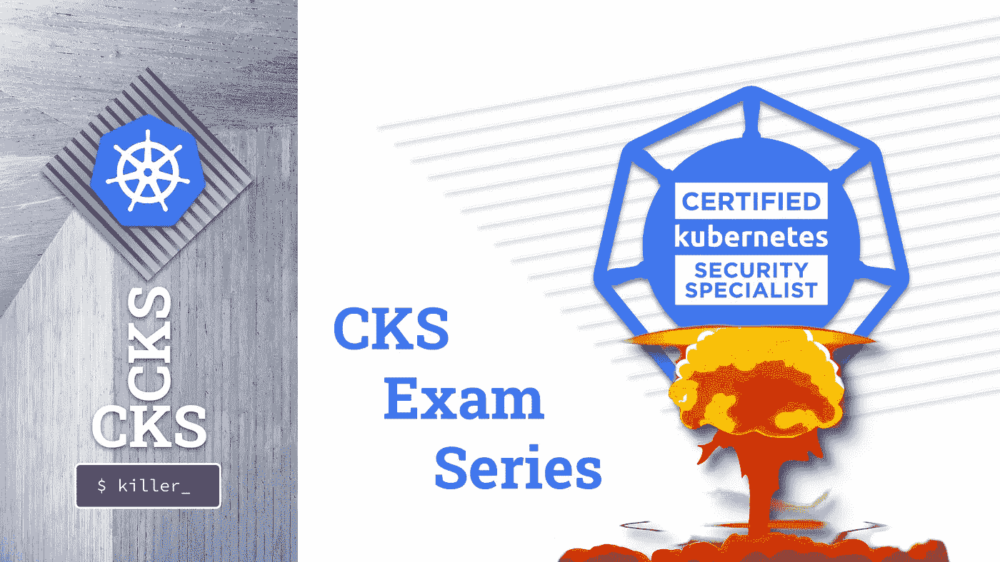
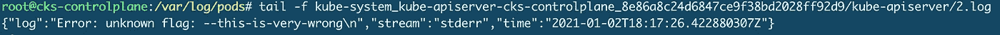
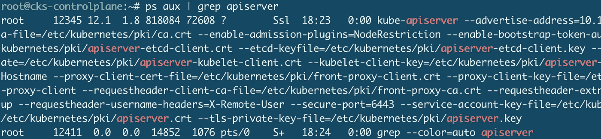
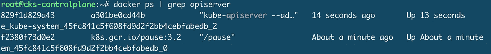
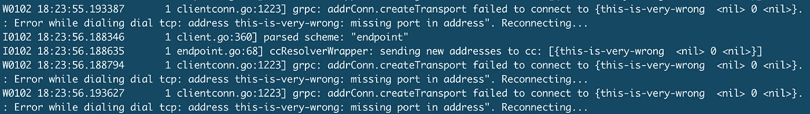

# CKS 考试系列#4 使 Apiserver 崩溃！

> 原文：<https://itnext.io/cks-exam-series-4-crash-that-apiserver-5f4d3d503028?source=collection_archive---------2----------------------->

## Kubernetes CKS 示例考试问题系列



> [CKS 考试系列](https://killer.sh/r?d=cks-series) | [CKA 考试系列](https://killer.sh/r?d=cka-series) | [CKAD 考试系列](https://killer.sh/r?d=ckad-series)

**## # # # # # # # # # # # # # # # # # # # ##**

**此挑战不会在此更新，将移至:**

[https://killercoda.com/killer-shell-cks](https://killercoda.com/killer-shell-cks)

**## # # # # # # # # # # # # # # # # # # # # # # ##**

# 内容

1.  [创建集群&安全最佳实践](https://wuestkamp.medium.com/cks-exam-series-1-create-cluster-security-best-practices-50e35aaa67ae?source=friends_link&sk=8bc466dae0ea90412251e32d4eaf7539)
2.  [pod、机密和服务帐户](https://wuestkamp.medium.com/cks-exam-series-2-pods-and-secrets-3d92a6fba331?source=friends_link&sk=379fa6e196233c73ef7845d84a3aa34d)
3.  [不可变豆荚](https://wuestkamp.medium.com/cks-exam-series-3-immutable-pods-3812cf76cff4?source=friends_link&sk=ed1231a0382d97bd5c8267afe75f14ac)
4.  [崩溃那个 Apiserver &检查日志](https://wuestkamp.medium.com/cks-exam-series-4-crash-that-apiserver-5f4d3d503028?source=friends_link&sk=3ccd9bf1b728e85f86157ef1af23d455)
5.  [ImagePolicyWebhook/admission controller](https://wuestkamp.medium.com/cks-exam-series-5-imagepolicywebhook-8d09f1ceee70?source=friends_link&sk=93017beeae20f640f52db41d20d3ffcd)
6.  [用户和证书签名请求](https://wuestkamp.medium.com/cks-exam-series-6-users-and-certificatesigningrequests-368a5b2c6a3f)
7.  [服务帐户令牌安装](https://wuestkamp.medium.com/cks-exam-series-7-serviceaccount-tokens-1158c93612d4?source=friends_link&sk=1064eaf2f3d4d03576bcde207eaf7cfb)
8.  [基于角色的访问控制(RBAC)](https://wuestkamp.medium.com/cks-exam-series-8-rbac-db8a0984059e?source=friends_link&sk=8a1abe2d51275faed47f3d36858b14d5)
9.  [基于角色的访问控制(RBAC) v2](https://wuestkamp.medium.com/cks-exam-series-9-rbac-v2-23ee24dd77cd?source=friends_link&sk=2a6027eb75fbcf7876216cab222fa953)
10.  [容器硬化](https://wuestkamp.medium.com/cks-exam-series-10-container-hardening-177588b8bbfe?source=friends_link&sk=dbdddc1ee9321a946ee2e3f778c0711a)
11.  [网络策略(默认拒绝+允许列表)](https://wuestkamp.medium.com/cks-exam-series-11-networkpolicies-default-deny-and-allowlist-b2ce4186551f?source=friends_link&sk=bdcc071a32f26b93d6c4a51b9a9436a7)

~~~~~~~~~~~~~~~~~~~~~~~~~~~~~~~~~~

→在 Udemy 上查看 [**全 CKS 课程**](https://killer.sh/r?d=cks-course)

~~~~~~~~~~~~~~~~~~~~~~~~~~~~~~~~~~

# 规则！

1.  速度要快，避免从头开始手动创建 yaml
2.  仅使用[kubernetes.io/docs](https://kubernetes.io/docs/home/)帮助。
3.  完成您的解决方案后，请查看我们的解决方案。你可能有一个更好的！

# 今天的任务:崩溃 Apiserver 并检查日志

*你应该很容易改变 Apiserver 的配置。在修改 Apiserver 配置时，您可能会搞砸一些事情，如果您知道在哪里检查日志，这并不是一件坏事！*

1.  用新的参数`--this-is-very-wrong`配置 Apiserver 清单。检查 Pod 是否重新启动以及这导致了什么日志。再次修复 Apiserver。
2.  将现有的 Apiserver 清单参数更改为:`—-etcd-servers=this-is-very-wrong.`检查日志内容，并再次修复它。
3.  更改 Apiserver 清单并添加无效的 YAML。检查日志记录，然后再次修复。

.

.

.

.

.

# 解决办法


愿猫与你同在

```
alias k=kubectl
```

**要检查的日志位置:**

*   `/var/log/pods`
*   `/var/log/containers`
*   `docker ps` + `docker logs`
*   `crictl ps` + `crictl logs`(不使用 Docker 时)
*   kubelet 日志:`/var/log/syslog`或`journalctl -u kubelet`

## 1.添加未知参数

```
cp /etc/kubernetes/manifests/kube-apiserver.yaml ~/kube-apiserver.yaml.ori **# always make a backup !**vim /etc/kubernetes/manifests/kube-apiserver.yaml
```

编辑:

```
...
spec:
  containers:
  - command:
    - kube-apiserver
 **- --this-is-very-wrong**
    - --advertise-address=10.156.0.53
    - --allow-privileged=true
...
```

等待它回来:

```
k -n kube-system get pod **# nothing there**
```

检查日志:

```
cd /var/log/podsls -lh | grep apiservertail -f kube-system_kube-apiserver-cks-master_7aef8559c5d7d59259044bb444b01ac3/kube-apiserver/4.log
```



我们移除`unknown flag`来再次修复 Apiserver:

```
cp ~/kube-apiserver.yaml.ori /etc/kubernetes/manifests/kube-apiserver.yaml **# smart people use a backup**
```


## 2.ETCD 连接配置错误

```
cp /etc/kubernetes/manifests/kube-apiserver.yaml ~/kube-apiserver.yaml.ori **# always make a backup !**vim /etc/kubernetes/manifests/kube-apiserver.yaml
```

编辑:

```
...
spec:
  containers:
  - command:
    - kube-apiserver
...
    - --etcd-certfile=/etc/kubernetes/pki/apiserver-etcd-client.crt
    - --etcd-keyfile=/etc/kubernetes/pki/apiserver-etcd-client.key
 **- --etcd-servers=this-is-very-wrong**
    - --insecure-port=0
...
```

Apiserver 需要与 ETCD 通信:


我们可以看到流程正在运行:



我们看到容器在运行:



> **如果不使用 Docker，则使用** `crictl ps`和`crictl logs`

我们可以查看集装箱日志:`docker logs 829f1d829a43`:



我们再次修复 Apiserver:

```
cp ~/kube-apiserver.yaml.ori /etc/kubernetes/manifests/kube-apiserver.yaml **# clever people use a backup**
```

## 3.无效的 Apiserver 清单 YAML

这将导致 kubelet 甚至无法创建容器。所以我们无法检查 Pod 或集装箱日志。

```
cp /etc/kubernetes/manifests/kube-apiserver.yaml ~/kube-apiserver.yaml.ori **# do you do backup?**vim /etc/kubernetes/manifests/kube-apiserver.yaml
```

编辑无效的 YAML:

```
apiVersion: v1
kind: Pod
metadata:
...
  name: kube-apiserver
  namespace: kube-system
**specTHIS IS VERY ::::: WRONG**
  containers:
  - command:
    - kube-apiserver
...
```

你好 apiserver 进程？

```
ps aux | grep apiserver **# nada**
```

豆荚日志？

```
find /var/log/pods/ | grep apiserver **# nichts**
```

集装箱？

```
docker ps | grep apiserver **# YUdGb1lTRWhJUW89Cg==**
```

> **或者如果不使用 Docker，使用** `*crictl ps*`和`*crictl logs*`

Kubelet syslog 日志(`/var/log/syslog`)？

```
Jan  2 18:41:00 cks-controlplane kubelet[7000]: E0102 18:41:00.573469    7000 file.go:187] Can't process manifest file "/etc/kubernetes/manifests/kube-apiserver.yaml": /etc/kubernetes/manifests/kube-apiserver.yaml: **couldn't parse as pod(yaml: line 13: mapping values are not allowed in this context)**, please check config file
```

或者也有可能:

```
journalctl -u kubelet | tail
```

现在再次修复它以使 apiserver 满意:

```
cp ~/kube-apiserver.yaml.ori /etc/kubernetes/manifests/kube-apiserver.yaml **# wise people use a backup**
```

.

.

.

.

.

# 你有不同的解决方法？

请在下面留言告诉我们！

# 重述:不要惊慌


Apiserver 没了？不用担心！吸气…呼气…然后检查日志！

*   如果 Apiserver 没有恢复，不要惊慌。很可能会有日志给你更多的信息！
*   在更改 K8s 组件配置之前，请务必进行备份。
*   放心地检查 Pod/Container/Process/Syslog/kube let 日志。

# — — —结尾————

本次会议到此为止。下次再见，祝学习愉快！

# 准备好加入黑仔壳牌了吗？

## 完整的 CKS 课程

[](https://killer.sh/r?d=cks-course)

[链接](https://killer.sh/r?d=cks-course)

## …或者 CKS 模拟器

[](https://killer.sh/cks)

[https://killer.sh/cks](https://killer.sh/cks)