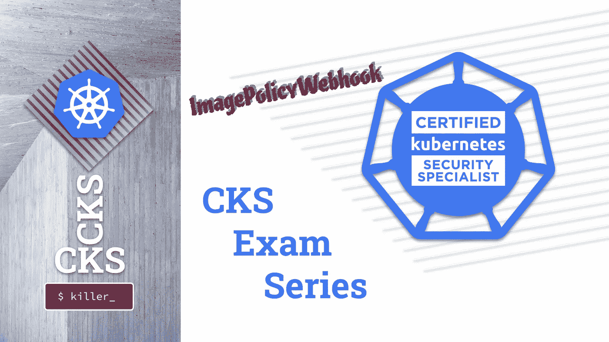
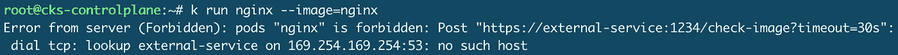

# CKS 考试系列#5 图片政策网页挂钩

> 原文：<https://itnext.io/cks-exam-series-5-imagepolicywebhook-8d09f1ceee70?source=collection_archive---------2----------------------->

## Kubernetes CKS 示例考试问题系列



> [CKS 考试系列](https://killer.sh/r?d=cks-series) | [CKA 考试系列](https://killer.sh/r?d=cka-series) | [CKAD 考试系列](https://killer.sh/r?d=ckad-series)

**## # # # # # # # # # # # # # # # # # # # ##**

**此挑战不会在此更新，将移至:**

[https://killercoda.com/killer-shell-cks](https://killercoda.com/killer-shell-cks)

**## # # # # # # # # # # # # # # # # # # # # # # ##**

# 内容

1.  [创建集群&安全最佳实践](https://wuestkamp.medium.com/cks-exam-series-1-create-cluster-security-best-practices-50e35aaa67ae?source=friends_link&sk=8bc466dae0ea90412251e32d4eaf7539)
2.  [pod、机密和服务帐户](https://wuestkamp.medium.com/cks-exam-series-2-pods-and-secrets-3d92a6fba331?source=friends_link&sk=379fa6e196233c73ef7845d84a3aa34d)
3.  [不可变豆荚](https://wuestkamp.medium.com/cks-exam-series-3-immutable-pods-3812cf76cff4?source=friends_link&sk=ed1231a0382d97bd5c8267afe75f14ac)
4.  [崩溃那个 Apiserver &检查日志](https://wuestkamp.medium.com/cks-exam-series-4-crash-that-apiserver-5f4d3d503028?source=friends_link&sk=3ccd9bf1b728e85f86157ef1af23d455)
5.  [ImagePolicyWebhook/admission controller](https://wuestkamp.medium.com/cks-exam-series-5-imagepolicywebhook-8d09f1ceee70?source=friends_link&sk=93017beeae20f640f52db41d20d3ffcd)
6.  [用户和证书签名请求](https://wuestkamp.medium.com/cks-exam-series-6-users-and-certificatesigningrequests-368a5b2c6a3f)
7.  [服务帐户令牌安装](https://wuestkamp.medium.com/cks-exam-series-7-serviceaccount-tokens-1158c93612d4?source=friends_link&sk=1064eaf2f3d4d03576bcde207eaf7cfb)
8.  [基于角色的访问控制(RBAC)](https://wuestkamp.medium.com/cks-exam-series-8-rbac-db8a0984059e?source=friends_link&sk=8a1abe2d51275faed47f3d36858b14d5)
9.  [基于角色的访问控制(RBAC) v2](https://wuestkamp.medium.com/cks-exam-series-9-rbac-v2-23ee24dd77cd?source=friends_link&sk=2a6027eb75fbcf7876216cab222fa953)
10.  [容器硬化](https://wuestkamp.medium.com/cks-exam-series-10-container-hardening-177588b8bbfe?source=friends_link&sk=dbdddc1ee9321a946ee2e3f778c0711a)
11.  [网络策略(默认拒绝+允许列表)](https://wuestkamp.medium.com/cks-exam-series-11-networkpolicies-default-deny-and-allowlist-b2ce4186551f?source=friends_link&sk=bdcc071a32f26b93d6c4a51b9a9436a7)

~~~~~~~~~~~~~~~~~~~~~~~~~~~~~~~~~~

→在 Udemy 上查看 [**全 CKS 课程**](https://killer.sh/r?d=cks-course)

~~~~~~~~~~~~~~~~~~~~~~~~~~~~~~~~~~

# 规则！

1.  速度要快，避免从头开始手动创建 yaml
2.  仅使用[kubernetes.io/docs](https://kubernetes.io/docs/home/)帮助。
3.  完成您的解决方案后，请查看我们的解决方案。你可能有一个更好的！

# 今天的任务:创建一个 ImagePolicyWebhook(没有外部服务)

*这个想法是创建一个 ImagePolicyWebhook Admission-Controller-Plugin 来阻止所有 Pod 的创建，因为应该允许/拒绝的外部服务是不可到达的。这将足以了解如何使用 ImagePolicyWebhook。*

**1:** 阅读[https://kubernetes . io/docs/reference/access-authn-authz/admission-controllers/# imagepolicywebhook](https://kubernetes.io/docs/reference/access-authn-authz/admission-controllers/#imagepolicywebhook)

**2:** 阅读[https://kubernetes . io/blog/2019/03/21/a-guide-to-kubernetes-admission-controllers](https://kubernetes.io/blog/2019/03/21/a-guide-to-kubernetes-admission-controllers/)

**3:** 下载未完成的 ImagePolicyWebhook:

```
git clone https://github.com/killer-sh/cks-challenge-seriescd cks-challenge-series/challenges/ImagePolicyWebhook
```

**4:** 创建`admission_config.yaml`，以便在外部服务不可达的情况下，所有 *Pod* 创建都将被拒绝

向 Apiserver 注册 ImagePolicyWebhook

**6:** 通过创建一个简单的 *Pod* 来验证它是否有效

**7** :了解 ImagePolicyWebhook 如何获取联系外部服务的 URL。

.

.

.

.

.

# 解决办法

```
alias k=kubectl
```

## 1.阅读

[https://kubernetes . io/docs/reference/access-authn-authz/admission-controllers/# imagepolicywebhook](https://kubernetes.io/docs/reference/access-authn-authz/admission-controllers/#imagepolicywebhook)

## 2.阅读

[https://kubernetes . io/blog/2019/03/21/a-guide-to-kubernetes-admission-controllers](https://kubernetes.io/blog/2019/03/21/a-guide-to-kubernetes-admission-controllers/)

## 3.下载现有文件

```
git clone https://github.com/killer-sh/cks-challenge-seriescp -r cks-challenge-series/challenges/ImagePolicyWebhook /etc/kubernetes/admissioncd /etc/kubernetes/admission
```

## 4.创建录取 _ 配置. yaml

```
**apiVersion:** apiserver.config.k8s.io/v1
**kind:** AdmissionConfiguration
**plugins:** - **name:** ImagePolicyWebhook
    **configuration:
      imagePolicy:
        kubeConfigFile:** /etc/kubernetes/admission/kubeconf
        **allowTTL:** 50
        **denyTTL:** 50
        **retryBackoff:** 500
        **defaultAllow:** false **# DENY ALL PODS IF SERVICE NOT AVAILABLE**
```

## 5.在 Apiserver 中注册

```
vim /etc/kubernetes/manifests/kube-apiserver.yaml
```

编辑到:

```
**apiVersion:** v1
**kind:** Pod
**metadata:** ...
  **name:** kube-apiserver
  **namespace:** kube-system
**spec:
  containers:** - **command:** - kube-apiserver
    - --admission-control-config-file=/etc/kubernetes/admission/admission_config.yaml
    - --enable-admission-plugins=NodeRestriction,ImagePolicyWebhook
...
    **volumeMounts:** - **mountPath:** /etc/kubernetes/admission
      **name:** admission
      **readOnly:** true
...
  **volumes:** - **hostPath:
      path:** /etc/kubernetes/admission
      **type:** DirectoryOrCreate
    **name:** admission
...
```

通过寻找响应来等待 Apiserver 返回:

```
k -n kube-system get pod **# just wait for a response**
```

> 我 **NFO:** 你可能看不到 Apiserver *Pod* 因为所有的 Pod 都会被拒绝，即使是 Apiserver 的那个。但是 Apiserver 容器仍然在运行，因为 Kubelet 直接运行它。Kubelet 不强制执行许可控制器。

如果您的 Apiserver 根本没有恢复，请参见前面的挑战来检查日志信息和错误配置。

## 6.核实



如果外部服务不可用，您现在可以设置`**defaultAllow:** true` 以允许 *Pod* 创建，并再次测试 *Pod* 创建，这应该会成功。

## 7.核实

这是在 kubeconf 文件中完成的，需要是 https:[https://github . com/killer-sh/cks-challenge-series/blob/master/challenges/ImagePolicyWebhook/kube conf # L8](https://github.com/killer-sh/cks-challenge-series/blob/master/challenges/ImagePolicyWebhook/kubeconf#L8)

.

.

.

.

.

# 测试外部服务

对于一个测试外部服务，你可以看看这个:[https://github.com/flavio/kube-image-bouncer](https://github.com/flavio/kube-image-bouncer)

# 你有不同的解决方法？

请在下面留言告诉我们！

# — — —结尾————

本次会议到此为止。下次再见，祝学习愉快！

# 准备好加入黑仔壳牌了吗？

## 完整的 CKS 课程

[](https://killer.sh/r?d=cks-course)

[链接](https://killer.sh/r?d=cks-course)

## …或者 CKS 模拟器

[](https://killer.sh/cks)

[https://killer.sh/cks](https://killer.sh/cks)