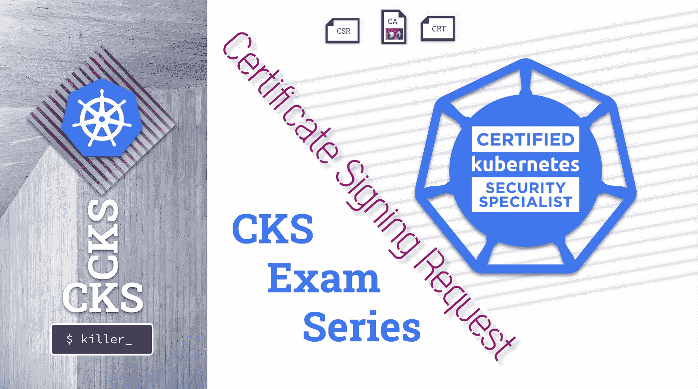
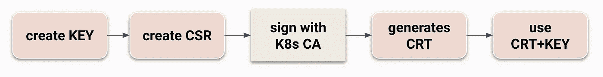
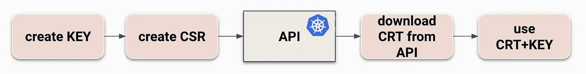
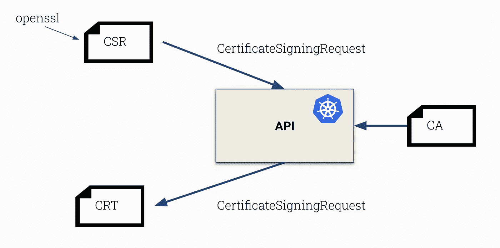
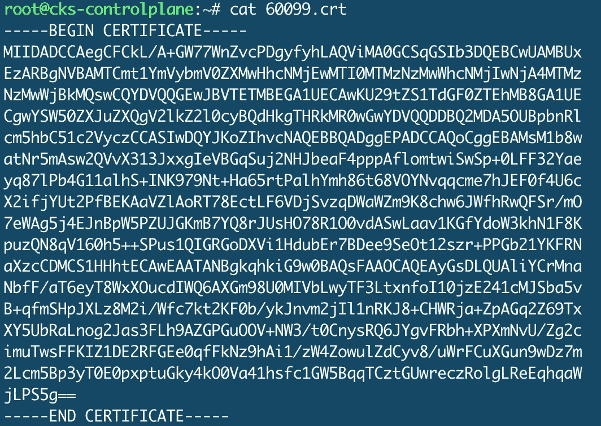
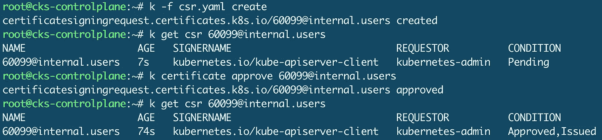
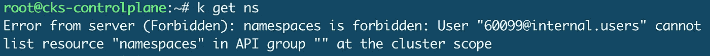

# CKS 考试系列#6 用户和证书设计请求

> 原文：<https://itnext.io/cks-exam-series-6-users-and-certificatesigningrequests-368a5b2c6a3f?source=collection_archive---------4----------------------->

## Kubernetes CKS 示例考试问题系列



> [CKS 考试系列](https://killer.sh/r?d=cks-series) | [CKA 考试系列](https://killer.sh/r?d=cka-series) | [CKAD 考试系列](https://killer.sh/r?d=ckad-series)

**## # # # # # # # # # # # # # # # # # # # ##**

**此挑战不会在此更新，将移至:**

[https://killercoda.com/killer-shell-cks](https://killercoda.com/killer-shell-cks)

**## # # # # # # # # # # # # # # # # # # # # # # ##**

# 内容

1.  [创建集群&安全最佳实践](https://wuestkamp.medium.com/cks-exam-series-1-create-cluster-security-best-practices-50e35aaa67ae?source=friends_link&sk=8bc466dae0ea90412251e32d4eaf7539)
2.  [pod、机密和服务帐户](https://wuestkamp.medium.com/cks-exam-series-2-pods-and-secrets-3d92a6fba331?source=friends_link&sk=379fa6e196233c73ef7845d84a3aa34d)
3.  [不可变豆荚](https://wuestkamp.medium.com/cks-exam-series-3-immutable-pods-3812cf76cff4?source=friends_link&sk=ed1231a0382d97bd5c8267afe75f14ac)
4.  [崩溃那个 Apiserver &检查日志](https://wuestkamp.medium.com/cks-exam-series-4-crash-that-apiserver-5f4d3d503028?source=friends_link&sk=3ccd9bf1b728e85f86157ef1af23d455)
5.  [ImagePolicyWebhook/admission controller](https://wuestkamp.medium.com/cks-exam-series-5-imagepolicywebhook-8d09f1ceee70?source=friends_link&sk=93017beeae20f640f52db41d20d3ffcd)
6.  [用户和证书签名请求](https://wuestkamp.medium.com/cks-exam-series-6-users-and-certificatesigningrequests-368a5b2c6a3f)
7.  [服务帐户令牌安装](https://wuestkamp.medium.com/cks-exam-series-7-serviceaccount-tokens-1158c93612d4?source=friends_link&sk=1064eaf2f3d4d03576bcde207eaf7cfb)
8.  [基于角色的访问控制(RBAC)](https://wuestkamp.medium.com/cks-exam-series-8-rbac-db8a0984059e?source=friends_link&sk=8a1abe2d51275faed47f3d36858b14d5)
9.  [基于角色的访问控制(RBAC) v2](https://wuestkamp.medium.com/cks-exam-series-9-rbac-v2-23ee24dd77cd?source=friends_link&sk=2a6027eb75fbcf7876216cab222fa953)
10.  [容器硬化](https://wuestkamp.medium.com/cks-exam-series-10-container-hardening-177588b8bbfe?source=friends_link&sk=dbdddc1ee9321a946ee2e3f778c0711a)
11.  [网络策略(默认拒绝+允许列表)](https://wuestkamp.medium.com/cks-exam-series-11-networkpolicies-default-deny-and-allowlist-b2ce4186551f?source=friends_link&sk=bdcc071a32f26b93d6c4a51b9a9436a7)

~~~~~~~~~~~~~~~~~~~~~~~~~~~~~~~~~~

→在 Udemy 上查看 [**全 CKS 课程**](https://killer.sh/r?d=cks-course)

~~~~~~~~~~~~~~~~~~~~~~~~~~~~~~~~~~

# 规则！

1.  速度要快，避免从头开始手动创建 yaml
2.  仅使用[kubernetes.io/docs](https://kubernetes.io/docs/home/)帮助。
3.  完成您的解决方案后，请查看我们的解决方案。你可能有一个更好的！

# 任务前的一点背景知识

```
CA  = Certificate Authority
CRT = Certificate
CSR = Certificate Signing Request
KEY = Private Key
```

K8s 中的用户通过 CRTs 和其中的 CN/CommonName 字段进行管理。群集 CA 需要签署这些 CRT。

现在的想法是一次手工签名，一次使用 K8s Api。这将解释后台发生的情况。

## 手动方式



## 自动方式



# 今天的任务:创建证书签名请求

1.  为名为`60099@internal.users`的用户创建一个密钥
2.  为密钥创建 CSR
3.  ***手动方式*** :用 K8s CA 文件手动签署 CSR，生成 CRT
4.  ***自动化方式*** :为 CSR 文件创建一个 CSR-K8s-resource，让 K8s Api 签名，然后下载 CRT
5.  通过手动和自动方式使用 CRT+键连接到 K8s Api。

.

.

.

.

.

# 解决办法



apiserver 已经可以访问集群 CA，那么为什么不让它签名呢？

```
alias k=kubectl
```

## 1.创建密钥

```
openssl genrsa -out 60099.key 2048
```

## 2.创建 CSR

```
openssl req -new -key 60099.key -out 60099.csr**# set Common Name =** **60099@internal.users**
```

## 3.手动签名

```
find /etc/kubernetes/pki | grep caopenssl x509 -req -in 60099.csr -CA /etc/kubernetes/pki/ca.crt -CAkey /etc/kubernetes/pki/ca.key -CAcreateserial -out 60099.crt -days 500
```



## 4.通过 API 签名

[https://kubernetes . io/docs/reference/access-authn-authz/certificate-signing-requests](https://kubernetes.io/docs/reference/access-authn-authz/certificate-signing-requests)

```
apiVersion: certificates.k8s.io/v1
kind: CertificateSigningRequest
metadata:
 **name:** **60099@internal.users # ADD**
spec:
  groups:
  - system:authenticated
 **request: {{BASE_64_ENCODED_CSR}} # ADD**
  signerName: kubernetes.io/kube-apiserver-client
  usages:
  - client auth
```

将 CSR 文件内容转换为 base64:

```
cat 60099.csr | base64 -w 0
```

创建资源，检查其状态并批准:

```
k -f csr.yaml createk certificate approve 60099@internal.users
```



现在下载 CRT:

```
k get csr 60099@internal.users -ojsonpath="{.status.certificate}" | base64 -d > 60099.crt
```

## 5.用它来连接 K8s API

```
k config set-credentials 60099@internal.users --client-key=60099.key --client-certificate=60099.crtk config set-context 60099@internal.users --cluster=kubernetes --user=60099@internal.usersk config get-contextsk config use-context 60099@internal.users
```



我们看到从 api 返回的用户名，只是没有任何 atm 权限

如果愿意，您可以授予用户 RBAC 权限，以便实际使用群集。这将在下一轮挑战中进行。

.

.

.

.

.

# 为什么通过 Api 使用 K8s CSR？

通过 Api 自动完成这项工作，就不需要直接访问集群的 CA。CA 应该被认为是神圣的，因为使用它可以为整个集群创建可信的证书。

# 你有不同的解决方法？

请在下面留言告诉我们！

# — — —结尾————

本次会议到此为止。下次再见，祝学习愉快！

# 准备好加入黑仔壳牌了吗？

## 完整的 CKS 课程

[](https://killer.sh/r?d=cks-course)

[链接](https://killer.sh/r?d=cks-course)

## …或者 CKS 模拟器

[](https://killer.sh/cks)

[https://killer.sh/cks](https://killer.sh/cks)