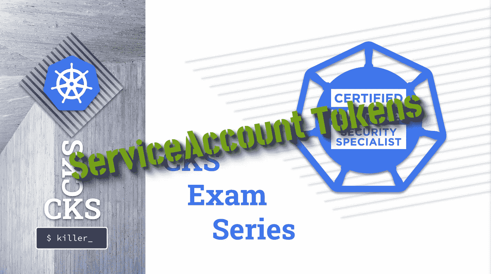

# CKS 考试系列#7 服务帐户令牌

> 原文：<https://itnext.io/cks-exam-series-7-serviceaccount-tokens-1158c93612d4?source=collection_archive---------2----------------------->

## Kubernetes CKS 示例考试问题系列



> [CKS 考试系列](https://killer.sh/r?d=cks-series) | [CKA 考试系列](https://killer.sh/r?d=cka-series) | [CKAD 考试系列](https://killer.sh/r?d=ckad-series)

**## # # # # # # # # # # # # # # # # # # # ##**

**此挑战不会在此更新，将移至:**

[https://killercoda.com/killer-shell-cks](https://killercoda.com/killer-shell-cks)

**## # # # # # # # # # # # # # # # # # # # # # # ##**

# 内容

1.  [创建集群&安全最佳实践](https://wuestkamp.medium.com/cks-exam-series-1-create-cluster-security-best-practices-50e35aaa67ae?source=friends_link&sk=8bc466dae0ea90412251e32d4eaf7539)
2.  [pod、机密和服务帐户](https://wuestkamp.medium.com/cks-exam-series-2-pods-and-secrets-3d92a6fba331?source=friends_link&sk=379fa6e196233c73ef7845d84a3aa34d)
3.  [不可变豆荚](https://wuestkamp.medium.com/cks-exam-series-3-immutable-pods-3812cf76cff4?source=friends_link&sk=ed1231a0382d97bd5c8267afe75f14ac)
4.  [崩溃那个 Apiserver &检查日志](https://wuestkamp.medium.com/cks-exam-series-4-crash-that-apiserver-5f4d3d503028?source=friends_link&sk=3ccd9bf1b728e85f86157ef1af23d455)
5.  [ImagePolicyWebhook/admission controller](https://wuestkamp.medium.com/cks-exam-series-5-imagepolicywebhook-8d09f1ceee70?source=friends_link&sk=93017beeae20f640f52db41d20d3ffcd)
6.  [用户和证书签名请求](https://wuestkamp.medium.com/cks-exam-series-6-users-and-certificatesigningrequests-368a5b2c6a3f)
7.  [服务帐户令牌安装](https://wuestkamp.medium.com/cks-exam-series-7-serviceaccount-tokens-1158c93612d4?source=friends_link&sk=1064eaf2f3d4d03576bcde207eaf7cfb)
8.  [基于角色的访问控制(RBAC)](https://wuestkamp.medium.com/cks-exam-series-8-rbac-db8a0984059e?source=friends_link&sk=8a1abe2d51275faed47f3d36858b14d5)
9.  [基于角色的访问控制(RBAC) v2](https://wuestkamp.medium.com/cks-exam-series-9-rbac-v2-23ee24dd77cd?source=friends_link&sk=2a6027eb75fbcf7876216cab222fa953)
10.  [容器硬化](https://wuestkamp.medium.com/cks-exam-series-10-container-hardening-177588b8bbfe?source=friends_link&sk=dbdddc1ee9321a946ee2e3f778c0711a)
11.  [网络策略(默认拒绝+允许列表)](https://wuestkamp.medium.com/cks-exam-series-11-networkpolicies-default-deny-and-allowlist-b2ce4186551f?source=friends_link&sk=bdcc071a32f26b93d6c4a51b9a9436a7)

~~~~~~~~~~~~~~~~~~~~~~~~~~~~~~~~~~

→查看 Udemy 上的 [**全 CKS 课程**](https://killer.sh/r?d=cks-course)

~~~~~~~~~~~~~~~~~~~~~~~~~~~~~~~~~~

# 规则！

1.  速度要快，避免从头开始手动创建 yaml
2.  仅使用[kubernetes.io/docs](https://kubernetes.io/docs/home/)进行帮助。
3.  完成您的解决方案后，请查看我们的解决方案。你可能有一个更好的！

# 今天的任务:控制 pod 中的服务帐户令牌安装

1.  创建一个新的*服务帐户* ( *服务协议* ) `special`
2.  创建一个使用`default` *SA* 的*Pod*图像`nginx`
3.  使用*SA*创建带有两个副本的*部署*映像`nginx`
4.  *Pod*不应该挂载 *SA* 令牌，请验证
5.  根本没有*吊舱*应该挂载*SA*的令牌，验证一下

.

.

.

.

.

# 解决办法

```
alias k=kubectl
```

## 1.创建服务协议

```
k create sa special
```

## 2.创建 Pod

```
k run pod1 --image=nginx -oyaml --dry-run=client > pod1.yamlk -f pod1.yaml create
```

## 3.创建部署

```
k create deploy deploy1 --image=nginx -oyaml --dry-run=client > deploy1.yamlvim deploy1.yaml
```

编辑到:

```
apiVersion: apps/v1
kind: Deployment
metadata:
  labels:
    app: deploy1
  name: deploy1
spec:
 **replicas: 2**
  selector:
    matchLabels:
      app: deploy1
  template:
    metadata:
      labels:
        app: deploy1
    spec:
 **serviceAccountName: special**
      containers:
      - image: nginx
        name: nginx
```

## 4.Pod 没有安装

将*盒*编辑为:

```
apiVersion: v1
kind: Pod
metadata:
  creationTimestamp: null
  labels:
    run: pod1
  name: pod1
spec:
 **automountServiceAccountToken: false**
  containers:
  - image: nginx
    name: pod1
```

并验证:

```
k exec pod1 -- mount | grep serviceaccount
```

## 5.萨诺山

将 *SA* 编辑为:

```
apiVersion: v1
kind: ServiceAccount
metadata:
  name: special
  namespace: default
**automountServiceAccountToken: false**
```

验证:

```
k rollout restart deploy deploy1k exec deploy1-775d6566dc-bq757 -- mount | grep serviceaccountk exec deploy1-775d6566dc-qwthl -- mount | grep serviceaccount
```

如果 *SA* 对令牌挂载说**假**而 *Pod* 说**真**会发生什么？然后将安装令牌。在 *SA* 中设置这只是默认行为。

.

.

.

.

.

# 什么是 ServiceAccount 令牌？

每个 *SA* 都有一个令牌，可以用来识别 K8s Api。如果有许可(RBAC ),那么令牌可以用于执行动作。

在 *Pod* 中安装 *SA* 令牌通常是不必要的，因为*Pod*如果只是运行一个应用程序，通常不需要与 Api 通信。但是有一些有效的用例应该启用挂载。

如果您在 *Pod* 中挂载令牌，那么您需要确保它只有最少的必要权限。

# 你有不同的解决方法？

请在下面留言告诉我们！

# — — —结尾————

本次会议到此为止。下次再见，祝学习愉快！

# 准备好加入黑仔壳牌了吗？

## 完整的 CKS 课程

[](https://killer.sh/r?d=cks-course)

[链接](https://killer.sh/r?d=cks-course)

## …或者 CKS 模拟器

[](https://killer.sh/cks)

[https://killer.sh/cks](https://killer.sh/cks)