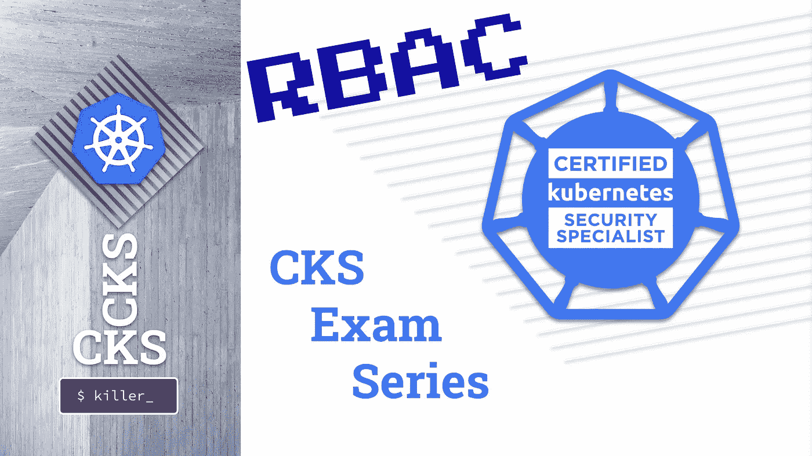

# CKS 考试系列#8 RBAC

> 原文：<https://itnext.io/cks-exam-series-8-rbac-db8a0984059e?source=collection_archive---------0----------------------->

## Kubernetes CKS 示例考试问题系列



> [CKS 考试系列](https://killer.sh/r?d=cks-series) | [CKA 考试系列](https://killer.sh/r?d=cka-series) | [CKAD 考试系列](https://killer.sh/r?d=ckad-series)

**## # # # # # # # # # # # # # # # # # # # ##**

**此挑战不会在此更新，将移至:**

[https://killercoda.com/killer-shell-cks](https://killercoda.com/killer-shell-cks)

**## # # # # # # # # # # # # # # # # # # # # # # ##**

# 内容

1.  [创建集群&安全最佳实践](https://wuestkamp.medium.com/cks-exam-series-1-create-cluster-security-best-practices-50e35aaa67ae?source=friends_link&sk=8bc466dae0ea90412251e32d4eaf7539)
2.  [pod、机密和服务帐户](https://wuestkamp.medium.com/cks-exam-series-2-pods-and-secrets-3d92a6fba331?source=friends_link&sk=379fa6e196233c73ef7845d84a3aa34d)
3.  [不可变豆荚](https://wuestkamp.medium.com/cks-exam-series-3-immutable-pods-3812cf76cff4?source=friends_link&sk=ed1231a0382d97bd5c8267afe75f14ac)
4.  [崩溃那个 Apiserver &检查日志](https://wuestkamp.medium.com/cks-exam-series-4-crash-that-apiserver-5f4d3d503028?source=friends_link&sk=3ccd9bf1b728e85f86157ef1af23d455)
5.  [ImagePolicyWebhook/admission controller](https://wuestkamp.medium.com/cks-exam-series-5-imagepolicywebhook-8d09f1ceee70?source=friends_link&sk=93017beeae20f640f52db41d20d3ffcd)
6.  [用户和证书签名请求](https://wuestkamp.medium.com/cks-exam-series-6-users-and-certificatesigningrequests-368a5b2c6a3f)
7.  [服务帐户令牌安装](https://wuestkamp.medium.com/cks-exam-series-7-serviceaccount-tokens-1158c93612d4?source=friends_link&sk=1064eaf2f3d4d03576bcde207eaf7cfb)
8.  [基于角色的访问控制(RBAC)](https://wuestkamp.medium.com/cks-exam-series-8-rbac-db8a0984059e?source=friends_link&sk=8a1abe2d51275faed47f3d36858b14d5)
9.  [基于角色的访问控制(RBAC) v2](https://wuestkamp.medium.com/cks-exam-series-9-rbac-v2-23ee24dd77cd?source=friends_link&sk=2a6027eb75fbcf7876216cab222fa953)
10.  [容器硬化](https://wuestkamp.medium.com/cks-exam-series-10-container-hardening-177588b8bbfe?source=friends_link&sk=dbdddc1ee9321a946ee2e3f778c0711a)
11.  [网络策略(默认拒绝+允许列表)](https://wuestkamp.medium.com/cks-exam-series-11-networkpolicies-default-deny-and-allowlist-b2ce4186551f?source=friends_link&sk=bdcc071a32f26b93d6c4a51b9a9436a7)

~~~~~~~~~~~~~~~~~~~~~~~~~~~~~~~~~~

→查看 Udemy 上的 [**全 CKS 课程**](https://killer.sh/r?d=cks-course)

~~~~~~~~~~~~~~~~~~~~~~~~~~~~~~~~~~

# 规则！

1.  速度要快，避免从头开始手动创建 yaml
2.  仅使用[kubernetes.io/docs](https://kubernetes.io/docs/home/)进行帮助。
3.  完成您的解决方案后，请查看我们的解决方案。你可能有一个更好的！

# 今天的任务:RBAC

1.  创建两个*名称空间* `ns1`和`ns2`
2.  在两个*名称空间中创建*service account*(*SA*)`pipeline`*
3.  应该允许这些 sa 查看整个集群中的几乎所有内容。为此，您可以使用默认的 ClusterRole `view`
4.  应该允许这些*sa*在*名称空间* `ns1`和`ns2`中创建和删除*部署*
5.  使用`kubectl auth can-i`验证一切

.

.

.

.

.

# 解决办法

```
alias k=kubectl
```

## 1.创建名称空间

```
k create ns ns1
k create ns ns2
```

## 2.创建服务帐户

```
k -n ns1 create sa pipeline
k -n ns2 create sa pipeline
```

## 3.查看整个集群

```
k get clusterrole view **# there is default one**k create clusterrolebinding -h **# examples**k create clusterrolebinding pipeline-view --clusterrole view --serviceaccount ns1:pipeline --serviceaccount ns2:pipeline
```

## 4.管理特定命名空间中的部署

```
k create clusterrole -h **# examples**k create clusterrole pipeline-deployment-manager --verb create,delete --resource deployments k create rolebinding -h **# examples**k -n ns1 create rolebinding pipeline-deployment-manager --clusterrole pipeline-deployment-manager --serviceaccount ns1:pipelinek -n ns2 create rolebinding pipeline-deployment-manager --clusterrole pipeline-deployment-manager --serviceaccount ns2:pipeline
```

相反，我们也可以在两个*名称空间*中创建相同的*角色*。

## 5.核实

[此处解释](https://kubernetes.io/docs/reference/access-authn-authz/rbac/#referring-to-subjects)为什么*sa*会这样引用。

```
**# namespace ns1 deployment manager**
k auth can-i delete deployments --as system:serviceaccount:ns1:pipeline -n ns1 **# YES**k auth can-i create deployments --as system:serviceaccount:ns1:pipeline -n ns1 **# YES**k auth can-i update deployments --as system:serviceaccount:ns1:pipeline -n ns1 **# NO**k auth can-i update deployments --as system:serviceaccount:ns1:pipeline -n default **# NO** **# namespace ns2 deployment manager**
k auth can-i delete deployments --as system:serviceaccount:ns2:pipeline -n ns2 **# YES**k auth can-i create deployments --as system:serviceaccount:ns2:pipeline -n ns2 **# YES**k auth can-i update deployments --as system:serviceaccount:ns2:pipeline -n ns2 **# NO**k auth can-i update deployments --as system:serviceaccount:ns2:pipeline -n default **# NO** **# cluster wide view role**
k auth can-i list deployments --as system:serviceaccount:ns1:pipeline -n ns1 **# YES**k auth can-i list deployments --as system:serviceaccount:ns1:pipeline -A **# YES**k auth can-i list pods --as
system:serviceaccount:ns1:pipeline -A **# YES**k auth can-i list pods --as
system:serviceaccount:ns2:pipeline -A **# YES**k auth can-i list secrets --as
system:serviceaccount:ns2:pipeline -A **# NO (default view-role doesn't allow)**
```

我们看到默认*集群角色* `view`实际上默认不允许查看*机密*。

.

.

.

.

.

# 最小特权原则

仅始终将所需的最低权限分配给*sa*或*用户*。使用 *ClusterRoleBindings* 时要小心，因为它们授予集群范围的访问权限以及对所有现有和未来的*名称空间*的访问权限。

# 快速回答 RBAC 的问题

总是使用`kubectl`命令来生成您的角色和绑定。不要从例子中复制现有的 YAML，并试图让它发挥作用。帮助页面展示了很好的例子。

# 你有不同的解决方法？

请在下面留言告诉我们！

# — — —结尾————

本次会议到此为止。下次再见，祝学习愉快！

# 准备好加入黑仔壳牌了吗？

## 完整的 CKS 课程

[](https://killer.sh/r?d=cks-course)

[链接](https://killer.sh/r?d=cks-course)

## …或者 CKS 模拟器

[](https://killer.sh/cks)

[https://killer.sh/cks](https://killer.sh/cks)